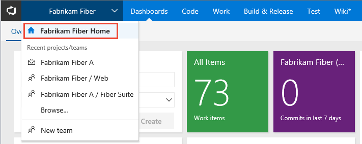
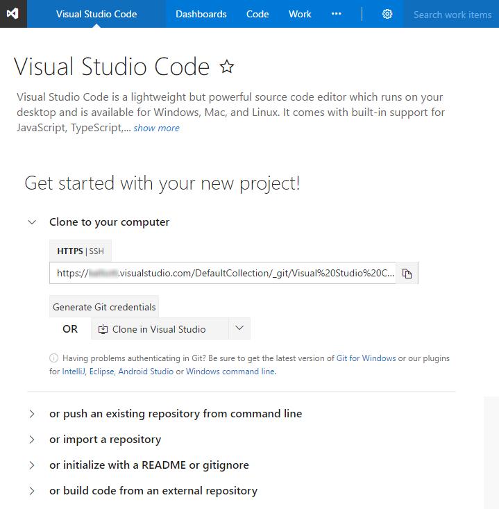
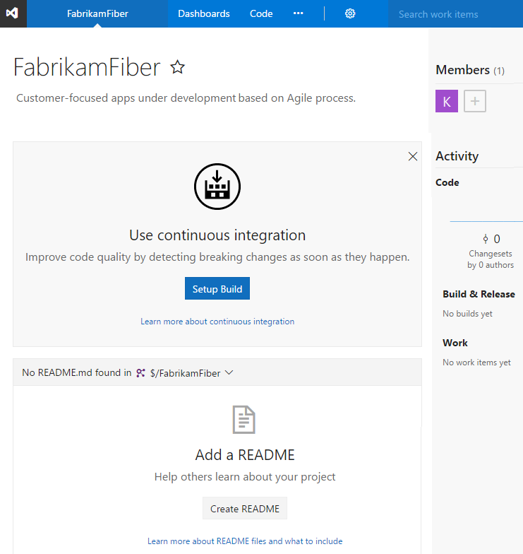
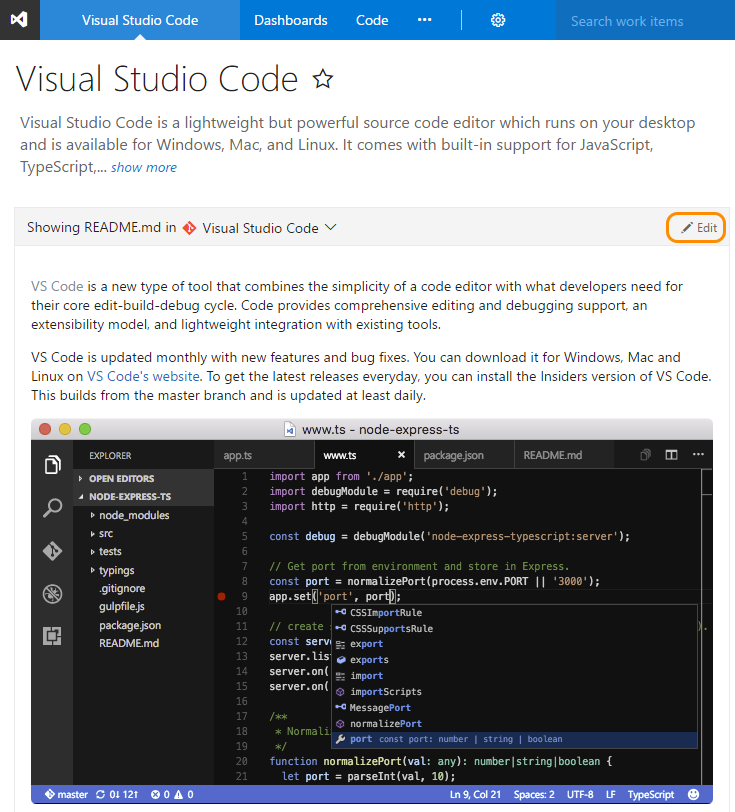
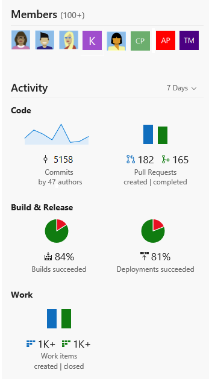
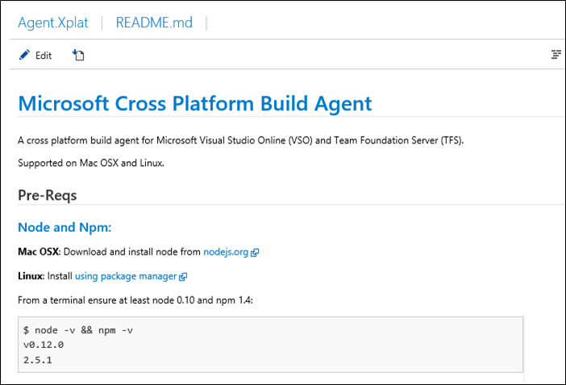
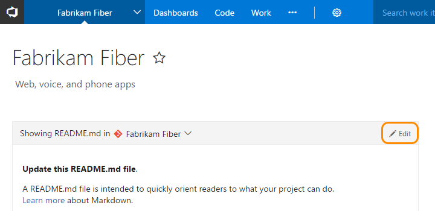
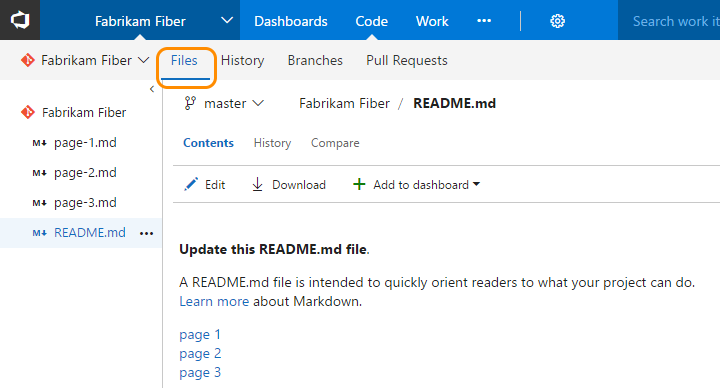
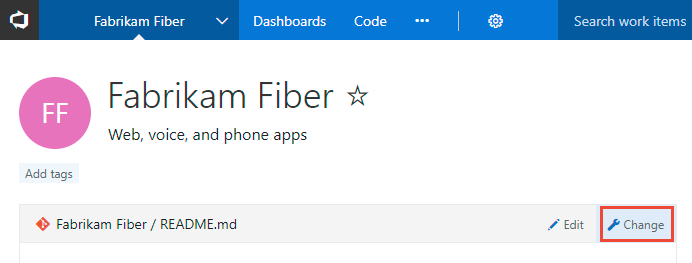

# Share your project vision, view project activity   

**VSTS | TFS 2018 | TFS 2017 | TFS 2015**  

> [!NOTE]   
> **Feature availability**: The project page described in this topic is available for VSTS and TFS 2017.1 and later versions. It replaces the [Welcome page](#welcome-pages) used in TFS 2017 and earlier versions. 

You can quickly get started with a team project from the project page. You can share your project vision with your team, add team members, and check the latest activity. Use this page to leverage all the built-in DevOps functionality of VSTS and to perform the following activities:

  
> [!NOTE]    
> The features and functions available from your project page depend on the source control&#151;Git or Team Foundation Version Control (TFVC)&#151;that you selected when you [created your team project](../accounts/create-team-project.md).  

> [!div class="mx-tdBreakAll"]   
> |Git repository |TFVC repository |  
> |-------------|----------|  
> |- Clone your project to your client computer - Push an existing repository from the command line - Import a repository - Initialize a README or gitignore - Setup a build from an external repository - [Add team members](#cross-project-activity) - [View code, build, and work activity](#cross-project-activity)|- Setup a build - Add a README for your project - [Add team members](#cross-project-activity) - [View code, build, and work activity](#cross-project-activity) |

## Prerequisites

- To edit information on the team project page or manage team membership, you must be a member of the [Project Administrators group](../security/set-project-collection-level-permissions.md) 
- To view the team project page, you must be a valid member of the team project. For more information, see [Permissions and groups, Valid user groups](../security/about-permissions.md#validusers) 
- To change the repository used to share your project vision, you need to be a member of the [Project Administrators group](../security/set-project-collection-level-permissions.md).

## Open the project home page
From your web browser, open the team project drop down menu and select the home page. If you don't have a team project yet, [create one in VSTS](../user-guide/sign-up-invite-teammates.md)<!---or set one up in an [on-premises TFS](../accounts/create-team-project.md)-->.   

<!--- <b>https://<i>AccountName</i>.visualstudio.com/<i>ProjectName</i></b>
-->  

## Get started with a new team project 

Upon [adding another team project](../accounts/create-team-project.md) to your account or collection, you'll see the get started page. This page guides you to get started quickly by adding code to your repository when you choose one of the options to clone, push, import, or simply initialize a repo. You can easily get started by adding members, setting up builds, or adding work from this page.

**Git repository**

   

**TFVC repository**

   

##Share your project vision

You can share your project vision and objective, as well as ways for team members to contribute to the project through a Project readme. 

To edit the project README.md file, click the Edit button. You'll need to be a member of the [Project Administrators group](../security/set-project-collection-level-permissions.md) or have your Edit project-level information permission set to allow. 

You can use Markdown language to format the README file and add images. To learn more about adding a README file, see [Create a README for your repo](../git/create-a-readme.md) and [Markdown guidance](../collaborate/markdown-guidance.md). 

   

## View cross project activity  

In addition to sharing information, the project home page pulls data from the various functional hubs to give visitors a bird's-eye view of your project activity. 

   

To add team members or manage membership in the team project, click  Add button. 

 
## Create a Repository README or Welcome page 

> [!NOTE]  
> **Feature availability**: The Welcome pages are available from the web portal of TFS 2017 and earlier versions.  

Here's an example of a Welcome page:

### Edit or create additional pages

> [!NOTE]   
> If you set policies on the Git repository, changes to the welcome page must be done as a pull request.  

1. You can start editing directly from the Welcome page.

	 
	
	To edit a page, you must be a contributor to the repository or branch or have the Contribute permissions set to allow.  

2. To add another page, simply enter a link to a new Markdown file that doesn't yet exist, for example:
 
	`[page-1](./page-1.md)`

3. After you save the file, click the link. Respond to the prompt to edit the file and commit it to your repository.  

### Location of the Welcome pages
The Welcome page corresponds to the README.md file defined in the Git repository or TFVC project folder (i.e. $/TeamProject/ReadMe.md). Additional pages you create show up in the same location.

  

You can edit and manage these files in the same way you manage all other files under source control. 

####Git repositories
For Git projects, the README.md file needs to be at the root of each repository in the default branch. For Git based projects the left pane supports navigation to other repositories. A separate Welcome page/README.md file can be created for each repository.  

####TFVC  projects
For TFVC projects the README.md file needs to be at the root of your team project folder (i.e. $/TeamProject/README.md). 

Any additional Markdown files you have (ones with a *.md extension) in the root of the project folder will also show up in the left pane for easy navigation between them so you can provide additional information.  

## Change the repository used

You can change the repository used to support your project vision, including pointing it to the home page of your [built-in Wiki](add-edit-wiki.md).

0. From your project home page, click **Change**. 

	 

	If you don't see the **Change** link, then you're not a member of the Project Administrators group. [Get added as an admin](../security/set-project-collection-level-permissions.md) in order to proceed.

0. From the select file dialog, choose an existing repo from the drop-down menu, or choose the Wiki option as shown here. 

	 

	> [!TIP]  
	> Only the Wiki home page displays. To access additional Wiki pages, you must navigate to the Wiki.    

## Try this next

> [!div class="nextstepaction"]
> [Create a wiki for your team project](wiki-create-repo.md) 

## Related notes  

- [Markdown guidance](../collaborate/markdown-guidance.md) 
- [Work effectively from your account hub](../user-guide/account-home-pages.md)

 

  