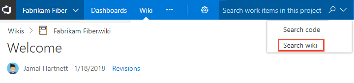
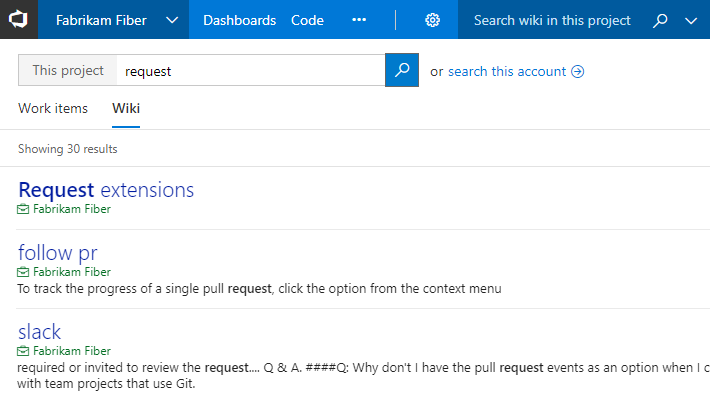

# Search  Wiki

**VSTS | TFS 2018.2**

With wiki search, you can search within a team project wiki or across all wikis created for the account. Simply select the **Search wiki** option from the search box and type a keyword or phrase within the search box. 

> [!div class="mx-imgBorder"]  
>    

The search feature quickly returns wiki pages by title or page content.

::: moniker range="tfs-2018"
> [!NOTE]  
> Wiki search is supported on TFS 2018.2 or later versions. To download TFS 2018.2, see [Team Foundation Server 2018 Update 2 Release Notes](https://docs.microsoft.com/en-us/visualstudio/releasenotes/tfs2018-update2). 
::: moniker-end

English language stemming support helps you find the most relevant wiki pages. For example, when you enter *request* in the search box, wiki search will return page results containing related words such as *requesting, requested, requests,* and so on.

> [!div class="mx-imgBorder"]  
> 

## Related articles

- [Search code](../project/search/code-search.md)
- [Search work items](../project/search/work-item-search.md)

<!---
When you search from the **Wiki** hub, you'll automatically navigate to wiki search results. If you initiate a search from another hub, such as **Code** or **Work**, then first select the **Search wiki** option from the search box menu options. 
--> 
