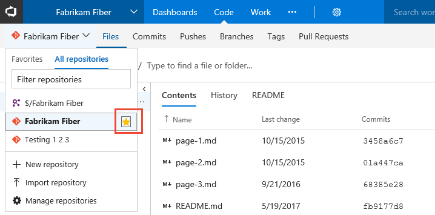
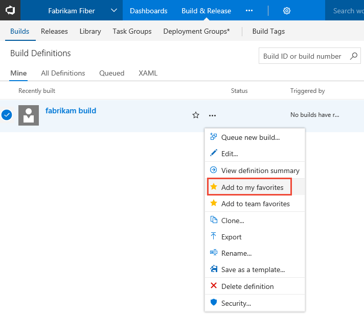
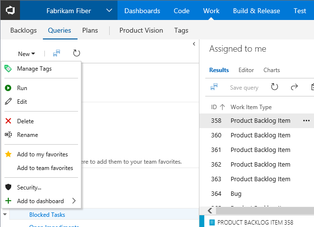
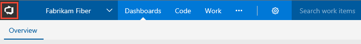
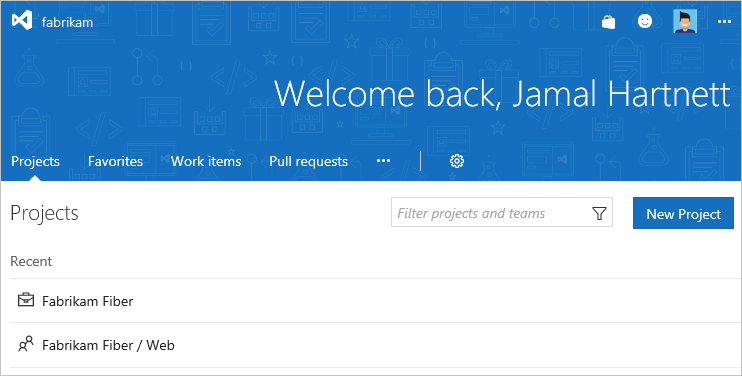
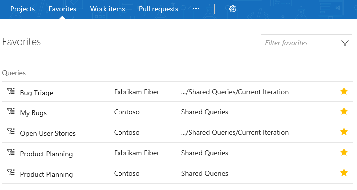
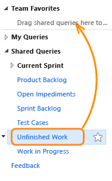

# Set personal or team favorites    

**VSTS | TFS 2017.1**  

<!--- Multiple version topic; need to update with latest screenshots-->  

As your code base, work tracking efforts, developer operations, and organization grows, you'll want to be able to quickly navigate to those object of interest to you and your team. Setting favorites allows you to do just that.  

This topic shows you how to:  

> [!div class="checklist"]   
> * Favorite a repository, build definition, shared query, delivery plan, or test plan 
> * Favorite a team or team project 
> * View your personal favorites       
> * Unfavorite an object    

> [!NOTE]   
> Changes based on preview features.  

You can set favorites for yourself or your team. You can set them for these objects, from the hub or page listed: 

- Code repository -> **Code>Branches**  (personal favorite only) 
- Build definition -> **Build & Release>Queries**   
- Queries -> **Work>Queries**  
- Delivery plans  -> **Work>Plans** (personal favorite only) 
- Test Plans -> **Test>Test Plans** (personal favorite only) 
- Team project or team  ->  **Account>Projects**  (personal favorite only)   

Delivery Plans requires installation of the [Delivery Plans extension](../work/scale/review-team-plans.md).   

## Favorite a code repository

From your web browser, open the **Code** hub, open the repository menu and click the  star icon next to the repository you want to favorite. 

 

## Favorite a build definition  

From your web browser, open the **Build-Release** hub, **Builds>All Definitions** page. Next, open the context menu of the build definition you want to favorite, and then select **Add to my favorites** or **Add to team favorites**.  

   

## Favorite a shared query 

From your web browser, open the **Work** hub, Queries page. Next, open  the context menu of the shared query you want to favorite, and then select **Add to my favorites** or **Add to team favorites**.  

  

## Favorite a Delivery Plan 

To mark a Delivery Plan as a favorite, open the **Work>Plans** page and click the  star icon next to the Delivery Plan.

## Favorite a test plan    

To mark a test plan as a favorite, open the **Test>Test Plans** page and click the  star icon next to a test plan from the menu that shows All test plans. 

## Favorite a team or team project   
 
0. Open your account page by clicking the  project icon as shown from anywhere in the web portal.  

	    

0. You'll see something similar to the following welcome page.

	    

0. From the **Projects** page, click the  star icon next to the team or team project you want to favorite.  

## View personal favorites through your account hub 

From your account hub, open the **Favorites** page to quickly access any object or item that you've marked as a favorite. 

    

## Unfavorite an object

You can unfavorite an object from your account hub by going to your account hub **Favorites** page and clicking the  star icon of a currently favorited object. 

Similarly, you can unfavorite an object from the same page where you favorited it. 

<!---

## Set team favorites 
Team favorites are a quick way for members of your team to quickly access shared resources of interest. You can define team favorites for the following:

- **Code hub/Explorer**: Add repos or folders to team favories  
- **Work hub/Queries**: A  [Shared work item queries](../work/track/using-queries.md) to team favorites    
- **Build hub/Explorer**: Add build definitions to team favorites   

From your team context, drag shared queries, builds, and folders to Team favorites to provide quick access to those items. Or, choose the Add to team favorites option from the context menu for the item. You must be [added as a team admin](../work/scale/add-team-administrator.md) to manage team favorites.  

  

-->

## Try this next  

> [!div class="nextstepaction"]
> [Work effectively from the account home page](../user-guide/account-home-pages.md)
> or
> [Manage personal notifications](../notifications/manage-personal-notifications.md)
