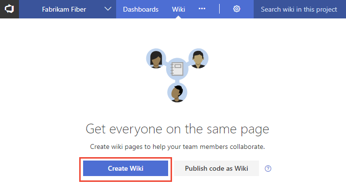
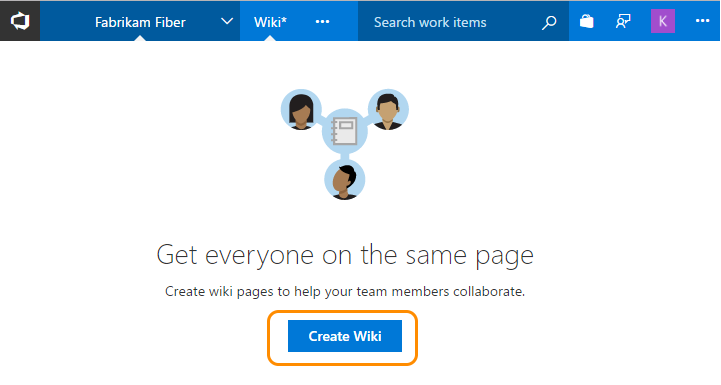
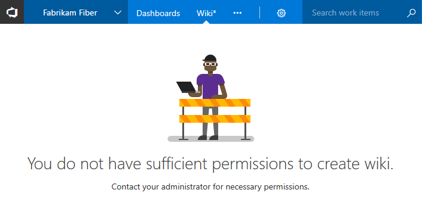

# Create a wiki for your team project

[!INCLUDE [temp](../_shared/version-vsts-tfs-2018.md)]

Each team project can be provisioned with a wiki. Use it to share information with your team to understand, use, and contribute to your project.

::: moniker range="tfs-2018"
>[!NOTE]  
>The built-in wiki is available with TFS 2018 and later versions. To download TFS 2018, see the [TFS 2018 Release Notes](https://www.visualstudio.com/en-us/news/releasenotes/tfs2018-relnotes). If you were using the Wiki Marketplace extension, you can [migrate your existing pages to the new team project wiki](migrate-extension-wiki-pages.md).

::: moniker-end

::: moniker range="vsts"
Each team project wiki is powered by a Git repository in the back-end. When you create a team project, a Wiki Git repo is not created by default. To start using a wiki, you must either provision a Git repository to store your wiki markdown files, or [publish existing markdown files from a Git repository](publish-repo-to-wiki.md) to a wiki. 

::: moniker-end

::: moniker range=">= tfs-2018"
Each team project wiki is powered by a Git repository in the back-end. When you create a team project, a Wiki Git repo is not created by default. To start using a wiki, you must  provision a Git repository to store your wiki markdown files. 

::: moniker-end

Use this topic to learn how to: 

> [!div class="checklist"]   
> * Open the **Wiki** hub
> * Provision a Git repo for your wiki 

## Prerequisites  

::: moniker range="vsts"

* You must have a team project. If you don't have a team project yet, create one in [VSTS](../accounts/set-up-vs.md).  
* You must be a member of the [Project Administrators group](../security/set-project-collection-level-permissions.md) in order to provision a wiki. 
* Anyone who is a member of the Contributors security group can add or edit wiki pages. Anyone with access to the team project, including [stakeholders](../security/get-started-stakeholder.md), can view the wiki. 

::: moniker-end

::: moniker range="tfs-2018"

* You must have a team project. If you don't have a team project yet, create one in your [on-premises TFS](../accounts/create-team-project.md).
* You must be a member of the [Project Administrators group](../security/set-project-collection-level-permissions.md) in order to provision a wiki or publish markdown files from an existing Git repo to a wiki. 
* Anyone who is a member of the Contributors security group can add or edit wiki pages. Anyone with access to the team project, including [stakeholders](../security/get-started-stakeholder.md), can view the wiki. 

::: moniker-end

[!INCLUDE [temp](_shared/open-wiki-hub.md)]

## Provision a wiki Git repository

On the Wiki landing page, choose **Create Wiki** to provision a new Git repository that will store all your wiki pages and related artifacts. (Even if you use TFVC for source control, you can create a wiki with a Git repository.)

::: moniker range="vsts"

> [!div class="mx-imgBorder"]  
> 
::: moniker-end

::: moniker range="tfs-2018"
> [!div class="mx-imgBorder"]  
>  
::: moniker-end

If you don't have access to create a Wiki Git repository, you will see a page as follows.

  

You can contact your administrator to provision the Wiki Git repository or request that they elevate your permissions. Stakeholders can't be granted permissions to create a wiki as they have no permissions to work in the **Code** hub.

The Wiki Git repo is referred as *TeamProjectName.wiki*. For example, if your team project is 'foobar' then the Wiki repo is labeled 'foobar.wiki'.

## Try this next
> [!div class="nextstepaction"]
> [Add and edit wiki pages](add-edit-wiki.md) 

## Related articles

- [Wiki Git repository files and file structure](wiki-file-structure.md)
- [Differences between provisioned wiki and publish code as wiki](provisioned-vs-published-wiki.md)
- [Publish a Git repository to a wiki](publish-repo-to-wiki.md)
- [Update wiki pages offline](wiki-update-offline.md)
- [Migrate your existing pages to the new team project wiki](migrate-extension-wiki-pages.md)
- [Manage README and Wiki permissions](manage-readme-wiki-permissions.md) 

### Why is the Git repository hidden?

The *TeamProjectName.wiki* doesn't appear in the drop-down menu of repositories in the **Code** hub, nor in the list provided in the team project administration context, **Version Control** page.  
 
However, you can navigate to it from the following URL:

::: moniker range="vsts"
`https://<AccountName>.visualstudio.com/DefaultCollection/<TeamProjectName>/_git/<TeamProjectName>.wiki` 
::: moniker-end

::: moniker range="tfs-2018"
`https://<ServerName>/DefaultCollection/<TeamProjectName>/_git/<TeamProjectName>.wiki` 
::: moniker-end

You can click **More** followed by **Clone Wiki** to access the Wiki URL.

    

This will expose the URL of the wiki Git repository and you can paste it into your web browser to access the underlying Git repo.
