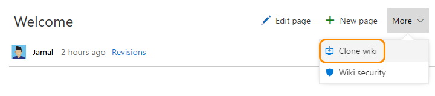
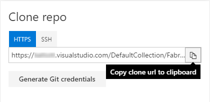
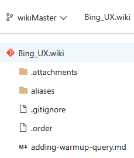
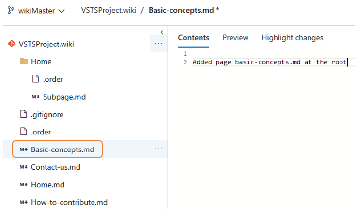
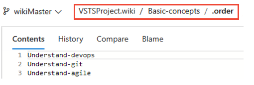
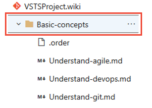
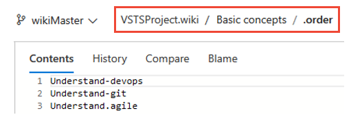
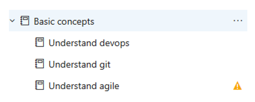
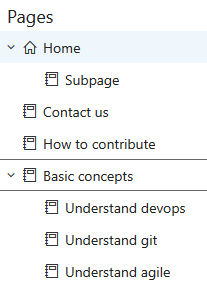

# Clone and update wiki pages offline

[!INCLUDE [temp](../_shared/version-vsts-tfs-2018.md)]

Since each team project wiki employs a git repository backend, to update your wiki pages offline, you must first clone your wiki repository and add or edit pages much the same way you develop code in a git repo. You can then push your changes to your working branch and merge them with the master branch of the wiki repository.

You can perform these steps to migrate markdown pages from another wiki to your team project wiki as well.

## Clone your wiki

1. To clone a wiki git repository, click on **More -> Clone**

2. From the **Clone repo** dialog, click **Copy clone url to clipboard**.

- The wiki repo corresponds to *ProjectName.wiki*
- The master branch corresponds to *WikiMaster*.

In order to perform the next steps to update pages offline, it is important to understand the underlying structure of a VSTS wiki git repo.

## Understand the underlying git repository structure

The wiki repository contains the following files and folders:
- A file for each page entered at the root level
- A folder for each page that contains subpages
- A folder called *.attachments* that stores all the attachments of the wiki
- A **.ORDER** file under each folder

## What is the ORDER file?

Each *.ORDER* file defines the sequence of pages contained within the folder.

- A root *.ORDER* file which specifies the sequence of pages defined at the root level
- A *.ORDER* file within each folder; this file maintains the order of subpages added to the parent page.

## Add pages to the git repository

### Add a page

1. To add pages at the root of the wiki tree, add a markdown file at the root of the git repository.

	

2. Next update the *.order* file with the name of the file (without the .MD file extension)

	

### Add a parent page

1. To add a parent page and associated sub-pages in wiki, first add a page like described in the previous topic then create a folder in the git repo for the parent page. Subsequenty add sub-pages and **.order** file under the folder.

	

2. Next, update the **.order** file with the order of the sub-pages as they should appear in wiki.

	

3. If there are any errors in the process, the pages will appear on the wiki with a warning sign.

	

## Push changes to master

When done, [push the files to the git repository](../git/tutorial/pushing.md). The updated files will appear in the wiki.

