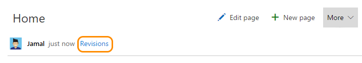
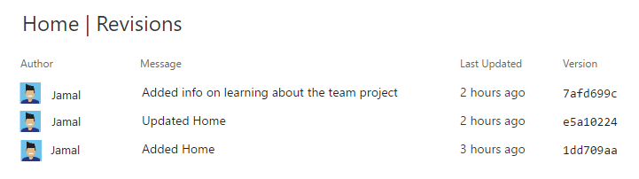
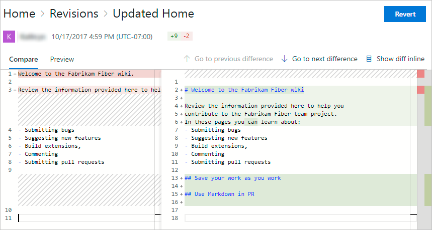
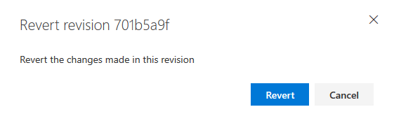

# View wiki page history and revert

[!INCLUDE [temp](../_shared/version-vsts-tfs-2018.md)]

The Revisions page provides a convenient way to get details of the changes made to a wiki page. 

## View wiki page revision history  

0. To view the revision history of a page, click the **Revisions** link provided on each page. You can also click on **View revisions** in the context menu of a page.
 
	
 
0. Revision pages show who made the change along with the revision message, date, and version or commit ID. To view details of a revision, click the message or version link. 

	

0.	Similar to any git file revision, the revision details page provides a **side-by-side diff view** or the **inline diff view**. You can also click **Preview** to view the content of the page as of the specific revision.

	

0. You can use the breadcrumbs to return to the page or the revisions of the page.

## Revert a commit

Mistakes can happen while updating a wiki page. You can conveniently revert a revision and undo changes done on a wiki page. You can click on the **Revert** button on the revision details page to revert a change on a wiki page.

