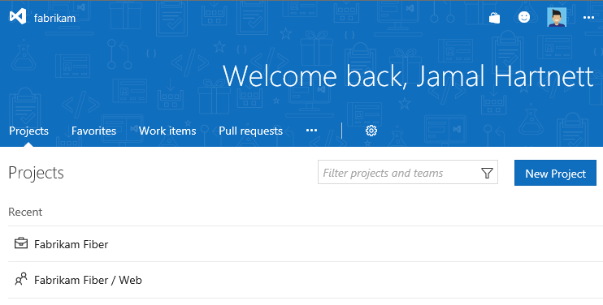
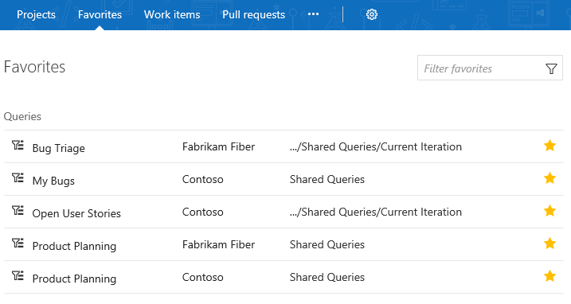
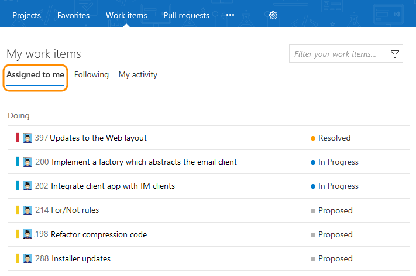
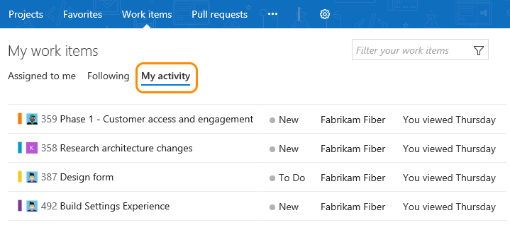

# Work effectively from your account hub

**Team Services | TFS 2017.1**  

>[!NOTE]  
>**Feature availability**: The features described in this topic are currently in preview for Team Services. You can enable or disable these features from your account menu, [Preview features-New Account Landing Page](../collaborate/preview-features.md). 
>
>For TFS 2017.1, the features described in this topic are automatically enabled for all users and cannot be disabled. To upgrade to TFS 2017.1, go to the [Visual Studio downloads page](https://www.visualstudio.com/downloads/download-visual-studio-vs). 

From your account, you gain access to a number of page views that are particularly helpful if you work in several team projects. These pages provide quick access and filter functions to support your work within a single team project or  work you're doing across several projects.  

For example, you can quickly access and navigate to work of interest from the following Account hubs:

- **Projects**: Team projects and teams within the projects that you work in  
- **Favorites**: Items&mdash;such as build definitions, repositories, shared queries, and more &mdash;that you've favorited  
- **Work items**: Work items assigned to you, that you're following, or that you've recently viewed or updated  
- **Pull requests**: Pull requests you've initiated or that are relevant to you across all team projects you work in   
- **Rooms**: Team rooms you use to collaborate with other team members.  

To access these pages, open your web browser to the following URL: 

<b>https://<i>AccountName</i>.visualstudio.com/_projects</b>

 
>[!NOTE]   
>For Team Services, the account hub is in preview mode. If you haven't enabled it yet for your account, you can do so through [your user account menu](../collaborate/preview-features.md). This hub is associated with the account collection and not any one team project or team.  
> 
>For TFS 2017.1, the account hub is automatically enabled for all users. 

You'll see something similar to the following welcome page.

   

## Projects: Navigate to a team project 
From the **Projects** page you can quickly navigate to a team project or a team that you've accessed or worked in previously. Projects are listed in the order you've last accessed, with the most recent five projects accessed appearing first. All projects you've accessed are listed within the **All** section.  

As you hover over the project, you can click one of the links to go to the Home (dashboards), Code, Work, Build & Release, or Test hub of the team project. Click the  star icon to mark the team project as a favorite. 

    

### Filter projects and teams
If a project isn't listed, you can find it by searching for it using the *Filter projects and teams* search box. Simply type a keyword contained within the name of a team project or team. Here we type **Design** to find the Contoso project Design team. 

    

### Add a team project
If you're an account administrator or are a member of the Project Collection Administrators group, the New Project button is shown. Click New Project to [add a team project](../setup-admin/create-team-project.md). 

## Favorites: Open items you've marked as Favorites  

Open the **Favorites** page to quickly access any object or item that you've marked as a favorite. 

   

Favorited objects include:

- Team projects   
- Repositories   
<!--- Branches (favoriting branches not supported at the account level) -->  
- Work item queries   
<!--- Plans (requires the [Plans extension to be installed](../work/scale/multiple-teams.md)) -->
- Build definitions  
- Test plans 

### Mark an object as a favorite 

- To mark a team project or team as a favorite, go to the **Projects** page and click the  star icon next to the team or team project.   
<!--- Not supported at account level: To mark a git branch as a favorite, open the **Code>Branches** page and click the  star icon next to the branch you want to add.  -->  
- To mark a query as a favorite, open the **Work>Queries** page and drag the query into the My Favorites area. 
- To mark a plan as a favorite, open the **Work>Plans** page and click the  star icon next to a plan.  
- To mark a build definition as a favorite, open the **Build&Release>All Definitions** page and click the  star icon next to the build definition.    
- To mark a test plan as a favorite, open the **Test>Test Plans** page and click the  star icon next to a test plan from the menu that shows All test plans. 

### Remove an item from your favorites list 
To remove an item from your favorites list, click the  favorited icon. 

   

### Filter the list of favorites  

To filter the list, type a keyword in the *Filter favorites* box. The list will filter based on keyword matches to the title or team project name associated with the favorited item. 
 

## Work: View and open work items  
Open the **Work items** hub to access the set of work items assigned to you or followed by you. The lists available from each page span all team projects that you work in. 

>[!NOTE]  
><b>Feature availability: </b>For Team Services, you can access the Work items hub [from a mobile device](../collaborate/mobile-work.md). 

###Your assigned work items 
The **Assigned to me** page lists all work items assigned to you in the order they were last updated. To open or update a work item, click its title. 

  

### Work you're following   

Click **Following** to open the page that lists all the work items [you've marked to follow](../collaborate/follow-work-items.md). 

   

To stop following an item and remove it from your list, click the  following icon. 

### My activity
Click **My activity** to open the page that lists all work items that you have recently viewed or updated.  

 

### Filter the list of work items 

Similar to the Favorites page, you can filter the work pages by typing a keyword in the *Filter your work items...* box. The list will filter based on keyword matches to the work item ID, title, state, or team project name. 

##Pull requests: View and open pull requests 

Open the **Pull requests** page to access any pull request that's relevant to you across all team projects you work in. Click **Active** or **Completed** to pivot between the active or completed set of pull requests.  To initiate a pull request, click New pull request. 

   

From each page, you're one click away from navigating to the branch or repository for a pull request. This mirrors capabilities on the team-project level **Code>Pull Requests** page.

### Filter the list of pull requests 

Similar to the Favorites page, you can filter the list by typing a keyword in the *Filter pull requests* box. 

##Rooms: Navigate to a team room 

To open a team room, click **Rooms**. You'll see all the team rooms defined for the account. Click the name of a team room which you have access. 

>**Note:**  You only have access to those team rooms of which you are a team member.  

   

To learn more about team rooms, see [Collaborate in a team room](../collaborate/collaborate-in-a-team-room.md). 

<!--- Not implemented yet 
##Load testing 

--> 

##Related notes

- [Enable preview features](../collaborate/preview-features.md)  
- [Work in the web portal](work-web-portal.md) 
- [User-focused features](user-focused-features.md)  
- [Productivity tips](../work/productivity/productivity-tips.md)  
- [Connect to team projects](connect-team-projects.md)  
- [Collaborate using team resources](../work/scale/manage-team-assets.md)  

[!INCLUDE [temp](../_shared/switch-team-context.md)]