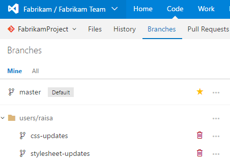
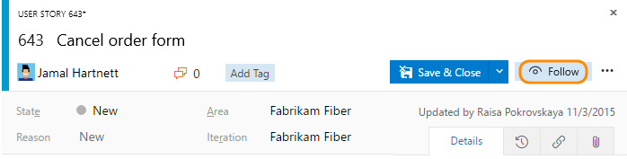
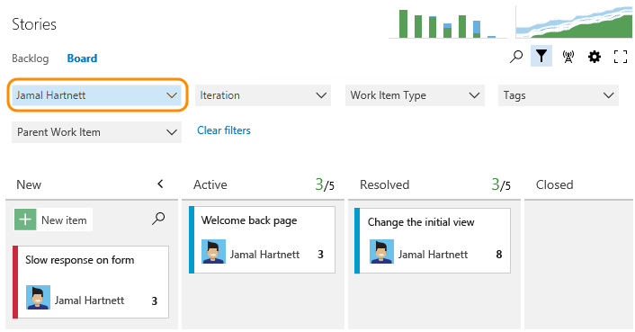
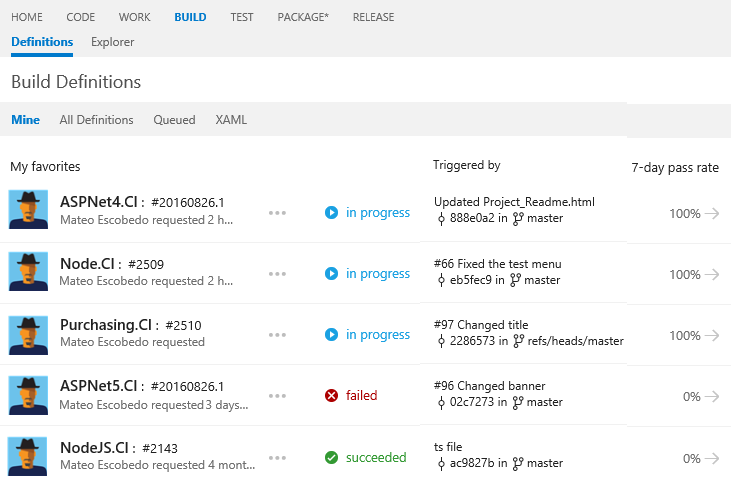

#User-focused features

**Team Services | TFS 2017 | TFS 2015.1**

With user-focused features, you gain quick access to the work you're most interested in. The features show-cased below are available from Team Services and the web portal for TFS. They focus on features supported through the web portal. Most of these features operate based on your logged-in user account.

<blockquote style="font-size: 13px"><b>Feature availability: </b>The following features are available from Team Services or from the web portal of the listed on-premises TFS version or a later version. Those not annotated are available from all platforms and versions. Visit the [Visual Studio Downloads](https://www.visualstudio.com/downloads/download-visual-studio-vs) page to get the latest TFS update. </blockquote>

Code development

<ul style="padding-left:30px">
 <li style="margin-bottom:2px">[View changes made to your published branches](#my-code-branches)  (TFS 2015.2)</li> 
 <li style="margin-bottom:2px">[Initiate a pull request after publishing a branch](#initiate-pr)  (TFS 2015.2)</li>
 <li style="margin-bottom:2px">[View your pull requests](#my-prs) (TFS 2015.2)</li>
 <li style="margin-bottom:2px">[Follow a pull request](#follow-pr) (TFS 2017.1)</li>
<li style="margin-bottom:2px">[Link to recently viewed work items](#mention-wit-id) (TFS 2015.1)</li>
 <li style="margin-bottom:2px">[Dashboard widget: your pull requests](#my-pr-widget)  (TFS 2015.2)</li>
</ul>

Track work

<ul style="padding-left:30px">
<li style="margin-bottom:2px">[Work assigned to you](#assigned-to-me)</li>
<li style="margin-bottom:2px">[Your queries, your favorites](#my-queries-favorites)</li>
<li style="margin-bottom:2px">[Follow work](#follow) (TFS 2017)</li>
<li style="margin-bottom:2px">[Follow a pull request](#follow-pr) (TFS 2017.1)</li>
<li style="margin-bottom:2px">[Filter Kanban board](#kanban-board)  (TFS 2017)</li>
<li style="margin-bottom:2px">[Filter task board](#task-board)</li>
<li style="margin-bottom:2px">[Dashboard widget: work assigned to you](#assigned-to-me-widget) (Team Services)</li>
</ul>

Devops: Build-Test-Release

<ul style="padding-left:30px">
<li style="margin-bottom:2px">[View your selected build definitions](#my-builds)  (Team Services)</li>
</ul>

Get notified

<ul style="padding-left:20px">
<li style="margin-bottom:1px">[Personal notifications or alerts](#alerts)  </li>
<li style="margin-bottom:2px">[Follow work](#follow) (TFS 2017)</li>
</ul>
 
 

Favorites

<ul style="padding-left:30px">
<li style="margin-bottom:1px">[Favorite a query](../work/track/using-queries.md#favorite-query) </li>
<li style="margin-bottom:1px">[Favorite a team or team project](account-home-pages.md#favorites) (TFS 2017.1)</li>
<li style="margin-bottom:1px">[Favorite a branch or repository](account-home-pages.md#favorites) (TFS 2017.1)</li>
<li style="margin-bottom:1px">[Favorite a build definition](account-home-pages.md#favorites) (TFS 2017.1)</li>
<li style="margin-bottom:1px">[Favorite team plans](account-home-pages.md#favorites) (TFS 2017.1)</li>
<li style="margin-bottom:1px">[View and manage favorites](account-home-pages.md#favorites) (TFS 2017.1)</li>
</ul>

Security

<ul style="padding-left:30px">
<li style="margin-bottom:2px">[Personal access tokens](../setup-admin/team-services/use-personal-access-tokens-to-authenticate.md) (TFS 2017)</li>
<li style="margin-bottom:2px">[Alternate authentication credentials](../git/auth-overview.md#alternate-credentials)</li>
<li style="margin-bottom:2px">[OAuth authorizations](../integrate/get-started/Authentication/oauth.md)</li>
<li style="margin-bottom:2px">[SSH public keys](../git/use-ssh-keys-to-authenticate.md) (TFS 2017)</li>
</ul>

>[!NOTE]  
>If you work in Team Services or TFS 2017.1, you can also use your account hub to view and quickly navigate to teams, team projects, branches, work items, pull requests and other objects that are relevant to you. For details, see [Work effectively from your account hub](account-home-pages.md).   

## Code development  

Your selected repository and branch persists from session to session. 

>[!NOTE]  
><b>Feature availability: </b>Code development features are supported from Team Services or the web portal for TFS 2015.2 or later version.   

### View changes made to your published branches  

From the **Code>Branches>Mine** page, you can quickly access all branches you've published. 

 

Also, you can add branch folders to your favorites and they'll show up on your **Mine** page. For details, see [Manage branches, Mark favorites](../git/manage-your-branches.md#mark-favorites). 
  

### Complete pull request prompt after publishing a branch 

When you publish or update a feature branch in your Git repo, you will get a prompt asking if would like to create a pull request from the **Code** hub.

Select the **New pull request** link to go to a page where you will enter your pull request details and create the pull request. See [Review code with pull requests](../git/pull-requests.md) for details. 

### View pull requests you initiated 
 

From the **Code>Pull Request>Mine** page, you can quickly access all branches you've published. 

### Link to recently viewed work items 

<blockquote style="font-size: 13px"><b>Feature availability: </b>The **#ID** special control for pull requests is supported from Team Services or the web portal for TFS 2015.1 or later version.   </blockquote>  

When leaving a code comment in a pull request, you can type **#** to trigger the **#ID** work item picker. The picker displays a list of 50 work items that you have recently modified or that are assigned to you. 

    

For details, see [Productivity tips, Use the #ID control to link to work items](../work/productivity/productivity-tips.md#mention-wit-id)

In a similar manner to the #ID field for a pull request, you can enter #ID within a work item Discussion, a commit, or a changeset or shelveset. You'll receive the same work item picker that displays a list of 50 work items that you have recently modified or that are assigned to you.   

### Tag pull requests you want to follow  

>[!NOTE]  
><b>Feature availability: </b>The **Follow** feature for pull requests is supported from Team Services or the web portal for TFS 2017.1 or later versions. For on-premises TFS, [you must configure an SMTP sever](../setup-admin/tfs/admin/setup-customize-alerts.md) in order for team members to receive notifications. 

To track the progress of a single pull request, click the  option from the context menu. To stop following changes, open the PR context menu and click the  icon. For details, see [Follow a work item or pull request](../collaborate/follow-work-items.md).  

  

 

## Track work  

Your selected backlog or board persists from session to session.   

Several features support your ability to track work assigned to you or work you want to stay up-to-date as changes are made. In addition to the features described in this section, see also [Personal alerts](#alerts) later in this topic. 

### Tag work items you want to follow  
>[!NOTE]  
><b>Feature availability: </b>The **Follow** feature is supported from Team Services or the web portal for TFS 2017 or later version. For on-premises TFS, [you must configure an SMTP sever](../setup-admin/tfs/admin/setup-customize-alerts.md) in order for team members to receive notifications.    

Click the  icon from any work item to get notified when changes are made to the work item or people add to the discussion. To stop following changes, click the  icon. For details, see [Follow a work item or pull request](../collaborate/follow-work-items.md).  

  

### Predefined queries, My queries, and My favorites 

From the **Work>Queries** page you'll find several features that help you focus on work assigned to you or work you're following. The Assigned to me query lists all work that is currently assigned to you using the **@Me** macro. You can modify this query as needed. The Followed work items query supports managing the work items you've tagged to follow. To learn more about queries, see [Use the query editor to list and manage queries](../work/track/using-queries.md).

In addition, you can save queries to your **My Queries** folder which only you'll have access, or drag defined queries to your **My favorites** folder. 

  

### Backlog and board filters 

<blockquote style="font-size: 13px"><b>Feature availability: </b>Kaban field filters are supported from Team Services or the web portal for TFS 2017 or later version.   </blockquote>

From a Kanban board, you can [filter based on your name](../work/how-to/filter-backlog-or-board.md#field-filter) to focus on those items assigned to you. 

  

From the sprint task board, you can focus on the work you've completed and your remaining work by [filtering on your name](../work/scrum/task-board.md#show-individual-progress).

  

## Dashboard widgets 

<blockquote style="font-size: 13px"><b>Feature availability: </b>The **Assigned to me** widget is supported from Team Services or the web portal for TFS 2017 or later version.   </blockquote>

There are two widgets you can add to the dashboard to focus on your work. The first is the Assigned to me widget, which works off a predefined query (different from the Assigned to me query described in the previous section).   

<blockquote style="font-size: 13px"><b>Feature availability: </b>The **Pull Request** widget is supported from Team Services or the web portal for TFS 2015.2 or later version. </blockquote>

The second widget is the Pull Requests widget which can be configured to show just those pull requests assigned to the logged in user or requested by the logged in user. To learn more about dashboards and widgets, see [Dashboards](../report/dashboards.md) and the[ Widget catalog](../report/widget-catalog.md). to learn about pull requests, see [View and create pull requests](../git/pull-requests.md). 

 

## DevOps: Build, Test, Release

<blockquote style="font-size: 13px"><b>Feature availability: </b>The following feature is currently supported only from Team Services.   </blockquote>

From the **Build>Definitions>Mine** page, you can quickly view all builds you've selected as a favorite, have been set as a team favorite, or builds of code that you've checked in. To learn more, see  [2016 Team Foundation Build release notes](../build-release/news/2016.md#august-19).

## Personal notifications or alerts 

With notifications or alerts, you can personalize the email notifications you receive based on changes made to work items, pushed commits, pull request activity, completion of builds, and more.

For Team Services and TFS 2017.1 and later versions, you [manage  your personal notifications](../collaborate/manage-personal-notifications.md). For TFS 2017 and earlier versions, you [manage your personal alerts](../work/track/alerts-and-notifications.md).

The functionality is similar whether you are managing notifications or alerts, as indicated in the following tables. The main differences are changes made to the user interface. 

>[!IMPORTANT]
>For on-premises TFS, [you must configure an SMTP sever](../setup-admin/tfs/admin/setup-customize-alerts.md) in order for team members to receive notifications.

### Notifications (Team Services, TFS 2017.1)

<table>
<tbody valign="top">
<tr>
<th>Functional area</th>
<th>Notification</th>
</tr>
<tr>
<td>
Build
</td>
<td>
- A build completes 
- A build fails 
- A build controller or agent's status changes 
- A build's quality changes 
</td>
</tr>
<tr>
<td>
Code (Git)
</td>
<td>
- A commit authored by me is pushed 
- A commit is pushed by me 
- A commit is pushed 
- A pull request is created or updated 
</td>
</tr>
<tr>
<td>
Code (TFVC)
</td>
<td>
- Code is checked in 
- Code is checked in with a policy override 
- A file with a specific extension is checked in  
- A file under a specific path is checked in 
- A code review I am working on changes  
- Any code review changes 
</td>
</tr>
<tr>
<td>
Work
</td>
<td>
- A work item I created is changed 
- A work item assigned to me is changed 
- A work item is created 
- A work item is assigned to me 
- A work item is deleted 
- A work item is restored 
</td>
</tr>
</tbody>
</table>

### Alerts (TFS 2017 and earlier versions)
Some options listed below are dependent on the TFS version. For example, *A work item is deleted* or *A work item is restored* requires TFS 2015.2 or later versions. 

<table>
<tbody valign="top">
<tr>
<th>Functional area</th>
<th>Alert</th>
</tr>
<tr>
<td>
Build
</td>
<td>
- A build completes 
- A build fails 
- My build completes 
- A build controller or agent's status changes 
- A build quality is changed 
</td>
</tr>
<tr>
<td>
Code (Git)
</td>
<td>
- A commit is pushed to this team project 
- A pull request I have participated in is created or updated 
- A pull request is created or updated for my team 
- A pull request is created or updated in a specified repository 
- A pull request is created or updated in this team project 

- A commit authored by me is pushed 
- A commit is pushed by me 
- A commit is pushed to a specified repository 
- A commit is pushed to this team project 
</td>
</tr>
<tr>
<td>
Code (TFVC)
</td>
<td>
- A checkin is submitted by me 
- A checkin occurs with a policy overridden  
- A file is check in under a folder with a specified name   
- A file is checked in under a specific path  
- A file with a specific file extension is checked in 
- Any checkin occurs in this team project  

- A code review I am working on changes  
- A code reviewin this project changes 
</td>
</tr>
<tr>
<td>
Work
</td>
<td>
- A change is made to a work item that I created 
- A change is made to a work item that is assigned to me 
- A new work item is created in this team project 
- A specific work item is changed  
- A work item in this team project is changed 
- A work item is assigned to me 
- A work item is deleted 
- A work item is moved from this team project 
- A work item is restored  
- A work item under a specified area path changes 
</td>
</tr>
</tbody>
</table>

## Related notes 

Additional resources you may find of interest: 

<!---[Work effectively from your account hub](account-home-pages.md)-->
- [Work in the web portal](work-web-portal.md) 
- [Productivity tips](../work/productivity/productivity-tips.md)
- [Keyboard shortcuts](../reference/keyboard-shortcuts.md) 
- [Collaborate using team resources](../work/scale/manage-team-assets.md)  

### Set your account preferences  

You [set your account preferences](../setup-admin/account-preferences.md) through your account menu.  

   

### Feedback and support  

We welcome your feedback. 

Send suggestions via **[UserVoice](https://visualstudio.uservoice.com/forums/330519-team-services)**, and follow us on **[Twitter](https://twitter.com/VSTeam) @VSTeam**.  

 