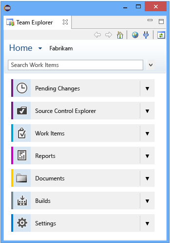
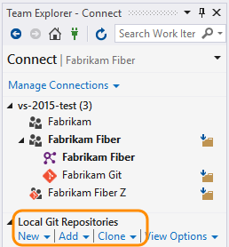
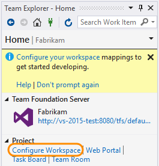

# Work in Team Explorer

**Team Services | TFS 2017 |  TFS 2015 | TFS 2013** 

You use Team Explorer to manage work that is assigned to you, your team, or your team projects, and to coordinate your efforts with other team members to develop a project. Team Explorer is a plug-in that installs with Visual Studio or Eclipse. Working from different platforms, developers and stakeholders can effectively collaborate using Team Explorer connected to team projects hosted on Visual Studio Online or on-premises Team Foundation Server (TFS). 

>[!TIP]  
>You can access the latest version of Visual Studio clients from the [Visual Studio Downloads page](https://www.visualstudio.com/downloads/). Additional options for connecting to Team Services or TFS include: 
> - [Team Explorer Everywhere](http://java.visualstudio.com/Docs/tools/eclipse)
> - [Visual Studio Team Services Plugin for Android Studio](http://java.visualstudio.com/Docs/tools/androidstudio)  
> - [Visual Studio Team Services Plugin for IntelliJ](http://java.visualstudio.com/Docs/tools/intellij) 
> - [Visual Studio Code](http://java.visualstudio.com/Docs/tools/vscode)    
>For information about compatibility among client and server versions, see [Requirements and compatibility](../setup-admin/requirements.md).

The operations available to you depend on which source control option—Team Foundation version control (TFVC) or Git—was selected to manage source code when the team project was created.

**Team Explorer plug-in for Visual Studio**

Team Explorer connects Visual Studio to team projects. You can manage source code, work items, and builds. Or, create a team project.

>[!TIP]  
>If you open Visual Studio and the Team Explorer pane doesn't appear, click the **View/Team Explorer** menu option. 

Home page with Git

> [!div class="mx-tdBreakAll"]  
> |Home page with Git  |Home page with TFVC  |
> |-------------|----------|
> |||

>[!NOTE]  
>Some pages, such as **Reports** and **Documents**, only appear when TFS is configured with the required resources, such as SQL Server Reporting Services and SharePoint.

If you don't need Visual Studio, but do want to connect to Team Services or TFS or get one or more Team Foundation add-ins, you can install the free [Visual Studio Community](https://www.visualstudio.com/downloads/download-visual-studio-vs).

**Team Explorer plug-in for Eclipse**

If you work in Eclipse or on a non-Windows platform, you can [install the Team Explorer plug-in for Eclipse](http://java.visualstudio.com/Docs/tools/eclipse#_install-the-tee-plugin-for-eclipse). Once installed, you can share your Eclipse projects by adding them to Team Services or TFS using [Git](../git/share-your-code-in-git-eclipse.md) or [TFVC](../tfvc/share-your-code-in-tfvc-eclipse.md).

> [!div class="mx-tdBreakAll"]  
> |Home page with Git (Eclipse) |Home page with TFVC (Eclipse) |
> |-------------|----------|
> | | |

> [!NOTE]  
> Some pages, such as **Reports** and **Documents**, only appear when TFS is configured with the required resources, such as SQL Server Reporting Services and SharePoint.

## Choose the page to access the task you want

Based on the page you select and the options configured for your team project.

### Connect page

From the **Connect** page, you can select the team projects you want to connect to and quickly switch context between team projects.

> [!div class="mx-tdBreakAll"]  
> |Git: Local Git repo |TFVC: Map workspace |
> |-------------|----------|
> |If you connect to a Git repo, you also can [create, add, or clone repositories](..//git/tutorial/creatingrepo.md).  |If you connect to a TFVC repo, you'll be prompted to [Configure your workspace (TFVC)](../build-release/define/options.md) on first connect. |

> [!IMPORTANT]  
> From the Visual Studio plug-in, you can [Create a team project](../setup-admin/create-team-project.md). The ability to create team projects is not supported from the Eclipse plug-in. You can, however, create team projects from the web portal account/collection administration context. 

### Home, Work, and Build pages 

> [!div class="mx-tdBreakAll"]  
> |Home|Work Items  |Build |
> |-------------|----------|----------|
> |-[Configure workspace](../tfvc/share-your-code-in-tfvc-vs.md#configure-your-workspace) - Open [Web portal](work-web-portal.md#user-context) - Open [Task Board](../work/scrum/task-board.md) - Open [Team Room](../collaborate/collaborate-in-a-team-room.md) |- [Add work items](../work/backlogs/add-work-items.md) - [Use the query editor to list and manage queries](../work/track/using-queries.md) - [Organize query folders and set query permissions](../work/track/set-query-permissions.md) - [Open query in Excel](../work/office/bulk-add-modify-work-items-excel.md) - [Open query in Project](../work/office/create-your-backlog-tasks-using-project.md) - [Email query results list using Outlook](../work/track/share-plans.md) - [Create reports from query in Excel](../report/excel/create-status-and-trend-excel-reports.md) (TFS only) |- [Create build definitions](../build-release/define/build.md) - [View and manage builds](../build-release/overview.md) - [Manage the build queue](../build-release/concepts/agents/pools-queues.md) |

> [!NOTE]  
> If inline images aren't displaying correctly, see [Resolve images that don't display in Team Explorer](#images-missing-te). 

### Git and TFVC pages  

The Git and TFVC repos support different pages and functions. You'll see one or the other pages depending on the team project and repro you connect to. For a comparison of the two repos, see [Choosing the right version control for your project](../tfvc/comparison-git-tfvc.md). 

> [!div class="mx-tdBreakAll"]  
> |Git | TFVC  |
> |-------------|----------|
> |-**Changes**: [Save work with commits](../git/tutorial/commits.md) -**Branches**: [Create work in branches](../git/tutorial/branches.md) -**Pull Requests**: [Review code with pull requests](../git/tutorial/pullrequest.md) -**Sync**: [Update code with fetch and pull](../git/tutorial/pulling.md)) | **My Work**: [Suspend/resume work](../tfvc/suspend-your-work-manage-your-shelvesets.md)  &#124; [Code review](../tfvc/day-life-alm-developer-suspend-work-fix-bug-conduct-code-review.md) -**Pending Changes**: [Manage pending changes](../tfvc/develop-code-manage-pending-changes.md) &#124; [Find shelvesets](../tfvc/suspend-your-work-manage-your-shelvesets.md) &#124; [Resolve conflicts](../tfvc/resolve-team-foundation-version-control-conflicts.md) -**Source Control Explorer**: [Add/view files and folders](../tfvc/add-files-server.md) |

### Report and Document pages (TFS only)  

The **Report** page opens the [Reporting Services report site](../report/sql-reports/reporting-services-reports.md). This page appears only when your team project has been configured with SQL Server Analysis Services and Reporting Services. Also, the option to **Create Report in Microsoft Excel** appears only when reporting has been configured for the team project.

From the **Document** page, you can [open project portal](../report/sharepoint-dashboards/share-information-using-the-project-portal.md) and [manage documents and document libraries](../report/sharepoint-dashboards/manage-documents-and-document-libraries.md). This page appears only if your team project has been configured with a SharePoint Products portal.
  
If your team project is missing one or more pages, you may be able to [add functionality to your on premises TFS deployment](../setup-admin/tfs/admin/config-tfs-resources.md).

### Settings page 

From the **Settings** page, you can configure administrative features for either a team project or team project collection. Configuring features in these areas requires you to be a member of a Team Services or TFS administrator group.

Most of the links open to a web portal administration page. Not all settings are available from the Team Explorer plug-in for Eclipse. 
 

> [!div class="mx-tdBreakAll"]  
> |Team project settings | Collection settings (TFS)  |
> |-------------|----------|
> |Required membership: [Project Administrators](../setup-admin/add-administrator-tfs.md#team-project) -[Security (manage project-level permissions)](../setup-admin/permissions.md#team-project-level-permissions) -[Group membership: manage group permissions](../setup-admin/permissions.md) -Source Control: Configure the [check-in and check-out policies](../tfvc/add-check-policies.md) (TFVC only) -[Work Item Areas (project-wide)](../work/customize/set-area-paths.md) -[Work Item Areas (project-wide)](../work/customize/set-iteration-paths-sprints.md) -[Portal Settings (Enable portal or process guidance)](../report/sharepoint-dashboards/configure-or-add-a-project-portal.md) -[Project Alerts](../work/track/alerts-and-notifications.md) |Required membership: [Project Collection Administrators](../setup-admin/add-administrator-tfs.md#project-collection) -[Security (manage project-level permissions)](../setup-admin/permissions.md#collection-level) -[Group membership: manage group permissions](../setup-admin/permissions.md) -Source Control: Configure the [default workspace type for the collection](../tfvc/decide-between-using-local-server-workspace.md#manage-team-project-collection-workspace-settings-for-your-team) (TFVC only) -[Process Template Manager: download, upload, delete, or set a default process template](../work/guidance/manage-process-templates.md) |

To learn more about administration features, see [Work in the web portal, administration context](work-web-portal.md#admin-context).

## Related notes 
You've now got a basic understanding of how to work in the Team Explorer add-in for Visual Studio and Eclipse.

### Troubleshoot connection problems  

Here's a list of the most frequently encountered connection problems and what to do about them. Start at the top and follow it in the order indicated.

1.  Verify that you have [required permissions](../setup-admin/add-users.md).

    If the errors that you receive indicate read-only or blocked actions, you might not have permission to act on the data.

2.  Verify that your computer is connected to the network and can access network resources.

3.  Verify that TFS hasn't been taken offline. Talk with your TFS administrator.

4.  Verify whether your team project has been moved to another team project collection in Team Foundation Server. If it has been moved, you must create a connection to the new server name.

For more troubleshooting tips, [TF31002: Unable to connect to this Team Foundation Server](../work/reference/error/tf31002-unable-connect-tfs.md).

### Clients that connect to Team Services or TFS

In addition to connecting through Team Explorer, you can connect to a team project from these clients: 

- [Web portal](work-web-portal.md) 
- [Visual Studio Code](https://code.visualstudio.com/Docs)
- [Visual Studio Community](https://www.visualstudio.com/products/visual-studio-community-vs.aspx) 
- [Eclipse: Team Explorer Everywhere](http://java.visualstudio.com/Docs/tools/eclipse) 
- [Office Excel](../work/office/bulk-add-modify-work-items-excel.md)
- [Office Project](../work/office/create-your-backlog-tasks-using-project.md)
- [PowerPoint Storyboarding](../work/office/storyboard-your-ideas-using-powerpoint.md) 
- [Microsoft Test Manager](https://msdn.microsoft.com/library/jj635157.aspx)
- [Microsoft Feedback Client](../work/connect/give-feedback.md)   

### Refresh Team Explorer 

If data doesn't appear as expected, the first thing to try is to refresh your client. Refreshing your client updates the local cache with changes that were made in another client or in TFS. To refresh Team Explorer, do one of the following actions:

-   To refresh a page that you are currently viewing, choose  **Refresh** icon in the menu bar (or choose the F5 key).

-   To refresh the team project you currently have selected, choose  **Home**, and then choose  **Refresh** icon (or choose the F5 key).

-   To refresh the set of teams defined for the team project that you currently have selected, choose the Connect icon, and then choose  **Refresh** icon (or choose the F5 key).

[!INCLUDE [temp](_shared/when-to-refresh-client.md)]

[!INCLUDE [temp](../_shared/images-not-appearing-vs.md)] 

### Additional tools provided with TFS Power Tools (Visual Studio 2015 & TFS 2015) 

By installing [TFS Power Tools](https://marketplace.visualstudio.com/items?itemName=TFSPowerToolsTeam.MicrosoftVisualStudioTeamFoundationServer2015Power), you gain access to these additional tools through the Team Explorer plug-in for Visual Studio:

-   Process Template Editor
-   Additional check-in policies for Team Foundation Version Control
-   Team Explorer enhancements including Team Members
-   Team Foundation Power Tool Command Line
-   Test Attachment Cleaner
-   Work Item Templates

Additional requirements may apply.

> [!NOTE]  
> For TFS 2017 and later versions, you can [install the TFS Process Template editor from the Visual Studio Marketplace](https://marketplace.visualstudio.com/items?itemName=KarthikBalasubramanianMSFT.TFSProcessTemplateEditor). You can use this version of the Process Editor to modify the old-style work item forms. You can't use it to edit forms associated with the [new web forms](/docs/work/process/new-work-item-experience).  

