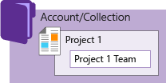
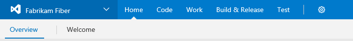
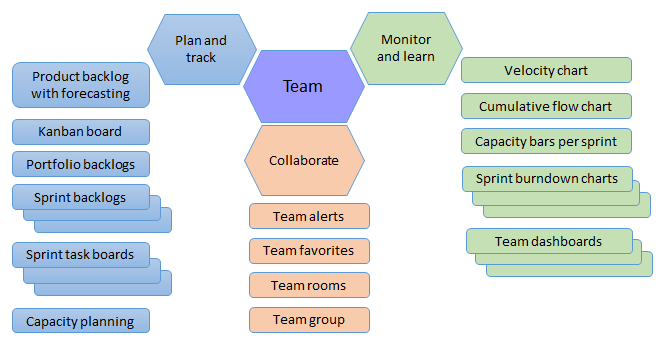
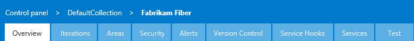
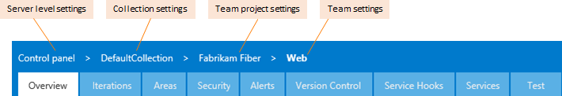
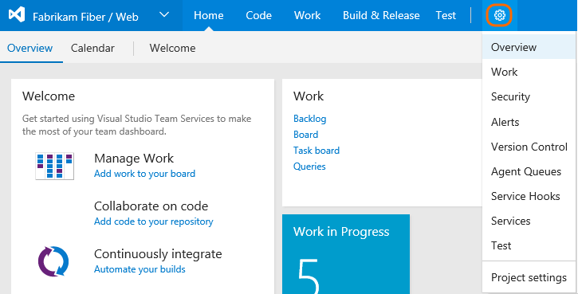
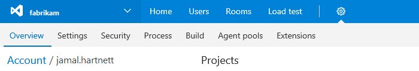

# Navigating in the web portal

**Team Services | TFS 2017 | TFS 2015 | TFS 2013**  

The web portal provides support for teams to collaborate through the planning, development, and release cycles. You use the web portal to perform both software development and administrative tasks.  

You can manage source code, plan and track work, define builds, run tests, and manage releases. The web portal connects you to the team project defined for an account in [Visual Studio Team Services](../setup-admin/team-services/sign-up-for-visual-studio-team-services.md) or within an on-premise TFS. 

If you don't have a team project yet, create one in [Visual Studio Team Services](../setup-admin/team-services/set-up-vs.md) or set one up in an [on-premises TFS](../setup-admin/create-team-project.md). If you don't have access to the team project, [get invited to the team](../work/scale/multiple-teams.md#add-team-members).

>[!NOTE]  
>The images you see from your web portal may differ from the images you see in this topic. These differences result from updates made to Team Services or your on-premises TFS and [options that you or your admin have enabled](../collaborate/preview-features.md). However, the basic functionality available to you remains the same unless explicitly mentioned.  

>[!NOTE]  
>**Feature availability**: The features available to you depend on the platform (Team Services or on-premises TFS), TFS version, features enabled for your team project or collection, and your access level. New features are deployed regularly to Team Services. Many of these features are then made available to [on-premises TFS through regular updates](https://www.visualstudio.com/articles/news/features-timeline).  

To get started, from a [supported web browser](../setup-admin/requirements.md#browsers) enter the following URL:

**Team Services:**
	<pre><code>https://<i>AccountName</i>.visualstudio.com/DefaultCollection/<i>ProjectName</i> </code></pre>

**TFS (on-premises):**   
	<pre><code>http://<i>ServerName</i>:8080/tfs/DefaultCollection/<i>ProjectName</i></code></pre>

>[!NOTE]  
>For TFS, the TFS administrator can configure the following elements: protocol (*https* vs *http*), port (*8080*), virtual directory (*tfs*), and collection name (*DefaultCollection*) (See [Web site settings and security](../setup-admin/websitesettings.md).) For example, a deployment configured on port 443 with no vdir, an FQDN, and a custom collection name might look like: *https://tfs.contoso.com/CustomCollection/ProjectName*. If the above pattern doesn't work for you, check with your TFS administrator.    
 

The web portal is one of several clients that can connect to a team project. Different clients support different features and functions. For a list of all clients that connect to Team Services or TFS, see [Tools and clients that connect to Team Services and TFS](../tools.md). 

##Navigational concepts  

There are three main navigational concepts to understand. The first is the collection-project-team structure, the second is the user/administrative context, and the third corresponds to user-focused and team-scoped features that provide quick access to tasks targeted for the logged-in user or for the selected team.

### Collection-project-team structure
When you connect to Team Services or an on-premises TFS, you connect to an account or team project collection. Within that collection, one or more team projects may be defined. At a minimum, at least one team project must be created in order to use the system.

When you create your team project, a team of the same name is automatically created. For small teams, this is sufficient.  

However, for enterprise-level organizations, it may be necessary to scale up, to create additional teams and/or team projects. These can be created within the single account or collection.

<table width="100%">
<tbody valign="top">
<tr>
<td width="40%">
**Single team project, team defined within an account/collection**  
  
</td>

<td width="60%">
**Multiple team projects and teams defined within an account/collection**   
  

</td>
</tr>
</tbody>
</table>

The collection-project-team structure provides teams a high-level of autonomy to configure their tools in ways that work for them. It also supports administrative tasks to occur at the appropriate level.

To learn more about adding teams and the features that support team autonomy, see [Multiple teams](../work/scale/multiple-teams.md) and [Manage team assets](../work/scale/manage-team-assets.md).

<!--- configure get started for a team -->

### User/administrative context
The user context is used to get work done&mdash;manage code, plan and track work,  define and manage builds, create and run tests, and so on. Administrators use the admin context to configure shared resources and permissions. Tasks performed in this context can impact the team project and team functions.  

**User context**   
You and other team members use the user context to collaborate, plan, and build working software.  

<ul class="nav nav-pills" style="padding-right:15px;padding-left:15px;padding-bottom:5px;vertical-align:top;font-size:18px;">
<li style="float:left;" data-toggle="collapse" data-target="#user-context-id">User context</li> 

<li style="float: right;"><a style="max-width: 374px;min-width: 120px;vertical-align: top;background-color:#AEAEAE;margin: 0px 0px 0px 8px;min-width:50px;color: #fff;border: solid 2px #AEAEAE;border-radius: 0;padding: 2px 6px 0px 6px;outline-style:none;height:32px;font-size:12px;font-weight:400" data-toggle="pill" href="#tfs-2015-user-context">TFS 2015</a></li>

<li style="float: right;"><a style="max-width: 374px;min-width: 120px;vertical-align: top;background-color:#AEAEAE;margin: 0px 0px 0px 8px;min-width:50px;color: #fff;border: solid 2px #AEAEAE;border-radius: 0;padding: 2px 6px 0px 6px;outline-style:none;height:32px;font-size:12px;font-weight:400" data-toggle="pill" href="#tfs-2017-user-context">TFS 2017</a></li>

<li style="float: right;"><a style="max-width: 374px;min-width: 120px;vertical-align: top;background-color:#AEAEAE;margin: 0px 0px 0px 8px;min-width:90px;color: #fff;border: solid 2px #AEAEAE;border-radius: 0;padding: 2px 6px 0px 6px;outline-style:none;height:32px;font-size:12px;font-weight:400" data-toggle="pill" href="#ts-account-off-user-context">TFS 2017.1</a></li>

<li class="active" style="float: right"><a style="max-width: 374px;min-width: 120px;vertical-align: top;background-color:#007acc;margin: 0px 0px 0px 0px;min-width:90px;color: #fff;border: solid 2px #007acc;border-radius: 0;padding: 2px 6px 0px 6px;outline-style:none;height:32px;font-size:12px;font-weight:400" data-toggle="pill" href="#team-services-user-context">Team Services</a></li>

</ul>
 

 

Click any hub to open that hub. Hover your mouse over a hub to access a drop-down menu of pages and other options for that hub. To access administrative options, click the  gear Settings icon or choose the admin level you want from the drop-down menu. 

 

 

Click any hub to open that hub. Hover your mouse over a hub to access a drop-down menu of pages and other options for that hub. To access administrative options, click the  gear Settings icon or choose the admin level you want from the drop-down menu.  

 

 

Click any hub to open that hub. Hover your mouse over a hub to access a drop-down menu of pages and other options for that hub. To access administrative options, click the  gear Settings icon or choose the admin level you want from the drop-down menu.  

 

Click any hub to open that hub. Then, click a page within the hub to open that page.   

 

 

**Administrative context**  
You use the administrative context to set team, team project, and account or collection settings. The hubs and pages available change based on what level of administrative context you're in. 

To learn more about each administrative context level, see the [Administrative context and team, team project, and account/collection settings](#administrative-context) later in this topic.
 

### User-focused features

Several features display information based on the logged-in user account or the selected team context. First off, users can [set their preferences](../setup-admin/account-preferences.md) through their profile or account menu:

   

In addition, they have access to special queries&mdash;Assigned to me query, Followed work items, and more&mdash; dashboard widget such as the Assigned to me widget, and the ability to save favorites under a **My favorites** folder. Here's an example of the Assigned to me widget that you can add to a dashboard. To learn more, see [User-focused features](user-focused-features.md).

 

>[!NOTE]  
>If you work in Team Services, you can also use your account hub to view and quickly navigate to teams, team projects, branches, work items, pull requests and other objects that are relevant to you. For details, see [Work effectively from your account hub](account-home-pages.md).     

### Team-scoped features

Teams access their set of team-scoped features by choosing their team context. Each team gets access to a suite of Agile tools and team assets. These tools provide teams the ability to work autonomously and collaborate with other teams across the enterprise.

  

Also, teams can set their query and build favorites within **Team favorites** folders. For more information, see [Manage team assets](../work/scale/manage-team-assets.md).  

## User context: hubs and tabs  

You perform the bulk of your tasks by accessing a page within one of the these hubs&mdash;**Home**, **Code**, **Work**,  **Build** and **Test** &mdash;and their corresponding  tabs&mdash;such as **Overview**, **Backlogs**, **Queries**. For an overview of each hub, see [Essential services](../services.md).

The next sections liste what you can do, based on the hub and page you select.

<!--- Put a note here about the access level you have, and the options configured for your deployment. -->

### Welcome page, dashboards, and plan and track work

The **Home** hub supports a configurable Welcome page and dashboards. From the **Work** hub, you gain access to a highly configurable suite of Agile tools to plan and track your work.   

>[!NOTE]  
>**Feature availability**: The [Account hub or New Account Landing Page feature](account-home-pages.md) is in preview mode for Team Services and turned on for all users of the web portal for TFS 2017.1 and later versions. To enable or disable the feature, see [Enable preview features](../collaborate/preview-features.md). 

[Home](../report/overview.md)

<ul style="padding-left:20px">
 <li style="margin-bottom:2px">[Account hub](account-home-pages.md)</li>
 <li style="margin-bottom:2px">[Project vision and status page](../collaborate/project-vision-status.md)</li>
 <li style="margin-bottom:2px">[Project welcome page](../reference/markdown-guidance.md)</li>
 <li style="margin-bottom:2px">[Overview (view/edit default dashboard)](../report/dashboards.md)</li>
 <li style="margin-bottom:2px">[Add/modify dashboards](../report/dashboards.md)</li>
</ul>

[Work](../work/overview.md)

<ul style="padding-left:30px">
<li style="margin-bottom:2px">Backlogs: [Create your backlog](../work/backlogs/create-your-backlog.md)  &#124; [Organize backlogs](../work/backlogs/organize-backlog.md) &#124; [Plan sprints](../work/scrum/sprint-planning.md) </li>
<li style="margin-bottom:2px">Boards: [Kanban board](../work/kanban/kanban-basics.md) &#124; [Features and epics](../work/kanban/kanban-epics-features-stories.md) &#124;  [Cumulative flow chart](../report/guidance/cumulative-flow.md)</li>
<li style="margin-bottom:2px">Boards: [Add task checklists](../work/kanban/add-task-checklists.md) &#124; [Task board](../work/scrum/task-board.md) </li>
<li style="margin-bottom:2px">Queries: [Run/define queries](../report/guidance/cumulative-flow.md) &#124; [Add work items](../work/backlogs/add-work-items.md)  &#124; [Manage bugs](../work/backlogs/manage-bugs.md)</li>
</ul>

### Source code control: Git and TFVC repositories

The **Code** hub supports management of your source control repositories. You can choose between two types of repos: Git (distributed) or Team Foundation version control (centralized). For a comparison of the two repos, see [Choosing the right version control for your project](../tfvc/comparison-git-tfvc.md).

[Code: Git](../git/gitquickstart.md)

<ul style="padding-left:20px">
<li style="margin-bottom:2px">[Add/manage repositories](../git/create-new-repo.md) &#124; [Rename a repo](../git/repo-rename.md) &#124; [Delete a repo](../git/delete-existing-repo.md)</li>
<li style="margin-bottom:2px">Explorer</li>
<li style="margin-bottom:2px">[History: review](../git/manage-your-branches.md#review-updates)</li>
<li style="margin-bottom:2px">[Branches: Manage branches](../git/manage-your-branches.md)</li>
<li style="margin-bottom:2px">[Pull Requests: View and create pull requests](../git/pull-requests.md)</li>
</ul>

[Code: TFVC](../tfvc/overview.md)

<ul style="padding-left:30px">
<li style="margin-bottom:2px">[Add/manage repositories](../git/create-new-repo.md) &#124; [Rename a repo](../git/repo-rename.md) &#124; [Delete a repo](../git/delete-existing-repo.md)</li>
<li style="margin-bottom:2px">[Explorer: View, download, and compare version-controlled files](../tfvc/download-get-files-from-server.md)</li>
<li style="margin-bottom:2px">[Changesets: find/view](../tfvc/find-view-changesets.md)</li>
<li style="margin-bottom:2px">[Shelvesets](../tfvc/suspend-your-work-manage-your-shelvesets.md)</li>
</ul>

 

###Build, test, and release  

The **Build & Release** hub supports defining and managing builds and releases to deploy your software to different staging and production environments. From the **Test** hub, you can create test plans, test cases, and run tests. 

[Build](../build-release/overview.md)

<ul style="padding-left:20px">
<li style="margin-bottom:2px">[Definitions: Define a build](../build-release/define/build.md)</li>
<li style="margin-bottom:2px">[Options: Define multiple configurations](../build-release/define/options.md)</li>
<li style="margin-bottom:2px">[Repository: Specify repository for build](../build-release/define/repository.md)</li>
<li style="margin-bottom:2px">[Variables: Use build variables](../build-release/define/variables.md)</li>
<li style="margin-bottom:2px">[Triggers: Set build triggers](../build-release/define/triggers.md)</li>
<li style="margin-bottom:2px">[Retention: Set  retention policies](../build-release/concepts/policies/retention.md)</li>
<li style="margin-bottom:2px">[History: View change history](../build-release/define/history.md)</li>
</ul>

[Release](../build-release/concepts/definitions/release/index.md)

<ul style="padding-left:40px">
<li style="margin-bottom:2px">[Release definition](../build-release/concepts/definitions/release/index.md)</li>
<li style="margin-bottom:2px">[Triggers: continuous integration](../build-release/concepts/definitions/release/triggers.md#release-triggers)</li>
<li style="margin-bottom:2px">[Deploy release](../build-release/actions/create-deploy-releases.md#deploy-command)</li>
<li style="margin-bottom:2px">[Approve a release](../build-release/concepts/definitions/release/environments.md#approvals)</li>
<li style="margin-bottom:2px">[Tests: view test results ](../build-release/actions/view-manage-releases.md#test-results)</li>
<li style="margin-bottom:2px">[Logs: view release logs](../build-release/actions/debug-deployment-issues.md)</li>
<li style="margin-bottom:2px">[Run unit tests with a build](../test/continuous-testing/getting-started/getting-started-with-continuous-testing.md)</li>
</ul>

[Test](../test/index.md)

<ul style="padding-left:40px">
<li style="margin-bottom:2px">[Test plans](../test/manual-exploratory-testing/getting-started/create-a-test-plan.md)</li>
<li style="margin-bottom:2px">[Parameters](../test/manual-exploratory-testing/repeat-test-with-different-data.md)</li>
<li style="margin-bottom:2px">[Configurations](../test/manual-exploratory-testing/test-different-configurations.md)</li>
<li style="margin-bottom:2px">[Runs](../test/manual-exploratory-testing/getting-started/run-manual-tests.md)</li>
<li style="margin-bottom:2px">[Machines](../test/continuous-testing/set-up-continuous-test-environments-builds.md)</li>
<li style="margin-bottom:2px">[Load test](../test/performance-testing/getting-started/getting-started-with-performance-testing.md)</li>
</ul>
 

 

## Administrative context and team, team project, and account/collection settings

From a user context, open the admin context by clicking the  gear Settings icon. The tabs and pages available differ depending on which admin context you access.

Below we show the admin context for the team project level. 

<ul class="nav nav-pills" style="padding-right:15px;padding-left:15px;padding-bottom:5px;vertical-align:top;font-size:18px;">

<li style="float:left;" data-toggle="collapse" data-target="#admin-intro">Admin context, project-level</li>

<li style="float: right;"><a style="max-width: 374px;min-width: 120px;vertical-align: top;background-color:#AEAEAE;margin: 0px 0px 0px 8px;min-width:50px;color: #fff;border: solid 2px #AEAEAE;border-radius: 0;padding: 2px 6px 0px 6px;outline-style:none;height:32px;font-size:12px;font-weight:400" data-toggle="pill" href="#admin-intro-tfs-2015">TFS 2015, TFS 2013</a></li>

<li style="float: right;"><a style="max-width: 374px;min-width: 120px;vertical-align: top;background-color:#AEAEAE;margin: 0px 0px 0px 8px;min-width:50px;color: #fff;border: solid 2px #AEAEAE;border-radius: 0;padding: 2px 6px 0px 6px;outline-style:none;height:32px;font-size:12px;font-weight:400" data-toggle="pill" href="#admin-intro-tfs-2017">TFS 2017</a></li>

<li style="float: right;"><a style="max-width: 374px;min-width: 120px;vertical-align: top;background-color:#AEAEAE;margin: 0px 0px 0px 8px;min-width:90px;color: #fff;border: solid 2px #AEAEAE;border-radius: 0;padding: 2px 6px 0px 6px;outline-style:none;height:32px;font-size:12px;font-weight:400" data-toggle="pill" href="#admin-intro-tfs-2017-1">TFS 2017.1</a></li>

<li class="active" style="float: right"><a style="max-width: 374px;min-width: 120px;vertical-align: top;background-color:#007acc;margin: 0px 0px 0px 0px;min-width:90px;color: #fff;border: solid 2px #007acc;border-radius: 0;padding: 2px 6px 0px 6px;outline-style:none;height:32px;font-size:12px;font-weight:400" data-toggle="pill" href="#admin-intro-team-services">Team Services</a></li>

</ul>

 

Open any admin page by clicking it's name. Click or hover over the gear icon to access other administrative options. Note that you can click any of the user-context hubs of **Home**, **Code**, **Work**, and so on to return to the user context.  

  

 

Open any admin page by clicking it's name. Hover your mouse over a hub to access a drop-down menu of pages and other options for that hub. Click or hover over the gear icon to access other administrative options. Note that you can click any of the user-context hubs of **Home**, **Code**, **Work**, and so on to return to the user context.   

  

 

Open any admin page by clicking it's corresponding hub. Hover your mouse over a hub to access a drop-down menu of pages and other options for that hub. Click or hover over the gear icon to access other administrative options. Note that you can click any of the user-context hubs of **Home**, **Code**, **Work**, and so on to return to the user context.   

  

  

Open any admin page by clicking it's corresponding hub. 
 
 
   

 

From within the admin context,  click one of the breadcrumb links to access the settings available at the account/collection, team project, or team level.
 

  
   

 
 You must be a member of the listed administrator group or role to perform the tasks listed.  

Team settings

Required membership: [Team administrator role](../work/scale/add-team-administrator.md)

<ul style="padding-left:20px">
 <li style="margin-bottom:2px">[Overview: Add team members](../work/scale/multiple-teams.md)  &#124; [Add team admins](../work/scale/add-team-administrator.md)  </li>
 <li style="margin-bottom:2px">[Select backlog levels](../work/customize/select-backlog-navigation-levels.md) &#124; [Set working days](../work/scale/capacity-planning.md)  &#124; [Working with bugs](../work/customize/show-bugs-on-backlog.md)</li>
 <li style="margin-bottom:2px">[Work/Iterations & Areas (team defaults)](../work/scale/set-team-defaults.md)</li>
<li style="margin-bottom:2px">[Work/Templates](../work/productivity/work-item-template.md)  (Team Services) </li>
<li style="margin-bottom:2px">[Security (manage team-level permissions)](../work/scale/multiple-teams.md)</li>
<li style="margin-bottom:2px">[Notifications](../collaborate/manage-team-notifications.md) or [Alerts](../work/track/alerts-and-notifications.md)</li>
</ul>

For a complete overview of all team assets that you can configure, see  [Manage team assets](../work/scale/manage-team-assets.md)

Team project settings

Required membership:  [Project Administrators](../setup-admin/add-administrator-tfs.md#team-project)

<ul style="padding-left:40px">
 <li style="margin-bottom:2px">[Overview: Add teams](../work/scale/multiple-teams.md)</li>
 <li style="margin-bottom:2px">[Work/Iterations & Areas (project-wide)](../work/customize/set-area-paths.md)</li>
<li style="margin-bottom:2px">[Security (manage project-level permissions)](../setup-admin/permissions.md#team-project-level-permissions)</li>
<li style="margin-bottom:2px">[Notifications](../collaborate/manage-team-notifications.md) or [Alerts](../work/track/alerts-and-notifications.md)</li>
<li style="margin-bottom:2px">[Version Control (manage repository permissions)](../setup-admin/permissions.md#git-repository)</li>
<li style="margin-bottom:2px">[Agent queues](../build-release/concepts/agents/pools-queues.md)</li>
<li style="margin-bottom:2px">[Service hooks](../integrate/get-started/service-hooks/services/webhooks.md)</li>
<li style="margin-bottom:2px">[Services](../build-release/concepts/library/service-endpoints.md)</li>
<li style="margin-bottom:2px">[Test (manage test retention policies](../test/manual-exploratory-testing/getting-started/how-long-to-keep-test-results.md)</li>
</ul>

 

Account settings (Team Services)

Required membership: [Project Collection Administrators](../setup-admin/add-administrator-tfs.md#project-collection)

<ul style="padding-left:20px">
 <li style="margin-bottom:2px">[Overview: Create team projects](../setup-admin/create-team-project.md)  &#124; [Rename team project](../setup-admin/rename-team-project.md) &#124; [Delete team project](../setup-admin/delete-team-project.md) &#124; [Change process](../work/process/manage-process.md) </li>
 <li style="margin-bottom:2px">[Settings: Set  account preferences](../setup-admin/account-preferences.md) &#124; [Change application access policies](../setup-admin/team-services/change-application-access-policies-vs.md) &#124; [Change account owner](../setup-admin/team-services/change-account-ownership-vs.md) &#124; [Delete or recover account](../setup-admin/team-services/delete-or-recover-your-account-vs.md) </li>
<li style="margin-bottom:2px">[Security (manage collection-level permissions)](../setup-admin/permissions.md#collection-level)</li>
<li style="margin-bottom:2px">[Process (customize work tracking)](../work/process/manage-process.md) </li>
<li style="margin-bottom:2px">[Build (manage build policies)](../build-release/concepts/policies/retention.md)</li>
<li style="margin-bottom:2px">[Agent pools (manage build agents)](../build-release/concepts/agents/pools-queues.md) (Team Services) </li>
<li style="margin-bottom:2px">[Extensions (install/manage extensions)](../marketplace/get-vsts-extensions.md)</li>
</ul>

  

Collection settings (TFS)

Required membership: [Project Collection Administrators](../setup-admin/add-administrator-tfs.md#project-collection)

<ul style="padding-left:40px">
 <li style="margin-bottom:2px">[Overview: Create team projects](../setup-admin/create-team-project.md)  &#124; [Rename team project](../setup-admin/rename-team-project.md) &#124; [Delete team project](../setup-admin/delete-team-project.md)</li>
<li style="margin-bottom:2px">[Security (manage collection-level permissions)](../setup-admin/permissions.md#collection-level)</li>
<li style="margin-bottom:2px">[Build (manage build policies)](../build-release/concepts/policies/retention.md)</li>
<li style="margin-bottom:2px">[Agent queues](../build-release/concepts/agents/pools-queues.md) </li>
<li style="margin-bottom:2px">[Extensions (install/manage extensions)](../marketplace/get-vsts-extensions.md)</li>
</ul>

  

 

Server-level settings (TFS only)

Required membership: [Team Foundation Administrators](../setup-admin/add-administrator-tfs.md#server)

<ul style="padding-left:20px">
 <li style="margin-bottom:2px">Control panel: Choose team project/team</li>
 <li style="margin-bottom:2px">[Access levels (Stakeholder, Basic, Advanced)](../work/connect/change-access-levels.md)</li>
 <li style="margin-bottom:2px">[Legacy Extensions (manage)](../marketplace/get-vsts-extensions.md)</li>
<li style="margin-bottom:2px">[Agent pools (manage build agents)](../build-release/concepts/agents/pools-queues.md)</li>

</ul>

<!--- End of Admin context -->

## Related notes  

Now that you have an understanding of how the user interface is structure, it's time to get started using it.  As you can see, there are a lot of features and functionality.  

If all you need is a code repository and bug tracking solution, then start with the [Git get started guide](../git/get-started.md) and [Manage bugs](../work/backlogs/manage-bugs.md).  

To start planning and tracking work, see [Get started with Agile tools to plan and track work](../work/overview.md).

Additional resources you may find of interest:

- [Work effectively from your account home page](account-home-pages.md)
- [Connect to team projects](connect-team-projects.md)  
- [Work in Team Explorer](work-team-explorer.md)
- [User-focused features](user-focused-features.md)  
- [Collaborate using team resources](../work/scale/manage-team-assets.md)  

<!---
### Navigating within the admin context (Team Services and TFS 2017)  

From a team context, open team settings by clicking the  gear Settings icon. Optionally, choose the hub you want to view from the menu options that appear. 

   

The admin team settings hubs appear. Note that you can click any of the user-context hubs of **Home**, **Code**, **Work**, and so on to return to the user context.   

     

#### Admin team project settings 
To open the admin context for the team project, open project settings by clicking the  gear Settings icon from the team project context. Optionally, choose the hub you want to view from the menu options that appear. 

  

The admin project setting hubs appear. While the hub names are similar to those of the team admin context, the details differ in select cases, such as for the **Overview**, **Work**, and **Security** hubs. Also, just like from the team admin context, you can click any of the user-context hubs of **Home**, **Code**, **Work**, and so on to return to the user context.   

    

####Admin account settings 
To open the admin account settings, choose the Account settings option from the project/team menu.

    

The admin account setting hubs appear.

  

To return to a team or project user context, select the team or project from the project/team menu.
-->

### User accounts and licensing  

To connect to the web portal, you need your user account added to the team project. This is typically done by the [account owner (Team Services)](../setup-admin/team-services/add-account-users-assign-access-levels-team-services.md) or a [project administrator (TFS)](../setup-admin/add-users.md).

For Team Services, five account users are free as are Visual Studio subscribers and stakeholders. After that, you need to [pay for more users (Team Services)](../setup-admin/team-services/buy-basic-access-add-team-services-users.md).

For TFS, limited access is available to an unlimited number of stakeholders for free; most regular contributors must have a TFS client access license (CAL). For details, see [Work as a Stakeholder](../quickstart/get-started-stakeholder.md).

All Visual Studio subscriptions and paid Team Services users include a TFS CAL. Find out more about licensing from the following pricing pages: 
- [Visual Studio Team Services pricing](https://www.visualstudio.com/team-services/pricing/)
- [Team Foundation Server pricing](https://www.visualstudio.com/team-services/tfs-pricing).

### Refresh the web portal

If data doesn't appear as expected, the first thing to try is to refresh your web browser. Refreshing your client updates the local cache with changes that were made in another client or in TFS. To refresh the page or object you're currently viewing, refresh the page or choose the  **Refresh** icon if available.  

[!INCLUDE [temp](_shared/when-to-refresh-client.md)]

### Clients that connect to Team Services or TFS

In addition to connecting through a web browser, you can connect to a team project from these clients:

- [Visual Studio (Professional, Enterprise, Test Professional)](https://www.visualstudio.com/en-us/products/compare-visual-studio-2015-products-vs)
- [Visual Studio Code](https://code.visualstudio.com/Docs)
- [Visual Studio Community](https://www.visualstudio.com/products/visual-studio-community-vs.aspx)
- [Eclipse: Team Explorer Everywhere](http://java.visualstudio.com/Docs/tools/eclipse)
- [Office Excel](../work/office/bulk-add-modify-work-items-excel.md)
- [Office Project](../work/office/create-your-backlog-tasks-using-project.md)
- [PowerPoint Storyboarding](../work/office/storyboard-your-ideas-using-powerpoint.md)
- [Microsoft Test Manager](https://msdn.microsoft.com/library/jj635157.aspx)
- [Microsoft Feedback Client](../work/connect/give-feedback.md)

### Differences between the web portal and Visual Studio  

Although you can access source code, work items, and builds from both clients, some task-specific tools are only supported in the web browser or an IDE, but not in both.

<table width="100%">
<thead>
<tr>
<th width="50%">
Web portal
</th>
<th width="50%">
Visual Studio
</th>
</tr>
</thead>
<tbody valign="top">
<tr>
<td><ul>
<li>
[Product backlog](../work/backlogs/create-your-backlog.md), [Portfolio backlogs](../work/kanban/kanban-epics-features-stories.md), [Sprint backlogs](../work/scrum/sprint-planning.md), [Task boards](../work/scrum/task-board.md), [Capacity planning](../work/scale/capacity-planning.md) 
</li>
<li>
[Kanban board](../work/kanban/kanban-basics.md)
</li>
<li>
[Dashboards](../report/dashboards.md), [Widgets](../report/widget-catalog.md), and [Charts](../report/charts.md)
</li>
<li>
[Team rooms](../collaborate/collaborate-in-a-team-room.md)
</li>
<li>
[Request feedback](../work/connect/get-feedback.md)
</li>
<li>
Web-based Test Management
</li>
<li>
Administration pages to administer accounts, team projects, and teams
</li>
</ul></td>
<td><ul>
<li>
Task specific interfaces that integrate with Git and TFVC, such as:

<ul>
<li>
<b>Git: </b> [Changes](../git/tutorial/commits.md#stage-your-changes-and-commit) |  [Branches](../git/tutorial/branches.md) | [Pull Requests](../git/tutorial/pullrequest.md) | [Sync](../git/tutorial/pulling.md) | [Work Items](../work/backlogs/add-work-items.md) | [Builds](https://msdn.microsoft.com/library/ms181721.aspx) 
</li>
<li>
<b>TFVC: </b> [My Work](../tfvc/develop-code-manage-pending-changes.md#use-the-my-work-page-to-manage-your-work) | [Pending Changes](../tfvc/develop-code-manage-pending-changes.md#use-the-pending-changes-page-to-manage-your-work) | [Source Control Explorer](../tfvc/develop-code-manage-pending-changes.md#use-solution-explorer-or-source-control-explorer-to-view-what-you-changed)  | [Work Items](../work/backlogs/add-work-items.md) | [Builds](https://msdn.microsoft.com/library/ms181721.aspx) 
</li>
</ul>
</li>
<li>
Greater integration with work items and Office-integration clients. You can open a work item or query result in an office supported client.
</li>
<li>
Additional text formatting options for rich-text fields in work item forms.
</li>
</ul></td>
</tr>
</tbody>
</table>

### Can I open a query in Excel or Project from the web portal?  

To open Excel from the web portal, install the [VSTS Open in Excel](https://marketplace.visualstudio.com/items?itemName=blueprint.vsts-open-work-items-in-excel) Marketplace extension. Otherwise, you can open [Excel](../work/office/bulk-add-modify-work-items-excel.md) or [Project](../work/office/create-your-backlog-tasks-using-project.md) and then open a query that you've created in the web portal. 

### Troubleshoot connection problems

Here's a list of the most frequently encountered connection problems and what to do about them. Start at the top and follow it in the order indicated.

1.  Verify that you have required permissions.

    If the errors that you receive indicate read-only or blocked actions, you might not have permission to act on the data.

2.  Verify that your computer is connected to the network and can access network resources.

3.  Verify that TFS hasn't been taken offline. Talk with your account or TFS administrator.

4.  Verify whether your team project has been moved to another team project collection in Team Foundation Server. If it has been moved, you must create a connection to the new server name.

For more troubleshooting tips, [TF31002: Unable to connect to this Team Foundation Server](../work/reference/error/tf31002-unable-connect-tfs.md).

### Feedback and support  

We welcome your feedback.

Send suggestions via **[UserVoice](https://visualstudio.uservoice.com/forums/330519-team-services)**, and follow us on **[Twitter](https://twitter.com/VSTeam) @VSTeam**.  

<!---
Overview
Work
Security
Alerts
Version Control
Agent Queues
Service Hooks
Services
Test

##To Be Covered:
- Client/server - When to use a client--Visual Studio/Eclipse/Visual Studio code/IntelliJ -- and when to use the web portal
- IMG: Collection > Team Projects > Teams > Personal

- Understand teams
- Web portal tasks, differ from those available through specific clients.
- Inheritance
- Profile - manage your alerts  
- Test runner, Exploratory testing
- search box  
- Favorites

-->
<!---

Team favorites
Team members
Team dashboards

-->
