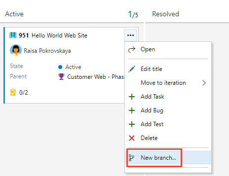
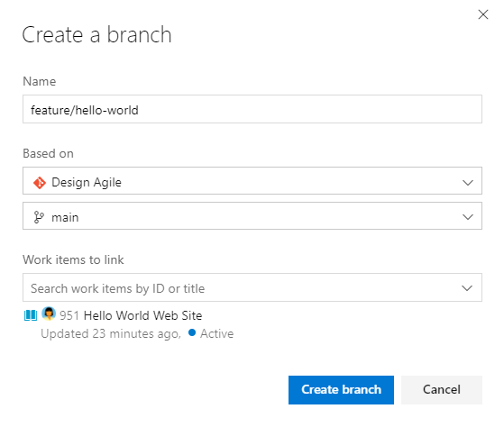
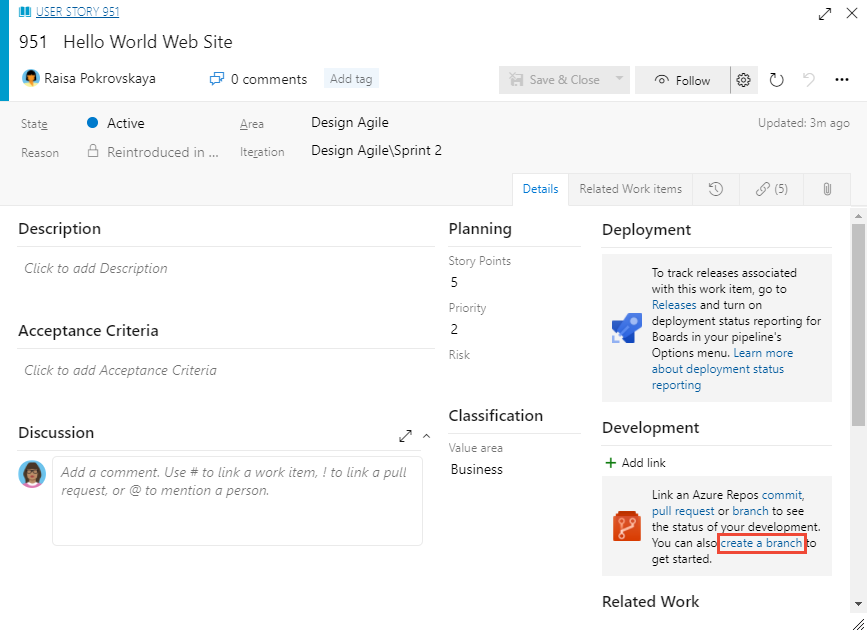
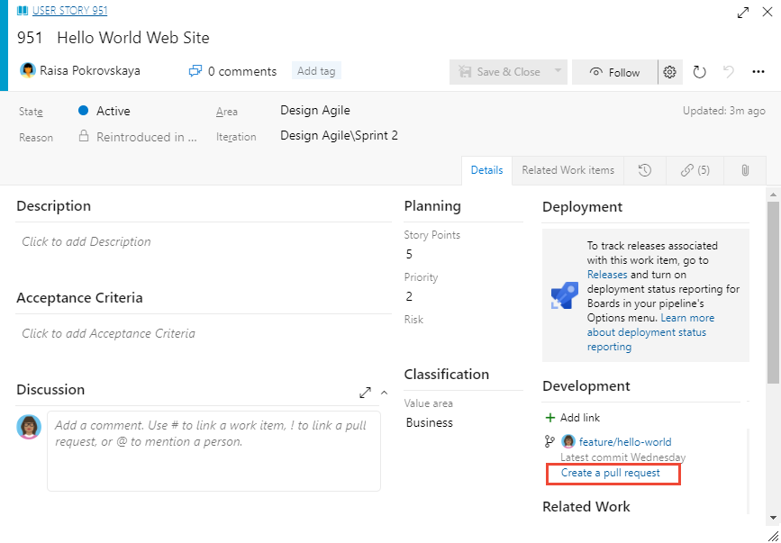
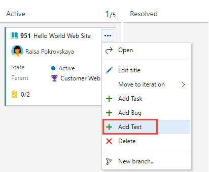
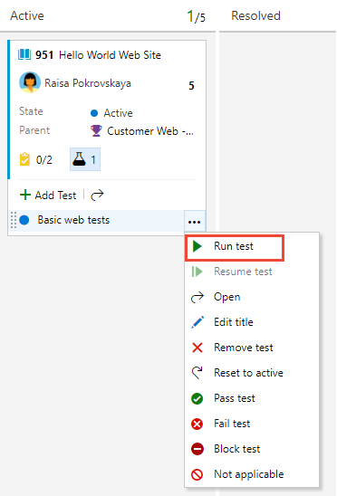
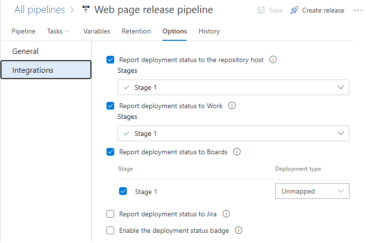

 

# End-to-end traceability 

[!INCLUDE [temp](../includes/version-vsts-only.md)]

One of the chief advantages of adopting a platform such as Azure DevOps is the support it provides to trace work from requirements to deployment. You gain insight at each step of decisions made and the software deployed. The scenarios illustrated in this article are supported when you use Azure Repos git repositories. 

The following are some of the supported tasks to facilitate end-to-end traceability:

> [!div class="checklist"]  
> - Create a branch from a requirement 
> - Create a pull request of updated branch 
> - Validate the pull request using a build pipeline 
> - Create and run inline tests on requirements
> - Merge the pull request into the main, default branch 
> - Deploy changes into production with deployment status to Azure Boards 
> - Monitor and report on requirements traceability 

> [!NOTE]
> *Tracking the origin of work through delivery, and the ability to trace work across the development lifecycle, is essential to achieving end-to-end traceability.*  

End-to-end traceability is supported by linking various objects such as work items, branches, commits, pull requests, builds, and releases. Build in reports and Analytics support the ability to monitor traceability in real time. This article presents an overview of Azure DevOps traceability support without going into the details of how to enable and support traceability. More detailed information is provided under [Related articles](#related-articles).   

## Traceability and linking 

Throughout the development lifecycle, you can capture which code changes, builds, and releases support the completion of a work item. In this way, your team can understand what work was done or how a bug was fixed through the audit trail of changes to the code base.

The link types used to construct these links for Git repositories&mdash;as illustrated in the following image&mdash;are *Build*, *Found in build*, *Integrated in build*, *Branch*, *Commit*, *Pull Request*, and *Integrated in release stage*.

> [!div class="mx-imgBorder"]  
>  

## Branch from a requirement  

You can accomplish many tasks with a single click from the product Kanban board. Here we show creating a branch from a requirement by opening the work item card menu. 

> [!div class="mx-imgBorder"]  
>    

You can name and label a branch off the default main branch from the dialog that opens. The work item is automatically linked to the branch you created with the *Branch* link type. 

> [!div class="mx-imgBorder"]  
>    

You can also accomplish this task through the work item form by choosing the **create a branch** link.  

> [!div class="mx-imgBorder"]  
>   

## Create a pull request from a requirement

After code changes have been made to the new branch, developers can then create a pull request from the requirement by opening the work item form. 

> [!div class="mx-imgBorder"]  
>    

Another advantage of driving software development from the Kanban board and work item is to encourage developers to input comments as they work to further the audit trail of changes occuring. 

 
## Add and run tests from requirements 

Just like you can create a new branch from the Kanban board, you can also add tests to the work item. 

> [!div class="mx-imgBorder"]  
>    

> [!NOTE]
> *Test traceability supports linking a test to a set of requirements and validating that the application works as expected.*

After adding and defining the tests, you can run them from the Kanban board and set the test status.  

> [!div class="mx-imgBorder"]  
>   

Test integration with the Kanban board makes it easy for teams to get started with manual testing and then take advantage of the full testing capabilities provided by Azure Test Plans. The Kanban board shows the test added to support the requirement when test cases are created from the Kanban board or when requirement-based test suites are created under Test Plans. 

### Manual and automated testing

Teams that are moving from manual testing to continuous, automated testing, and have a subset of tests already automated, can execute them as part of a pipeline or on demand. Referred to as *planned testing*, automated tests can be associated to the test cases in a test plan and executed from Test Plans. Once associated, these tests contribute towards the quality metrics of the corresponding requirements.

## Deploy changes into production
 
After you define a pipeline to build and release the code changes, you can track the deployment of the requirement to each release stage. From the work item form, you can quickly open the links to builds and releases from the **Deployment** and **Development** control sections. 

#### Deployment and Development controls 

When you open the work item form, you can see the stages the requirement has been deployed to, and drill down for greater details by choosing the links. Under the **Development** section, you can open the branch ,commit, or pull requests that have been linked to the requirement.

> [!div class="mx-imgBorder"]  
> 
 
The  **Deployment** control shows release information for those work items that have been associated to a Git commit which is part of a build being released. 

#### Release view

The following image illustrates the multiple environments that the release is targeting which the selected work item is associated with. 

> [!div class="mx-imgBorder"]  
> 

#### Release settings 

You manage the deploy to production view options from the release settings.  

> [!div class="mx-imgBorder"]  
>  

 
The work item deployment control displays the status of releases within those work items that are associated with commits in the build and those release pipelines you've configured to report deployment information to Azure Boards. 

 
 
## Requirements Traceability Matrix

Requirements traceability relates and documents two or more phases of a development process, which can then be traced both forward or backward from its origin. Requirements traceability provides teams insights into indicators such as quality of requirements or readiness to ship requirements. A fundamental aspect of requirements traceability is association of the requirements to test cases, bugs and code changes.

> [!NOTE]
> *The Requirements Traceability Matrix (RTM) is a document that links requirements throughout the validation process. The purpose of the Requirements Traceability Matrix is to ensure that all requirements defined for a system are tested in the test protocols.* 

## Requirements traceability reports 

Requirements traceability reports 

> [!div class="mx-imgBorder"]  
>  

## Bug traceability

View the bug with the test result, directly in context, within the Tests tab. The Work Items tab also lists any linked requirements for the test result.

> [!div class="mx-imgBorder"]  
>  

### Source traceability 

Based on the build or release pipeline, you can choose the timeline or pipeline view to see what code changes were committed. You can analyze the code changes to identify the potential root cause of the test failure.

> [!div class="mx-imgBorder"]  
> 

## Test analytics

### Test analytics for builds

To help teams find and fix tests that fail frequently or intermittently, use the top failing tests report. The build summary includes the Analytics page that hosts this report. The top-level view provides a summary of the test pass rate and results for the selected build pipeline, for the specified period. The default range is 14 days.

> [!div class="mx-imgBorder"]  
> 

### Test analytics for releases

Open a build or release summary to view the top failing tests report. This report provides a granular view of the top failing tests in the pipeline, along with the failure details.

For tests executing as part of release, access test analytics from the Analytics link at the top right corner. As with build, the summary provides an aggregated view of the test pass rate and results for the specified period.

> [!div class="mx-imgBorder"]  
> 

### Track the quality of requirements 

To track the quality of work items that belong to the Requirements category. This includes work items such as User Stories (Agile), Product Backlog Items (Scrum) and Requirements (CMMI).

> [!div class="mx-imgBorder"]  
> 

### Test failures

Open a build or release summary to view the top failing tests report. This report provides a granular view of the top failing tests in the pipeline, along with the failure details.

> [!div class="mx-imgBorder"]  
> 

<a id="related-articles" />

## Related articles 

To learn more about any of the concepts introduced in this article, refer to the following articles. 

### Linking  

- [Configure repositories and branches to integrate with work tracking](../repos/git/configure-repos-work-tracking.md?toc=/azure/devops/boards/toc.json&bc=/azure/devops/boards/breadcrumb/toc.json)
- [Configure pipelines to support work tracking](../pipelines/integrations/configure-pipelines-work-tracking.md?toc=/azure/devops/boards/toc.json&bc=/azure/devops/boards/breadcrumb/toc.json)
- [Drive Git development from a work item](../boards/backlogs/connect-work-items-to-git-dev-ops.md)
- [Link and view work items to builds and deployments](../boards/work-items/work-item-deployments-control.md)
- [Link user stories, issues, bugs, and other work items](../boards/backlogs/add-link.md)
- [Linking, traceability, and managing dependencies](../boards/queries/link-work-items-support-traceability.md)
- [Link type reference](../boards/queries/link-type-reference.md)

### Testing

- [Add, run, and update inline tests](../boards/boards/add-run-update-tests.md)
- [Associate automated tests with test cases](../test/associate-automated-test-with-test-case.md)  

### Reports and Analytics

- [Requirements traceability](../pipelines/test/requirements-traceability.md)
- [Requirements tracking sample report](../report/powerbi/sample-stories-overview.md) 
- [Requirements tracking rollup sample report](../report/powerbi/sample-stories-overview-rollup.md)
- [Review test results](../pipelines/test/review-continuous-test-results-after-build.md)
- [Test Analytics](../pipelines/test/test-analytics.md)
- [Review code coverage results](../pipelines/test/review-code-coverage-results.md)
- [Code coverage for pull requests](../pipelines/test/codecoverage-for-pullrequests.md)

<!---
 
 
When we demo traceability to customers, the main demo we show is 
- Create a work item
- Create a branch from the work item
- Make a change in the branch, create a pull request
- Validate the pull request using a build
- Merge the pull request, build the main branch
- Deploy it to production and in all of this show how every artifact is linked to the other. For instance, the production deployment shows the work items and commits, the work item shows which build it was part of, etc.   
  

- While committing the code changes you associate the work item(s) addressed in the code changes. 
- After committing the CI Build will trigger. Post that in that work item, there will be link reference to the Build
- And when this build is deployed to any of the release environments, it will be displayed under. You can check this new feature introduced in Azure DevOps here
- But if you want all this information in a table, in one single view. You have to use Azure DevOps REST APIs to build a customer report to get all the data in one place.

-->