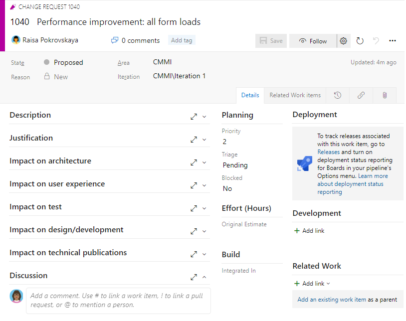

 

# Manage change 

[!INCLUDE [temp](../includes/version-vsts-only.md)]

Managing change is an aspect of managing your project plan, your requirements, and your sprints. In keeping with the Agile manifesto that encourages "*Responding to change over following a plan*, how should you manage change?

> [!NOTE]
> *Agile change management is the adaptive and iterative planning and execution of change management practices that encourages flexibility and speed. If organizations want to make effective change, they need to recognize and deal with the principles of how change happens within agile organizations and have the tools to make the work happen. &mdash;[Managing Change in an Agile World](https://www.agilealliance.org/resources/books/managing-change-in-an-agile-world/)* 

You'll want to keep your change management process lightweight. You'll want to gain insight into where change is occurring in your project, and how the change impacts your team in their ability to deliver. And, when managing change, you'll want to consider your business requirements to meet the following scenarios.   

> [!div class="checklist"]  
> - Define and track status of change  
> - Analyze and prioritize change requirements  
> - Monitor and report on changes  
> - Keep stakeholders and teams informed of changes.   

This article provides guidance for managing change. It also maps Agile change management tasks by project managers to the tools Azure DevOps supports. More detailed information is provided under [Related articles](#related-articles). 

## Where does change arise? How can you minimize change?  

Several sources can contribute to changes that you need to manage in your software development projects.  

- Business needs and customer needs change  
- New priorities arise 
- Feature requirements change as new information occurs or dependencies are discovered 
- Resources and organizations change    
- Development or testing takes longer than expected
- Issues arise after deployment and ongoing operations.  

While some changes are unavoidable, other changes can be avoided or their affect minimized. Many changes arise when a team is new to Agile methods and haven't yet adopted an Agile culture.

To minimize avoidable changes, minimize the occurrence of the following.  
- Unclear requirements and acceptance criteria  
- Unclear project scope and priorities
- Unclear change management process agreed to by the team 
- Poor estimates on planned work 
- Not negotiating requests for new work  
- Allowing a team member to focus  on developing what they believe to be best rather than what is required 
- Poor communication within the team when changes occur 
- Lack of stakeholders and customer input around change requests  
- Team members are hesitant to raise issues as they occur.   
 

## Agile practices for managing change

> [!NOTE]
> *Agile is a project management approach that works by breaking projects into short, iterative cycles called “sprints”. At its core, Agile is based on the assumption that circumstances change as a project develops. That’s why, in an Agile project, the planning, design, development, and testing cycles are never done. They continue to change as the project takes form. &mdash;[IMA](https://www.imaworldwide.com/blog/5-implications-for-change-management-in-an-agile-world)*  

 
To mitigate problems that arise from change, Agile project managers adopt a number of best practices. These practices are divided into the following three groups: 

### Process practices 

- Support a change management process  
- Meet both team and business objectives  
- Minimize the number of approvals required to address changes 
- Assist teams in their continual improvement processes.   

> [!NOTE]
> *Continuous improvement is a method to make sure that your processes, methods, and practices are as efficient and effective as possible. &mdash;[Agile and a continuous improvement mindset](https://scrumtraininginstitute.com/agile-scrum-training/agile-team-health-check/#:~:text=At%20the%20core%20of%20Agile%20continuous%20improvement%20is,your%20organization%20can%20develop%20a%20continuous%20improvement%20mindset)*  

### Manage change at the product plan level   

- Continuously refine and prioritize the product plan and product backlog 
- Ensure customer needs are understood and properly scoped and communicated
- Analyze the product backlog for dependencies and risks 
- Develop contingency plans  
- Analyze and triage change requests
- Determine the scope impact of change requests on current and planned work 
- Assess the risks of accepting or rejecting the change 
- Use a light change control form as needed 

### Sprint management practices 

- Ensure the acceptance criteria and requirements are well understood at the start of a sprint 
- Work to minimize accepting changes after the start of the sprint, while still adhering to Agile principles   
- Keep all stakeholders and teams involved as changes occur  
- Control scope changes and minimize scope creep  
- Protect your team against "gold plating", a practice of making changes to a project that are outside of the original agreed-upon scope.  

> [!NOTE]
> *What is Scope creep? Scope creep occurs when the deliverables or features of a project expand from what was originally defined, without a commensurate change in additional time or budget.*  

### Questions to ask before accepting a change
- Does it serve the sprint goal?    
- Is there a clear business value for the change? 
- Upon release, will the customer use the result of the scope change?
- What is the urgency for the change request?
- If new scope is added to the sprint backlog, is there something that can be removed? 

## Options for tracking change 

You have several choices for tracking change. From most lightweight to most robust, you can use one or more of the following methods: 

- Track changes to requirements within the requirement work item through discussions, changes to acceptance criteria, or attachments  
- Add a *change* tag to work items to support tracking changes to the scope of work 
- Set up notifications to automatically communicate change within your team or organization 
- Add a bug that tracks a change in scope or another work 
- Add a change request work item type to formally track and log change requests to the product backlog.   

With any of these methods, you can generate a query to list work items involve in change. You can then review and triage the change with the team. How you choose to track change should align with how you and your team choose to monitor and report the scope of change. 

### Change request form 

To formally track change, you can define a change request work item type, similar to the one shown in the following image for the Capability Maturity Model Integration (CMMI) process.

> [!div class="mx-imgBorder"]  
>  

This form provides rich-text fields to capture the affect of the change to the following areas: 
- Architecture
- User experience
- Test
- Design and development
- Technical publications 

You can adopt this form or customize your own. You can also customize your backlog to have change requests appear on your backlog along with other user stories or requirements. 

### Ensure acceptance criteria is well-defined

Acceptance criteria defines what "done" means. It clearly describes the conditions that the team should use to verify whether a requirement or bug fix has been fully implemented. Typically, you want to capture these criteria within the work item. Clear acceptance criteria helps teams estimate work and develop tests to ensure the criteria has been met.  

You can specify acceptance criteria for individual requirements and for sprints. Shared understanding of acceptance criteria ensures that all team members understand the scope of work. 

Here are two examples of defining acceptance criteria.  

- **Example 1: A Product Backlog Item is considered "Done" when the following objectives have been met:**

	- Solution builds successfully.
	- Code written and merged into main branch
	- Unit Tests implemented on all features to an appropriate code coverage
	- All regression tests run and pass
	- All acceptance criteria met
	- Code has been peer reviewed and comments addressed
	- User Story moved to Resolved state
	- Remaining hours for tasks set to zero and tasks closed.
	- No open Sev1 or Sev2 bugs
	- Deploys successfully to nondevelopment environment (automated)
	- Static Code Analysis is run with results no worse than the baseline.

- **Example 2: A Sprint is considered "Done" when  the following objectives have been met:**
	- The time period allocated for the Sprint has passed
	- Unfinished work has been moved to the Backlog
	- Completed work has been deployed to target environment(s) and demoed in a Sprint Review to the Product Owner
	- Sprint Summary email has been sent to the team detailing:
	- User Stories Completed
	- Velocity of the sprint
	- Sprint Burndown
	- Notable accomplishments, highlights, or milestones that were hit
	- Retrospective conducted.
 
## Monitor and report on changes 
 
Teams can monitor changes through the following methods: 
- Work item queries 
- Team velocity charts 
- Sprint burndown and release burndown charts  
 

### Work item queries 

With queries you can find and triage a list of change management requests or work items tagged with a change management tag. 

### Team velocity and unplanned work  

The team velocity chart provides several pieces of information. This chart shows how much work was planned and how much was completed. Visually, you can determine how often work was added to a sprint after the sprint began. As shown in the following image, the team velocity for the past 10 sprints shows a pattern of adding work after the sprint start date. 

:::image type="content" source="media/manage-change/velocity-chart-scope-creep.png" alt-text="Screenshot of Velocity chart showing scope creep":::

### Sprint burndown and scope creep 

Another chart to review for scope creep is the sprint burndown chart. As shown in the following image, a number of work items were added after the start of the sprint.   

:::image type="content" source="media/manage-change/sprint-burndown-scope-increase.png" alt-text="Screenshot of Sprint burndown showing scope creep":::

With Azure Boards, you can review the sprint burndown charts for each sprint and each team to determine the degree of scope creep introduced into each sprint. 

## Get notified of changes 

Azure DevOps provides a robust alert system, allowing project members to set alerts for themselves, a team, or a project.   

As changes occur to work items, code reviews, source control files, and builds, you can receive email notifications. For example, you can set an alert to be notified whenever a bug that you opened is resolved or a work item is assigned to you. You can set personal alerts, team, project, or organization alerts. 

To support change management, you can define team alerts for the following instances: 

- A requirement or work item is tagged with a change request tag 
- A formal change request work item is filed 
- Work is added to a sprint after the sprint has started 

<a id="related-articles" />

## Related articles 

To learn more about any of the concepts introduced in this article, refer to the following resources. 

#### Industry articles

- [5 Implications for Change Management in an Agile World](https://www.imaworldwide.com/blog/5-implications-for-change-management-in-an-agile-world)
- [How to Create the Best Agile Change Management Process](https://www.mindville.com/blog/create-the-best-agile-change-management-process) 
- [Managing Change Requests in Scrum](https://www.infoq.com/news/2008/12/change-requests-in-scrum/) 
- [Identify And Avoid Project Scope Creep](https://thedigitalprojectmanager.com/scope-creep/)
- [Change Management meets Agile, how does that work?](https://www.andchange.com/themes/change-management-meets-agile/)

#### Agile and Agile culture

- [What is Agile?](/devops/plan/what-is-agile)
- [Agile culture](../boards/plans/agile-culture.md) 
- [Best practices for "light-weight" Agile project management](../boards/best-practices-agile-project-management.md)
- [Scaling Agile - Practices that scale](../boards/plans/practices-that-scale.md) 

#### Work items and process guidance 

- [Capability Maturity Model Integration (CMMI) process](../boards/work-items/guidance/cmmi-process.md)
- [Acceptance criteria](../boards/backlogs/best-practices-product-backlog.md#acceptance-criteria)
- [Definition of Done](../boards/boards/definition-of-done.md)
- [Manage change using Change request form](../boards/work-items/guidance/cmmi/guidance-manage-change.md)  
- [Add work item tags to categorize and filter lists and boards](../boards/queries/add-tags-to-work-items.md) 
- [Customize your backlogs or boards (Inheritance process)](../organizations/settings/work/customize-process-backlogs-boards.md)

#### Monitor and report on progress

- [Triage work items](../boards/queries/triage-work-items.md)
- [Velocity metrics and usage guidance](../report/dashboards/velocity-guidance.md)
- [View or configure team velocity](../report/dashboards/team-velocity.md)
- [Burndown guidance, scope management](../report/dashboards/burndown-guidance.md)
- [Cumulative flow, lead time, and cycle time guidance](../report/dashboards/cumulative-flow-cycle-lead-time-guidance.md)

#### Notifications

- [Default and supported notifications](../notifications/oob-built-in-notifications.md) 
- [Manage personal notifications](../notifications/manage-your-personal-notifications.md)
- [Manage notifications for a team or group](../notifications/manage-team-group-global-organization-notifications.md)
  
 
#### Maintain specifications and share information 

- [About Wikis, READMEs, and Markdown](../project/wiki/about-readme-wiki.md)
- [Share information within work items and social tools](../boards/queries/share-plans.md)
