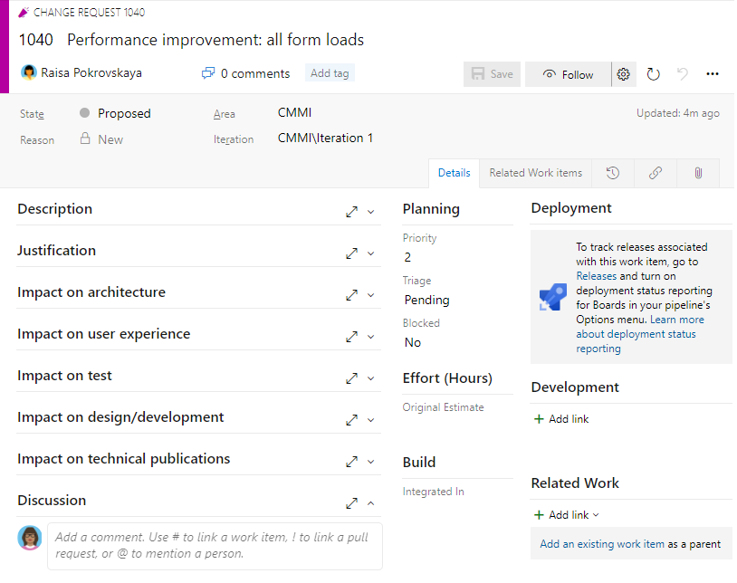

# Manage change

[!INCLUDE [version-lt-eq-azure-devops](../includes/version-lt-eq-azure-devops.md)]

Azure DevOps provides various tools and features to help you manage change effectively and efficiently, which is a crucial part of any project. This article provides an overview for managing change and maps Agile change management tasks to the tools that Azure DevOps supports.

[!INCLUDE [ai-assistance-mcp-server-tip](../includes/ai-assistance-mcp-server-tip.md)]

## Identify the need for change

Several sources can contribute to necessary changes in your software development projects:

- Changing business and customer needs
- New priorities
- Evolving feature requirements due to new information or discovered dependencies
- Changes in resources and organizations
- Delays in development or testing
- Issues arising after deployment and during ongoing operations

## Minimize unnecessary change

To minimize unnecessary change, ensure the following:

- Clear requirements and acceptance criteria
- Clear project scope and priorities
- Agreed-upon change management process
- Accurate estimates on planned work
- Negotiated requests for new work
- Effective communication within the team when changes occur
- Input from stakeholders and customers on change requests
- Team members feel comfortable raising issues as they occur

## Implement Agile best practices for change management

Agile is a project management approach that works by breaking projects into short, iterative cycles called “sprints”. At its core, Agile is based on the assumption that circumstances change as a project develops. That’s why, in an Agile project, the planning, design, development, and testing cycles are never done. They continue to change as the project takes form.

To mitigate problems that arise from change, Agile project managers adopt many best practices. These practices are divided into the following categories: Control your process, Manage change at the product plan level, Manage your sprints, and Consider change criteria.

| **Category** | **Best practices** |
|--------------|--------------------|
| **Control your process** | - Meet both team and business objectives   - Minimize the number of approvals required to address changes   - Assist your teams in their continual improvement processes   **Tip:** Continuous improvement is a method to ensure that your processes, methods, and practices are as efficient and effective as possible. |
| **Manage change at the product plan level** | - Refine and prioritize the product plan and product backlog continuously   - Ensure customer needs are understood and properly scoped and communicated   - Analyze the product backlog for dependencies and risks   - Develop contingency plans   - Analyze and triage change requests   - Determine the scope effect of change requests on current and planned work   - Assess the risks of accepting or rejecting the change   - Use a light change control form as needed |
| **Manage your sprints** | - Ensure the acceptance criteria and requirements are well understood at the start of a sprint   - Minimize accepting changes after the start of the sprint, while still adhering to Agile principles   - Keep all stakeholders and teams involved as changes occur   - Control scope changes and minimize scope creep   - Protect your team against making changes to a project that are outside of the original agreed-upon scope   **Tip:** *What is Scope creep? Scope creep occurs when the deliverables or features of a project expand from what was originally defined, without a commensurate change in additional time or budget.* |
| **Consider change criteria** | Ask the following questions when you consider making a change:   - Does it serve the sprint goal?   - Is there a clear business value for the change?   - Upon release, do you plan to use the result of the scope change?   - What is the urgency for the change request?   - If new scope is added to the sprint backlog, is there something that can be removed? |

## Track change

Choose from several methods to track change, ranging from lightweight to robust:

- Track changes to requirements within the requirement work item through discussions, changes to acceptance criteria, or attachments.
- Add a *change* tag to work items to support tracking changes to the scope of work.
- Set up notifications to automatically communicate change within your team or organization.
- Add a bug that tracks a change in scope or another work.
- Add a change request work item type to formally track and log change requests to the product backlog.

With any of these methods, you can generate a query to list work items involved in change, and then review and triage the change with the team. Choose a tracking method that aligns with how you and your team monitor and report the scope of change.

| **Method** | **Details** |
|-------------|-------------|
| **Use the change request form** | Define a change request work item type, like the one in the following image for the Capability Maturity Model Integration (CMMI) process.      You can adopt this form or customize your own. You can also have change requests appear on your backlog along with other user stories or requirements. |
| **Define acceptance criteria** | Clearly describe what "done" means with acceptance criteria to verify whether a requirement or bug fix is fully implemented. Capture these criteria within the work item. Clear acceptance criteria help teams estimate work and develop tests to ensure the criteria are met.   Specify acceptance criteria for individual requirements and sprints to ensure all team members understand the scope of work. |

## Monitor and report on changes

Teams can monitor changes through work item queries, team velocity charts, and sprint burndown and release burndown charts.

| **Method** | **Details** |
|-------------|-------------|
| **Work item queries** | With [queries](../boards/queries/using-queries.md), you can find and triage a list of change management requests or work items tagged with a change management tag. |
| **Team velocity and unplanned work** | The team [velocity chart](../report/dashboards/team-velocity.md) provides several pieces of information. This chart shows how much work was planned and how much was completed. Visually, you can determine how often work was added to a sprint after the sprint began. |
| **Sprint burndown and scope creep** | Another chart to review for scope creep is the [sprint burndown chart](../report/dashboards/burndown-guidance.md). With Azure Boards, you can review the sprint burndown charts for each sprint and each team to determine the degree of scope creep introduced into each sprint. |

## Get notified of changes

Azure DevOps provides a robust alert system, where project members can [set alerts for themselves, a team, or a project](../organizations/notifications/about-notifications.md). As changes occur to work items, code reviews, source control files, and builds, you can receive email notifications.

## Use AI to manage change

If you have the [Azure DevOps MCP Server](../mcp-server/mcp-server-overview.md) connected to your AI agent in agent mode, you can use natural language prompts to track, monitor, and triage change across your project.

| Task | Example prompt |
|------|----------------|
| Find change requests | `List all work items tagged 'change-request' in project <Contoso>` |
| Triage scope changes | `Show work items added to Sprint 10 for <Contoso Team> after the sprint start date` |
| Check sprint scope creep | `Compare the original sprint scope to the current scope for Sprint 10 for <Contoso Team>` |
| Review velocity trends | `Show the planned vs. completed story points for <Contoso Team> over the last 6 sprints` |
| Identify unplanned work | `List work items in the current sprint for <Contoso Team> that were added after sprint planning` |
| Tag items for change tracking | `Add tag 'scope-change' to user story #345 in project <Contoso>` |
| Query acceptance criteria gaps | `List user stories in the current sprint for <Contoso Team> that have empty acceptance criteria` |
| Create a change request | `Create a change request work item titled 'Add OAuth support' with priority 2 in project <Contoso>` |
| Audit sprint burndown | `Show the remaining work for Sprint 10 for <Contoso Team> grouped by work item state` |
| Cross-link change to requirements | `Link change request #890 as related to user stories #101 and #102 in project <Contoso>` |

> [!NOTE]
> Agent mode and the MCP Server use natural language, so you can adjust these prompts or ask follow-up questions to refine the results.

## Related content

- [Manage Agile requirements](manage-requirements.md)
- [End-to-end traceability](end-to-end-traceability.md)
- [What is Agile?](/devops/plan/what-is-agile)
