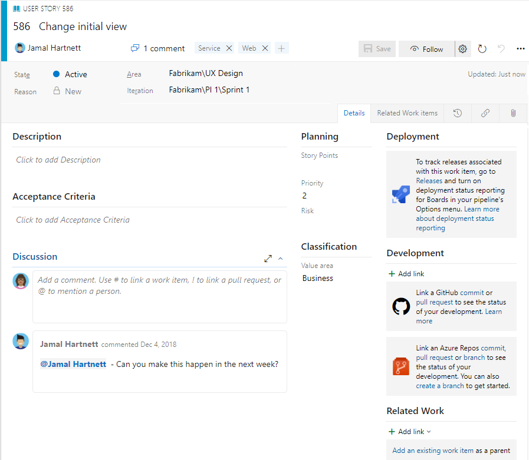
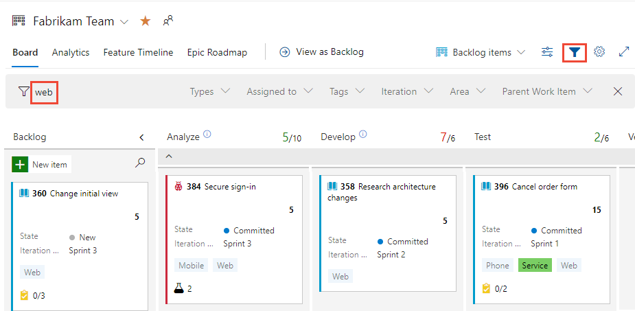
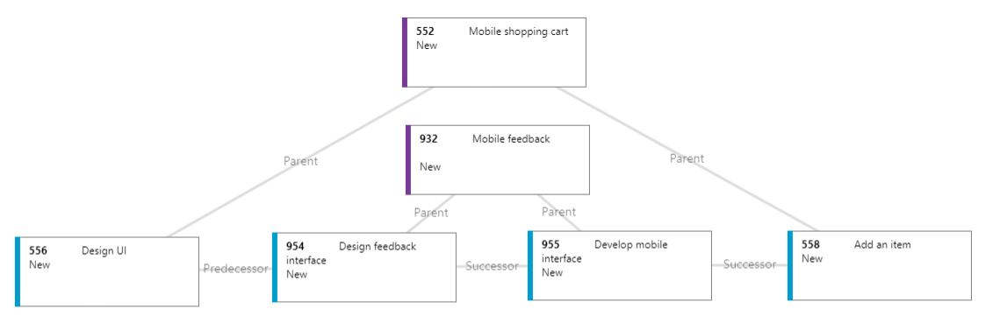
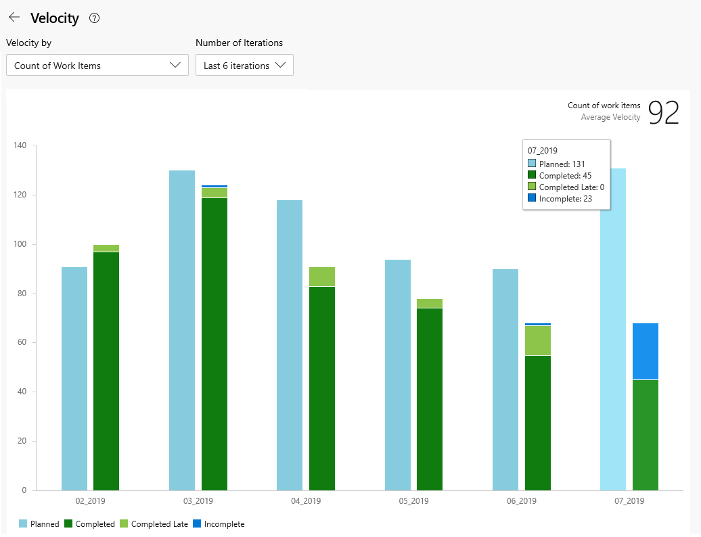
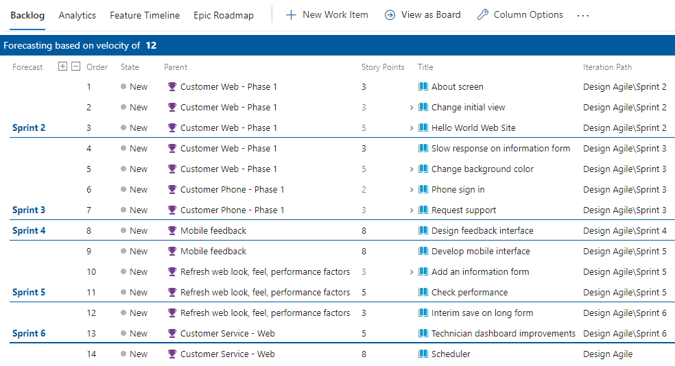
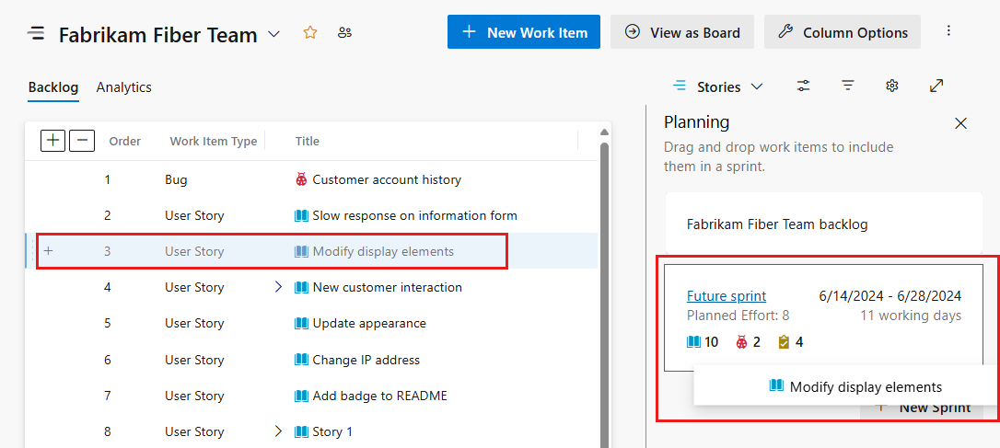
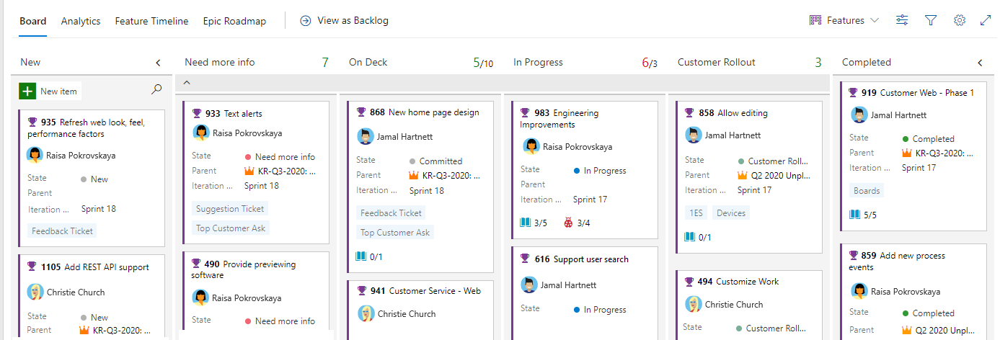
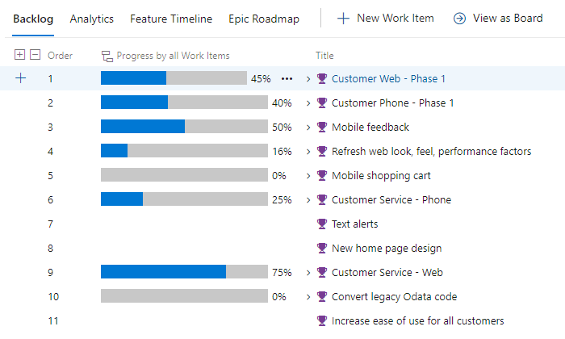
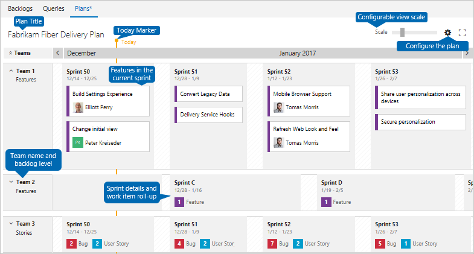

# Manage requirements 

[!INCLUDE [temp](../includes/version-vsts-only.md)]

Become familiar with the essential concepts to manage projects using Agile tools. Gain an overview of Azure DevOps tools and features to manage requirements. This article maps Agile requirements management tasks by project managers to the tools Azure DevOps supports. More detailed information is provided under [Related articles](#related-articles).   

> [!NOTE]
> *Requirements management is a continuous process throughout a project lifecycle&mdash;encompassing the processes of documenting, analyzing, prioritizing, tracking, and collaborating with stakeholders to agree on work to be performed. A single requirement corresponds to a capability which a project outcome&mdash;product, service, architecture, performance&mdash;should conform.*

Agile requirements management supports the following scenarios.   

> [!div class="checklist"]  
> - Define and track status of requirements  
> - Analyze and prioritize requirements  
> - Assign requirements to timeboxes  
> - Group and organize requirements  
> - Manage dependencies  
> - Determine what can ship and when  
> - Monitor and report on progress  

When managing requirements using Agile methods, you'll also perform within an Agile culture which supports the following principles and methods:  

> [!div class="checklist"]  
> - Alignment within the organization
> - Autonomous teams 
> - Kanban and lean management 
> - Scrum   

## Capture requirements  

You capture requirements using work items, where each work item is based on a work item type. You have a choice of work item types to use based on the process you select. Or, you can add a custom work item type. 

[!INCLUDE [temp](../boards/includes/note-requirements-terms.md)] 

### Work item fields and form

You can use work items to track anything you need to track. Each work item represents an object stored in the work item data store. Each work item is based on a work item type and is assigned a unique identifier. 

Each work item supports tracking data contained in work item fields. Also, it captures changes as updates are made within the **History** field and comments made in the **Discussion** section. The following image shows a sample work item form for the User Story work item type.

**Example work item form**

> [!div class="mx-imgBorder"]  
>  

In a nutshell, you use work items to support these tasks: 
- Add information, update status, assign to team members, link work items, and attach files 
- Assign work to a timebox or sprint  
- Quickly fill in work item fields using work item templates
- Contribute to a queryable discussion thread  
- Prioritize work and triage work items. 

Other features that support end-to-end traceability are the **Development** and **Deployment** sections. These sections support the following tasks and insights:

- Create a new branch or pull request from a work item
- Complete the pull request
- Perform a squash merge
- Create a branch for several work items
- Link a work item to existing development and build objects 
- View the release stages associated with the work item within the work item form in real time 
- View the status of releases within those work items that are associated with commits in the build and release pipelines  
 
### Work item types 

Different work item types support capturing different information and workflow processes. Each work item is based on a work item type. The following images illustrate the default work item types used to capture requirements and code defects. They are based on the four system processes&mdash;Agile, Basic, Scrum, or Capability Maturity Model Integration (CMMI). 

Each Azure DevOps project is defined based on one of these customizable processes. Each team can determine how they want to track bugs.

**Default work item types**

[!INCLUDE [temp](../boards/includes/work-item-types.md)]

### Customize work item types  

You can add custom work item types or customize the default work item types. Supported customizations include the following additions:  
- Add custom fields and workflow states
- Add custom rules to support business workflow processes 
- Add custom portfolio backlogs and customize backlogs and boards  
- Add custom controls to work item forms to gain enhanced functionality. 

### Add work items to product backlog or board 

Capturing requirements typically starts by adding a Title to a product backlog. You add details later. 

**Capture requirements on the product backlog** 

> [!div class="mx-imgBorder"]  
>    

### Import and update requirements using Excel 

Alternatively, you can import and update requirements you've defined through a .csv file or Excel spreadsheet. These tools support a flat list or a hierarchy of work items. As shown in the following image, a hierarchy of Epics, Features, and User Stories are defined in Excel and then imported to Azure DevOps. 

**Import requirements from Excel** 

> [!div class="mx-imgBorder"]  
>    

### Functional and non-functional requirements 

Any work that you or a development team need to track can be captured using work items. You can use the same type of work item to capture both functional and non-functional requirements. Non-functional requirements specify criteria associated with system operations rather than specific product or service functionality. 

You can differentiate your requirements using tags, the Business Value field, or a custom field. 
 
### Maintain requirement specifications 

Requirements often require specifications to provide details that aren't readily captured within the work item. You can use Azure DevOps to maintain and version control your requirements under an Azure Repos repository. Or, you can use a project wiki to provide a central source and repository for specifications.  

You can then link your specifications or attach them to your requirements. 
 
 
## Analyze and prioritize requirements

Once you have a working backlog, you'll want to get it in priority order. You'll want to review and refine your requirements and make sure the acceptance criteria is well-defined. These tasks are supported through the following Azure Board tools: 

- **Product backlog**: Supports drag-and-drop of work items to get them in priority order. Supports bulk-edit of work items to change assignments or update fields. 
- **Query Results, Triage mode**: Supports review of a list of work items and their forms so that you can quickly update work items and add details. 
 
Here the features backlog shows the sequence of features to ship. 

**Prioritize feature backlog** 

:::image type="content" source="media/manage-requirements/features-backlog-priority-order.png" alt-text="Screenshot of Features backlog, ordered by feature parent.":::

## Group and organize requirements

The product backlog starts out as a flat list. However, often you want to group requirements that support specific features or business objectives. Azure Boards supports this by providing portfolio work item types, portfolio backlogs and boards, and a Mapping tool to quickly link requirements to a portfolio work item.  

Work item tags are another way you can group requirements. 

### Epics, features, and portfolio backlogs

You group requirements under Features, and Features under Epics, using parent-child hierarchical links. This type of grouping is recommended for organizations with several teams that want to view rollups associated with multiple teams and to take advantage of all portfolio planning tools.

By grouping work within a hierarchy, you can manage a portfolio of features that are supported by different development and management teams. Also, you can view a rollup of estimates, progress bars, and  more on product backlogs.
 

**Group User Stories under Features using Mapping** 

:::image type="content" source="media/manage-requirements/mapping-user-stories-to-features.png" alt-text="Screenshot of mapping User Stories under Features using Mapping tool.":::

### Use tags to group work items   
 
With work item tags, team members can assign ad-hoc tags to work items. You can use these tags to filter backlogs and boards as well as query on work items.  For example, the following image illustrates a Kanban board filtered on the *web* keyword which displays cards with the *Web* tag. 

**Filter backlogs and boards based on tags** 

> [!div class="mx-imgBorder"]  
> 

## Implement Kanban or Scrum  

Two of the major Agile methods are Kanban and Scrum. Azure Boards supports both methods. Or, teams can adapt them to use a combination of methods such as Scrumban. 

### Implement Kanban  

Each product and portfolio backlog is associated with a corresponding Kanban board. Both backlogs and boards are associated with a team, and display work items based on the area and iteration paths selected by the team.

Each board supports many Kanban practices such as defining columns and swimlanes, setting Work-in-Progress (WIP) limits, defining the Definition of Done, and more. As work completes in one stage, you update the status of an item by dragging it to a downstream stage. 

**Example Kanban board** 

 

Each team can quickly configure their board and the cards to support their business needs.  
 

### Implement Scrum  

Sprint backlogs and Taskboards provide a filtered view of work items a team has assigned to a specific iteration path, or sprint. From your requirements backlog, you can drag-and-drop work items onto an iteration path, and then view that work in a separate **Sprint Backlog**. 

**Example Sprint Backlog** 

> [!div class="mx-imgBorder"]  
>     

Supported Scrum practices include the following tasks: 

- Assign requirements to a sprint  
- Add tasks to requirements   
- Set sprint capacity for team members
- Adjust work to fit sprint capacity 
- Share your sprint plan 
- Filter, update tasks, and update task status 
- Monitor sprint burndown 

#### Sprint burndown chart 

By updating the status of work daily throughout a sprint, you can easily track sprint progress with the Sprint burndown chart, as shown in the following image. 

**Example Sprint burndown chart** 

> [!div class="mx-imgBorder"]  
>  

## Manage dependencies

In Microsoft Project, you manage tasks that depend on the completion of other tasks by linking them. To manage dependencies in Azure Boards, you can link work items using the Predecessor/Successor link type. Once you've linked work items, you can view link relationships using the [Work Item Visualization](https://marketplace.visualstudio.com/items?itemName=ms-devlabs.WorkItemVisualization) Marketplace extension. The following image illustrates link relationships among several work items. 

[!INCLUDE [temp](../includes/lightbox-image.md)] 

> [!div class="mx-imgBorder"]  
> 

### Minimum Viable Product versus Critical Path Management  

Azure Boards doesn't provide a native view of the critical path. In part, as Agile methodologies favor a Minimum Viable Product (MVP) over Critical Path Management (CPM). By using MVP, you identify the shortest path and dependencies by prioritizing epics, features, stories, and tasks.  

## Perform milestone planning

Two tools that support planning what can ship when are team velocity and forecasting.

### Team velocity

One of the advantages of working in sprints is that you gain insight into team velocity. Velocity provides an indication of how much work a team can complete during a sprint based either on a count of completed work items or the sum of requirement estimates. 

**Example team Velocity chart** 

> [!div class="mx-imgBorder"]  
>  

### Forecast requirements

The **Forecast** tool requires that you provide estimates to the Story Points, Effort, or Size field for each requirement.  

With estimates assigned to each requirement, you can set a team velocity. In the example below, we specify 12 for the velocity, equivalent to stating that on average the team can complete 12 Story Points per sprint. The Forecast tool shows which requirements and features the team can complete within the next six sprints. Using the Planning tool, you can quickly assign requirements to the forecasted sprints.  

**Example Forecast of requirements backlog** 

[!INCLUDE [temp](../includes/lightbox-image.md)] 

> [!div class="mx-imgBorder"]  
> []../boards/media/best-practices/forecast-product-backlog-ordered-parent.png#lightbox)

If you want to integrate your requirements planning with Microsoft Project tools, you may do so via a Marketplace extension.  

#### Milestone markers

Milestone markers aren't used in Azure Boards work tracking, except for Delivery Plans. [Delivery Plans](#delivery-plans) provide a calendar view and allow you to define a milestone marker. 
However, you can use one or more of the following options to mark a work item as a milestone: 
- Simply prepend or append the word **Milestone** in the title of your work item
- Add a work item tag labeled **Milestone**   
- Add a custom field labeled **Milestone** and populate it with a pick list of milestones  
- Link work items using the Predecessor/Successor or Related link type to a milestone work item 
- Assign a milestone work item to the sprint in which it's targeted for completion. 
 

## Assign requirements to timeboxes 

You can quickly assign work items to a sprint through drag-and-drop from the product backlog to the sprint listed within the Planning pane. 

**Example assign requirements to sprints** 

> [!div class="mx-imgBorder"]
> 
 

## Monitor and report on progress 

The three main tools you'll want to use to review progress and deliverables are: 

- Features Kanban board 
- Features backlog with rollup columns
- Delivery plans

### Features Kanban board 
 
Your Features board is another place to review progress and ensure the continuous flow of deliverables. The following image illustrates a customized Features board. In progress columns have been added such as *Need more info*, *Spec Complete*, *In Progress*, and *Customer Rollout*. These column labels provide a more natural set of states as Features get proposed, researched, designed, developed, and then deployed to production. 

**Example of Features board with customized columns** 

[!INCLUDE [temp](../includes/lightbox-image.md)] 

> [!div class="mx-imgBorder"]  
> 

### Rollup 

One quick and visual way to monitor progress is from the Features backlog. By adding the rollup progress bar column, you can see what percentage of work items are completed for each feature, as shown in the following image.  

**Example of Requirements backlog showing progress rollup** 

> [!div class="mx-imgBorder"]  
>   
 
<a id="delivery-plans" />

### Delivery plans and multiple team deliverables  

To review features delivered across several teams, configure a delivery plan. Delivery plans provide an interactive board to review a calendar schedule of stories or features several teams plan to deliver.  

**Example of multi-team Delivery Plan** 

::: moniker range="azure-devops"  
:::image type="content" source="../boards/plans/media/plans/overview-with-callouts.png " border="false" alt-text="Screenshot with callouts of Delivery Plans, collapsed teams.":::   
::: moniker-end 

::: moniker range="< azure-devops"  

::: moniker-end 
 

## Get notified of changes 

Azure DevOps provides a robust alert system, allowing project members to set alerts for themselves, a team, or a project.   

As changes occur to work items, code reviews, source control files, and builds, you can receive email notifications. For example, you can set an alert to be notified whenever a bug that you opened is resolved or a work item is assigned to you. You can set personal alerts, team, project, or organization alerts.
 

<a id="related-articles" />

## Related articles 

To learn more about any of the concepts introduced in this article, refer to the following articles. 
 
#### Agile and Agile culture

- [What is Agile?](/devops/plan/agile/what-is-agile)
- [Agile culture](../boards/plans/agile-culture.md) 
- [Best practices for "light-weight" Agile project management](../boards/best-practices-agile-project-management.md)
- [Scaling Agile - Practices that scale](../boards/plans/practices-that-scale.md) 

#### Work items, work item types, and process models 

- [About work items](../boards/work-items/about-work-items.md) 
- [Add work item tags to categorize and filter lists and boards](../boards/queries/add-tags-to-work-items.md)
- [Choose a process](../boards/work-items/guidance/choose-process.md)
- [About process customization and inherited processes](../organizations/settings/work/inheritance-process-model.md) 
- [Bulk add or modify work items with Excel](../boards/backlogs/office/bulk-add-modify-work-items-excel.md)
- [About Area and Iteration Paths (sprints)](../organizations/settings/about-areas-iterations.md) 
- [Work tracking, process, and project limits](../organizations/settings/work/object-limits.md)

#### Backlogs and boards

- [Create your backlog](../boards/backlogs/create-your-backlog.md)  
- [Organize your backlog](../boards/backlogs/organize-backlog.md)  
- [Define features and epics](../boards/backlogs/define-features-epics.md) 
- [Refine your backlog](../boards/backlogs/best-practices-product-backlog.md) 
- [About teams and Agile tools](../organizations/settings/about-teams-and-settings.md) 
- [Tasks supported by Backlogs, Boards, Taskboards, and Plans](../boards/backlogs/backlogs-boards-plans.md)
- [Configure and customize Azure Boards](../boards/configure-customize.md)

#### Kanban 

- [Start using your Kanban board](../boards/boards/kanban-quickstart.md)
- [Add columns to your Kanban board](../boards/boards/add-columns.md) 
- [Customize cards](../boards/boards/customize-cards.md)
- [Filter your Kanban board](../boards/backlogs/filter-backlogs-boards-plans.md)
- [Kanban best practices](../boards/boards/best-practices-kanban.md)

#### Scrum

- [Assign backlog items to a sprint](../boards/sprints/assign-work-sprint.md) 
- [Configure and monitor sprint burndown](../report/dashboards/configure-sprint-burndown.md) 
- [Scrum and best practices](../boards/sprints/best-practices-scrum.md)  

#### Dependency management 

- [Link user stories, issues, bugs, and other work items](../boards/backlogs/add-link.md) 
- [Triage work items](../boards/queries/triage-work-items.md) 

#### Milestone planning 

- [View or configure team velocity](../report/dashboards/team-velocity.md)
- [Forecast your product backlog](../boards/sprints/forecast.md) 
- [The Critical Path on Agile Projects](https://www.mountaingoatsoftware.com/blog/the-critical-path-on-agile-projects)
- [Running a lean startup on Azure DevOps](https://medium.com/@giladkhen/running-a-lean-startup-on-azure-devops-5934ced2cc42) 

#### Monitor and report on progress

- [Display rollup progress or totals](../boards/backlogs/display-rollup.md)
- [Review team Delivery Plans](../boards/plans/review-team-plans.md)

#### Maintain specifications and share information 

- [About Wikis, READMEs, and Markdown](../project/wiki/about-readme-wiki.md)
- [Share information within work items and social tools](../boards/queries/share-plans.md)

#### Notifications

- [Default and supported notifications](../notifications/oob-built-in-notifications.md) 
- [Manage personal notifications](../notifications/manage-your-personal-notifications.md)
- [Manage notifications for a team or group](../notifications/manage-team-group-global-organization-notifications.md)