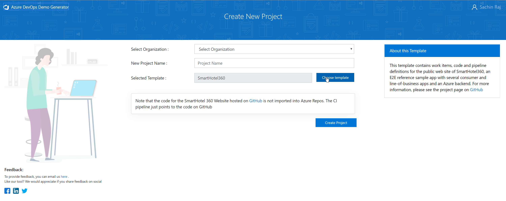

# About the Azure DevOps Services Demo Generator

The Azure DevOps Services Demo Generator is a service helps you provision projects in your organization with pre-populated sample content that includes source code, work items, iterations, service connections, build and release pipelines based on a template you choose.

> [!div class="mx-imgBorder"]

The purpose of this system is to simplify working with the hands-on-labs, demos and other education material provided by the Microsoft Visual Studio Marketing team. You can use it to experiment with different services and options in a personal, pre-configured sandbox, or to simply develop comfort with UI and workflows without impacting a production environment.

[Get started using the Demo Generator V2 now](https://azuredevopsdemogenerator.azurewebsites.net/), or follow the [simple walkthrough](use-demo-generator-v2.md).