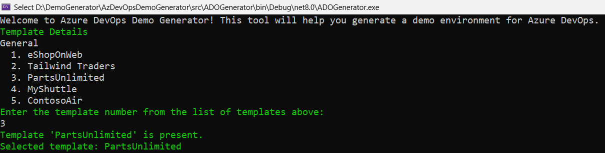
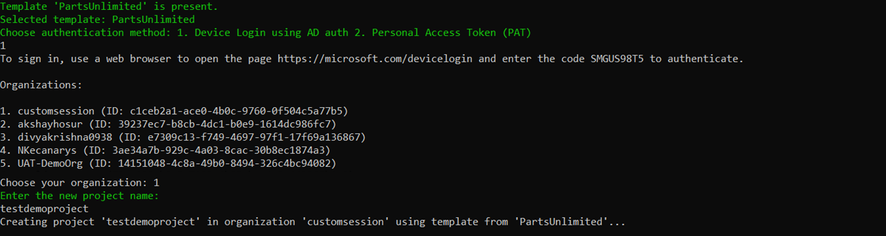

# Get started creating and populating demo Azure DevOps Services projects

[!INCLUDE [version-eq-azure-devops](../includes/version-eq-azure-devops.md)] 

You should first have the **Azure DevOps Demo Generator** app ready by following the steps outlined in the [configure section](configure.md). This app will automate the process of creating a new Azure DevOps project within your organization that is prepopulated with content (work items, repos, etc.) required for the labs. 

When you run the application you will see the information about predefined templates, choose the template by entering the corresponding number

> [!div class="mx-imgBorder"]
> 

#### Select the authentication method

You have 2 methods to authenticate to use the Azure DevOps Demo Generator app:

1. Device Login using AD authentication
Register Your Application in Azure AD. Check out the [Register and Application](https://learn.microsoft.com/entra/identity-platform/quickstart-register-app?tabs=certificate%2Cexpose-a-web-api#register-an-application) documentation for more details. 

   * Login with the code displayed

   * After the login, organizations will be listed and select an organization to create project

   > [!div class="mx-imgBorder"]
> 

2. With Personal Access Token (PAT)

   <a href="https://learn.microsoft.com/en-us/azure/devops/organizations/accounts/use-personal-access-tokens-to-authenticate?view=azure-devops&tabs=Windows#create-a-pat" target="_blank">Create Personal Access Token</a> with the given scopes below

   | Scope                      | Description                                |
   | -------------------------- | ------------------------------------------ |
   | vso.agentpools             | Agent Pools (read)                         |
   | vso.build_execute          | Build (read and execute)                   |
   | vso.code_full              | Code (full)                                |
   | vso.dashboards_manage      | Team dashboards (manage)                   |
   | vso.extension_manage       | Extensions (read and manage)               |
   | vso.profile                | User profile (read)                        |
   | vso.project_manage         | Project and team (read, write and manage)  |
   | vso.release_manage         | Release (read, write, execute and manage)  |
   | vso.serviceendpoint_manage | Service Endpoints (read, query and manage) |
   | vso.test_write             | Test management (read and write)           |
   | vso.variablegroups_write   | Variable Groups (read, create)             |
   | vso.work_full              | Work items (full)                          |

   Enter the organization name and the Personal Access Token (PAT). Provide the project name and press enter to create a project

> [!div class="mx-imgBorder"]
> [")](../demo-gen/media/103.png#lightbox)

#### Select your organization

1. Select the organization you will use to host the project created by the Azure DevOps Demo Generator. (You may have multiple organizations of which you are a member, and which are associated with your login, so choose carefully.) Provide a name for your project (such as "MyProjectDemo" ) that you and other contributors can use to identify it as a demo project. 

There are several templates available, including **eShopOnWeb**, which defines a team project for an .NET app that deploys to Azure App Service; **PartsUnlimited**, which defines an ASP.NET app with customized CI/CD pipelines; and **MyShuttle**, which defines a Java app and Azure App Service deployment. If you are following a lab from [Azure DevOps Labs](https://www.azuredevopslabs.com), select the **DevOps Labs** section to choose the template

> [!NOTE]
> All  templates provide fictional Azure DevOps users and pre-populated Agile planning and tracking work items and data, along with source code in an Azure Repos Git repo, as well as access to Azure Pipelines.
1. Some templates may require additional extensions to be installed to your organization. The demo generation process checks to see if these extensions are already installed. If the extension is **not** installed, provide your consent to install extension by pressing **Y** or **Yes** to install the extension(s) to your account. When ready, press enter to **Create Project**.

> [!NOTE]
> If you want to manually install the extensions,  click on the provided link for a specific extension, which takes you to the extension's page on Azure DevOps Marketplace. From there, you can install the extension.

2. Your project may take a couple of minutes for the Demo Generator to provision. When it completes, you will be provided with a link to the demo project.

    > [!div class="mx-imgBorder"]
    > :::image type="content" source="media/104.png" alt-text="Required extensions setup in organization" lightbox="media/104.png":::
1. Select the link to go to the new demo Azure DevOps Services project and confirm it was successfully provisioned.