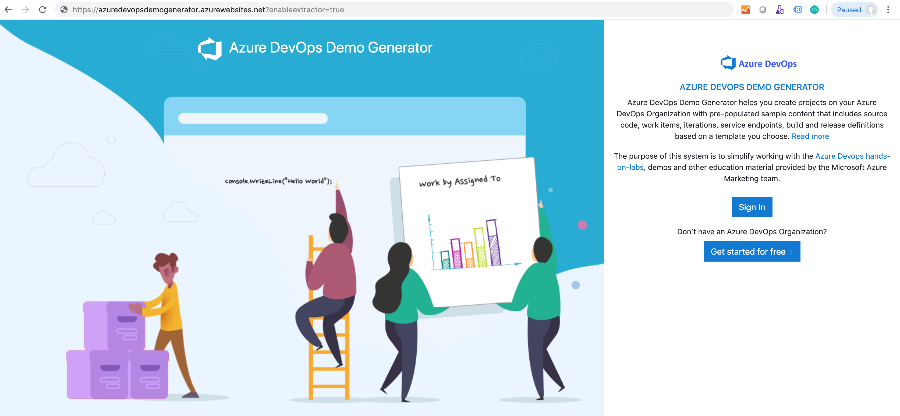
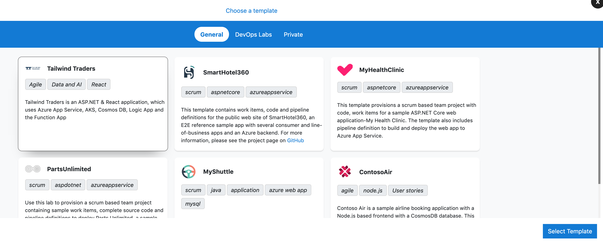

# Get started creating and populating demo Azure DevOps Services projects with the Azure DevOps Demo Generator

1. Browse to the [Azure DevOps Demo Generator site](https://azuredevopsdemogenerator.azurewebsites.net/) by click the link, or copy `https://azuredevopsdemogenerator.azurewebsites.net/` into your browser's URL field.

2. Click **Sign In** and provide the Microsoft or Azure AD account credentials associated with an organization in Azure DevOps Services. If you don't have an organization, click on **Get Started for Free** to create one and then log in with your credentials.

    > [!div class="mx-imgBorder"]

1. After you sign in, select **Accept** to grant the Demo Generator permissions to access your Azure DevOps account.

    > [!div class="mx-imgBorder"]

1. Select the organization you will use to host the project created by the Azure DevOps Demo Generator. (You may have multiple accounts of which you are a member, and which are associated with your login, so choose carefully.) Provide a name for your project (such as "MyProjectDemo" ) that you and other contributors can use to identify it as a demo project. Lastly, select the demo project template you want to provision by clicking **...** (Browse) button.

    > [!div class="mxImage"]

The default template is **SmartHotel360**, which contains complete ASP.NET 2 web mobile and desktop business apps for a hotel, and can be deployed using Docker containers. 

There are several other templates available, including **MyHealthClinic**, which defines a team project for an ASP.NET Core app that deploys to Azure App Service; **PartsUnlimited**, which defines an ASP.NET app with customized CI/CD pipelines; and **MyShuttle**, which defines a Java app and Azure App service deployment. If you are following a lab from [Azure DevOps Labs](https://www.azuredevopslabs.com), select the **DevOps Labs** tab to choose the template

    >
    > All  templates provide fictional Azure DevOps users and pre-populated Agile planning and tracking work items and data, along with source code in an Azure Repos Git repo, as well as access to Azure Pipelines.

1. Some templates may require additional extensions to be installed to your organization. The demo generation process checks to see if these extensions are already installed. If the extension is already installed, a green check will be displayed in front of the extension name. If the extension is **not** installed, select the empty check boxes to install the extension(s) to your account. When ready, click on **Create Project** button.

    > If you want to manually install the extensions,  click on the provided link for a specific extension, which takes you to the extension's page on Azure DevOps Marketplace. From there, you can install the extension.

2. Your project may take a couple of minutes for the Demo Generator to provision. When it completes, you will be provided with a link to the demo project.

    > [!div class="mxImage"]

1. Select the link to go to the new demo Azure DevOps Services project and confirm it was successfully provisioned.

    > [!div class="mxImage"]

> [!NOTE]
> You must provide your own information such as URLs, logins, password, and others for the configuration of demo endpoints that use Azure resources. 

## Common Issues and workarounds:

### **Issue:** Error while creating release definition:
Tasks with versions 'ARM Outputs:4.*' are not valid for deploy job 'Agent job' in stage Stage 1

**Cause:** This is usually caused by one of the third-party extensions not enabled or installed in your Azure DevOps org. Usually installation of extensions are quick but sometimes, it  can take a few minutes (or even hours!) for an extension to be available to use, after it is installed in the marketplace. 

**Workaround:** You can try waiting for a few minutes and confirm whether the extension is available to use, and then run the generator again. 

------------------
### **Issue:** Error while creating query: TF401256: You do not have Write permissions for query Shared Queries:

**Cause:** In Azure DevOps, users have different access levels - Basic, Stakeholder and Visual Studio Subscriber. Access levels determine what features are available to user. In order to provion projects using the demo generator, you need at least a **Basic** access level. This error indicates the user has a *stakeholder* license which does not grant permissions to writing shared queries

**Fix:** You should change the access level, from basic to stakeholder. Please refer to this article on docs:  [Add users to your organization or project](https://docs.microsoft.com/en-us/azure/devops/organizations/accounts/add-organization-users?view=azure-devops) for more information on how to add users to your organization, and specify the level of features they can use

-------------

### **Issue:** TF50309: The following account does not have sufficient permissions to complete the operation: 
The following permissions are needed to perform this operation: Create new projects

**Cause:** You do not have permissions to create new projects in the Azure DevOps organization you have selected. You will need to be a part of of the Project Administrators group or have explicit permissions to create new projects

**Fix:**  Please make sure you have the required permissions or try selecting a different Azure DevOps org where you project creation permission.

