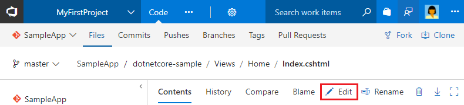
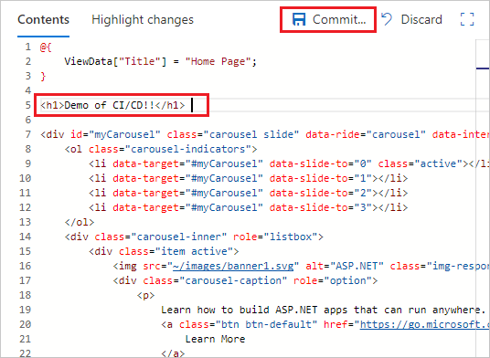

## Edit the code and see it deployed

Now that you have a completely automated CI/CD pipeline, any changes that you make to the app are automatically built and deployed by VSTS. To try this, make a change to the app and commit that change to the Git repository.

You can use [Visual Studio Code](https://code.visualstudio.com/Docs/editor/versioncontrol) or [Visual Studio](../../git/tutorial/pushing.md) to connect and push commits into your VSTS Git repo.

However, VSTS also features a web-based editor to so that you can quickly commit small changes to source code directly in your browser.

1. In the VSTS **Code** hub, edit the **Views/Home/Index.cshtml** file.

 

1. Make a simple change above the slide carousel `div` tag:

 ```html
<h1>Demo of CI/CD!!</h1>
```

1. **Commit** your changes to trigger a CI build. When the build completes, it triggers an automatic deployment.

 