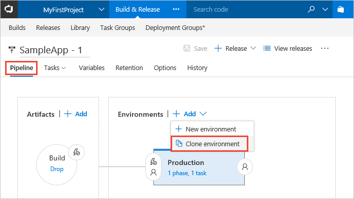
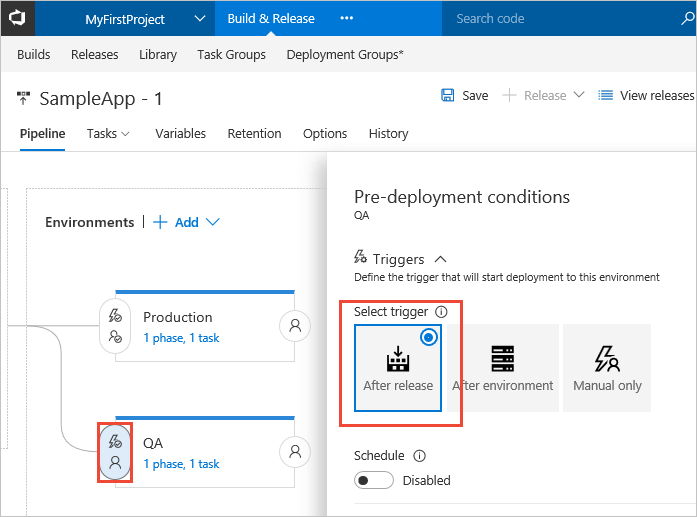
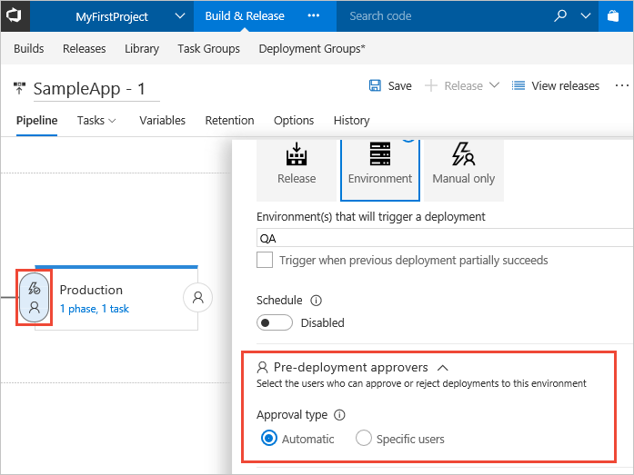
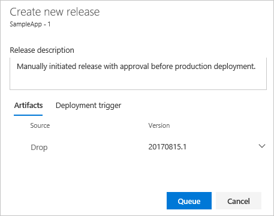
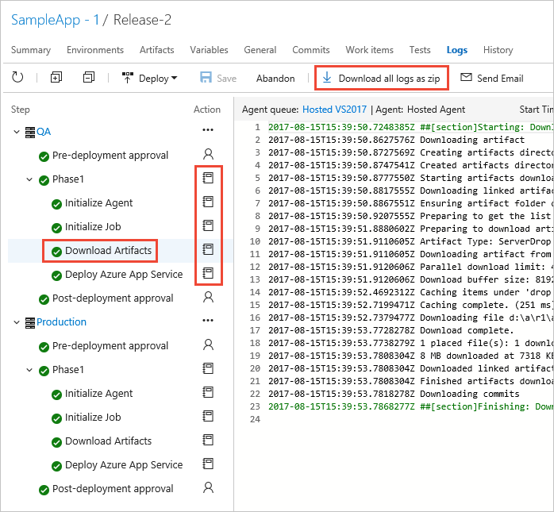
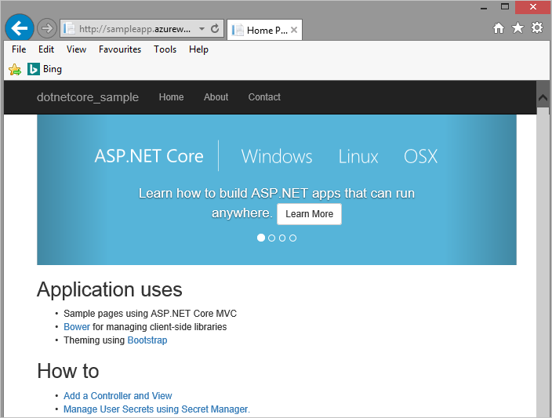

## Extend a release definition by adding environments

In this section, you will add a new environment to the release definition. This environment will deploy your app to the new 
Azure App Services website. This is a typical scenario where you deploy initially to a test or staging server, and then to a
live or production server. Each [environment](../../build-release/concepts/definitions/release/environments.md?toc=/vsts/deploy-azure/toc.json)
represents one deployment target, though that target could be a physical or virtual server,
a groups of servers, or any other legitimate physical or virtual deployment target.

1. Open the **Pipeline** tab of the release definition and select the existing **Production** environment.
   Then open the **+ Add** drop-down list and choose **Clone environment** (the clone option is available only
   when an existing environment is selected).

   

   Typically, you want to use exactly the same deployment methods with a test and a production environment
   so that you can be sure the deployed apps will behave in exactly the same way. Therefore, cloning an existing
   environment is a good way to ensure you have the same settings for both. Then you just need to change the deployment
   targets (the websites where each copy of the app will be deployed).

1. The clone of the environment appears after the existing environment in the pipeline, and has the name **Copy of Production**.
   Select this environment and, in the **Environment** panel, change the name to **QA**. 

   

1. To reorganize the environments in the pipeline, choose the **Pre-deployment conditions** icon for the **QA** environment and
   set the trigger to **After release**. The pipeline diagram changes to show that the deployment to the two environments will
   now execute in parallel. 

   

1. Choose the **Pre-deployment conditions** icon for the **Production** environment and
   set the trigger to **After environment**, then select **QA** in the **Environments** drop-down list.
   The pipeline diagram changes to show that the deployment to the two environments will
   now execute in the required order.
     
   
 
   Notice that you can specify deployment to start when a deployment to the previous environment is _partially_ successful.
   Usually, this means the deployment tasks were set to continue the deployment even if a specific non-critical task failed
   (the default is that all tasks must succeed). You're most likely to set this option if you create a pipeline containing
   [fork and join deployments](../../build-release/concepts/definitions/release/triggers.md?toc=/vsts/deploy-azure/toc.json)
   that deploy to different environments in parallel.  

1. Open the **Tasks** drop-down list and choose the **QA** environment.

   

1. Recall that this environment is a clone of the original **Production** environment in the release definition.
   Therefore, currently, it will deploy the app to the same website. To change this,
   select the **Deploy Azure App Service** task and then select the new "QA" website you created at the start of this tutorial.

   

## Add approvals within a release definition

The release definition you have modified deploys to test and then to production. If the deployment to test fails, the trigger 
on the production environment does not fire, and so it is not deployed to production. However, it is typically the case that
you want the deployment to pause after _successful_ deployment to the test website so that you can verify the app is working correctly before
you deploy to production. In this section, you will add an approval step to the release definition to achieve this.

1. Back in the **Pipeline** tab of the release definition, choose the **Pre-deployment conditions** icon in the **Environments** section
   to open the conditions panel. Scroll down to the **Pre-deployment approvers** section and expand it using the "down arrow" icon.
   You can see that the approval type is set to **Automatic**, which means that deployment to this environment, when initiated by any
   of the environment triggers, will be approved without user intervention - and deployment will commence immediately.  

   

1. Change the approval type to **Specific users** and choose your account from the list. You
   can type part of a name to search for matches.

   

   You can add as many approvers as you need, both individual accounts and account groups.
   It's also possible to set up post-deployment approvals by choosing the icon at the right side of the environment item in the pipeline diagram. 
   For more information, see [Environments in Release Management](../../build-release/concepts/definitions/release/environments.md?toc=/vsts/deploy-azure/toc.json).

1. Save the modified release definition.

   

## Create a release

Now that you have completed the modifications to the release definition, it's time to start the deployment. To do this, you
create a release from the release definition. A release may be created automatically; for example, the continuous deployment
trigger was set in the release definition when it was originally generated. This means that modifying
the source code will start a new build and, from that, a new release. However, in this section you will create a new release manually.

1. Open the **Release** drop-down list and choose **Create release**.

   

1. Enter a description for the release, and check that the artifact named **Drop** is selected. Then choose **Queue**.

   

1. After a few moments, a banner appears indicating that the new release was created.
   Choose the link (the name of the release).

   

1. The release summary page opens showing details of the release. In the **Environments** section
   you will see the deployment status for the **QA** environment change from "IN PROGRESS" to "SUCCEEDED" and, at that point,
   a banner appears indicating that the release is now waiting for approval.
   When a deployment to an environment is pending or has failed, a blue (i) information icon is shown.
   Point to this to see a pop-up containing the reason.

   

   Other views, such as the list of releases, also display an icon that indicates approval is pending.
   The icon shows a pop-up containing the environment name and more details when you point to it.
   This makes it easy for an administrator to see which releases are awaiting approval, as well as the overall progress of all releases.    

   

1. Choose the **Approve or Reject** link to open the approval dialog. Enter a brief note about the
   approval, and choose **Approve**. 

   

   Notice that you can defer a deployment to a specific day and time; for example, a time when you expect the app to be only lightly loaded.
   You can also reassign the approval to another user. Release administrators can open _any_ approval
   and over-ride it to accept or reject that deployment.

## Monitor and track deployments

In this section, you will see how you can monitor and track the deployment to the two Azure App Services websites 
from the release you created in the previous section.

1. In the release summary page, choose the **Logs** link. While the deployment is taking place,
   this page shows the live log from the agent and, in the left pane, an indication of the status
   of each operation in the deployment process for each environment.

   

1. After the deployment is complete, the entire log file is displayed in the right pane.
   Select any of the process steps in the left pane to show just the log file contents for that step.
   This makes it easier to trace and debug individual parts of the overall deployment. Alternatively, download
   the individual log files, or a zip of all the log files, from the icons and links in the page.

   

1. Open the **Summary** tab to see the overall detail of the release. It shows details of the build and
   the environments it was deployed to - along with the deployment status and other information about
   the release.   

   

1. Select each of the environment links to see more details about
   existing and pending deployments to that specific environment.
   You can use these pages to verify that the same build was deployed to both environments.

   

1. Open the deployed production app in your browser from the URL `http://[your-app-name].azurewebsites.net`

   

If you are having problems with a deployment, you can get more information from the log files by
running the release in debug mode. For more information, see
[How To: Monitor releases and debug deployment issues](../../build-release/actions/debug-deployment-issues.md?toc=/vsts/deploy-azure/toc.json). 
