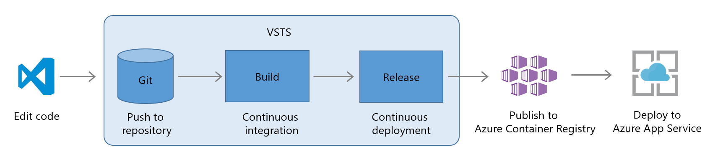
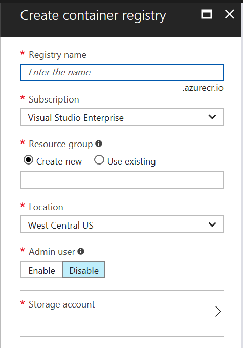
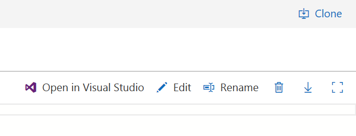
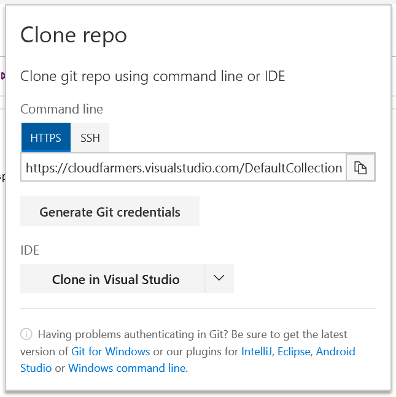
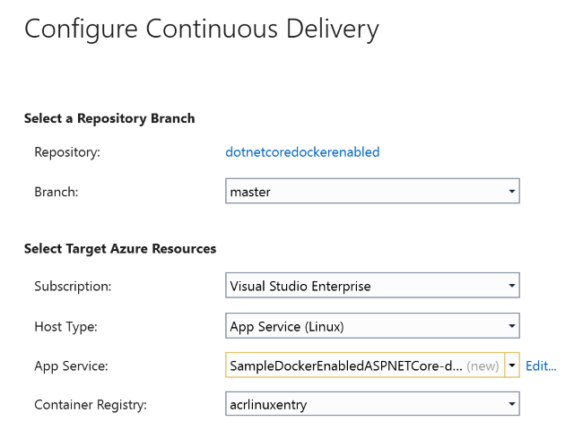

# Deploy an ASP.NET Core App to Linux App Service

Visual Studio Team Services (VSTS) provides a highly customizable continuous integration (CI) and continuous deployment (CD) pipeline for your ASP.NET Core apps. This quickstart shows how to set up CI and CD to deploy an ASP.NET Core application to Linux App Service using Docker and [Azure Container Registry](https://docs.microsoft.com/en-us/azure/container-registry/).

With your CI/CD processes in place, you'll push a change into your team's git repo and the results will automatically show up on your site.

[!INCLUDE [include](_shared/prerequisites.md)]    
* [Visual Studio 2017](https://www.visualstudio.com/downloads/)    
* [Continuous Delivery Tools for Visual Studio](https://marketplace.visualstudio.com/items?itemName=VSIDEDevOpsMSFT.ContinuousDeliveryToolsforVisualStudio) 

##  Deploy an Azure Container Registry    
You use [Azure Container Registry](https://docs.microsoft.com/en-us/azure/container-registry/) to host the Docker image that is deployed to Azure App Service.  Follow the steps below to create and configure the registry to store and manage the Docker container.  In later steps you deploy the Docker container to Linux App Service in Azure.

1.  Sign into your Azure Account at [https://portal.azure.com](https://portal.azure.com)
2.  In the Azure Portal, **click** **New, Containers, then click Azure Container Registry**.    
3.  Choose a **Registry name**, **Resource Group**, and **Location**.  

   

4.  Choose **Enable** for **Admin user**, and Click **Create**.
5.  Wait for the deployment to complete in the Azure Portal before proceeding.

[!INCLUDE [import-code-aspnet-core](_shared/import-code-aspnet-core-docker.md)] 

##  Clone the solution
Use the following steps to clone the sample solution and open it in Visual Studio 2017.  This allows you to work with solution in a local development environment.  In upcoming steps you use Visual Studio 2017 to configure continuous integration and continuous delivery for the web app.

1.  Ensure the import of the code is complete before continuing.  In the top right hand corner of your browser click **clone**.  Click **Clone in Visual Studio**.  

       
       

2.  Visual Studio 2017 will launch and prompt you for credentials.
3.  After authenticating, choose a directory and click **clone** to finish cloning the code to your local environment.

## Install Continuous Delivery (CD) Tools for Visual Studio 2017    
Continuous Delivery (CD) Tools for Visual Studio 2017 helps automate the creation of VSTS to Azure release pipelines.  Optionally, you can extend the generated pipeline to further enhance your CI/CD workflows.

1.  In Visual Studio 2017 click **Tools then click Extensions and Updates**.
2.  In the dialogue, click **Online** and search for **Continuous Delivery Tools for Visual Studio**.
3.  Click **Download**, and once it finishes **close** Visual Studio to finish the install process.
4.  **Restart** Visual Studio and **open** your solution.
5.  **Right Click** your solution in solution explorer and verify you see a **Configure Continuous Delivery** icon.

##  Configure and execute Continuous Delivery (CD) for your app    
The tools in Visual Studio 2017 automate the creation of a CI/CD pipeline.  The automation quickly creates various services in Azure and VSTS.  This automation allows you to quickly enable CI/CD to Azure for your apps by creating full end to end release pipelines in Visual Studio Team Services.

1.  In Visual Studio, **right click** your solution and click **Configure Continuous Delivery**.

   

2.  Choose App Service (Linux) as your **Host Type**.
3.  Choose the **Container Registry** you created earlier.
4.  Accept the default App Service name or click **edit** to choose a new name.
5.  Click **ok**, and monitor the output window for results.  
6.  **Azure resources** including the App Service will be created.  **VSTS resources** such as a build definition, and a release definition will be created in the same team project with your source code.
6.  A **build** and **release** will then execute.  **Navigate** to the VSTS account and monitor the build and release processes until they complete.  This process may take several minutes.
7.  Check the **Azure Portal** for the newly created resource group and Linux based App Service.  Find the new url for the Azure App Service URL by choosing properties on the App Service.
8.  **Verify** the web app is operational in a browser.  **Note**:  Currently the below work around is required until engineering pushes an update.
9.  **Optionally** you can make changes to the web app code and push them to VSTS.  A new build and release will execute and deploy the changes.

##	[ENGINEERING is fixing a bug and we can remove this section/work around]
1.  Currently if you navigate to your App Service, you receive a 503 error.
2.  Navigate to **Container registries** in the Azure Portal.  Copy the values for **Login Server, Username, and Password**.  **Note**:  In later steps you will add the prefix https:// to the value for the Login URL. 
3.  Navigate to the newly created **App Service** in the Azure Portal.
4.  Choose **Docker Container** under the **SETTINGS** section for your App Service.
5.  Choose **Private registry** and configure the details you saved above.  **Note**:  You must place https:// in front of the URL.  Example:  **https://LoginUrlGoesHere**
5.	**Refresh** your App Service URL in a browser.  The web app should now display.  
6.  **Optional:**  Make changes to your website and **push** the changes into VSTS.  A build and release will execute and your changes will be deployed.

## Next Steps    
You've just put your own CI/CD processes in place. You can modify these build and release definitions to meet the needs of your team. To learn more see one of these tutorials:

* [Define your continuous integration (CI) build process](../tutorials/define-ci-build-process.md)
* [Define your continuous deployment (CD) process](../tutorials/define-cd-release-process.md)
* [Define your multi-stage continuous deployment (CD) process](../tutorials/define-multistage-release-process.md)