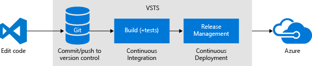
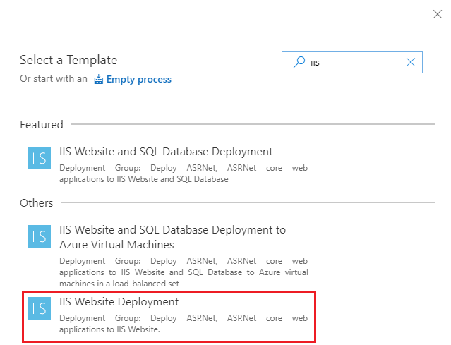
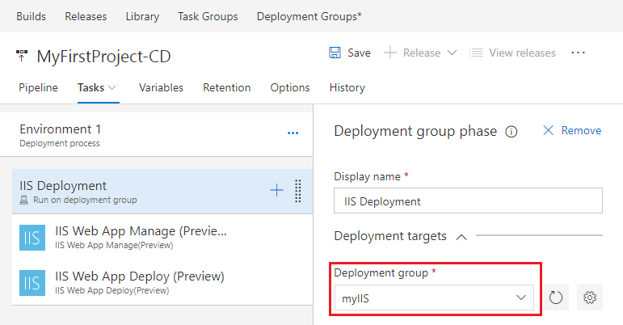

# Deploy your ASP.NET Core app to a Windows virtual machine

Visual Studio Team Services (VSTS) provides a highly customizable continuous integration (CI) and continuous deployment (CD) pipeline to automatically deploy your ASP.NET Core web app to a Windows virtual machine (VM) in Azure.

You'll use the VSTS portal to set up CI/CD. Your CI process runs the .NET Core commands to restore packages, build and test the app, and finally publish artifacts. Your CD process automatically picks up these artifacts and deploys them to your environment. Finally, you'll test it all out by pushing a small code change into your team's git repo. Your CI/CD processes will automatically deploy the change.



Your code changes automatically appear on your site:


[!INCLUDE [include](_shared/prerequisites.md)]

* Have a Windows virtual machine that has a default web site running in IIS. See [Create a Windows virtual machine with the Azure CLI](https://docs.microsoft.com/en-us/azure/virtual-machines/windows/quick-create-cli) for instructions to create a virtual machine in Azure, to install IIS, and to obtain its `publicIpAddress`.

## Prepare the Windows VM

Running an ASP.NET Core app on Windows requires some dependencies.

On your VM, open an **Administrator: Windows PowerShell** console. Install IIS and the required .NET features:

```PowerShell
# Install IIS
Install-WindowsFeature Web-Server,Web-Asp-Net45,NET-Framework-Features

# Install the .NET Core SDK
Invoke-WebRequest https://go.microsoft.com/fwlink/?linkid=848827 -outfile $env:temp\dotnet-dev-win-x64.1.0.4.exe
Start-Process $env:temp\dotnet-dev-win-x64.1.0.4.exe -ArgumentList '/quiet' -Wait

# Install the .NET Core Windows Server Hosting bundle
Invoke-WebRequest https://go.microsoft.com/fwlink/?LinkId=817246 -outfile $env:temp\DotNetCore.WindowsHosting.exe
Start-Process $env:temp\DotNetCore.WindowsHosting.exe -ArgumentList '/quiet' -Wait

# Restart the web server so that system PATH updates take effect
net stop was /y
net start w3svc
```

When `net start w3svc` appears, press **Enter** to run it.

[!INCLUDE [temp](_shared/create-deployment-group.md)]

[!INCLUDE [temp](_shared/import-code-aspnet-core.md)]

[//]: # (TODO)

[//]: # (TODO: Restore use of includes when we get support for using them in a list.)

[//]: # (TODO: [!INCLUDE [temp](_shared/set-up-ci-1.md])

[//]: # (TODO: In the right panel, select **ASP.NET Core**, and then click **Apply**.)

[//]: # (TODO: 

[//]: # (TODO: [!INCLUDE [temp](_shared/set-up-ci-2.md])

[//]: # (TODO: [!INCLUDE [temp](_shared/set-up-ci-3.md])

[//]: # (TODO)

## Set up continuous integration

Continuous Integration (CI) is the process of automating the build and testing of code every time a team member commits changes to version control. Here you'll create a CI build definition that helps team keep the master branch clean.

1. On the **Files** tab of the **Code** hub, click **Set up build**.

 

 You are taken to the **Build & Release** hub in VSTS and asked to **Choose a template**.

1. In the right panel, click **ASP.NET Core**, and then click **Apply**.

 

 You now see all the tasks that were automatically added to the build definition by the template. These are the steps that will automatically run every time check in code.

1. For the **Default agent queue**, select _Hosted VS2017_. This is how you can use our pool of agents that have the software you need to build a .NET Core app.

1. Click the **Triggers** tab in the build definition. Enable the **Continuous Integration** trigger. This will ensure that the build process is automatically triggered every time you commit a change to your repository.

1. Click **Save and queue** to kick off your first build. On the **Queue build** dialog box, click **Queue**.

1. A new build is started. You will see a link to the new build on the top of the page. Click the link to watch the new build as it happens. Wait for the build to complete and succeed before proceeding to the next section.

[//]: # (TODO)

[//]: # (TODO: Restore use of includes when we get support for using them in a list.)

[//]: # (TODO: [!INCLUDE [temp](_shared/set-up-cd-1.md])

[//]: # (TODO: 

[//]: # (TODO: In the **Create release definition** wizard, select the **IIS Website Deployment** template, and click **Apply**.)

[//]: # (TODO: 

[//]: # (TODO: Click **Tasks**, and then select the **SQL Deployment** phase. Click 'X' to delete this phase. We won't be deploying a database in this quickstart.)

[//]: # (TODO: Select **IIS Deployment** phase. For the **Deployment Group**, select the deployment group you created earlier, such as *myIIS*. In the **Machine tags** box, select **Add** and choose the *Web* tag.)

[//]: # (TODO: Select the **IIS Web App Manage** task; click 'X' to delete this task. We will not create a new website for this quickstart. Instead, we will deploy to the **default web site**.)

[//]: # (TODO: Select the **IIS Web App Deploy** task to configure your IIS instance settings as follows. For **Website Name**, enter *default web site*. Leave all the other default settings.)

[//]: # (TODO: 

[//]: # (TODO: [!INCLUDE [temp](_shared/set-up-cd-3.md])

## Set up continuous deployment

Continuous deployment (CD) is a lean practice that your team can use to keep production fresh. Here you'll set up a short automatic path from the availability of new code in version control to deployment. Specifically, you'll define a CD release management process that picks up the artifacts from your CI build and deploys you app to the IIS web server hosted in your Windows VM.

1. Once the build succeeds, click the **Release** action on the build summary page.

 

1. In the **Create release definition** wizard, select **IIS Website Deployment** template, and then click **Apply**.

 

1. Click the **Tasks** tab, and then click the **IIS Deployment** phase. For the **Deployment Group**, click the deployment group you created earlier, such as *myIIS*.

 

1. Click **Save**. On the Save dialog box, click **OK**.

1. To test the release definition, click **Release** and then **Create Release**.

 

1. On the Create new release dialog box, click **Queue**.

 Notice that a new release was created. Click the link to navigate to the release.

 

1. Click the **Logs** tab to watch the live logs from the deployment as it happens. Wait for the release to be deployed to the Azure web app.

1. Once deployment has completed, open your web browser and test your web app: `http://<publicIpAddress>`

[!INCLUDE [include](_shared/change-aspnet-core-code.md)]

When the deployment is done, verify that your changes are live in your web browser: `
http://<publicIpAddress>`

You're ready to collaborate with a team on an ASP.NET Core app with a CI/CD process that automatically deploys your latest work to your web site.

## Next steps

You've just put your own CI/CD processes in place. You can modify these build and release definitions to meet the needs of your team. To learn more see one of these tutorials:

* [Customize CD process](customize-cd-process.md)

* [Deploy to multiple VMs](deploy-to-vms.md)

* [Manage infrastructure as code](infrastructure-as-code.md)

[//]: # (TODO MAYBE [!INCLUDE [include](_shared/quickstart-next-steps.md)
