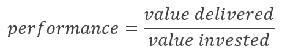

# Redefining "performance"

To begin the story of DevOps, let's state a simple truth:

_**Great apps and services deliver great performances**_

What did you think about when you read that line? If you work in or near software engineering, change are that you immediately thought about the narrow technical definition of "performance" as something measured with a profiler or similar tool. As engineers and developers, we're so accustomed to thinking about how fast code executes that we can easily forget why we care about such things in the first place.

We also pulled a little grammatical trick on you, which you may or may not have noticed. We didn't use the singular term "performance"; we intentionally used the plural, *performance***s**.

We say that great apps and services deliver great performances in the same way that great actors, artists, and athletes&mdash;even great teachers, doctors, and engineers&mdash;deliver great performances. To put it more simply, they put on a show of some sort that's wel worth whatever we've invested to experience that show.

Let's then define the singular "performance," in its most general sense, as follows:

This formula applies whether you're a consumer paying to experience the performance, or a producer paying to create the performance:

| | Consumer | Producer |
| --- | --- | --- |
| Value delivered | The value of the experience (watching a sporting event; enjoying an app). | The impact on revenue (or other business goals) delivered by the performer in question (athlete; app or service). |
| Value invested | The cost of having the experience (ticket price; purchase price of an app and/or associated services). | The total investment in the performer and required performance venues (salary, bonuses, training, equipment, and facilities for athletes; development and ongoing hosting/maintenance costs for an app or service). |

No matter the nature of the performance in question, the economics are simple: consumers are willing to pay more for higher levels of performance. It's why the greatest performers&mdash;such as major-league athletes&mdash;demand much higher premiums over the more abundant, but lower-performing minor-leaguers. Producers, therefore, are constantly looking to secure rights to the best performers, which is to say, those performers who deliver the greatest value at the lowest overall cost. Most businesses, in fact&mdash;whether they deliver software or soap, entertainment or education, or rockets or religion&mdash;are built around this exact principle.

## The software business is all about creating performers

To be in the software business means that you're ultimately seeking great performers: apps and services that accrue value to whatever you define as your bottom line. For simplicity, we'll assume means generating the necessary revenue to build and sustain your business , which leads to the operational principle we've already stated several times:

_**Performant apps and services are those that generate the highest revenue at the lowest cost**_

Both parts of this statement are important. Although you can say from a pure design perspective that performance is all about user experience, there's little point from a business perspective in producing the best performing app if you go bankrupt in the process. Nor is there much purpose in keeping costs so low that you can't deliver anything at all!

Keeping the two in balance is the primary challenge (and art!) of a successful software business.

## DevOps == continuous validation of performance

Given the operational principle stated earlier, it becomes clear that every practice and process that one adopts in software development must accrue to the increase in the value of the experience delivered to the consumer and/or the reduction of production costs. (Otherwise, again, what's the point?)

In all manners of endeavor, human beings validate and continually improve their ability to performance through extensive training, practice, rehearsals, and after-the-fact reviews. In software development, we achieve the same ends through many levels of rigorous testing and monitoring across the software lifecycle.

These activities are what we collectively refer to as DevOps, and thus we can make the following definition:

_**DevOps is the continuous validation of the performance of your apps and services across a broad spectrum of user experience and cost concerns**_

That "broad spectrum" of course includes many factors. User experience includes features, responsiveness (including startup time and traditional "perf"), backend responsiveness, usability, graphic (and sound) design, localization, discoverability, and robustness, to name a few. The most beautifully designed app, for example, will not deliver a great experience if it constantly struggles to retrieve necessary data from an overloaded backend; the most perfectly-designed app to accomplish a highly useful task is utterly worthless if it crashes all the time.[*](#footnote1)

With cost, similarly, there are many factors to consider, such as:

- The ability to catch bugs and other issues as early as possible in the development cycle (especially before the software gets into the hands of consumers),
- The ability to get actionable telemetry from the released app, and, most importantly,
- The degree to which processes throughout the lifecycle of every app release can be automated.

The sheer diversity of these factors is why DevOps seems so fragmented: the tools, services, processes, and practices can vary widely for each concern. By picking up DevOps by the single thread of continuous validation, however, it's easy to see the purpose and value of any individual piece, as this article explores.

> [!div class="nextstepaction"]
> [The delivery/release pipeline](azure-devops-guide-for-managers-04-pipeline.md)

(Footnotes)

<a name="footnote1">*</a> In this context it's helpful to revisit the typical notion of "perf" as measured by a code profiler, to which developers revert almost instinctively even though it's far too narrow a factor. For example, mention a cross-platform mobile app technology and developers typically jump right into comparisons like "Well, those platforms just won’t perform like a native app." According to the performance formula, however, performance is the ratio of value delivered to value invested. If an app written with cross-platform tools can deliver a great user experience that's, say, 90% of the "ideal" native app experience and still be highly attractive to consumers, and do so at 25% of the cost, then it's overall performance is, in fact, 3.6 times higher than the native app. Some will then argue, "Oh, but (insert whatever programming language you love to hate) doesn't run as fast as (insert your most favored language)!" But when does that actually matter? If it takes three seconds (3600ms) to get data from your backend, the difference between taking 50ms or 150ms in the processing routine is quite negligible, especially if the average user takes another 400ms to react to the result. The choice of programming language is therefore inconsequential: improving the responsiveness of the backend by even 10% makes a more significant impact on the user experience. Performance, in the end, is a comprehensive measure again of both user experience and production cost, and must be measured across the whole of the solution including mobile clients, backend services, and non-coding activities like training, the availability and cost of hiring capable developers, and DevOps.
