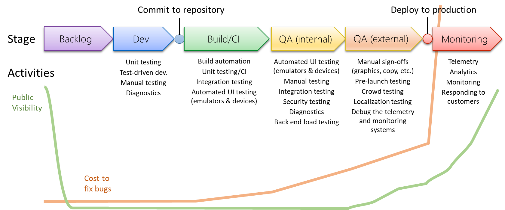

# The delivery/release pipeline

The idea of a "pipeline" means that for any particular release of an app or services, the various artifacts that comprise your delivered product must somehow flow from the computers on which developers do their work to customer devices and customer-accessible servers. That flow, of course, doesn't happen by magic. It happens through a sequence of distinct stages, as illustrated shown in the following diagram:

- **Backlog**: Organize and prioritize all work items into distinct releases and iterations.
- **Dev**: Write code and test on local developer computers or development servers. In both cases, these "developer" systems are generally optimized for the concerns of developers, rather than customers, and are typically loaded up with a variety of developer-oriented tools like code editors, compilers, diagnostic and logging tools, and specialized hardware.
- **Build/CI**: the act of **committing code to a source control repository**, which collects work from the whole development team, starts the process of turning that code into customer-ready artifacts. (Using commits to trigger the next stage of the pipeline is what's known as Continuous integration or CI.) The first stage is to make sure the code actually builds through the use of tools like compilers that are run on specialized build servers. If the code builds, you can then a variety of automated test on the build server and/or other dedicated test computers that are appropriately configured for the task.
- **QA**: The next two steps involve additional quality assurance checks, which can be automated or manual. Manual checks mean a human approver is involved and must sign-off before the software goes further in the pipeline. In these steps, software is typically deployed onto "staging" devices or servers that are similar to those that real customers use, and can thus test the software under real-world conditions before releasing it into that real world. The internal QA checks are, as the name implies, is done privately within your company; external QA, on the other hand, involves test customers outside the company who are willing to exercise the software prior to final release and provide valuable feedback.
- **Monitoring**: Once all the QA checks are complete, and perhaps a final approver signs off on the release, the software is **deployed into "production,"** which means it's made available to customers. At this point, you ideally gather data on how the software performs "in the wild," as we say. Such monitoring is important because regardless of how much testing you do, customers will almost certainly encounter unique problems. They'll also have valuable opinions about what you've delivered, and telemetry reveals their usage patterns.

Let's acknowledge here that you may have already seen these stages in other diagrams, perhaps arranged in a circle to illustrate concepts like "application lifecycle management." However, as you see in the sections that follow, we've arranged them linearly on purpose to better show a deeper set of cyclical relationships. The linear arrangement also reinforces the fact that for any given release, the pipeline&mdash;as the word implies&mdash;is linear in nature, as each stage is a distinct gateway to the next and that you're not actually *required* to take anything from the end of the pipeline and feed it into the beginning. Of course, if you care at all about your customers, you feed monitoring data and customer input into the backlog, as discussed shortly.

## DevOps activities at each stage

Before discussing the backlog, however, let's add another layer to the diagram by spelling out the different activities that occur at each state of the pipeline. (For a description of each activity, see the glossary.)

Take a few minutes to study the diagram closely. As you can see, each stage of the pipeline has a variety of activities, all of which are part of "DevOps" regardless of whether they're manual or automated. These are the same activities that you can adopt one at a time to incrementally increase the degree of validation of what you're delivering while simultaneously lowering costs through both automation and/or earlier detection of issue.

We've also added two lines to the diagram. The green line suggests how visible the activities involved are to your customers, which also implies the visibility of any bugs or issues that occur and thus the impact of those issues on customer sentiment and satisfaction. The orange line, then, suggests the relative cost of addressing issues at any stage of the pipeline. Clearly, the cost of a bug, for example, increases dramatically as soon as you deploy to production, because that bug affects your real customers and can incur a tremendous cost to your company's reputation!

The purpose of both these lines is to help you understand that you ideally want to catch as many issues as you can as early as possible in the pipeline, and especially before anything goes out to customers (including test customers). Such is one of the fundamental motivations for DevOps.

## DevOps output: feeding the backlog

Now it should go without saying that every test you apply within a release pipeline is a gate through which the software must pass to proceed further in the pipeline. What, then, do you do when tests fail, as they should? Or put another way, what is the output of all these DevOps activities? Let's put it this way:

**The output of DevOps as a whole&mdash;the output of the continuous validation of performance&mdash;are any bugs or issues that invalidate that performance anywhere in the entire pipeline of a given release**

That is, anywhere along the pipeline, each and every test, measurement, and observation might reveal a defect in the software. In addition, each activity might also reveal defects in the structure and configuration of the pipeline itself. We like to say, for example, that because tests are often themselves written in code, they're just as error-prone as any other kind of code. Even manual approval steps may have defects&mdash;some detail that gets routinely overlooked and thereby allows some other defect to reach customers.

Every such break in the pipeline, if you will, must then ultimately cycle around as items in the work backlog, where they can be appropriately prioritized and sorted into the necessary iterations.

This relationship is illustrated in the diagram below, where the various DevOps activities have specific outputs such as code defects, configuration errors, usability issues, responsiveness bottlenecks, and so forth. In each case, an output indicates something that either interferes with customer delight or increases your costs, and must consequently become into an issue in the backlog.

Although work items in the backlog most commonly direct Dev activities, which is the next step in the pipeline, they may apply to any other stage of the pipeline. This relationship is illustrated by the small arrows across the top.
As noted before, you might have seen "application lifecycle management" diagrams that are arranged in a circle. The detailed diagram above, however, shows that there are both linear and cyclical aspects in the development process:

- Because each stage is dependent on the state, any given release necessarily follows a somewhat linear progression. Dev is driven by the backlog. Build/CI is triggered by commits to the repository. QA is triggered by a successful build and CI tests. Deployment to production and monitoring is triggered by successful QA checks. And you can even say that the next iteration depends on the successful completion of the previous one! 
- Simultaneously, there is a cycle or loop between each stage of the pipeline and the backlog, because again, failures in the pipeline are not necessarily due to code bugs: there may be errors in build definitions, configuration files, test design, telemetry design or implementation, and even something like insufficient staffing in one's support department.

We've also explicitly called out technical debt management as a process that happens between the logging of work items and their appearance in the backlog for a release. Any given failure or break in the pipeline, that is, doesn't necessarily accrue to the current iteration and release: work items vary in priority, of course, and project managers choose when to schedule them into an iterations or releases (especially in the case of customer feedback).

All in all, you now have a comprehensive picture of exactly what DevOps is: it's the continuous validation of the performance of your apps and services that's comprised of many potential activities that each serve that validation. Each activity is designed to defect certain defects in the software or the pipeline itself, and those defects turn into work items that feed the backlog for subsequent iterations of your development work, all of which is aimed at delivering the highest value to your customers at the lowest cost.

> [!div class="nextstepaction"]
> [Redefining "performance"](azure-devops-guide-for-managers-03-redefining-performance.md)
