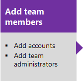
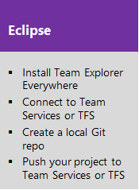
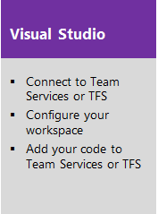
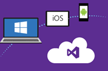

# DevOps overview for Team Services and TFS

<b>Team Services | TFS 2017 | TFS 2015 | TFS 2013</b> 

Use our integrated tool set to speed the development and delivery of your software applications. Build better apps for any platform, including iOS, Android, Java, Linux or Windows.  
 
  

Visual Studio Team Services and Azure cloud services help remove barriers between teams, encourage collaboration, and improve the flow of value to your customers. Or, use our on-premises server, Team Foundation Server (TFS), when you want to maintain your data within your network. 

Both options are enterprise-ready, supporting teams of any size, from tens to thousands. Team Services provides a scalable, reliable, and globally available hosted service. It is backed by a 99.9% SLA, monitored by our 24—7 operations team, and available in local data centers around the world.

Also, you can quickly expand the power of these tools through integration with other services and tools using service hooks and extensions.  

For the key differences between TFS and Team Services, see [About Visual Studio Team Services and Team Foundation Server](about-vsts-tfs.md). 

## Get started in the cloud or on-premises  
Whether you work in the cloud, on-premises, or a hybrid of each, you have a comprehensive set of DevOps and Agile tools to support team collaboration throughout the cycles of planning, development and test, and continuous delivery.

### Work in the cloud
Choose Team Services when you want quick setup, maintenance-free operations, easy collaboration across domains, elastic scale, and rock solid security. You'll also have access to cloud load testing, cloud build servers, and application insights. [Small teams can start for free!](https://www.visualstudio.com/products/visual-studio-team-services-vs.aspx)  

   

### Work on-premises
Choose on-premises TFS when you need your data to stay within your network or you want access to SharePoint sites and SQL Server reporting services that integrate with TFS data and tools.  

   
 

## Develop code using your IDE of choice 

Team Services supports two types of version control Git and Team Foundation Version Control (TFVC). Use Git, Team Foundation version control (TFVC) or both to store code for your app and give you access to different versions of your code. 

Depending on whether you use Git or TFVC as a repo, you can develop your code in Android Studio, Eclipse, IntelliJ, Visual Studio, Visual Studio Code, or Xcode.  

### Git

Git is a distributed version control system. Each developer has a copy of the source repository on their dev machine. Developers can commit each set of changes on their dev machine and perform version control operations such as history and compare without a network connection. Branches are lightweight. 

&#160;&#160;&#160;&#160;&#160;&#160;&#160;&#160;&#160;&#160;&#160;&#160;  

 
&#160;&#160;&#160;&#160;&#160;&#160;&#160;&#160;&#160;&#160;&#160;&#160;  

### TFVC 

TFVC is a centralized version control system that lets you apply granular permissions and restrict access down to a file level. Typically, team members have only one version of each file on their dev machines. Historical data is maintained only on the server. Branches are path-based and created on the server.

You can use TFVC to scale from small to large projects, and by using server workspaces, you can scale up to very large codebases with millions of files per branch and large binary files. And with compare and annotate you can identify the exact changes that they made.

&#160;&#160;&#160;&#160;&#160;&#160;&#160;&#160;&#160;&#160;&#160;&#160;  

###Package management and code search 

Software development teams often rely on re-using libraries or providing libraries for others to re-use. Package management supports code sharing as binary components across organizations and within teams. With it, you can build projects to produce packages and update projects that consume updated packages. Our package management service enables plugging in existing package management services you already use, such as local NuGet servers for IP protection, NuGet, MyGet, or Artifactory.  

Package Management

<ul style="padding-left:30px">
<li style="margin-bottom:2px">[Package Management overview](package/overview.md)</li>
<li style="margin-bottom:2px">[What is Package Management?](package/index.md)</li>

</ul>

Code Search

<ul style="padding-left:30px">
<li style="margin-bottom:2px">[Search across all your code](search/overview.md)</li>
<li style="margin-bottom:2px">[Code Search extension](https://marketplace.visualstudio.com/items/ms.vss-code-search)</li>

</ul>

Also of interest

<ul style="padding-left:30px">
<li style="margin-bottom:2px">[CodePlex Project Hosting for Open Source Software](http://www.codeplex.com/)</li>
<li style="margin-bottom:2px">[Find code changes and other history with CodeLens](https://msdn.microsoft.com/library/dn269218.aspx)</li>
</ul>

Code Search provides a comprehensive solution to all your code exploration and troubleshooting needs. From discovering examples of an API's implementation to searching for error text, Code Search offers a fast and powerful way to find code. Search across one or more projects, with semantic ranking and rich search results to ensure you find what you need and can focus in to understand your code. Code Search lets you filter your results based on code types such as definitions, comments, and references; filter by path, file extension, or repository; and use logical operators such as AND, OR, NOT to refine your query and get the results you need.  

Code Search also makes team collaboration easier and helps maximize developer efficiency. View history and annotations to see who last changed a line of code, and what they changed. Search locally within code files, and find references or definitions of Code Search matches, when debugging or exploring your code. Add your comments and then communicate the results to team members easily by sharing the query URL.  

## Plan and track work with Agile tools  

 Use Agile tools to plan and track work using Scrum and Kanban processes or a mix of both. Scrum tools support defining and managing work within sprints, setting capacity, and tracking tasks. Kanban tools allow you to manage a continuous flow of work via an interactive sign board. In addition, configurable charts, dashboards, and reports help teams monitor and share progress. 

&#160;&#160;&#160;&#160;&#160;&#160; &#160;&#160;&#160;&#160;&#160;&#160;
 

You also gain access to a [rich set of customization capabilities](work/customize/customize-work.md). 
 
<!---
##Agile tools support planning and tracking work
Prioritization of investments should be based on real-world usage patterns. Use Agile tools to plan and track work using Scrum and Kanban processes or a mix of both. Configurable charts, dashboards, and reports help teams monitor and report progress. And, enterprise organizations can scale the tools and manage a portfolio of products while teams work autonomously.  

Agile tools

<ul style="padding-left:30px">
<li style="margin-bottom:2px">[Create your backlog](work/backlogs/create-your-backlog.md)</li>
<li style="margin-bottom:2px">[Scrum](work/scrum/sprint-planning.md)</li>
<li style="margin-bottom:2px">[Kanban](work/kanban/kanban-basics.md)</li>
<li style="margin-bottom:2px">[Storyboard with PowerPoint](work/office/storyboard-your-ideas-using-powerpoint.md)</li>
</ul>

Dashboards and reports

<ul style="padding-left:30px">
<li style="margin-bottom:2px">[Track (work item queries)](work/track/using-queries.md)</li>
<li style="margin-bottom:2px">[Charts](report/charts.md)</li>
<li style="margin-bottom:2px">[Dashboards](report/dashboards.md)</li>
</ul>

Also of interest

<ul style="padding-left:30px">
<li style="margin-bottom:2px">[Agile tools](work/overview.md)</li>
<li style="margin-bottom:2px">[Portfolio management](work/scale/portfolio-management.md)</li>
<li style="margin-bottom:2px">[Customize](work/customize/customize-work.md)</li>
<li style="margin-bottom:2px">[Power BI Dashboards and reports (Team Services)](report/powerbi/report-on-vso-with-power-bi-vs.md)</li>
</ul>

-->

## DevOps: Build - Test - Release 

Help your team continuously deliver software at a faster pace and with lower risk, while improving efficiency and collaboration between all teams that participate in release processes. Set up continuous integration builds for your app that run with every check in. Multi-platform build agents support Android, iOS, Java, .NET, and other applications. Easily load test your apps and provision test environments. Track when the quality is sufficient to release to the customer.  

   

<!---

Agile methodologies speed up the development and test cycle and make sure that you can deliver real value to your customers on a regular basis.

No matter what platform you target or language you use, you can simplify the continuous integration of your apps that build on Linux, Mac, or Windows. And, you can seamless integrate information about your builds with work, code, test, and release.  
-->

In addition to continuous integration testing, you can create [test plans](manual-test/getting-started/create-a-test-plan.md), [perform manual testing](manual-test/index.md), and [run unit tests](https://docs.microsoft.com/visualstudio/test/developer-testing-scenarios). 

Release Management helps you automate the deployment and testing of your software in multiple environments. With it, you can either fully automate the delivery of your software all the way to production, or set up semi-automated processes with approvals and on-demand deployments.  

<!---

Code

<i>Git</i>

<ul style="padding-left:30px">
<li style="margin-bottom:2px">[Git & Visual Studio](git/share-your-code-in-git-vs.md)</li>
<li style="margin-bottom:2px">[Git & Eclipse](git/share-your-code-in-git-eclipse.md)</li>
<li style="margin-bottom:2px">[Git & Xcode](git/share-your-code-in-git-xcode.md)</li>
</ul>

<i>TFVC</i>

<ul style="padding-left:30px">
<li style="margin-bottom:2px">[TFVC & Visual Studio](tfvc/share-your-code-in-tfvc-vs.md)</li>
<li style="margin-bottom:2px">[TFVC & Eclipse](tfvc/share-your-code-in-tfvc-eclipse.md)</li> 
<li style="margin-bottom:2px">[TFVC & Xcode](tfvc/share-your-code-in-tfvc-xcode.md)</li>
</ul>

Build

<ul style="padding-left:30px">
<li style="margin-bottom:2px"><a href="build-release/overview.md">Overview</a></h4>
<li style="margin-bottom:2px"><a href="build-release/apps/windows/dot-net.md">.NET get started</a></li>
<li style="margin-bottom:2px"><a href="build-release/apps/java/build.md">Java get started</a></li>
<li style="margin-bottom:2px"><a href="build-release/apps/aspnet/build-aspnet4.md">Azure</a></li>
<li style="margin-bottom:2px"><a href="build-release/apps/windows/universal.md">Windows</a></li>
<li style="margin-bottom:2px"><a href="build-release/apps/mobile/xamarin.md">Mobile</a></li>
</ul>

Test

<ul style="padding-left:30px">
<li style="margin-bottom:2px">[Test plans](manual-test/getting-started/create-a-test-plan.md)</li>
<li style="margin-bottom:2px">[Manual testing](manual-test/index.md)</li>
<li style="margin-bottom:2px">[Unit tests](https://docs.microsoft.com/visualstudio/test/developer-testing-scenarios)</li>
<li style="margin-bottom:2px">[Continuous testing](build-release/test/index.md)</li>
</ul>

Release

<ul style="padding-left:30px">
<ul style="padding-left:30px">
<li style="margin-bottom:2px">[Get started](build-release/overview.md)</li>
<li style="margin-bottom:2px">[Release definitions](build-release/concepts/definitions/release/index.md)</li>
<li style="margin-bottom:2px">[Manage releases](build-release/actions/view-manage-releases.md)</li>
<li style="margin-bottom:2px">[Deploy your apps](build-release/apps/index.md)</li>
</ul>

Also of interest

<ul style="padding-left:30px">
<li style="margin-bottom:2px">[Cross-platform command-line tool](https://msdn.microsoft.com/library/hh873092.aspx)</li>
<li style="margin-bottom:2px">[Improve code quality](https://msdn.microsoft.com/library/dd264943.aspx)</li>
<li style="margin-bottom:2px">[Load test in the cloud](load-test/get-started-simple-cloud-load-test.md)</li>
<li style="margin-bottom:2px">[Track test status](manual-test/getting-started/track-test-status.md)</li>
</ul>

-->

## Scale up  

As your team grows, your tools will grow with you. You can easily add teams which can focus on their set of backlog stories. Each team you create gets access to their set of dashboards, Agile planning tools, and other collaborative tools.  

  

 
## Related notes

Once you've signed up for Team Services or installed TFS, you'll want to get familiar with the [web portal and working in the user and admin contexts](connect/work-web-portal.md).    

Other topics of interest:  
 
- [About Visual Studio Team Services and Team Foundation Server](about-vsts-tfs.md) - [Key concepts](concepts.md) 
- [Essential services](services.md)
- [Client-server tools](tools.md)
- [Software development roles](roles.md)   

- [What's new for Team Foundation Server](whats-new.md)   

### TFS updates

- [What's new](whats-new.md)  
- [Migrate data from TFS to Team Services](migrate-to-vsts-from-tfs.md)

### Pricing, costs, and licenses
[Team Services Pricing](https://www.visualstudio.com/team-services/pricing/) provides per user costs. Small teams (5 users or fewer) can start for free. Unlimited Visual Studio subscribers are free.   

On-premises TFS provides three access levels: [Stakeholder, Basic, and Advanced](security/change-access-levels.md). You don't need to buy additional licenses for Visual Studio subscribers. Use the [Team Foundation Server pricing page](https://www.visualstudio.com/team-services/tfs-pricing) to plan your licensing requirements. 

### Extensibility: Create first-class integration experiences 

Our extensibility framework enables you to build integrations directly within Team Services or TFS to create first-class, seamless connections between different tools and services.  

With Marketplace extensions (currently in private preview), you can create first-class integration experiences, such as a simple context menu or toolbar action. Or, you can create a complex, powerful full UI experience that seamlessly lights up within the VSTS web portal.  

Marketplace

<ul style="padding-left:10px">
<li style="margin-bottom:2px">[Find marketplace extensions](marketplace/index.md)</li>
<li style="margin-bottom:2px">[Buy subscriptions](billing/vs-subscriptions/buy-vs-subscriptions.md)</li>
<li style="margin-bottom:2px">[Get extensions](marketplace/install-vsts-extension.md)</li>
</ul>

 

Service hooks

<ul style="padding-left:20px">
<li style="margin-bottom:2px">[Using service hooks](service-hooks/index.md)</li>
<li style="margin-bottom:2px">[Authorize](service-hooks/authorize.md)</li>
<li style="margin-bottom:2px">[Create subscriptions](service-hooks/create-subscription.md)</li>
<li style="margin-bottom:2px">[Service hook consumers](service-hooks/consumers.md)</li>
<li style="margin-bottom:2px">[Service hook events](service-hooks/events.md)</li>
</ul>

REST APIs

<ul style="padding-left:20px">
<li style="margin-bottom:2px">[Get started with REST APIs](integrate/get-started/rest/basics.md)</li>
<li style="margin-bottom:2px">[Choosing the right authentication mechanism](integrate/get-started/authentication/authentication-guidance.md)</li>
<li style="margin-bottom:2px">[.NET client libraries](integrate/get-started/client-libraries/dotnet.md)</li>
<li style="margin-bottom:2px">[C# client library samples](integrate/get-started/client-libraries/samples.md)</li>
<li style="margin-bottom:2px">[REST API Reference](https://visualstudio.com/integrate/api/overview.md)</li>
</ul>

Also of interest

<ul style="padding-left:20px">
<li style="margin-bottom:2px">[Self-help integration options](http://www.visualstudio.com/integrate/support/support-overview-vsi)</li>
<li style="margin-bottom:2px">[Visual Studio Partner program](https://vsipprogram.com/About)</li>
<li style="margin-bottom:2px">[Products and extensions for Visual Studio](https://visualstudiogallery.msdn.microsoft.com)</li>
<li style="margin-bottom:2px">[Extension examples](https://github.com/Microsoft/vso-extension-samples)</li>
<li style="margin-bottom:2px">[Client-object model SDK](tfs-server/architecture/extend-vs-for-alm.md) (TFS)</li>
</ul>

Service hooks enable integration scenarios between other applications and VSTS or your on-premises TFS by subscribing to events instead of constantly polling for them. Service hooks provide a more efficient way to drive activities when events happen in your team projects. For example, you can send a push notification to your team's mobile devices when a build fails, or create a card in Trello when a work item is created. Some of the services you can easily integrate with are UserVoice, Zendesk, Trello, Slack, and HipChat. 

Industry-standard RESTful APIs extend the power of VSTS and TFS from your apps and services. With them, you can integrate from virtually any device, platform, or technology stack, including Windows, Android, iOS, Node.js, and more.  

### Analytics: Monitor your apps to gain insight  

Monitor your web and device apps to gain actionable insight to improve performance, determine usage patterns, and plan for the next version of your software.  

  
[Use Application Insights](http://azure.microsoft.com/documentation/services/application-insights/) to understand how your app is being used and to make sure it is performing well. Detect issues, diagnose crashes and track usage of your mobile apps, and web apps hosted from Azure, or your own IIS or J2EE servers.  

[Use HockeyApp](http://hockeyapp.net/features/) to distribute beta versions of your apps on iOS, Android, Mac OS X, and Windows, collect live crash reports, get feedback from users, recruit new testers, and analyze test coverage.

Application Insights

<ul style="padding-left:30px">
<li style="margin-bottom:2px">[What is Application Insights?](https://docs.microsoft.com/azure/application-insights/app-insights-overview)</li>
<li style="margin-bottom:2px">[Monitor ASP.NET websites](https://docs.microsoft.com/azure/application-insights/app-insights-asp-net)</li>
<li style="margin-bottom:2px">[Monitor Java web projects](https://docs.microsoft.com/azure/application-insights/app-insights-java-get-started)</li>
<li style="margin-bottom:2px">[Monitor HockeyApp data](https://docs.microsoft.com/azure/application-insights/app-insights-hockeyapp-bridge-app)</li>

</ul>

HockeyApp

<li style="margin-bottom:2px">[Manage mobile apps with HockeyApp](https://support.hockeyapp.net/kb/app-management-2/how-to-create-a-new-app)</li>
<li style="margin-bottom:2px">[Get HockeyApp plans](billing/get-hockeyapp.md)</li>
<li style="margin-bottom:2px">[Get HockeyApp extension](https://marketplace.visualstudio.com/items?itemname=ms.hockeyapp)</li>
</ul>

Also of interest

<ul style="padding-left:30px">
<li style="margin-bottom:2px">[Application insight videos](https://azure.microsoft.com/documentation/services/application-insights/)</li>
<li style="margin-bottom:2px">[Get started tutorial](https://azure.microsoft.com/documentation/articles/app-insights-get-started/)</li>
</ul>

<!---

##Setup

Team Services

<ul style="padding-left:30px">
 <li style="margin-bottom:2px">[Set up Visual Studio](accounts/set-up-vs.md)</li>
 <li style="margin-bottom:2px">[Connect to Team Services](connect/connect-team-projects.md)</li>
 <li style="margin-bottom:2px">[Add team members](connect/connect-team-projects.md)</li>
 <li style="margin-bottom:2px">[Migrate from Team Foundation Server to Visual Studio Team Services](https://www.visualstudio.com/en-us/articles/adopting-vsts)</li>
</ul>

TFS

<i>Server</i>

<ul style="padding-left:30px">
<li style="margin-bottom:2px">[Install and setup](tfs-server/install/get-started.md)</li>
<li style="margin-bottom:2px">[Upgrade](tfs-server/upgrade/get-started.md)</li>
<li style="margin-bottom:2px">[Administer](accounts/account-management.md)</li>
</ul>

<i>Team project</i>

<ul style="padding-left:30px">
<li style="margin-bottom:2px">[Create a team project](accounts/create-team-project.md)</li>
<li style="margin-bottom:2px">[Update a team project](work/customize/configure-features-after-upgrade.md)</li>
</ul>

Supported clients

<i>Primary clients</i>

<ul style="padding-left:30px">
<li style="margin-bottom:2px">[Visual Studio](https://msdn.microsoft.com/library/dd831853.aspx)</li>
<li style="margin-bottom:2px">[Web portal](https://msdn.microsoft.com/library/ee523998.aspx)</li>
<li style="margin-bottom:2px">[Team Explorer](https://msdn.microsoft.com/library/hh500420.aspx)</li>
<li style="margin-bottom:2px">[Team Explorer Everywhere](https://www.visualstudio.com/explore/team-explorer-everywhere-and-eclipse-vs)</li>
</ul>

<i>Office-integration clients</i>

<ul style="padding-left:30px">
<li style="margin-bottom:2px">[Excel](work/office/bulk-add-modify-work-items-excel.md)</li>
<li style="margin-bottom:2px">[Project](work/office/create-your-backlog-tasks-using-project.md)</li>
<li style="margin-bottom:2px">[Project Professional with TFS-Project Server integration](work/tfs-ps-sync/synchronize-tfs-project-server.md)</li>
<li style="margin-bottom:2px">[PowerPoint Storyboarding](work/office/storyboard-your-ideas-using-powerpoint.md)</li>
</ul>

<i>Task-specific clients</i>

<ul style="padding-left:30px">
<li style="margin-bottom:2px">[Microsoft Test Manager](https://msdn.microsoft.com/library/dd380763.aspx)</li>
<li style="margin-bottom:2px">[Microsoft Feedback Client](work/connect/give-feedback.md) </li>
<li style="margin-bottom:2px">[Stakeholder access](quickstart/get-started-stakeholder.md)</li>  
</ul>

Also of interest

<ul style="padding-left:30px">
 <li style="margin-bottom:2px">[Feature matrix](https://www.visualstudio.com/features/visual-studio-online-feature-matrix-vs)</li>
 <li style="margin-bottom:2px">[Pricing](https://www.visualstudio.com/en-us/products/visual-studio-online-pricing-vs.aspx)</li>
 <li style="margin-bottom:2px">[Downloads](https://www.visualstudio.com/downloads/download-visual-studio-vs)</li>
 <li style="margin-bottom:2px">[Compare Visual Studio Offerings](https://www.microsoft.com/visualstudio/eng/products/compare)</li>
</ul>

### Visual Studio, Team Foundation clients, and cross-platform support
Visual Studio and Team Foundation clients support program managers and other stakeholders to connect to TFS and Visual Studio Team Services. You can get started using the free Visual Studio Community edition. Compare Visual Studio versions to learn which editions provide access to premium features.  

Team Explorer is installed with each version of Visual Studio. You can download it for free by [installing Visual Studio Community](https://www.visualstudio.com/downloads/download-visual-studio-vs). Team Explorer supports connecting to team projects hosted on either an on-premises TFS or VSTS.  

Use [Team Explorer Everywhere](https://www.visualstudio.com/explore/team-explorer-everywhere-and-eclipse-vs), the Team Foundation Server plug-in for Eclipse, to connect to TFS and Team Services from Eclipse. The TFS plug-in supports version control, build, and work item tracking.  

### Client-server support 

Clients

<ul style="padding-left:10px">
 <li style="margin-bottom:2px"><b>[Visual Studio](https://beta.visualstudio.com/visual-studio-vs/)</b>
Fully-featured IDE for Android, iOS, Windows, web, and cloud
</li>
 <li style="margin-bottom:2px"><b>[Visual Studio Enterprise](https://www.visualstudio.com/products/visual-studio-enterprise-vs)</b>
An integrated, end-to-end solution for teams of any size with demanding quality and scale needs. Take advantage of comprehensive tools and services for designing, building and managing complex enterprise applications.
</li>
 <li style="margin-bottom:2px"><b>[Visual Studio Test Professional](https://beta.visualstudio.com/visual-studio-vs/)</b>
Drive quality and collaboration with integrated test case management, manual and exploratory testing tools.
</li>  

Free clients

  
 <li style="margin-bottom:2px"><b>[Visual Studio Code](https://code.visualstudio.com/)</b>

Free. Open source. Runs everywhere.
</li>
 <li style="margin-bottom:2px"><b>[Visual Studio Community](https://beta.visualstudio.com/visual-studio-community-vs/)</b>

A free, fully-featured, and extensible IDE for creating modern applications for Windows, Android, and iOS, as well as web applications and cloud services.
</li>
</ul>

Servers

<ul style="padding-left:20px">
 <li style="margin-bottom:2px"><b>[Visual Studio Team Services](https://www.visualstudio.com/visual-studio-team-services-vs/)</b>
Services for teams to share code, track work, and ship software €“ for any language, all in a single package. It's the perfect complement to your IDE.
</li>
 <li style="margin-bottom:2px"><b>[Team Foundation Server](https://www.visualstudio.com/en-us/products/tfs-overview-vs.aspx)</b>
An enterprise-grade server for teams to share code, track work, and ship software &mdash; for any language, all in a single package. It's the perfect complement to your IDE.
</li>    
 
</ul>

Extensibility

<ul style="padding-left:20px">
 <li style="margin-bottom:2px"><b>[Visual Studio Marketplace](https://marketplace.visualstudio.com/)</b>
The place to find extensions and subscriptions for the VIsual Studio family of products. 
</li>
 <li style="margin-bottom:2px"><b>[Visual Studio Code extension gallery](https://code.visualstudio.com/docs/editor/extension-gallery)</b>
All Visual Studio code extensions share a common model of contribution (registration)_, activation (loading), and access to the Visual Studio Code extensibilty API. 
</li>
 <li style="margin-bottom:2px"><b>[Open platforms](https://www.visualstudio.com/integrate/explore/explore-vso-vsi)</b>
Build awesome extensions and integrations:
 
<ul style="padding-left:10px">
<li>REST APIs with libraries for .NET, Node.js, and more</li>
<li>Extensions to create seamless experiences with other tools and services</li>
<li>Web hooks to enable robust integration</li>
<li>Common APIs across cloud and on-premises</li>
</ul>
</li>
</ul>

-->
