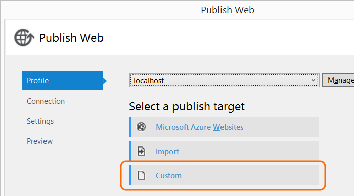

1. If you haven't already, install IIS.

2. Run Visual Studio as administrator.

3. Publish your web app from the solution explorer.

	

4. Use the custom target.

	

4. Set the connection info.

	

	Verify that and then step through the rest of the publish wizard.

5. In the IIS Manager, select your web site and add an HTTPs binding if you don't already have one.

	

6. Open SSL Settings to require SSL for your web site.

	
