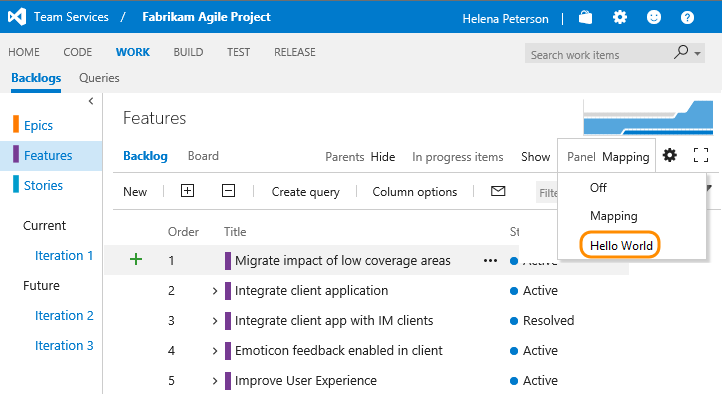

# Add panels on backlog pages

In this example, we'll add a simple Hello World extension as a panel on the Portfolio backlog, Product backlog, and Iteration backlog.

<!---

-->



The custom panel opens in the same space that the mapping panel opens if it were selected.  


There are three types of backlogs that can be targets for panel extensions: Portfolio backlogs, Product backlogs, and Iteration backlogs. For the Agile template, this breakdown is as below. This is representative of Scrum and CMMI as well. For custom templates, please consult your process to see which backlogs are requirement or portfolio category. 

<!---

-->


See the [Azure DevOps Services Extension Samples](https://github.com/Microsoft/vsts-extension-samples/tree/master/backlogs-panel) on GitHub for the full source of an example extension.

## Update your extension manifest

Update your [extension manifest](../develop/manifest.md) file with the following code:

```json
...
	"contributions": [
		{
			"id": "Fabrikam.HelloWorld.Backlogs.Panel",
			"type": "ms.vss-work-web.backlog-panel",
			"description": "Adds a 'Hello' panel to Product and Iteration backlog pages.",
			"targets": [
				"ms.vss-work-web.requirement-backlog-toolpane",
				"ms.vss-work-web.portfolio-backlog-toolpane",
				"ms.vss-work-web.iteration-backlog-toolpane"
			],
			"properties": {
				"title": "Hello Panel Pane",
				"name": "Hello Panel",
				"uri": "index.html",
				"registeredObjectId": "backlogPanelObject"
			}
		}
	],
	"scopes": [ 
		"vso.work" 
	]
... 
```

### Contribution
For each contribution in your extension, the manifest defines
* the type of contribution (backlog panel in this case),
* the contribution target (the requirements, portfolio, and iteration backlogs in this case),
* and the properties that are specific to each type of contribution. For panels, we have


| Property           | Description                                                                                                                         
|--------------------|----------------------------------------------------------------------------------------|                
| title              | Tooltip text that will appear on the menu item                                        |                   
| name               | What appears in the dropdown for panel selection					                  |                   
| uri                | Path (relative to the extension's base URI) of the page to surface as the panel     |                   
| registeredObjectId | Id of the object registered for the panel                                             |    


Learn about all of the places where you can add an extension in the [contributions reference](../reference/targets/overview.md).

### Scopes
Include the[scopes](manifest.md#scopes) that your extension requires.
In this case, we need `vso.work` to access work items.


## Get selection events
To get selection events (information about what work items are selected) implement this interface on your registered object.

```javascript
...
	IContributedPanel {
		workItemSelectionChanged: (selectedWorkItems) => void;
	}
...
```
	

## Next Steps

<div name="row" style="padding-top:15px">
    <div style="vertical-align:top;display:inline-block;float:left;width:50%">
        <div class="index-button" align="right" style="padding-right:10px">
        <a href="../publish/overview.md"><button style="background-color:#4CAF50;border:none;color:white;padding:15px;font-size:16px;margin:4px;cursor:pointer;border-radius:8px;">Package, Publish, and Install</button></a>
        </div>
    </div>
    <div style="vertical-align:top;display:inline-block;float:left;width:50%">
        <div class="index-button" align="left" style="padding-left:10px">
        <a href="../test/debug-in-browser.md"><button style="background-color:#4CAF50;border:none;color:white;padding:15px;font-size:16px;margin:4px;cursor:pointer;border-radius:8px;">Test and Debug</button></a>
        </div>
    </div>
</div>
