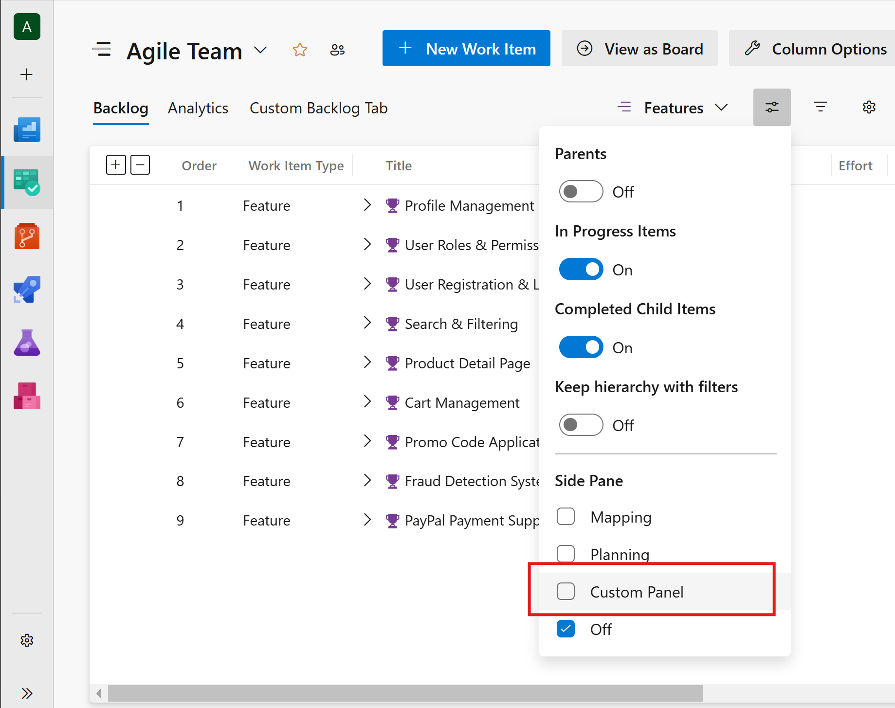
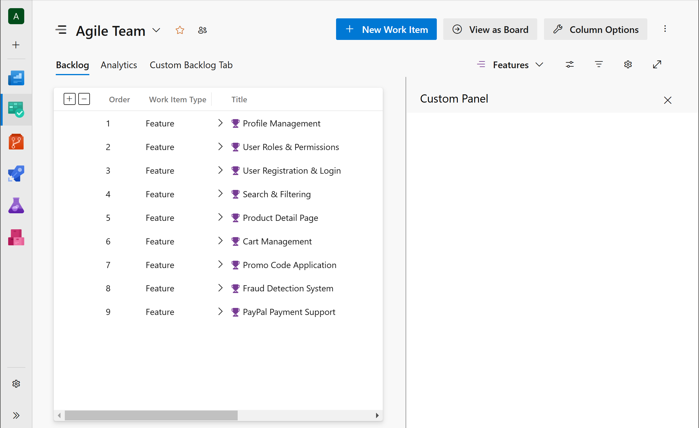

# Add panels on backlog pages

[!INCLUDE [version-eq-azure-devops](../../includes/version-eq-azure-devops.md)]

This article shows how to add a custom panel to the Portfolio backlog, Product backlog, and Iteration backlog pages.

[!INCLUDE [extension-docs-new-sdk](../../includes/extension-docs-new-sdk.md)]



The custom panel opens in the same space as the mapping panel.



Three backlog categories support panel extensions. The following contribution points apply to Agile, Scrum, and CMMI process templates. For custom templates, check your process to identify which backlogs use the requirement or portfolio category.

| Backlog category   | Contribution point |
|--------------------|--------------------|
| Portfolio (Epic, Feature) | ms.vss-work-web.portfolio-backlog-toolpane |
| Requirements (User Story, Product Backlog Item) | ms.vss-work-web.requirement-backlog-toolpane | 
| Sprint Backlog | ms.vss-work-web.iteration-backlog-toolpane |

For more information, see the [Azure DevOps Services Extension Sample](https://github.com/Microsoft/azure-devops-extension-sample).

## Update your extension manifest

Update your [extension manifest](manifest.md) file with the following code. This example adds a panel to all three backlog types.

```json
{
	"contributions": [
		{
			"id": "Fabrikam.HelloWorld.Backlogs.Panel",
			"type": "ms.vss-work-web.backlog-panel",
			"description": "Adds a 'Hello' panel to Product and Iteration backlog pages.",
			"targets": [
				"ms.vss-work-web.requirement-backlog-toolpane",
				"ms.vss-work-web.portfolio-backlog-toolpane",
				"ms.vss-work-web.iteration-backlog-toolpane"
			],
			"properties": {
				"title": "Hello Panel Pane",
				"name": "Hello Panel",
				"uri": "index.html",
				"registeredObjectId": "backlogPanelObject"
			}
		}
	],
	"scopes": [
		"vso.work"
	]
}
```

### Contribution

For each contribution in your extension, the manifest defines:

- The type of contribution, such as `backlog-panel`
- The contribution targets, such as the requirement, portfolio, and iteration backlog toolpanes
- The properties specific to each contribution type

The following table describes the panel-specific properties.

| Property | Description |
|---|---|
| `title` | Tooltip text that appears on the menu item. |
| `name` | Text that appears in the dropdown for panel selection. |
| `uri` | Path, relative to the extension's base URI, of the page to surface as the panel. |
| `registeredObjectId` | ID of the object registered for the panel. |

For more information about where you can add an extension, see [Extensibility points](../reference/targets/overview.md).

### Scopes

Include the [scopes](manifest.md#scopes) that your extension requires. This example uses `vso.work` to access work items.

## Get selection events

To get selection events about which work items are selected, implement this interface on your registered object.

```javascript
...
	IContributedPanel {
		workItemSelectionChanged: (selectedWorkItems) => void;
	}
...
```

## Next step

> [!div class="nextstepaction"]
> [Package, Publish, and Install](../publish/overview.md)
