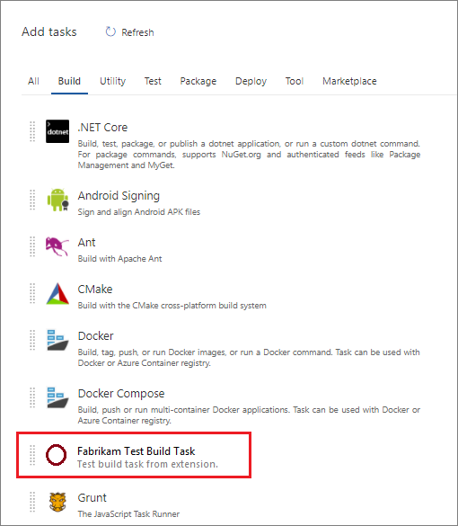

# Add a build or release task

Custom build or release tasks can be contributed by extensions that can be discovered and installed by users into an Azure DevOps Services organization. 
These tasks will appear next to Microsoft-provided tasks in the Add Step wizard:



To learn more about the new cross-platform build/release system, see [Team Foundation Build & Release](../..//pipelines/overview.md). 

> **Note:** This article covers agent tasks in agent-based extensions. For information on server tasks/server-based extensions, checkout the [Server Task GitHub Documentation](https://github.com/Microsoft/vsts-tasks/blob/master/docs/authoring/servertaskauthoring.md).

## Preparation and required setup for this tutorial
In order to create extensions for Azure DevOps Services, there are some prerequisite software and tools you'll need:

- A **Azure DevOps Services organization**, more information can be found [here](https://visualstudio.microsoft.com/en-us/products/visual-studio-team-services-vs.aspx)
- **A text editor**. For many of the tutorials we used `Visual Studio Code`, which can be downloaded [here](https://code.visualstudio.com/)
- The latest version of **node**, which can be downloaded [here](https://nodejs.org/en/download/)
<a name="cli" />
- **TFS Cross Platform Command Line Interface (tfx-cli)** to package your extensions.
    - **tfx-cli** can be installed using `npm`, a component of Node.js by running `npm i -g tfx-cli`
- A `home` directory for your project.
    - The `home` directory of a build or release task extension should look like the following:

```no-highlight
|--- README.md
|--- sdk    
	|--- node_modules           
	|--- scripts
		|--- VSS.SDK.js       
|--- images                        
	|--- extension-icon.png  
|--- buildAndReleaseTask
    |--- task.json                         
|--- scripts                        	// where your build or release task scripts should be placed
|--- vss-extension.json				// extension's manifest
```


## Steps
There are four steps to creating a build or release task extension and putting it on the Marketplace:
* [Step 1: Create the task metadata file](#createmetadata)
* [Step 2: Create the extension manifest file](#extensionmanifest)
* [Step 3: Package your extension](#packageext)
* [Step 4: Publish your extension](#publishext)
* [Optional: Install and test your extension](#installandtest)

<a name="createmetadata" />
## Step 1: Create the task metadata file

In your task folder (buildAndReleaseTask), create a `task.json` file. 
This file will describe the build or release task and is what the build/release system uses to render configuration options to the user and to know which scripts to execute at build/release time.
Below is a template that you can use to begin developing your build or release task extension:

### task.json template
```javascript
{
    "id": "{{taskguid}}",
    "name": "{{taskname}}",
    "friendlyName": "{{taskfriendlyname}}",
    "description": "{{taskdescription}}",
    "helpMarkDown": "",
    "category": "Utility",
    "visibility": [
        "Build",
        "Release"
    ],
    "author": "{{taskauthor}}",
    "version": {
        "Major": 0,
        "Minor": 1,
        "Patch": 0
    },
    "instanceNameFormat": "Echo $(samplestring)",
    "groups": [
        {
            "name": "advanced",
            "displayName": "Advanced",
            "isExpanded": false
        }
    ],
    "inputs": [
        {
            "name": "samplepathinput",
            "type": "filePath",
            "label": "Sample Path",
            "defaultValue": "",
            "required": true,
            "helpMarkDown": "A sample path which is relative to root of repo if empty"
        },
        {
            "name": "samplestring",
            "type": "string",
            "label": "Sample String",
            "defaultValue": "",
            "required": false,
            "helpMarkDown": "A sample string"
        },
        {
            "name": "samplebool",
            "type": "boolean",
            "label": "Sample Boolean",
            "defaultValue": "false",
            "required": false,
            "helpMarkDown": "If this is true, this task will fail if any errors are written to the StandardError stream.",
            "groupName": "advanced"
        }
    ],
    "execution": {
        "Node": {
            "target": "index.js"
        }
    }
}
```
<br>

> Remove either *Build* or *Release* from the **Visibility* attribute if you wish to exclude one.

**task.json components**<br>
Here is a description of some of the components of the `task.json` file.
| Property     | Description            |
|--------------|------------------------|
| `id`          | A unique guid for your task | 
| `name`         | Name with no spaces |
| `friendlyName`      | Descriptive name (spaces allowed) |
| `description` | Detailed description of what your task does |
| `author`          | Short string describing the entity developing the build or release task, e.g. "Microsoft Corporation" | 
| `instanceNameFormat`         | This is how the task will be displayed within the build or release step list - you can use variable values by using **$(variablename)** |
| `groups`      | Describes groups that task properties may be logically grouped by in the UI. |
| `inputs` | Inputs to be used when your build or release task runs |
| `execution` | Execution options for this task, including scripts |

>[!NOTE]
>For a more in-depth look into the task.json file, or to learn how to bundle multiple versions in your extension, check out the **[build/release task reference](./build-task-schema.md)**

You can explore the **[vso-agent-tasks](https://github.com/Microsoft/vso-agent-tasks/tree/master/Tasks)** repository on GitHub for multiple examples ([Grunt](https://github.com/Microsoft/vso-agent-tasks/blob/master/Tasks/GruntV0) is a good one).        

<a name="extensionmanifest" />
## Step 2: Create the extension manifest file
The extension manifest contains all of the information about your extension. It includes links to your files, including your task folders and images. This example is an extension manifest which contains the build or release task.

Copy the .json code below and save it as your `vss-extension.json` file:
[!code-javascript[JSON]](../_data/extension-build-tasks.json)]

>[!NOTE]
>The **publisher** here will need to be changed to your publisher name. If you would like to create a publisher now, you can jump down to
[create your publisher](#createpublisher) for instructions on how to do so.  

### Contributions
| Property     | Description            |
|--------------|------------------------|
| `id`          | Identifier of the contribution. Must be unique within the extension. Does not need to match the name of the build or release task, but typically the build or release task name is included in the ID of the contribution. | 
| `type`         | Type of the contribution. Should be **ms.vss-distributed-task.task**.
| `targets`      | Contributions "targeted" by this contribution. Should be **ms.vss-distributed-task.tasks**.
| `properties.name` | Name of the task. This must match the folder name of the corresponding self-contained build or release task pipeline. |

### Files
| Property     | Description            |
|--------------|------------------------|
| `path`          | Path of the file or folder relative to the `home` directory | 

>[!NOTE]
>For more information about the **extension manifest file**, such as its properties and what they do, check out the [extension manifest reference](./manifest.md).

<a name="packageext" />
## Step 3: Package your extension

Once you've written your extension, the next step towards getting it into the Marketplace is to package all of your files together. All extensions are packaged
as VSIX 2.0 compatible .vsix files - Microsoft provides a cross-platform command line interface (CLI) to package your extension. 

Packaging your extension into a .vsix file is effortless once you have the [tfx-cli](#cli), simply navigate to your extension's home directory and run the following command.

```no-highlight
tfx extension create --manifest-globs vss-extension.json
```
>[!NOTE]
>An extension/integration's version must be incremented on every update. <br>
>When updating an existing extension, either update the version in the manifest or pass the `--rev-version` command line switch. This will increment the *patch* version number of your extension and save the new version to your manifest.


After you have your packaged extension in a .vsix file, you're ready to publish your extension to the marketplace.

<a name="publishext" />
## Step 4: Publish your extension
<a name="createpublisher" />
### Create your publisher

All extensions, including those from Microsoft, are identified as being provided by a publisher.
If you aren't already a member of an existing publisher, you'll create one.

1. Sign in to the [Visual Studio Marketplace Publishing Portal](http://aka.ms/vsmarketplace-manage)
2. If you are not already a member of an existing publisher, you'll be prompted to create a publisher. If you're not prompted to create a publisher, scroll down to the bottom of the page and select <i>Publish Extensions</i> underneath <b>Related Sites</b>.
 * Specify an identifier for your publisher, for example: `mycompany-myteam`
    * This will be used as the value for the `publisher` attribute in your extensions' manifest file.
 * Specify a display name for your publisher, for example: `My Team`
3. Review the [Marketplace Publisher Agreement](http://aka.ms/vsmarketplace-agreement) and click **Create**

Now your publisher is defined. In a future release, you'll be able to grant permissions to view and manage your publisher's extensions.
This will make it easy (and more secure) for teams and organizations to publish extensions under a common publisher,
but without the need to share a set of credentials across a set of users.

### Upload your extension

After creating a publisher, you can now upload your extension to the marketplace.

1. Find the <b>Upload new extension</b> button, navigate to your packaged .vsix file, and select <i>upload</i>.

You can also upload your extension via the command line by using the ```tfx extension publish``` command instead of ```tfx extension create```
to package and publish your extension in one step.
You can optionally use ```--share-with``` to share your extension with one or more accounts after publishing.
You'll need a personal access token, too.

```no-highlight
tfx extension publish --manifest-globs your-manifest.json --share-with yourOrganization
```

### Share your extension

Now that you've uploaded your extension, it's in the Marketplace, but no one can see it. 
Share it with your organization so that you can install and test it.

1. Right click your extension and select <b>Share...</b>, and enter your organization information. You can share it with other accounts that you want to have access to your extension, too.

>[!IMPORTANT]
>Publishers must be verified in order to share extensions publicly, to learn more visit [Package/Publish/Install](../publish/overview.md)

Now that your extension is in the marketplace and shared, anyone who wants to use it will have to install it.

<a name="installandtest" />
## Optional: Install and test your extension
Installing an extension that is shared with you is simple and can be done in a few steps:

1. From your organization control panel (`https://dev.azure.com/{organization}/_admin`), go to the project collection administraton page.
2. In the Extensions tab, find your extension in the "Extensions Shared With Me" group, click on the extension link.
3. Install the extension!

If you can't see the Extensions tab, make sure you're in the control panel (the project collection level administration page - `https://dev.azure.com/{organization}/_admin`) and not the administration page for a project.

If you're on the control panel, and you don't see the <b>Extensions</b> tab, extensions may not be enabled for your organization. You can get early access to the extensions feature by joining the Visual Studio Partner Program.

## Helpful links
* [Extension Manifest Reference](./manifest.md)
* [Build/Release Task JSON Schema](./build-task-schema.md)
* [Build/Release Task Examples](https://github.com/Microsoft/vso-agent-tasks/tree/master/Tasks)

>[!NOTE]
>Check out our **[Node task sample in GitHub](https://github.com/Microsoft/vsts-task-lib/blob/master/node/docs/stepbystep.md)** for a tutorial that
>shows how to create, debug, and test a cross platform task in Node using the TypeScript API.

