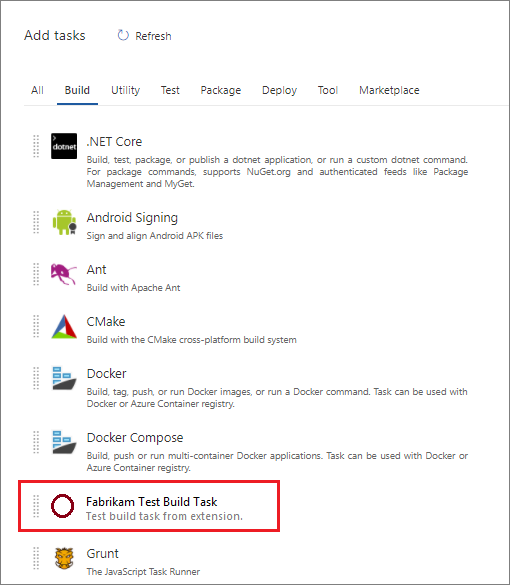

# Add a build or release task

In this article, learn how to install extensions to your organization for custom build or release tasks in Azure DevOps. 
These tasks appear next to Microsoft-provided tasks in the Add Step wizard.



To learn more about the new cross-platform build/release system, see [Team Foundation Build & Release](../..//pipelines/overview.md). 

> [!NOTE]
> This article covers agent tasks in agent-based extensions. For information on server tasks/server-based extensions, check out the [Server Task GitHub Documentation](https://github.com/Microsoft/azure-pipelines-tasks/blob/master/docs/authoring/servertaskauthoring.md).

## Prerequisites

To create extensions for Azure DevOps, you need the following software and tools:

- An organization in Azure DevOps. For more information, see [Create an organization](../../organizations/accounts/create-organization.md).
- A text editor. For many of the tutorials, we used **Visual Studio Code**, which provides intellisense and debugging support and can be downloaded [here](https://code.visualstudio.com/).
- The latest version of node, which can be downloaded [here](https://nodejs.org/en/download/).

  The production Environment only uses [Node10](http://blog.majcica.com/2018/12/04/node10-provider-available-for-agent-v2-144-0/) or Node6 (by using the `"Node"` in the `"execution"` object instead of `Node10`). 
- Typescript Compiler 2.2.0 or greater, which can be downloaded [here](https://www.npmjs.com/package/typescript)
    <a name="cli" />
- TFS Cross Platform Command Line Interface (tfx-cli) to package your extensions.
    - **tfx-cli** can be installed using `npm`, a component of Node.js by running `npm i -g tfx-cli`
- A `home` directory for your project.
    - The `home` directory of a build or release task extension should look like the following example after you complete the steps in this tutorial:

```
|--- README.md    
|--- images                        
    |--- extension-icon.png  
|--- buildAndReleaseTask            // where your task scripts are placed
|--- vss-extension.json             // extension's manifest
```

### Develop in Unix versus Windows

This walk through was done on Windows with PowerShell. We attempted to make it generic for all platforms, but the syntax for getting environment variables is different.

If using a Mac or Linux, replace any instances of ```$env:<var>=<val>``` with ```export <var>=<val>```

## Process 
Below are the steps to create a build or release task extension and put it on the Marketplace:
* [Step 1: Create a custom task](#createtask)
* [Step 2: Unit test the task scripts](#testscripts)
* [Step 3: Create the extension manifest file](#extensionmanifest)
* [Step 4: Package your extension](#packageext)
* [Step 5: Publish your extension](#publishext)
* [Step 6: Create Build and Release Pipeline to Publish Extension to Marketplace](#createbuildrelease)
* [Optional: Install and test your extension](#installandtest)

<a name="createtask" />

## Step 1: Create a custom task

Set up your task. Every part of Step 1 should be done within the `buildAndReleaseTask` folder.

### Create task scaffolding

Create the folder structure for the task and install the required libraries and dependencies.

#### Create a directory and package.json file

From within your `buildAndReleaseTask` folder, run:

```
npm init
```

```npm init``` creates the ```package.json``` file. You can accept all of the default ```npm init``` options.

> [!TIP]
> The agent doesn't automatically install the required modules, as it's expecting your task folder to include the node modules. To mitigate this, copy the ```node_modules``` to ```buildAndReleaseTask```. As your task gets bigger, it's easy to exceed the size limit (50MB) of a vsix file. Before you copy the node folder, you may want to run ```npm install --production```, or ```npm prune --production```, or you can write a script to build and pack everything.

#### Add azure-pipelines-task-lib

We provide a library, _azure-pipelines-task-lib_, that should be used to create tasks. Add it to your library:

```
npm install azure-pipelines-task-lib --save
```

#### Add typings for external dependencies

Ensure that TypeScript typings are installed for external dependencies.

```
npm install @types/node --save-dev
npm install @types/q --save-dev
```

Create a ```.gitignore``` file and add node_modules to it. Your build process should do an ```npm install``` and ```typings install```
so node_modules are built each time and don't need to be checked in.

```
echo node_modules > .gitignore
```

#### Create tsconfig.json compiler options

This file ensures that our TypeScript files are compiled to JavaScript files.

```
tsc --init
```

For example, we want to compile to the ES6 standard instead of ES5.
To ensure the ES6 standard happens, open the newly generated ```tsconfig.json``` and update the ```target``` field to "es6".

>[!NOTE]
>To have the command run successfully, make sure that TypeScript is installed globally with npm on your local machine.

### Task implementation

Now that the scaffolding is complete, we can start to create our custom task.

#### task.json

Next, we create a ```task.json``` file in the ``buildAndReleaseTask`` folder. The ```task.json``` file describes the build or release task and is what the build/release system uses to render configuration options to the user and to know which scripts to execute at build/release time.

Copy the code below and replace the ```{{placeholders}}``` with your tasks information. The most important placeholder is the ```taskguid```, which must be unique and can be generated [here](https://www.guidgen.com/).

```json
{
    "$schema": "https://raw.githubusercontent.com/Microsoft/azure-pipelines-task-lib/master/tasks.schema.json",
    "id": "{{taskguid}}",
    "name": "{{taskname}}",
    "friendlyName": "{{taskfriendlyname}}",
    "description": "{{taskdescription}}",
    "helpMarkDown": "",
    "category": "Utility",
    "author": "{{taskauthor}}",
    "version": {
        "Major": 0,
        "Minor": 1,
        "Patch": 0
    },
    "instanceNameFormat": "Echo $(samplestring)",
    "inputs": [
        {
            "name": "samplestring",
            "type": "string",
            "label": "Sample String",
            "defaultValue": "",
            "required": true,
            "helpMarkDown": "A sample string"
        }
    ],
    "execution": {
        "Node10": {
            "target": "index.js"
        }
    }
}
```

**task.json components**<br>
Here is a description of some of the components of the `task.json` file:

| Property              | Description            |
|-----------------------|------------------------|
| `id`                  | A unique guid for your task | 
| `name`                | Name with no spaces |
| `friendlyName`        | Descriptive name (spaces allowed) |
| `description`         | Detailed description of what your task does |
| `author`              | Short string describing the entity developing the build or release task, for example: "Microsoft Corporation" | 
| `instanceNameFormat`  | How the task is displayed within the build or release step list - you can use variable values by using **$(variablename)** |
| `groups`              | Describes groups that task properties may be logically grouped by in the UI. |
| `inputs`              | Inputs to be used when your build or release task runs. This task expects an input with the name "samplestring" |
| `execution`           | Execution options for this task, including scripts |

>[!NOTE]
>For a more in-depth look into the task.json file, or to learn how to bundle multiple versions in your extension, check out the **[build/release task reference](./integrate-build-task.md)**.

#### index.ts

Create an ```index.ts``` file using the following code as a reference. This code runs when the task is called.

```typescript
import tl = require('azure-pipelines-task-lib/task');

async function run() {
    try {
        const inputString: string | undefined = tl.getInput('samplestring', true);
        if (inputString == 'bad') {
            tl.setResult(tl.TaskResult.Failed, 'Bad input was given');
            return;
        }
        console.log('Hello', inputString);
    }
    catch (err) {
        tl.setResult(tl.TaskResult.Failed, err.message);
    }
}

run();
```

### Compile

Enter "tsc" from the buildAndReleaseTask folder to compile an ```index.js``` file from ```index.ts```.

### Run the task

The task can be run with ```node index.js``` from PowerShell—that is exactly what an agent does.

```
node index.js
##vso[task.debug]agent.workFolder=undefined
##vso[task.debug]loading inputs and endpoints
##vso[task.debug]loaded 0
##vso[task.debug]task result: Failed
##vso[task.issue type=error;]Input required: samplestring
##vso[task.complete result=Failed;]Input required: samplestring
```

**The task failed!** That's exactly what would happen if the task ran and inputs weren't supplied (```samplestring``` is a required input).

As a fix, we can set the ```samplestring``` input and run again:

```
$env:INPUT_SAMPLESTRING="Human"
node index.js
##vso[task.debug]agent.workFolder=undefined
##vso[task.debug]loading inputs and endpoints
##vso[task.debug]loading INPUT_SAMPLESTRING
##vso[task.debug]loaded 1
##vso[task.debug]Agent.ProxyUrl=undefined
##vso[task.debug]Agent.CAInfo=undefined
##vso[task.debug]Agent.ClientCert=undefined
##vso[task.debug]Agent.SkipCertValidation=undefined
##vso[task.debug]samplestring=Human
Hello Human
```

This time the task succeeded since ```samplestring``` was supplied, and it correctly outputted "Hello Human"!

<a name="testscripts" />

## Step 2: Unit test your task scripts

The goal of unit testing is to quickly test the task script, not the external tools it's calling. We want to test all aspects
of both success and failure paths.

### Install test tools

We use [Mocha](https://mochajs.org/) as the test driver in this walk through.

```
npm install mocha --save-dev -g
npm install sync-request --save-dev
npm install @types/mocha --save-dev
```

### Create test suite

Create a ```tests``` folder containing a ```_suite.ts``` file with the following contents:

```typescript
import * as path from 'path';
import * as assert from 'assert';
import * as ttm from 'azure-pipelines-task-lib/mock-test';

describe('Sample task tests', function () {

    before( function() {

    });

    after(() => {

    });

    it('should succeed with simple inputs', function(done: MochaDone) {
        // Add success test here
    });

    it('it should fail if tool returns 1', function(done: MochaDone) {
        // Add failure test here
    });    
});
```

> [!TIP]
> Your test folder should be located in the buildAndReleaseTask folder. If you get a sync-request error, you can work around it by installing sync-request from inside of the buildAndReleaseTask folder with the following command.
>  `npm i --save-dev sync-request`

### Create success test

The success test validates that when the tool has the appropriate inputs, it succeeds with no errors
or warnings and returns the correct output.

Create a file containing our task mock runner. This file creation simulates running the task and mocks all calls to outside methods.

Create a ```success.ts``` file in your test directory with the following contents:

```typescript
import ma = require('azure-pipelines-task-lib/mock-answer');
import tmrm = require('azure-pipelines-task-lib/mock-run');
import path = require('path');

let taskPath = path.join(__dirname, '..', 'index.js');
let tmr: tmrm.TaskMockRunner = new tmrm.TaskMockRunner(taskPath);

tmr.setInput('samplestring', 'human');

tmr.run();
```

Next, add the following example success test to your ```_suite.ts``` file to run the task mock runner:

```typescript
it('should succeed with simple inputs', function(done: MochaDone) {
    this.timeout(1000);

    let tp = path.join(__dirname, 'success.js');
    let tr: ttm.MockTestRunner = new ttm.MockTestRunner(tp);

    tr.run();
    console.log(tr.succeeded);
    assert.equal(tr.succeeded, true, 'should have succeeded');
    assert.equal(tr.warningIssues.length, 0, "should have no warnings");
    assert.equal(tr.errorIssues.length, 0, "should have no errors");
    console.log(tr.stdout);
    assert.equal(tr.stdout.indexOf('Hello human') >= 0, true, "should display Hello human");
    done();
});
```

### Create failure test

The failure test validates that when the tool gets bad or incomplete input, it fails in the expected way with helpful output.

First, we create our task mock runner. To do so, create a ```failure.ts``` file in your test directory with the following contents:

```typescript
import ma = require('azure-pipelines-task-lib/mock-answer');
import tmrm = require('azure-pipelines-task-lib/mock-run');
import path = require('path');

let taskPath = path.join(__dirname, '..', 'index.js');
let tmr: tmrm.TaskMockRunner = new tmrm.TaskMockRunner(taskPath);

tmr.setInput('samplestring', 'bad');

tmr.run();
```

Next, add the following to your ```_suite.ts``` file to run the task mock runner:

```typescript
it('it should fail if tool returns 1', function(done: MochaDone) {
    this.timeout(1000);

    let tp = path.join(__dirname, 'failure.js');
    let tr: ttm.MockTestRunner = new ttm.MockTestRunner(tp);

    tr.run();
    console.log(tr.succeeded);
    assert.equal(tr.succeeded, false, 'should have failed');
    assert.equal(tr.warningIssues, 0, "should have no warnings");
    assert.equal(tr.errorIssues.length, 1, "should have 1 error issue");
    assert.equal(tr.errorIssues[0], 'Bad input was given', 'error issue output');
    assert.equal(tr.stdout.indexOf('Hello bad'), -1, "Should not display Hello bad");

    done();
});
```

### Run the tests

To run the tests, run the following commands:

```
tsc
mocha tests/_suite.js
```

Both tests should pass. If you want to run the tests with more verbose output (what you would see in the build console), set the environment variable: ```TASK_TEST_TRACE=1```:

```
$env:TASK_TEST_TRACE=1
```

<a name="extensionmanifest" />

## Step 3: Create the extension manifest file
The extension manifest contains all of the information about your extension. It includes links to your files, including your task folders and images folders. Ensure you've created an images folder with extension-icon.png. The following example is an extension manifest that contains the build or release task.

Copy the .json code below and save it as your `vss-extension.json` file in your `home` directory. Don't create this file in the BuildAndReleaseTask folder.

[!code-javascript[JSON](../_data/extension-build-tasks.json)]

>[!NOTE]
>The **publisher** here must be changed to your publisher name. If you would like to create a publisher now, go to
[create your publisher](#createpublisher) for instructions.

### Contributions

| Property     | Description            |
|--------------|------------------------|
| `id`          | Identifier of the contribution. Must be unique within the extension. Doesn't need to match the name of the build or release task. Typically the build or release task name is  in the ID of the contribution. | 
| `type`         | Type of the contribution. Should be **ms.vss-distributed-task.task**.
| `targets`      | Contributions "targeted" by this contribution. Should be **ms.vss-distributed-task.tasks**.
| `properties.name` | Name of the task. This name must match the folder name of the corresponding self-contained build or release task pipeline. |

### Files

| Property     | Description            |
|--------------|------------------------|
| `path`          | Path of the file or folder relative to the `home` directory | 

>[!NOTE]
>For more information about the **extension manifest file**, such as its properties and what they do, check out the [extension manifest reference](./manifest.md).

<a name="packageext" />

## Step 4: Package your extension

Once you've written your extension, the next step towards getting it into the Marketplace is to package all of your files together. All extensions are packaged
as VSIX 2.0 compatible .vsix files - Microsoft provides a cross-platform command-line interface (CLI) to package your extension. 

Packaging your extension into a .vsix file is effortless once you have the [tfx-cli](#cli), navigate to your extension's home directory, and run the following command.

```no-highlight
tfx extension create --manifest-globs vss-extension.json
```

> [!NOTE] 
> An extension or integration's version must be incremented on every update. <br> 
> When you're updating an existing extension, either update the version in the manifest or pass the `--rev-version` command line switch. This  increments the *patch* version number of your extension and saves the new version to your manifest.
> You must rev both the task version and extension version for an update to occur. `tfx extension create --manifest-globs vss-extension.json --rev-version` only updates the extension version and not the task version. For more information, see [Build Task in GitHub](https://github.com/microsoft/tfs-cli/blob/master/docs/buildtasks.md).

After you have your packaged extension in a .vsix file, you're ready to publish your extension to the Marketplace.

<a name="publishext" />

## Step 5: Publish your extension

<a name="createpublisher" />

### Create your publisher

All extensions, including extensions from Microsoft, are identified as being provided by a publisher.
If you aren't already a member of an existing publisher, you'll create one.

1. Sign in to the [Visual Studio Marketplace Publishing Portal](https://marketplace.visualstudio.com/manage)
2. If you aren't already a member of an existing publisher, you're prompted to create a publisher. If you're not prompted to create a publisher, scroll down to the bottom of the page and select <i>Publish Extensions</i> underneath <b>Related Sites</b>.
   * Specify an identifier for your publisher, for example: `mycompany-myteam`
     * This identifier is used as the value for the `publisher` attribute in your extensions' manifest file.
   * Specify a display name for your publisher, for example: `My Team`
3. Review the [Marketplace Publisher Agreement](https://aka.ms/vsmarketplace-agreement) and select **Create**

Your publisher is defined. In a future release, you can grant permissions to view and manage your publisher's extensions.
It's easier and more secure to publish extensions under a common publisher,
without the need to share a set of credentials across users.

### Upload your extension

After creating a publisher, you can upload your extension to the Marketplace.

1. Find the <b>Upload new extension</b> button, navigate to your packaged .vsix file, and select <i>upload</i>.

You can also upload your extension via the command line by using the ```tfx extension publish``` command instead of ```tfx extension create```
to package and publish your extension in one step.
You can optionally use ```--share-with``` to share your extension with one or more accounts after publishing.
You'll need a personal access token, too. For more information, see [Acquire a personal access token](../publish/command-line.md#acquire-a-personal-access-token).

```no-highlight
tfx extension publish --manifest-globs your-manifest.json --share-with yourOrganization
```

### Share your extension

Now that you've uploaded your extension, it's in the Marketplace, but no one can see it. 
Share it with your organization so that you can install and test it.

1. Right select your extension and select <b>Share...</b>, and enter your organization information. You can share it with other accounts that you want to have access to your extension, too.

>[!IMPORTANT]
>Publishers must be verified in order to share extensions publicly, to learn more visit [Package/Publish/Install](../publish/overview.md)

Now that your extension is in the Marketplace and shared, anyone who wants to use it must install it.

<a name="createbuildrelease" />

## Step 6: Create Build and Release Pipeline to Publish Extension to Marketplace

Lets create a build and release pipeline on Azure DevOps to help maintain the custom task on the marketplace.

### Prerequisites

1. A project on your organization. For help creating a project, visit [Create a project](https://docs.microsoft.com/en-us/azure/devops/organizations/projects/create-project?view=azure-devops&tabs=preview-page).
2. You will need the [Azure DevOps Extension Tasks](https://marketplace.visualstudio.com/items?itemName=ms-devlabs.vsts-developer-tools-build-tasks&targetId=85fb3d5a-9f21-420f-8de3-fc80bf29054b&utm_source=vstsproduct&utm_medium=ExtHubManageList) package installed on your organization.

To begin, create a new pipeline with the below yaml. Learn more on how to [Create your first pipeline](https://docs.microsoft.com/en-us/azure/devops/pipelines/create-first-pipeline?view=azure-devops&tabs=javascript%2Cyaml%2Cbrowser%2Ctfs-2018-2) and [YAML schema](https://docs.microsoft.com/en-us/azure/devops/pipelines/yaml-schema?view=azure-devops&tabs=schema%2Cparameter-schema).

You will also need a pipeline library variable group to hold the variables used by this pipeline. For more information on creating one of these, visit [Add and use variable groups](https://docs.microsoft.com/en-us/azure/devops/pipelines/library/variable-groups?view=azure-devops&tabs=classic). Keep in mind that variable groups can be made from the Azure DevOps Library tab or through the CLI. Once a variable group is made, use any variables within that group in your pipeline. For help linking the variable group, visit [Use a variable group](https://docs.microsoft.com/en-us/azure/devops/pipelines/library/variable-groups?view=azure-devops&tabs=yaml#use-a-variable-group).

The variables that need to be declared in the variable group for the below pipeline example are:
- PublisherID: ID of your marketplace publisher
- ExtensionID: ID of your extension, as declared in the vss-extension.json file
- ExtensionName: Name of your extension, as declared in the vss-extension.json file
- ArtifactName: Name of the artifact being created for the VSIX file

Lastly, you will need to create a Visual Studio Marketplace service connection. Make sure to grant access permissions for all pipleines. For more information on creating a service connection, visit [Service connections](https://docs.microsoft.com/en-us/azure/devops/pipelines/library/service-endpoints?view=azure-devops&tabs=yaml).

 

Example pipeline:

``` YAML
trigger: 
- master

pool:
  vmImage: "ubuntu-latest"

variables:
  - group: variable-group

stages:
  - stage: Unit_Tests
    jobs:
      - job:
        steps:
          - task: TfxInstaller@2
            inputs:
              version: "v0.7.x"
          - task: Npm@1
            inputs:
              command: 'install'
              workingDir: '/TaskDirectory'
          - task: Bash@3
            displayName: Compile Javascript
            inputs:
              targetType: "inline"
              script: |
                cd TaskDirectory
                tsc
          - task: Npm@1
            inputs:
              command: 'custom'
              workingDir: '/TestsDirectory'
              customCommand: 'testScript'
          - task: PublishTestResults@2
            inputs:
              testResultsFormat: 'JUnit'
              testResultsFiles: '**/ResultsFile.xml'
  - stage: Build_Manifest_File
    jobs:
      - job:
        steps:
          - task: TfxInstaller@2
            inputs:
              version: "v0.7.x"
          - task: Npm@1
            inputs:
              command: 'install'
              workingDir: '/TaskDirectory'
          - task: Bash@3
            displayName: Compile Javascript
            inputs:
              targetType: "inline"
              script: |
                cd TaskDirectory
                tsc
          - task: QueryAzureDevOpsExtensionVersion@3
            inputs:
              connectTo: 'VsTeam'
              connectedServiceName: 'ServiceConnection'
              publisherId: '$(PublisherID)'
              extensionId: '$(ExtensionID)'
              versionAction: 'Patch'
              outputVariable: 'Task.Extension.Version'
          - task: PackageAzureDevOpsExtension@3
            inputs:
              rootFolder: '$(System.DefaultWorkingDirectory)'
              publisherId: '$(PublisherID)'
              extensionId: '$(ExtensionID)'
              extensionName: '$(ExtensionName)'
              extensionVersion: '$(Task.Extension.Version)'
              updateTasksVersion: true
              updateTasksVersionType: 'patch'
              extensionVisibility: 'private'
              extensionPricing: 'free'
          - task: CopyFiles@2
            displayName: "Copy Files to: $(Build.ArtifactStagingDirectory)"
            inputs:
              Contents: "**/*.vsix"
              TargetFolder: "$(Build.ArtifactStagingDirectory)"
          - task: PublishBuildArtifacts@1
            inputs:
              PathtoPublish: '$(Build.ArtifactStagingDirectory)'
              ArtifactName: '$(ArtifactName)'
              publishLocation: 'Container'
  - stage: Publish_Extension
    jobs:
      - job:
        steps:
          - task: TfxInstaller@2
            inputs:
              version: "v0.7.x"
          - task: DownloadBuildArtifacts@0
            inputs:
              buildType: "current"
              downloadType: "single"
              artifactName: "$(ArtifactName)"
              downloadPath: "$(System.DefaultWorkingDirectory)"
          - task: PublishAzureDevOpsExtension@3
            inputs:
              connectTo: 'VsTeam'
              connectedServiceName: 'ServiceConnection'
              fileType: 'vsix'
              vsixFile: '/Publisher.*.vsix'
              publisherId: '$(PublisherID)'
              extensionId: '$(ExtensionID)'
              extensionName: '$(ExtensionName)'
              updateTasksVersion: false
              extensionVisibility: 'private'
              extensionPricing: 'free'
```

For more help with triggers, such as CI and PR triggers, visit [Specify events that trigger pipelines](https://docs.microsoft.com/en-us/azure/devops/pipelines/build/triggers?view=azure-devops).

> [!NOTE] Each job uses a new user agent. This means that when a new job starts, anything installed on the previous jobs agent is gone. This
> includes dependencies, pipeline generated files, and compiled files.

### Pipeline Stages

#### Running and Publishing Unit Tests

- To run unit tests, add a custom script to the package.json file, similar to:
``` JSON
"scripts": {
    "testScript": "mocha ./TestFile --reporter xunit --reporter-option output=ResultsFile.xml"
},
```
- The first task to add is the 'Use Node CLI for Azure DevOps (tfx-cli)'. This will install the tfx-cli onto your build agent. This is installed to ensure that some of the later tasks don't run into any deprecation issues. Use all base inputs.
- Add the 'npm' task. Make sure to use the install command, and to target the folder with the package.json file. <br/>Inputs:
    - Command: install
    - Working folder that contains package.json: /TaskDirectory
- Next add the 'Bash' task. This will be used to compile the Typescript into Javascript. <br/>Inputs:
    - Type: inline
    - Script: Should look something like:
    ```
    cd 'TaskDirectory'
    tsc
    ```
- This will require the 'npm' task again. Make sure to select 'custom' command, target the folder that contains the unit tests, and input testScript as the command. <br/>Inputs:
    - Command: custom
    - Working folder that contains package.json: /TestsDirectory
    - Command and arguments: testScript
- Next add the 'Publish Test Results' task. Ensure that the result format is 'JUnit' and not 'XUnit', if using the Mocha XUnit reporter. Also set the search folder to the root directory. <br/>Inputs:
    - Test result format: JUnit
    - Test results files: **/ResultsFile.xml
    - Search folder: $(System.DefaultWorkingDirectory)

Once the test results have been published, the output under the tests tab should look like this:


#### Packaging Extension and Publishing Build Artifacts

- The first task to add is the 'Use Node CLI for Azure DevOps (tfx-cli)'. This will install the tfx-cli onto your build agent. This is installed to ensure that some of the later tasks don't run into any deprecation issues. Use all base inputs.
- Add the 'npm' task. Make sure to use the install command, and to target the folder with the package.json file. <br/>Inputs:
    - Command: install
    - Working folder that contains package.json: /TaskDirectory
- Next add the 'Bash' task. This will be used to compile the Typescript into Javascript. <br/>Inputs:
    - Type: inline
    - Script: Should look something like:
    ```
    cd 'TaskDirectory'
    tsc
    ```
- The first task for publishing the extension is the 'Query Extension Version' task. <br/>Inputs:
    - Connect to: Visual Studio Marketplace
    - Visual Studio Marketplace (Service connection): ServiceConnection
    - Publisher ID: ID of your Visual Studio Marketplace publisher
    - Extension ID: ID of your extension in the vss-extension.json file
    - Increase version: Patch
    - Output Variable: Task.Extension.Version
- The next task is the 'Package Extension' task. <br/>Inputs:
    - Root manifests folder: $(System.DefualtWorkingDirectory) _this is the root directory_
    - Manifest file(s): vss-extension.json 
    - Publisher ID: ID of your Visual Studio Marketplace publisher
    - Extension ID: ID of your extension in the vss-extension.json file
    - Extension Name: Name of your extension in the vss-extension.json file
    - Extension Version: $(Task.Extension.Version)
    - Override tasks version: checked (true)
    - Override Type: Replace Only Patch (1.0.r)
    - Extension Visibility: If the extension is still in development, this should be set to private. This way only you and those your share the extension with can see it on the marketplace. If are releasing the extension to the public, this should be set to public.
- This task makes it easier to locate and publish multiple files. This is the 'Copy files' task. <br/>Inputs:
    - Contents: All of the files that need to be copied in order to publish them into an artifact.
    - Target folder: The folder that the files will all be copied to. A good choice for this would be the                                 $(Build.ArtifactStagingDirectory).
- The task for publishing the artifacts is 'Publish build artifacts'. This will publish the artifacts for use in other jobs, or pipelines. <br/>Inputs:
    - Path to publish: The path to the folder that contains the files that are being published. For example the                           $(Build.ArtifactStagingDirectory).
    - Artifact name: The name given to the artifact.
    - Arifact publish location: Pick 'Azure Pipelines' to use the artifact in future jobs.

#### Downloading Build Artifacts and Publishing the Extension

- The first task to add is the 'Use Node CLI for Azure DevOps (tfx-cli)'. This will install the tfx-cli onto your build agent. This is installed to ensure that some of the later tasks don't run into any deprecation issues. Use all base inputs.
- To download the artifacts onto a new job, use the 'Download build artifacts' task. <br/>Inputs:
    - Download artifacts produced by: If downloading the artifact on a new job from the same pipeline, pick 'Current build', if downloading on a new pipeline, pick 'Specific build'.
    - Download type: Choose 'Specific artifact' to download all files that were published.
    - Artifact name: The published artifact's name
    - Destination directory: The folder where the files should be downloaded.
- The last task needed is the 'Publish Extension' task. <br/>Inputs:
    - Connect to: Visual Studio Marketplace
    - Visual Studio Marketplace connection: ServiceConnection
    - Input file type: VSIX file
    - VSIX file: /Publisher.*.vsix
    - Publisher ID: ID of your Visual Studio Marketplace publisher
    - Extension ID: ID of your extension in the vss-extension.json file
    - Extension Name: Name of your extension in the vss-extension.json file
    - Extension visibility: Either private or public.

<a name="installandtest" />

## Optional: Install and test your extension

Installing an extension that is shared with you is simple and can be done in a few steps:

1. From your organization control panel (`https://dev.azure.com/{organization}/_admin`), go to the project collection administration page.
2. In the Extensions tab, find your extension in the "Extensions Shared With Me" group, selection the extension link.
3. Install the extension.

If you can't see the Extensions tab, make sure you're in the control panel (the project collection level administration page - `https://dev.azure.com/{organization}/_admin`) and not the administration page for a project.

If you don't see the **Extensions** tab on the control panel, then extensions aren't enabled for your organization. You can get early access to the extensions feature by joining the Visual Studio Partner Program.

For build and release tasks to package and publish Azure DevOps Extensions to the Visual Studio Marketplace, you can download [Azure DevOps Extension Tasks](https://marketplace.visualstudio.com/items?itemName=ms-devlabs.vsts-developer-tools-build-tasks).

## Helpful links
* [Extension Manifest Reference](./manifest.md)
* [Build/Release Task JSON Schema](./integrate-build-task.md)
* [Build/Release Task Examples](https://github.com/Microsoft/vso-agent-tasks/tree/master/Tasks)
