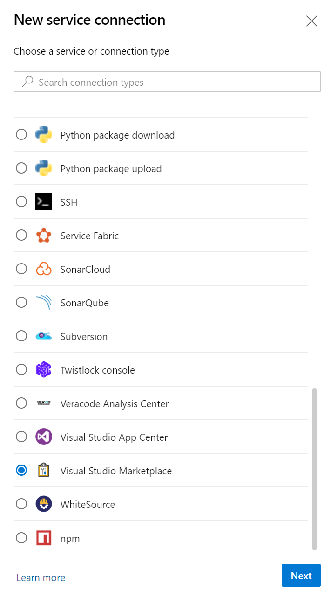
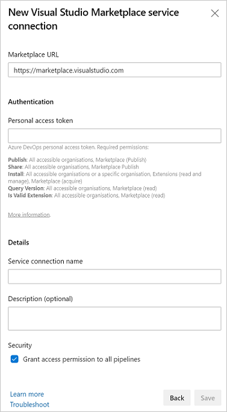
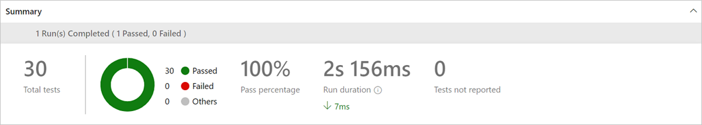

# Add a custom pipelines task extension

[!INCLUDE [version-lt-eq-azure-devops](../../includes/version-lt-eq-azure-devops.md)]

Learn how to install extensions to your organization for custom build or release tasks in Azure DevOps.

For more information about the new cross-platform build/release system, see [What is Azure Pipelines?](../../pipelines/get-started/what-is-azure-pipelines.md).

> [!NOTE]
> This article covers agent tasks in agent-based extensions. For information on server tasks/server-based extensions, check out the [Server Task GitHub Documentation](https://github.com/Microsoft/azure-pipelines-tasks/blob/master/docs/authoring/servertaskauthoring.md).

## Prerequisites

To create extensions for Azure DevOps, you need the following software and tools.

- An organization in Azure DevOps. For more information, see [Create an organization](../../organizations/accounts/create-organization.md).
- A text editor. For many of the tutorials, we use **Visual Studio Code**, which provides intellisense and debugging support. Go to [code.visualstudio.com](https://code.visualstudio.com/) to download the latest version.
- The [latest version](https://nodejs.org/en/download/) of Node.js.
- TypeScript Compiler 2.2.0 or greater, although we recommend version 4.0.2 or newer. Go to [npmjs.com](https://www.npmjs.com/package/typescript) to download the compiler.
    <a name="cli"></a>
- [Cross-platform CLI for Azure DevOps](https://github.com/microsoft/tfs-cli) to package your extensions.
     You can install **tfx-cli** by using `npm`, a component of Node.js, by running `npm i -g tfx-cli`.
- A `home` directory for your project.
  The `home` directory of a build or release task extension should look like the following example after you complete the steps in this tutorial:

  ```
  |--- README.md    
  |--- images                        
      |--- extension-icon.png  
  |--- buildandreleasetask            // where your task scripts are placed
  |--- vss-extension.json             // extension's manifest
  ```

- The [azure-devops-extension-sdk package installation](https://github.com/Microsoft/azure-devops-extension-sdk).

> [!IMPORTANT]
> The dev machine needs to run the [latest version of Node](https://nodejs.org/en/download/) to ensure that the written code is compatible with the production environment on the agent and the latest non-preview version of azure-pipelines-task-lib.

<a name="createtask"></a>

## 1. Create a custom task

Do every part of the steps withing this procedure in the `buildandreleasetask` folder.

> [!NOTE]
> This example walk-through is on Windows with PowerShell. We made it generic for all platforms, but the syntax for getting environment variables is different. If you're using a Mac or Linux, replace any instances of `$env:<var>=<val>` with `export <var>=<val>`.

### Create task scaffolding

1. Create the folder structure for the task and install the required libraries and dependencies.
2. Open a PowerShell command window, go to your `buildandreleasetask` folder, and run the following command.

   ```
   npm init --yes
   ```

   `npm init` creates the `package.json` file. We added the `--yes` parameter to accept all of the default `npm init` options.

   > [!TIP]
   > The agent doesn't automatically install the required modules because it's expecting your task folder to include the node modules. To mitigate this, copy the `node_modules` to `buildandreleasetask`. As your task gets bigger, it's easy to exceed the size limit (50MB) of a VSIX file. Before you copy the node folder, you may want to run `npm install --production` or `npm prune --production`, or you can write a script to build and pack everything.

3. Add `azure-pipelines-task-lib` to your library.

   ```
   npm install azure-pipelines-task-lib --save
   ```

4. Ensure that TypeScript typings are installed for external dependencies.

   ```
   npm install @types/node --save-dev
   npm install @types/q --save-dev
   ```

5. Create a `.gitignore` file and add node_modules to it. Your build process should do an `npm install` and a `typings install` so that node_modules are built each time and don't need to be checked in.

   ```
   echo node_modules > .gitignore
   ```

6. Install [Mocha](https://mochajs.org/) as a development dependency.

   ```
   npm install mocha --save-dev -g
   npm install sync-request --save-dev
   npm install @types/mocha --save-dev
   ```

7. Choose TypeScript version 2.3.4 or 4.6.3. 

   ```
   npm install typescript@4.6.3 -g --save-dev
   ```

   > [!NOTE]
   > To have the `tsc` command available, make sure that TypeScript is installed globally with npm in your development environment. If you skip this step, TypeScript version 2.3.4 gets used by default, and you still have to install the package globally to have the `tsc` command available.

8. Create `tsconfig.json` compiler options. This file ensures that your TypeScript files are compiled to JavaScript files.

   ```
   tsc --init --target es6
   ```

   To ensure the ES6 (rather than ES5) standard is used, we added the `--target es6` parameter.

### Create custom task

Now that the scaffolding is complete, we can create our custom task.

1. Create a `task.json` file in the `buildandreleasetask` folder. The `task.json` file describes the build/release task and is what the build/release system uses to render configuration options to the user and to know which scripts to execute at build/release time.

2. Copy the following code and replace the `{{placeholders}}` with your task's information. The most important placeholder is the `taskguid`, and it must be unique.

   ```json
   {
    "$schema": "https://raw.githubusercontent.com/Microsoft/azure-pipelines-task-lib/master/tasks.schema.json",
    "id": "{{taskguid}}",
    "name": "{{taskname}}",
    "friendlyName": "{{taskfriendlyname}}",
    "description": "{{taskdescription}}",
    "helpMarkDown": "",
    "category": "Utility",
    "author": "{{taskauthor}}",
    "version": {
        "Major": 0,
        "Minor": 1,
        "Patch": 0
    },
    "instanceNameFormat": "Echo $(samplestring)",
    "inputs": [
        {
            "name": "samplestring",
            "type": "string",
            "label": "Sample String",
            "defaultValue": "",
            "required": true,
            "helpMarkDown": "A sample string"
        }
    ],
    "execution": {
        "Node": {
            "target": "index.js"
        }
    }
    }
   ```

**task.json components**

See the following descriptions of some of the components of the `task.json` file.

| Property             | Description                                                                                                            |
| -------------------- | -------------------------------------------------------------------------------------------------------------------------- |
| `id`                 | A unique GUID for your task.                                                                                                |
| `name`               | Name with no spaces.                                                                                                        |
| `friendlyName`       | Descriptive name (spaces allowed).                                                                                          |
| `description`        | Detailed description of what your task does.                                                                                |
| `author`             | Short string describing the entity developing the build or release task, for example: "Microsoft Corporation."              |
| `instanceNameFormat` | How the task displays within the build/release step list. You can use variable values by using **$(variablename)**. |
| `groups`             | Describes groups that task properties may be logically grouped by in the UI.                                               |
| `inputs`             | Inputs to be used when your build or release task runs. This task expects an input with the name **samplestring**.          |
| `execution`          | Execution options for this task, including scripts.                                                                         
| `restrictions`       | Restrictions being applied to the task about [GitHub Codespaces commands](../../pipelines/scripts/logging-commands.md) task can call, and variables task can set. We recommend that you specify restriction mode for new tasks.|

> [!NOTE]
> You can create an `id` with the following command in PowerShell:
> ```powershell
> (New-Guid).Guid
> ```

> [!NOTE]
> For a more in-depth look into the task.json file, or to learn how to bundle multiple versions in your extension, see the **[Build/release task reference](./integrate-build-task.md)**.

3. Create an `index.ts` file by using the following code as a reference. This code runs when the task gets called.

```typescript
import tl = require('azure-pipelines-task-lib/task');

async function run() {
    try {
        const inputString: string | undefined = tl.getInput('samplestring', true);
        if (inputString == 'bad') {
            tl.setResult(tl.TaskResult.Failed, 'Bad input was given');
            return;
        }
        console.log('Hello', inputString);
    }
    catch (err) {
        tl.setResult(tl.TaskResult.Failed, err.message);
    }
}

run();
```

4. Enter "tsc" from the `buildandreleasetask` folder to compile an `index.js` file from `index.ts`.

### Run the task

1. Run the task with `node index.js` from PowerShell.

   In the following example, the task fails because inputs weren't supplied (`samplestring` is a required input).

   ```
    node index.js
    ##vso[task.debug]agent.workFolder=undefined
    ##vso[task.debug]loading inputs and endpoints
    ##vso[task.debug]loaded 0
    ##vso[task.debug]task result: Failed
    ##vso[task.issue type=error;]Input required: samplestring
    ##vso[task.complete result=Failed;]Input required: samplestring
   ```

   As a fix, we can set the `samplestring` input and run the task again.

   ```
    $env:INPUT_SAMPLESTRING="Human"
    node index.js
    ##vso[task.debug]agent.workFolder=undefined
    ##vso[task.debug]loading inputs and endpoints
    ##vso[task.debug]loading INPUT_SAMPLESTRING
    ##vso[task.debug]loaded 1
    ##vso[task.debug]Agent.ProxyUrl=undefined
    ##vso[task.debug]Agent.CAInfo=undefined
    ##vso[task.debug]Agent.ClientCert=undefined
    ##vso[task.debug]Agent.SkipCertValidation=undefined
    ##vso[task.debug]samplestring=Human
    Hello Human
   ```

This time, the task succeeded because `samplestring` was supplied and it correctly outputted "Hello Human"!

<a name="testscripts"></a>

## 2. Unit test your task scripts

We unit test to quickly test the task script, and not the external tools that it's calling. We want to test all aspects of both success and failure paths.

1. Install test tools. We use [Mocha](https://mochajs.org/) as the test driver in this walk through.

    ```
    npm install mocha --save-dev -g
    npm install sync-request --save-dev
    npm install @types/mocha --save-dev
    ```

2. Create a `tests` folder containing a `_suite.ts` file with the following contents:

    ```typescript
    import * as path from 'path';
    import * as assert from 'assert';
    import * as ttm from 'azure-pipelines-task-lib/mock-test';
    
    describe('Sample task tests', function () {
    
        before( function() {
    
        });
    
        after(() => {
    
        });
    
        it('should succeed with simple inputs', function(done: Mocha.Done) {
            // Add success test here
        });
    
        it('it should fail if tool returns 1', function(done: Mocha.Done) {
            // Add failure test here
        });    
    });
    ```

   > [!TIP]
   > Your test folder should be located in the buildandreleasetask folder. If you get a sync-request error, you can work around it by adding sync-request to the buildandreleasetask folder with the command
   > `npm i --save-dev sync-request`.

3. Create a `success.ts` file in your test directory with the following contents. This file creation simulates running the task and mocks all calls to outside methods.

    ```typescript
    import ma = require('azure-pipelines-task-lib/mock-answer');
    import tmrm = require('azure-pipelines-task-lib/mock-run');
    import path = require('path');
    
    let taskPath = path.join(__dirname, '..', 'index.js');
    let tmr: tmrm.TaskMockRunner = new tmrm.TaskMockRunner(taskPath);
    
    tmr.setInput('samplestring', 'human');
    
    tmr.run();
    ```

   The success test validates that with the appropriate inputs, it succeeds with no errors or warnings and returns the correct output.


4. Add the following example success test to your `_suite.ts` file to run the task mock runner.

    ```typescript
    it('should succeed with simple inputs', function(done: Mocha.Done) {
        this.timeout(1000);
    
        let tp = path.join(__dirname, 'success.js');
        let tr: ttm.MockTestRunner = new ttm.MockTestRunner(tp);
    
        tr.run();
        console.log(tr.succeeded);
        assert.equal(tr.succeeded, true, 'should have succeeded');
        assert.equal(tr.warningIssues.length, 0, "should have no warnings");
        assert.equal(tr.errorIssues.length, 0, "should have no errors");
        console.log(tr.stdout);
        assert.equal(tr.stdout.indexOf('Hello human') >= 0, true, "should display Hello human");
        done();
    });
    ```

5. Create a `failure.ts` file in your test directory as your task mock runner with the following contents:

    ```typescript
    import ma = require('azure-pipelines-task-lib/mock-answer');
    import tmrm = require('azure-pipelines-task-lib/mock-run');
    import path = require('path');
    
    let taskPath = path.join(__dirname, '..', 'index.js');
    let tmr: tmrm.TaskMockRunner = new tmrm.TaskMockRunner(taskPath);
    
    tmr.setInput('samplestring', 'bad');
    
    tmr.run();
    ```

   The failure test validates that when the tool gets bad or incomplete input, it fails in the expected way with helpful output.

6. Add the following code to your `_suite.ts` file to run the task mock runner.

    ```typescript
    it('it should fail if tool returns 1', function(done: Mocha.Done) {
        this.timeout(1000);
    
        let tp = path.join(__dirname, 'failure.js');
        let tr: ttm.MockTestRunner = new ttm.MockTestRunner(tp);
    
        tr.run();
        console.log(tr.succeeded);
        assert.equal(tr.succeeded, false, 'should have failed');
        assert.equal(tr.warningIssues.length, 0, "should have no warnings");
        assert.equal(tr.errorIssues.length, 1, "should have 1 error issue");
        assert.equal(tr.errorIssues[0], 'Bad input was given', 'error issue output');
        assert.equal(tr.stdout.indexOf('Hello bad'), -1, "Should not display Hello bad");
    
        done();
    });
    ```

7. Run the tests.

    ```
    tsc
    mocha tests/_suite.js
    ```

   Both tests should pass. If you want to run the tests with more verbose output (what you'd see in the build console), set the environment variable: `TASK_TEST_TRACE=1`.

   ```
   $env:TASK_TEST_TRACE=1
   ```

<a name="extensionmanifest"></a>

## 3. Create the extension manifest file

The extension manifest contains all of the information about your extension. It includes links to your files, including your task folders and images folders. Ensure you've created an images folder with extension-icon.png. The following example is an extension manifest that contains the build or release task.

1. Copy the following .json code and save it as your `vss-extension.json` file in your `home` directory. **Don't create this file in the buildandreleasetask folder.**

[!code-javascript[JSON](../_data/extension-build-tasks.json)]

>[!NOTE]
>Change the **publisher** to your publisher name. For more information, see [Create a publisher](#createpublisher).

### Contributions

| Property          | Description                                                                                                                                                                                                   |
| ----------------- | ------------------------------------------------------------------------------------------------------------------------------------------------------------------------------------------------------------- |
| `id`              | Identifier of the contribution. Must be unique within the extension. Doesn't need to match the name of the build or release task. Typically the build or release task name is  in the ID of the contribution. |
| `type`            | Type of the contribution. Should be **ms.vss-distributed-task.task**.                                                                                                                                         |
| `targets`         | Contributions "targeted" by this contribution. Should be **ms.vss-distributed-task.tasks**.                                                                                                                   |
| `properties.name` | Name of the task. This name must match the folder name of the corresponding self-contained build or release pipeline task.                                                                                    |

### Files

| Property | Description                                                 |
| -------- | ----------------------------------------------------------- |
| `path`   | Path of the file or folder relative to the `home` directory. |

>[!NOTE]
>For more information about the **extension manifest file**, such as its properties and what they do, check out the [extension manifest reference](./manifest.md).

<a name="packageext"></a>

## 4. Package your extension

After you've written your extension, the next step toward getting it into the Visual Studio Marketplace is to package all of your files together. All extensions are packaged
as VSIX 2.0-compatible .vsix files. Microsoft provides a cross-platform command-line interface (CLI) to package your extension.

1. Once you have the [tfx-cli](#cli), go to your extension's home directory, and run the following command:

   ```no-highlight
   tfx extension create --manifest-globs vss-extension.json
   ```

> [!NOTE]
> An extension or integration's version must be incremented on every update.
> When you're updating an existing extension, either update the version in the manifest or pass the `--rev-version` command line switch. This  increments the *patch* version number of your extension and saves the new version to your manifest.
> You must rev both the task version and extension version for an update to occur. `tfx extension create --manifest-globs vss-extension.json --rev-version` only updates the extension version and not the task version. For more information, see [Build Task in GitHub](https://github.com/microsoft/tfs-cli/blob/master/docs/buildtasks.md).

After you have your packaged extension in a .vsix file, you're ready to publish your extension to the Marketplace.

<a name="publishext"></a>

## 5. Publish your extension

To publish your extension, you first [create your publisher](#create-your-publisher), then [upload your extension](#upload-your-extension), and finally [share it](#share-your-extension).
<a name="createpublisher"></a>

### Create your publisher

All extensions, including extensions from Microsoft, are identified as being provided by a publisher.
If you aren't already a member of an existing publisher, you'll create one.

1. Sign in to the [Visual Studio Marketplace Publishing Portal](https://marketplace.visualstudio.com/manage).
2. If you aren't already a member of an existing publisher, you're prompted to create a publisher. If you're not prompted to create a publisher, scroll down to the bottom of the page and select **Publish extensions** under **Related Sites**.
   * Specify an identifier for your publisher, for example: `mycompany-myteam`.
     * This identifier is used as the value for the `publisher` attribute in your extensions' manifest file.
   * Specify a display name for your publisher, for example: `My Team`.
3. Review the [Marketplace Publisher Agreement](https://aka.ms/vsmarketplace-agreement) and select **Create**.

Your publisher is defined. In a future release, you can grant permissions to view and manage your publisher's extensions.
It's easier and more secure to publish extensions under a common publisher,
without the need to share a set of credentials across users.

### Upload your extension

1. Find the **Upload new extension** button, go to your packaged .vsix file, and select **Upload**.

   You can also upload your extension via the command line by using the `tfx extension publish` command instead of `tfx extension create` to package and publish your extension in one step.
   You can optionally use `--share-with` to share your extension with one or more accounts after publishing. You'll need a personal access token, too. For more information, see [Create a personal access token](../publish/command-line.md#create-a-personal-access-token).

   ```no-highlight
   tfx extension publish --manifest-globs your-manifest.json --share-with yourOrganization
   ```

### Share your extension

Now that you've uploaded your extension, it's in the Marketplace, but no one can see it.
Share it with your organization so that you can install and test it.

1. Right-click your extension and select **Share**, and enter your organization information. You can share it with other accounts that you want to have access to your extension, too.

> [!IMPORTANT]
> Publishers must be verified to share extensions publicly. To learn more, see [Package/Publish/Install](../publish/overview.md).

Now that your extension is shared in the Marketplace, anyone who wants to use it must install it.

<a name="createbuildrelease"></a>

## 6. Create a build and release pipeline to publish the extension to Marketplace

Create a build and release pipeline on Azure DevOps to help maintain the custom task on the Marketplace.

### Prerequisites

- A project in your organization. For more information, see [Create a project](../../organizations/projects/create-project.md?tabs=preview-page).
- An [Azure DevOps Extension Tasks](https://marketplace.visualstudio.com/items?itemName=ms-devlabs.vsts-developer-tools-build-tasks&targetId=85fb3d5a-9f21-420f-8de3-fc80bf29054b&utm_source=vstsproduct&utm_medium=ExtHubManageList) extension installed in your organization.
  1. Go to [Azure DevOps Extension Tasks](https://marketplace.visualstudio.com/items?itemName=ms-devlabs.vsts-developer-tools-build-tasks&targetId=85fb3d5a-9f21-420f-8de3-fc80bf29054b&utm_source=vstsproduct&utm_medium=ExtHubManageList)
  2. Choose **Get it free** and install the extension into your organization.

Create a pipeline library variable group to hold the variables used by the pipeline. For more information about creating a variable group, see [Add and use variable groups](../../pipelines/library/variable-groups.md?tabs=classic). Keep in mind that you can make variable groups from the Azure DevOps Library tab or through the CLI. After a variable group is made, use any variables within that group in your pipeline. Read more on [How to use a variable group](../../pipelines/library/variable-groups.md?tabs=yaml#use-a-variable-group).

Declare the following variables in the variable group.

- `publisherId`: ID of your marketplace publisher
- `extensionId`: ID of your extension, as declared in the vss-extension.json file
- `extensionName`: Name of your extension, as declared in the vss-extension.json file
- `artifactName`: Name of the artifact being created for the VSIX file

Create a new Visual Studio Marketplace service connection and grant access permissions for all pipelines. For more information about creating a service connection, see [Service connections](../../pipelines/library/service-endpoints.md?tabs=yaml).





:::moniker range=">=azure-devops-2019"

Use the following example to create a new pipeline with YAML. Learn more about how to [Create your first pipeline](../../pipelines/create-first-pipeline.md?tabs=javascript%2Cyaml%2Cbrowser%2Ctfs-2018-2) and [YAML schema](/azure/devops/pipelines/yaml-schema/).

```yaml
trigger: 
- main

pool:
  vmImage: "ubuntu-latest"

variables:
  - group: variable-group # Rename to whatever you named your variable group in the prerequisite stage of step 6

stages:
  - stage: Run_and_publish_unit_tests
    jobs:
      - job:
        steps:
          - task: TfxInstaller@4
            inputs:
              version: "v0.x"
          - task: Npm@1
            inputs:
              command: 'install'
              workingDir: '/TaskDirectory' # Update to the name of the directory of your task
          - task: Bash@3
            displayName: Compile Javascript
            inputs:
              targetType: "inline"
              script: |
                cd TaskDirectory # Update to the name of the directory of your task
                tsc
          - task: Npm@1
            inputs:
              command: 'custom'
              workingDir: '/TestsDirectory' # Update to the name of the directory of your task's tests
              customCommand: 'testScript' # See the definition in the explanation section below - it may be called test
          - task: PublishTestResults@2
            inputs:
              testResultsFormat: 'JUnit'
              testResultsFiles: '**/ResultsFile.xml'
  - stage: Package_extension_and_publish_build_artifacts
    jobs:
      - job:
        steps:
          - task: TfxInstaller@4
            inputs:
              version: "0.x"
          - task: Npm@1
            inputs:
              command: 'install'
              workingDir: '/TaskDirectory' # Update to the name of the directory of your task
          - task: Bash@3
            displayName: Compile Javascript
            inputs:
              targetType: "inline"
              script: |
                cd TaskDirectory # Update to the name of the directory of your task
                tsc
          - task: QueryAzureDevOpsExtensionVersion@4
            name: QueryVersion
            inputs:
              connectTo: 'VsTeam'
              connectedServiceName: 'ServiceConnection' # Change to whatever you named the service connection
              publisherId: '$(PublisherID)'
              extensionId: '$(ExtensionID)'
              versionAction: 'Patch'
          - task: PackageAzureDevOpsExtension@4
            inputs:
              rootFolder: '$(System.DefaultWorkingDirectory)'
              publisherId: '$(PublisherID)'
              extensionId: '$(ExtensionID)'
              extensionName: '$(ExtensionName)'
              extensionVersion: '$(QueryVersion.Extension.Version)'
              updateTasksVersion: true
              updateTasksVersionType: 'patch'
              extensionVisibility: 'private' # Change to public if you're publishing to the marketplace
              extensionPricing: 'free'
          - task: CopyFiles@2
            displayName: "Copy Files to: $(Build.ArtifactStagingDirectory)"
            inputs:
              Contents: "**/*.vsix"
              TargetFolder: "$(Build.ArtifactStagingDirectory)"
          - task: PublishBuildArtifacts@1
            inputs:
              PathtoPublish: '$(Build.ArtifactStagingDirectory)'
              ArtifactName: '$(ArtifactName)'
              publishLocation: 'Container'
  - stage: Download_build_artifacts_and_publish_the_extension
    jobs:
      - job:
        steps:
          - task: TfxInstaller@4
            inputs:
              version: "v0.x"
          - task: DownloadBuildArtifacts@0
            inputs:
              buildType: "current"
              downloadType: "single"
              artifactName: "$(ArtifactName)"
              downloadPath: "$(System.DefaultWorkingDirectory)"
          - task: PublishAzureDevOpsExtension@4
            inputs:
              connectTo: 'VsTeam'
              connectedServiceName: 'ServiceConnection' # Change to whatever you named the service connection
              fileType: 'vsix'
              vsixFile: '$(PublisherID).$(ExtensionName)/$(PublisherID)..vsix'
              publisherId: '$(PublisherID)'
              extensionId: '$(ExtensionID)'
              extensionName: '$(ExtensionName)'
              updateTasksVersion: false
              extensionVisibility: 'private' # Change to public if you're publishing to the marketplace
              extensionPricing: 'free'
```

:::moniker-end

For more help with triggers, such as CI and PR triggers, see [Specify events that trigger pipelines](../../pipelines/build/triggers.md).

> [!NOTE]
> Each job uses a new user agent and requires dependencies to be installed.

### Pipeline stages

This section helps you understand how the pipeline stages work.

#### Stage: Run and publish unit tests

This stage runs unit tests and publishes test results to Azure DevOps.

To run unit tests, add a custom script to the package.json file. For example:

```json
"scripts": {
    "testScript": "mocha ./TestFile --reporter xunit --reporter-option output=ResultsFile.xml"
},
```

1. Add "Use Node CLI for Azure DevOps (tfx-cli)" to install the tfx-cli onto your build agent.
1. Add the "npm" task with the "install" command and target the folder with the package.json file.
1. Add the "Bash" task to compile the TypeScript into JavaScript.
1. Add the "npm" task with the "custom" command, target the folder that contains the unit tests, and input `testScript` as the command. Use the following inputs:
    - Command: custom
    - Working folder that contains package.json: /TestsDirectory
    - Command and arguments: `testScript`

1. Add the "Publish Test Results" task. If you're using the Mocha XUnit reporter, ensure that the result format is "JUnit" and not "XUnit." Set the search folder to the root directory. Use the following inputs:
    - Test result format: JUnit
    - Test results files: **/ResultsFile.xml
    - Search folder: `$(System.DefaultWorkingDirectory)`

After the test results have been published, the output under the tests tab should look like the following example.



#### Stage: Package the extension and publish build artifacts

1. Add "Use Node CLI for Azure DevOps (tfx-cli)" to install the tfx-cli onto your build agent.
1. Add the "npm" task with the "install" command and target the folder with the package.json file.
1. Add the "Bash" task to compile the TypeScript into JavaScript. 
1. Add the "Query Extension Version" task to query the existing extension version. Use the following inputs:
    - Connect to: Visual Studio Marketplace
    - Visual Studio Marketplace (Service connection): Service Connection
    - Publisher ID: ID of your Visual Studio Marketplace publisher
    - Extension ID: ID of your extension in the vss-extension.json file
    - Increase version: Patch
    - Output Variable: Task.Extension.Version

1. Add the "Package Extension" task to package the extensions based on manifest Json. Use the following inputs:
    - Root manifests folder: Points to root directory that contains manifest file. For example, $(System.DefaultWorkingDirectory) is the root directory
    - Manifest file(s): vss-extension.json
    - Publisher ID: ID of your Visual Studio Marketplace publisher
    - Extension ID: ID of your extension in the vss-extension.json file
    - Extension Name: Name of your extension in the vss-extension.json file
    - Extension Version: $(Task.Extension.Version)
    - Override tasks version: checked (true)
    - Override Type: Replace Only Patch (1.0.r)
    - Extension Visibility: If the extension is still in development, set the value to private. To release the extension to the public, set the value to public
1. Add the "Copy files" task to copy published files. Use the following inputs:
    - Contents: All of the files to be copied for publishing them as an artifact
    - Target folder: The folder that the files get copied to
       - For example: $(Build.ArtifactStagingDirectory)
1. Add "Publish build artifacts" to publish the artifacts for use in other jobs or pipelines. Use the following inputs:
    - Path to publish: The path to the folder that contains the files that are being published
       - For example: $(Build.ArtifactStagingDirectory)
    - Artifact name: The name given to the artifact
    - Artifacts publish location: Choose "Azure Pipelines" to use the artifact in future jobs

#### Stage: Download build artifacts and publish the extension

1. Add "Use Node CLI for Azure DevOps (tfx-cli)" to install the tfx-cli onto your build agent.

1. Add the "Download build artifacts" task to download the artifacts onto a new job. Use the following inputs:
    - Download artifacts produced by: If you're downloading the artifact on a new job from the same pipeline, select "Current build." If you're downloading on a new pipeline, select "Specific build."
    - Download type: Choose "Specific artifact" to download all files that were published.
    - Artifact name: The published artifact's name.
    - Destination directory: The folder where the files should be downloaded.
1. The last task that you need is the "Publish Extension" task. Use the following inputs:
    - Connect to: Visual Studio Marketplace
    - Visual Studio Marketplace connection: ServiceConnection
    - Input file type: VSIX file
    - VSIX file: /Publisher.*.vsix
    - Publisher ID: ID of your Visual Studio Marketplace publisher
    - Extension ID: ID of your extension in the vss-extension.json file
    - Extension Name: Name of your extension in the vss-extension.json file
    - Extension visibility: Either private or public

<a name="installandtest"></a>

## Optional: Install and test your extension

Install an extension that is shared with you in just a few steps:

1. From your organization control panel (`https://dev.azure.com/{organization}/_admin`), go to the project collection administration page.
2. In the **Extensions** tab, find your extension in the "Extensions Shared With Me" group and select the extension link.
3. Install the extension.

If you can't see the **Extensions** tab, make sure you're in the control panel (the administration page at the project collection level, `https://dev.azure.com/{organization}/_admin`) and not the administration page for a project.

If you don't see the **Extensions** tab, then extensions aren't enabled for your organization. You can get early access to the extensions feature by joining the Visual Studio Partner Program.

To package and publish Azure DevOps Extensions to the Visual Studio Marketplace, you can download [Azure DevOps Extension Tasks](https://marketplace.visualstudio.com/items?itemName=ms-devlabs.vsts-developer-tools-build-tasks).

## FAQs
See the following frequently asked questions (FAQs) about adding custom build or release tasks in extensions for Azure DevOps

### Q: How can I restrict Azure Pipelines commands usage for task?

You can restrict Azure Pipelines commands usage and variables, which can be set by task.
This action could be useful to prevent unrestricted access to variables/vso commands for custom scripts which task executes. We recommend that you set it up for new tasks.
To apply, you may need to add the following statement to your task.json file:

```json
  "restrictions": {
    "commands": {
      "mode": "restricted"
    },
    "settableVariables": {
      "allowed": ["variable1", "test*"]
    }
}
```

If `restricted` value is specified for `mode` - you can only execute the following commands by the task:

- `logdetail`
- `logissue`
- `complete`
- `setprogress`
- `setsecret`
- `setvariable`
- `debug`
- `settaskvariable`
- `prependpath`
- `publish`

`settableVariables` restrictions allow you to pass in an allowlist of variables, which can be set by `setvariable` or `prependpath` commands. It also allows basic regular expressions. For example, if your allowlist was: `['abc', 'test*']`, setting `abc`, `test`, or `test1` as variables with any value or prepending them to the path would succeed, but if you try to set a variable proxy it would warn. Empty list means that no variables can be changed by task.

If either the `settableVariables` or `commands` key is omitted, relevant restriction isn't applied.

The restriction feature is available from [2.182.1](https://github.com/microsoft/azure-pipelines-agent/releases/tag/v2.182.1) agent version.

### Q: How is the cancellation signal handled by a task?

The pipeline agent sends `SIGINT` and `SIGTERM` signals to the relevant child process. There are no explicit means in the [task library](https://github.com/microsoft/azure-pipelines-task-lib) to process. For more information, see [Agent jobs cancellation](https://github.com/microsoft/azure-pipelines-agent/blob/master/docs/design/jobcancellation.md).

### Q: How can I remove the task from project collection?

We don't support the automatic deletion of tasks. Automatic deletion isn't safe and breaks existing pipelines that already use such tasks. But, you can mark tasks as deprecated. To do so, [bump the task version](https://github.com/microsoft/azure-pipelines-tasks/blob/master/docs/taskversionbumping.md) and [mark the task as deprecated](https://github.com/microsoft/azure-pipelines-tasks/blob/master/docs/deprecatedtasks.md).

### Q: How can I upgrade a task to the latest Node?

We recommend upgrading to [the latest Node version](https://nodejs.org/en/download/). For example information, see [Upgrading tasks to Node 16](https://github.com/microsoft/azure-pipelines-tasks/blob/master/docs/migrateNode16.md).

## Related articles

- [Extension manifest reference](./manifest.md)
- [Build/Release Task JSON Schema](./integrate-build-task.md)
- [Build/Release Task Examples](https://github.com/Microsoft/vso-agent-tasks/tree/master/Tasks)
