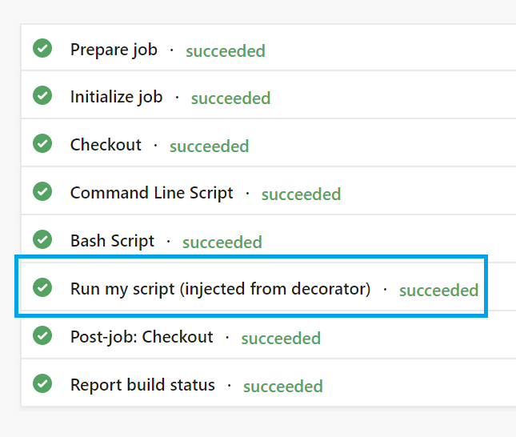
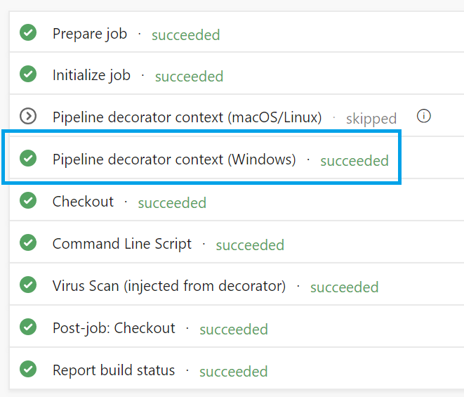

# Use a decorator to inject steps into a pipeline

Pipeline decorators allow you to add steps to the beginning and end of every job.
This is different than adding steps to a single definition because it applies to all pipelines in an organization.

Suppose our organization requires running a virus scanner on all build outputs that could be released.
Instead of requiring every pipeline author to remember to add that step, we'll create a decorator which automatically injects the step.
Our pipeline decorator will inject a custom task that does virus scanning at the end of every pipeline job.

## Author a pipeline decorator

This example assumes you're familiar with the [contribution models](contributions-overview.md).

Start by [creating an extension](add-build-task.md#step-3-create-the-extension-manifest-file).
After you follow the tutorial, you'll have a `vss-extension.json` file.
In this file, add contribution for our new pipeline decorator.

#### vss-extension.json
```json
{
    "manifestVersion": 1,
    "contributions": [
        {
            "id": "my-required-task",
            "type": "ms.azure-pipelines.pipeline-decorator",
            "targets": [
                "ms.azure-pipelines-agent-job.post-job-tasks"
            ],
            "properties": {
                "template": "my-decorator.yml"
            }
        }
    ]
}
```

Let's take a look at the properties and what they are used for:

| Property | Description |
| ------------- |:-------------|
| `id` | Contribution identifier. Must be unique among contributions in this extension. |
| `type` | Specifies that this contribution is a pipeline decorator. Must be the string `ms.azure-pipelines.pipeline-decorator`. |
| `targets` | Decorators can run before your job, after, or both. The two targets are `ms.azure-pipelines-agent-job.pre-job-tasks` and `ms.azure-pipelines-agent-job.post-job-tasks`. In this example, we use only `post-job-tasks` because we want to run at the end of the job. |
| `properties` | The only property required is a `template`. The template is a YAML file included in your extension which defines the steps for your pipeline decorator. It's a relative path from the root of your extension folder. |

This extension will contribute a pipeline decorator.
Next, we'll create a template YAML file to define the decorator's behavior.

## Decorator YAML

In the extension's properties, we chose the name "my-decorator.yml".
Create that file in the root of your contribution.
It will hold the set of steps to run after each job.
We'll start with a very simple example and work up to the full task.

#### my-decorator.yml (initial version)
------
```yaml
steps:
- script: dir
  displayName: 'Run my script (injected from decorator)'
```

## Installating the decorator

In order to add a pipeline decorator to your organization, you must [install an extension](../../marketplace/install-extension.md).
Only private extensions can contribute pipeline decorators.
The extension needs to be authored and shared with your organization before it can be used.

Once the extension has been shared with your organization, [search for the extension](https://marketplace.visualstudio.com/search?term=tag%3APipeline%20decorator&target=AzureDevOps&category=All%20categories&visibilityQuery=all&sortBy=Relevance) and install it.

> [!IMPORTANT]
> Pipeline decorators are in preview.
> You must [enable the feature at the organization level](../../project/navigation/preview-features.md#enable-features-at-the-organization-level-for-all-users)
> Otherwise, pipeline decorators will not run.

Save the file, then [build and install the extension](../get-started/node.md).
Create and run a simple pipeline.
The decorator will automatically inject our `dir` script at the end of every job.
A pipeline run looks similar to:



> [!NOTE] 
> The decorator runs on every job in every pipeline in the organization.
> In later steps, we'll add logic to control when and how the decorator runs.

## Conditional injection

In our example, we only need to run the virus scanner if the build outputs might be released to the public.
Let's say that only builds from the default branch (typically `master`) are ever released.
Therefore, we should limit the decorator to jobs running against the default branch.

The updated file looks like this:

#### my-decorator.yml (revised version)
------
```yaml
steps:
- ${{ if eq(resources.repositories['self'].ref, resources.repositories['self'].defaultBranch) }}:
  - script: dir
    displayName: 'Run my script (injected from decorator)'
```

You can start to see the power of this extensibility point.
We're able to use the context of the current job to conditionally inject steps at runtime.
We can use [YAML expressions](../../pipelines/process/expressions.md) to make decisions about what steps to inject and when.
See [pipeline decorator expression context](pipeline-decorator-context.md) for a full list of available data.

There's another condition we need to consider: what if the user already included the virus scanning step?
We shouldn't waste time running it again.
In this simple example, we'll pretend that any `script` task found in the job is running the virus scanner.
(In a real implementation, you'd have a custom task and check for that instead.)

The script task's ID is `d9bafed4-0b18-4f58-968d-86655b4d2ce9`.
If we see another script task, we shouldn't inject ours.

#### my-decorator.yml (final version)
------
```yaml
steps:
- ${{ if and(eq(resources.repositories['self'].ref, resources.repositories['self'].defaultBranch), not(containsValue(job.steps.*.task.id, 'd9bafed4-0b18-4f58-968d-86655b4d2ce9'))) }}:
  - script: dir
    displayName: 'Run my script (injected from decorator)'
```

<!--## Limitations

#### Scoping

You cannot scope the contribution to apply to certain pipelines within your organization. When you install the extension it applies to all jobs across your organization.

#### Endpoints

For now, you can't specify endpoints like SonarQube with pipeline decorators.

#### Source control

Pipeline decorators currently work with Azure Dev Ops Git and GitHub. They do not work for other source control providers.
-->
## Debugging

While authoring your pipeline decorator, you'll likely need to debug.
You also may want to see what data you have available in the context.

You can set the `system.debugContext` variable to `true` when you queue a pipeline.
Then, look at the pipeline summary page.

You'll see the following:



Click the task to see the logs, which report the available context is available and runtime values.

## Helpful Links

Learn more about [YAML expression syntax](../../pipelines/process/expressions.md#functions).
