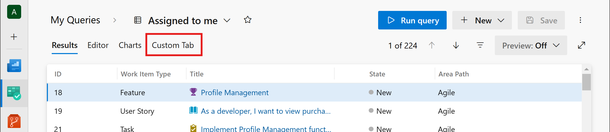

# Add tabs on query result pages

[!INCLUDE [version-lt-eq-azure-devops](../../includes/version-lt-eq-azure-devops.md)]

You can host any iframe-compatible web page as a tab on the Azure DevOps query result pages. This article walks through adding a simple Hello World tab.



[!INCLUDE [extension-docs-new-sdk](../../includes/extension-docs-new-sdk.md)]

## Create your web page

[!INCLUDE [Web_page](../includes/procedures/create-web-page.md)]

## Update your extension manifest
Update your [extension manifest](../develop/manifest.md) file with the following code:

```json
...

	"contributions": [
		{
            "id": "Fabrikam.HelloTab.Query.Tabs",
            "type": "ms.vss-web.tab",
            "description": "Adds a 'Hello' tab to the query results",
            "targets": [
                "ms.vss-work-web.query-tabs"
            ],
            "properties": {
                "uri": "hello-query-tab.html",
                "title": "Hello",
                "name": "Hello"
            }
        }
	],
	"scopes": [
		"vso.work"
	],
	"files": [
		{
			"path": "hello-query-tab.html", "addressable": true
		},
		{
			"path": "scripts", "addressable": true
		},
		{
			"path": "sdk/scripts", "addressable": true
		},
		{
			"path": "images/logo.png", "addressable": true
		}
	]
...
```

### Contributions
Each contribution defines a `type` (tab), a `target` (query tabs), and type-specific `properties`. For a tab, set `name` and `title` to the display text and `uri` to the page path relative to the extension's base URI.

### Scopes
The [scopes](./manifest.md#scopes) section declares the permissions your extension requires. The following example uses `vso.work` to access work items.

### Files
The [files](./manifest.md#files) section lists every file your extension needs at runtime. Set `addressable` to `true` for files that must be URL-addressable.
	
### Example

```javascript
SDK.register(SDK.getContributionId(), {
    pageTitle: function(state) {
        return "Hello";
    },
    updateContext: function(tabContext) {
    },
    isInvisible: function(state) {
        return false;
    },
    isDisabled: function(state) {
        return false;
    }
});
```

For all available contribution points, see [Extensibility points](../reference/targets/overview.md).

## Related content

- [Package, publish, and install extensions](../publish/overview.md)
- [Extension manifest reference](../develop/manifest.md)
