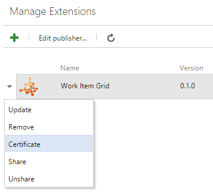

# Authenticate and secure web extensions

[!INCLUDE [version-lt-eq-azure-devops](../../includes/version-lt-eq-azure-devops.md)]

This article covers authentication for *web extensions* only. It doesn't apply to pipeline task extensions or service endpoint extensions.

[!INCLUDE [extension-docs-new-sdk](../../includes/extension-docs-new-sdk.md)]

## Call REST APIs from your extension

Most extensions call Azure DevOps REST APIs on behalf of the current user.

- **Using the SDK REST clients**: Authentication is handled automatically. The clients request an access token from the SDK and set the `Authorization` header.
- **Using custom HTTP requests**: Request a token from the SDK and set the header yourself:

    ```javascript
    import * as SDK from "azure-devops-extension-sdk";

    SDK.init();

    SDK.ready().then(async () => {
        const token = await SDK.getAccessToken();
        const authHeader = `Bearer ${token}`;

        // Use authHeader in your fetch/XMLHttpRequest calls
    });
    ```

## Authenticate requests to your service

When your extension calls a backend service you control, you need to verify the request came from your extension running in Azure DevOps. The SDK provides `getAppToken()`, which returns a JWT signed with your extension's certificate. Your service validates this token to authenticate the request.

### Get your extension's key

Your extension's unique key is generated when you publish. Use it to verify the authenticity of tokens from your extension.

1. Go to the [extension management portal](https://aka.ms/vsmarketplace-manage).
2. Right-click your [published extension](../publish/overview.md) and select **Certificate**.



> [!WARNING]
> Scope changes cause the certificate to change. Get a new key after modifying scopes.

### Generate a token for your service

Use `getAppToken()` to get a JWT signed with your extension's certificate, then pass it to your service:

```javascript
import * as SDK from "azure-devops-extension-sdk";

SDK.init();

SDK.ready().then(async () => {
    const token = await SDK.getAppToken();
    
    // Pass this token to your backend as a header or query parameter
    const response = await fetch("https://your-service.example.com/api/data", {
        headers: {
            "Authorization": `Bearer ${token}`
        }
    });
});
```

### Validate the token

Your backend service validates the JWT using your extension's secret key. The following examples show how to implement validation.

> [!IMPORTANT]
> Never hardcode your extension secret in source code. Load it from environment variables, Azure Key Vault, or another secure configuration store.

#### .NET (console application)

Install the NuGet package:

```
dotnet add package System.IdentityModel.Tokens.Jwt
```

> [!NOTE]
> Use version 7.x or later. Version 6.x and earlier are deprecated. See [IdentityModel version lifecycle](https://www.nuget.org/packages/System.IdentityModel.Tokens.Jwt) for details.

```csharp
using System.IdentityModel.Tokens.Jwt;
using Microsoft.IdentityModel.Tokens;

string secret = Environment.GetEnvironmentVariable("EXTENSION_SECRET")
    ?? throw new InvalidOperationException("EXTENSION_SECRET not configured");
string issuedToken = ""; // Token from the extension request

var validationParameters = new TokenValidationParameters()
{
    IssuerSigningKey = new SymmetricSecurityKey(System.Text.Encoding.UTF8.GetBytes(secret)),
    ValidateIssuer = false,
    ValidateAudience = false,
    ValidateActor = false,
    RequireSignedTokens = true,
    RequireExpirationTime = true,
    ValidateLifetime = true
};

var tokenHandler = new JwtSecurityTokenHandler();
var principal = tokenHandler.ValidateToken(issuedToken, validationParameters, out SecurityToken token);
```

#### ASP.NET Core Web API

Install the NuGet package:

```
dotnet add package Microsoft.AspNetCore.Authentication.JwtBearer
```

**Program.cs**

```csharp
using System.Text;
using Microsoft.AspNetCore.Authentication.JwtBearer;
using Microsoft.IdentityModel.Tokens;

var builder = WebApplication.CreateBuilder(args);

builder.Services.AddControllers();

string secret = builder.Configuration["ExtensionSecret"]
    ?? throw new InvalidOperationException("ExtensionSecret not configured");

builder.Services
    .AddAuthentication(JwtBearerDefaults.AuthenticationScheme)
    .AddJwtBearer(options =>
    {
        options.TokenValidationParameters = new TokenValidationParameters()
        {
            IssuerSigningKey = new SymmetricSecurityKey(Encoding.UTF8.GetBytes(secret)),
            ValidateIssuer = false,
            ValidateAudience = false,
            ValidateActor = false,
            RequireSignedTokens = true,
            RequireExpirationTime = true,
            ValidateLifetime = true
        };
    });

var app = builder.Build();

app.UseAuthentication();
app.UseRouting();
app.UseAuthorization();
app.MapControllers();

app.Run();
```

**API Controller:**

```csharp
using Microsoft.AspNetCore.Authorization;
using Microsoft.AspNetCore.Mvc;

[Route("api/[controller]")]
[Authorize]
public class SampleLogicController : ControllerBase
{
   // Requests without a valid token return 401 Unauthorized
}
```

## Related content

- [Call a REST API](call-rest-api.md)
- [Extension manifest reference](manifest.md)
- [Azure DevOps Extension SDK](https://github.com/Microsoft/azure-devops-extension-sdk)
