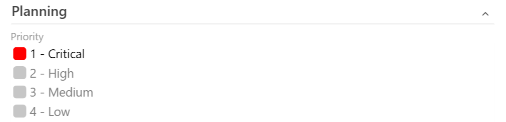

# Add a custom control to the work item form

[!INCLUDE [version-vsts-tfs-2017-on](../../boards/includes/version-vsts-tfs-2017-on.md)]

Custom controls allow you to change how users view and interact with a field on the work item form. The following article walks you through how this sample custom control was built.  Learn how to build your own custom control.

[!INCLUDE [extension-docs-new-sdk](../../includes/extension-docs-new-sdk.md)]

## Add the custom control

To add a control to the main page, add a contribution to your [extension manifest](../develop/manifest.md). The type of this contribution should be `ms.vss-work-web.work-item-form-control`
and it should target the `ms.vss-work-web.work-item-form` contribution.

```json
"contributions": [
    {  
        "id": "sample-work-item-form-control",
        "type": "ms.vss-work-web.work-item-form-control",
        "description": "Custom work item form control",
        "targets": [
            "ms.vss-work-web.work-item-form"
        ],
        "properties": {
            "name": "My Control",
            "uri": "workItemControl.html",
            "height": 600
        }
    }
]
```

The work item form adds an iframe to host the custom control.

### Properties

| Property     | Description           |
|--------------|-----------------------|
| `name`         | Text that appears on the group.   |
| `uri`          | URI to a page that hosts the html that is loaded by the iframe.
| `height`       | (Optional) Defines the height of the iframe. When omitted, it's 50 pixels.
| `inputs`       | The values a user provides within the form.

If you want to dynamically resize the iframe, you can use the `resize method` available in the client SDK.

A custom control on the work item form is another type of [contribution](./contributions-overview.md), like [group & page contribution](./add-workitem-extension.md). The main difference is that a control contribution can take a set of user inputs while group and page contributions can't.

## Control contribution inputs

To define the inputs for your control contribution, use the `inputs` property in the contribution object in the manifest. In the following sample you see two inputs: FieldName and Colors. `FieldName` specifies which field the control associates with. `Colors` configures which colors map to which values in the control. The values for the inputs get provided by the users when they add to the work item form. These values get passed to the control contribution when it's loaded on the form.

```json
"inputs": [
    {
        "id": "FieldName",
        "description": "The field associated with the control.",
        "type": "WorkItemField",
        "properties": {
            "workItemFieldTypes": ["String"]
        },
        "validation": {
            "dataType": "String",
            "isRequired": true
        }
    },
    {
        "id": "Colors",
        "description": "The colors that match the values in the control.",
        "validation": {
            "dataType": "String",
            "isRequired": false
        }
    }
]
```

These properties define a user input that the contribution can use:

* **id** - A unique id for the input.
* **description** - A few sentences describing the input.
* **type (optional)** - The type of input. Only supported on Azure DevOps and TFS 15 RC2 and later.
  * Valid values: 
    * `WorkItemField` - Indicates that the input is a Work Item field. The value provided by the user for this input should be a reference name for the valid work item field.
* **properties (optional)** - Custom properties for the input. Only supported on Azure DevOps and TFS 15 RTM.
  * Valid keys:
    * `workItemFieldTypes` - Defines an array of field types that this input supports. Valid values are -
        * `String`
        * `Integer`
        * `DateTime`
        * `PlainText`
        * `HTML`
        * `TreePath`
        * `History`
        * `Double`
        * `Guid`
        * `Boolean`
        * `Identity`
        * `PicklistString`
        * `PicklistInteger`
        * `PicklistDouble`
* **validation** - A set of properties that defines which values are considered valid for the input.
    * Valid keys:
        * `dataType` - Defines the data type of the input value. Valid values for this property are -
            * `String`
            * `Number`
            * `Boolean`
            * `Field` - Only supported in TFS 15 RC1 and RC2 and not in Azure DevOps.
        * `isRequired` - A boolean value, which indicates if the input is required to have a value or not

## JavaScript sample

A control extension works like a group or page extension with one difference that it can take certain user inputs. To read the user input values, use `VSS.getConfiguration().witInputs`. This sample shows how to register an object that's called when events occur on the work item form that may affect your contributed control. It also shows how to read input values provided by user for this control.

```typescript
import { Control } from "control";
import * as ExtensionContracts from "TFS/WorkItemTracking/ExtensionContracts";

var control: Control;

var provider = () => {
    return {
        onLoaded: (workItemLoadedArgs: ExtensionContracts.IWorkItemLoadedArgs) => {
            // create the control
            var fieldName = VSS.getConfiguration().witInputs["FieldName"];
            var colors = VSS.getConfiguration().witInputs["Colors"];
            control = new Control(fieldName, colors);
        },
        onFieldChanged: (fieldChangedArgs: ExtensionContracts.IWorkItemFieldChangedArgs) => {
            var changedValue = fieldChangedArgs.changedFields[control.getFieldName()];
            if (changedValue !== undefined) {
                control.updateExternal(changedValue);
            }
        }
    }
};

VSS.register(VSS.getContribution().id, provider);
```

The following screenshot shows a sample custom work item control for the *Priority* field.

> [!div class="mx-imgBorder"]
> 

