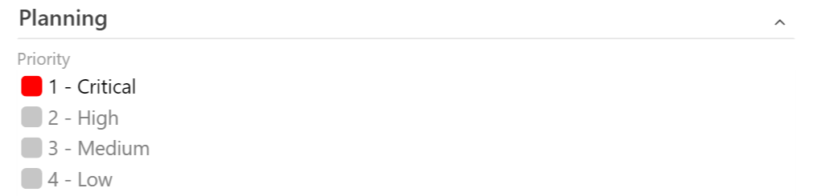

# Add a custom control to the work item form

[!INCLUDE [version-lt-eq-azure-devops](../../includes/version-lt-eq-azure-devops.md)] 

Custom controls allow you to change how users view and interact with a field on the work item form. The following article walks you through how this sample custom control was built. This article shows you how to build your own custom control.

[!INCLUDE [extension-docs-new-sdk](../../includes/extension-docs-new-sdk.md)]

## Prerequisites

Include the azure-devops-extension-sdk in your project:

1. Install the SDK via npm: `npm install azure-devops-extension-sdk`.
2. Initialize it in your JavaScript code: 

    ```javascript
    import * as SDK from "azure-devops-extension-sdk";
    SDK.init();
    ```

## Add the control contribution

Add a contribution to your [extension manifest](../develop/manifest.md) with type `ms.vss-work-web.work-item-form-control` targeting `ms.vss-work-web.work-item-form`:

```json
"contributions": [
    {  
        "id": "sample-work-item-form-control",
        "type": "ms.vss-work-web.work-item-form-control",
        "description": "Custom work item form control",
        "targets": [
            "ms.vss-work-web.work-item-form"
        ],
        "properties": {
            "name": "My Control",
            "uri": "workItemControl.html",
            "height": 600
        }
    }
],
"manifestVersion": 1.0,
    "scopes": [
        "vso.work"
    ]
```

The work item form loads the custom control in an IFrame.

### Control properties

| Property     | Description           |
|--------------|-----------------------|
| `name`       | Text that appears on the group. |
| `uri`        | URI to the HTML page loaded in the IFrame. |
| `height`     | (Optional) Height of the IFrame in pixels. Default is 50. |
| `inputs`     | Values that users provide when adding the control to the form. |

To dynamically resize the IFrame, use the `resize` method in the SDK.

A custom control is a type of [contribution](./contributions-overview.md) similar to [group and page contributions](./add-workitem-extension.md). The key difference is that control contributions accept user inputs, while group and page contributions don't.

## Control contribution inputs

Use the `inputs` property in the contribution object to define configurable inputs for your control.

The following example defines two inputs: `FieldName` specifies which work item field the control is associated with, and `Colors` configures which colors map to which field values. Users provide these values when they add the control to the form, and the values are passed to the control at load time.

```json
"inputs": [
    {
        "id": "FieldName",
        "description": "The field associated with the control.",
        "type": "WorkItemField",
        "properties": {
            "workItemFieldTypes": ["String"]
        },
        "validation": {
            "dataType": "String",
            "isRequired": true
        }
    },
    {
        "id": "Colors",
        "description": "The colors that match the values in the control.",
        "type": "string",
        "validation": {
            "dataType": "String",
            "isRequired": false
        }
    }
]
```

### Input properties

The following properties define a user input:

| Property | Description |
|----------|-------------|
| **id** | Unique ID for the input. |
| **description** | Short description of the input. |
| **type** | (Optional) Input type. Use `WorkItemField` to indicate the value should be a work item field reference name. |
| **properties** | (Optional) Custom properties. Use `workItemFieldTypes` to restrict which field types are valid (for example, `String`, `Integer`, `DateTime`, `Boolean`). |
| **validation** | Validation rules. Set `dataType` (`String`, `Number`, `Boolean`, or `Field`) and `isRequired` (`true` or `false`). |

Supported `workItemFieldTypes` values: `String`, `Integer`, `DateTime`, `PlainText`, `HTML`, `TreePath`, `History`, `Double`, `Guid`, `Boolean`, `Identity`, `PicklistString`, `PicklistInteger`, `PicklistDouble`.

## JavaScript sample

A custom control extension works like a group or page extension, with the addition that it reads user input values via `SDK.getConfiguration().witInputs`. The following sample registers a provider that responds to work item form events:

```typescript
import { Control } from "control";
import * as SDK from "azure-devops-extension-sdk";
import * as ExtensionContracts from "azure-devops-extension-api/WorkItemTracking/WorkItemTracking";

let control;

const provider = () => {
    return {
        onLoaded: (workItemLoadedArgs) => {
            // create the control
            const config = SDK.getConfiguration();
            const fieldName = config.witInputs["FieldName"];
            const colors = config.witInputs["Colors"];
            control = new Control(fieldName, colors);
        },
        onFieldChanged: (fieldChangedArgs) => {
            const changedValue = fieldChangedArgs.changedFields[control.getFieldName()];
            if (changedValue !== undefined) {
                control.updateExternal(changedValue);
            }
        }
    };
};

SDK.init();
SDK.ready().then(() => {
    SDK.register(SDK.getContributionId(), provider);
});
```

The following screenshot shows a sample custom work item control for the *Priority* field.

> [!div class="mx-imgBorder"]
> 

## Related content

- [Extend the work item form](add-workitem-extension.md)
- [Extension manifest reference](manifest.md)
- [Contribution model](contributions-overview.md)
