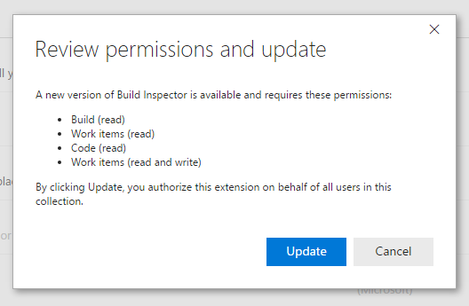

# Extension manifest reference

[!INCLUDE [version-lt-eq-azure-devops](../../includes/version-lt-eq-azure-devops.md)]

Every extension has a JSON manifest file that defines basic information about the extension. The file also defines how it can extend and enhance the experience. This article shows you how to create a manifest for your extension to Azure DevOps.

[!INCLUDE [extension-docs-new-sdk](../../includes/extension-docs-new-sdk.md)]

Create a file named `vss-extension.json` at the root of your extension folder. This file contains required attributes, like the extension's ID and its installation targets, where it can run. It also defines the contributions being made by your extension.

See the following example of a typical manifest:

[!code-json[](../_data/extension-typical.json)]

## Required attributes

<a id="core-properties" />

[!INCLUDE [](../includes/manifest-core.md)]

### Examples of required attributes

[!code-json[](../_data/extension-core.json)]

## Optional attributes

### Runtime attributes
[!INCLUDE [](../includes/manifest-extension-runtime.md)]

[!code-json[](../_data/extension-runtime.json)]

<a name="discoveryprops"></a>

### Discovery attributes

[!INCLUDE [](../includes/manifest-discovery.md)]

<a id="public-flag" />

#### Mark an extension public

By default, all extensions in the [Azure DevOps Marketplace](https://marketplace.visualstudio.com/azuredevops/) are private. They're only visible to the publisher and accounts shared to by the publisher. If your publisher has been verified, you can make your extension public by setting the `Public` flag in your extension manifest:

```json
{
    "galleryFlags": [
        "Public"
    ]
}            
```

Or:

```json
{
    "public": true
}            
```

For more information, see [Package/Publish/Install](../publish/overview.md).

#### Mark an extension to be in preview

If your extension's ready for users on the Marketplace to try, but you're still working out a few bugs or adding function, you can mark it as `preview`:

```json
{
    "galleryFlags": [
        "Preview"
    ]
}            
```
#### Mark an extension as paid preview

If you intend to sell your extension on the Marketplace, mark it as *paid preview*. An extension marked *free* can't be changed to *paid*.

```json
{
    "galleryFlags": [
        "Paid",
        "Preview"
    ]
}            
```

#### Mark an extension as paid

If you want to sell your extension on the Marketplace, you can mark it with the `Paid` flag and `__BYOLENFORCED` tag (starts with two underscores):

```json
{
    "galleryFlags": [
        "Paid"        
    ],
     "tags": [        
        "__BYOLENFORCED"
    ]
}            
```

Both the `Paid` flag and `__BYOLENFORCED` tag need to be present to mark an extension as paid in  the Marketplace. Bring-Your-Own-License (BYOL) means the publisher of the extension provides the billing and licensing mechanism for the extension, as it isn't provided by Microsoft for Azure DevOps extensions. All paid extensions are required to define privacy policy, support policy, and an end-user license agreement. Also, publishers must provide content for the pricing tab in Marketplace as follows:

```json
{
    "content": {
        "details": {
            "path": "overview.md"
        }, 
        "pricing": {
            "path": "pricing.md"
        }
    }
}          
```

You also need to add a new section in your extension manifest to override paid licensing. In the future, we'll remove the paid licensing check and no longer require the override. For now, ensure your extension displays as expected. Each override consists of an “ID” and a “behavior.” The “ID” must match the ID of the contributions defined in the manifest.
```json
"licensing": {

      "overrides": [

        { "id": "my-hub", "behavior": " AlwaysInclude" }
      ]
    }
```

If your paid BYOL extension offers a trial period (we recommend so), then you can specify the length of the trial in days: 

```json
{
    "galleryproperties": {
        "trialDays": "30"
    } 
}          
```

> [!NOTE]
> If you want to target TFS, but don't wish to surface a **Download** option for your extension, then add the `__DoNotDownload` tag (starts with two underscores) to the extension manifest.
> If you're moving an extension from the previously-offered billing & licensing from Microsoft to the BYOL model, then contact us and we'll provide you with suitable steps.

### Example of more properties

[!code-json[](../_data/extension-discovery.json)]

### Details page example

* 1 - description
* 2 - icon
* 3 - categories
* 4 - screenshots
* 5 - content (details)
* 6 - links
* 7 - branding


<a name="CustomerQnASupport"></a>

### Marketplace Q & A - CustomerQnASupport property

All extensions on the Visual Studio Marketplace have a Q&A section to allow one-on-one public conversations between extension users and publishers. Publishers can choose between Marketplace Q&A, GitHub issues, or a custom Q&A URL. You can disable Q&A in the Marketplace using the CustomerQnASupport property in the manifest. 

**Default experience** (No changes to manifest are required)
- For extensions with a GitHub repository, Marketplace redirects users in the Q&A section to the associated GitHub issues. 
- For extensions without a GitHub repository, Marketplace Q&A is enabled. 

For a different experience than one of the default options, use the **CustomerQnASupport** property in the manifest.  


```json
{
    "CustomerQnASupport": {
        "enablemarketplaceqna": true,
        "url": "http://uservoice.visualstudio.com"
    } 
}
```

### Properties

Properties for the Customer Q & A Support section:

- **enablemarketplaceqna** - boolean field, set to true for marketplace or custom Q&A; false for disabling Q&A
- **url** - string, URL for custom Q&A


### Examples showing usage of Q & A support

#### Example: Extension using custom Q & A

```json
{
     "CustomerQnASupport": {
        "enablemarketplaceqna":"true",
        "url": "http://uservoice.visualstudio.com"
    } 
}
```
#### Example: Extension with GitHub repository but using Marketplace Q & A instead of GitHub issues

```json
{
     "CustomerQnASupport": {
        "enablemarketplaceqna":"true"
    } 
}
```
#### Example: Extension disabling Q & A section

```json
{
     "CustomerQnASupport": {
        "enablemarketplaceqna":"false"
    } 
}
```

## Scopes

Your extension can specify one or more scopes. Scopes control what resources can be accessed by your extension and what operations your extension is allowed to do with those resources. The scopes you specify in your extension manifest are the scopes set on access tokens issued to your extension. For more information, see [Auth and security](auth.md).

If no scopes are specified, extensions are only provided access to user profile and extension data.

### Supported scopes

[!INCLUDE [](../../integrate/includes/scopes.md)] 

### Changing scope of published extension

You can change the scope of a published extension. If you previously installed your extension (and authorized the previous set of scopes), you must authorize the new scopes before you can upgrade to the newest version.

The **Action Required** section of the Extension settings hub shows a user that, if any, installed extensions require authorization:


An administrator can then review and authorize the new set of scopes:



## Installation targets

As the name implies, installation targets define the products and services where you can install your extension. `Microsoft.VisualStudio.Services` is the most common installation target and indicates that the extension can be installed into Azure DevOps.

The installation targets for an extension or integration are specified via the `targets` field in the manifest. 

Supported identifiers for **extensions**:

* `Microsoft.VisualStudio.Services.Cloud`: installs into Azure DevOps Services
* `Microsoft.TeamFoundation.Server`: installs into TFS
* `Microsoft.VisualStudio.Services`: installs into both. Shortcut for `Microsoft.VisualStudio.Services.Cloud` and `Microsoft.TeamFoundation.Server` version `[14.2,)`

Supported identifiers for **integrations**:

* `Microsoft.VisualStudio.Services.Cloud.Integration`: integrates with Azure DevOps Services
* `Microsoft.TeamFoundation.Server.Integration`: integrates with TFS
* `Microsoft.VisualStudio.Services.Integration`: integrates with both. Shortcut for `Microsoft.VisualStudio.Services.Cloud.Integration` and `Microsoft.TeamFoundation.Server.Integration`

For more information, see [Extensibility points](../reference/targets/overview.md).

### Examples of installation targets

#### Example: Extension that works with Azure DevOps
```json
{
    "targets": [
        {
            "id": "Microsoft.VisualStudio.Services"
        }
    ]
}
```

#### Example: Extension that works only with Azure DevOps Services

```json
{
    "targets": [
        {
            "id": "Microsoft.VisualStudio.Services.Cloud"
        }
    ]
}
```

Installation targets can also be used in the manifest of integrations. For example, products, apps, or tools that work with, but don't install into Azure DevOps.

#### Example: Integration that works with Azure DevOps

```json
{
    "targets": [
        {
            "id": "Microsoft.VisualStudio.Services.Integration"
        }
    ]
}
```

#### Example: Integration that only works with TFS

```json
{
    "targets": [
        {
            "id": "Microsoft.TeamFoundation.Server.Integration"
        }
    ]
}
```

### Installation target versions

Some installation target identifiers, like `Microsoft.TeamFoundation.Server` and `Microsoft.TeamFoundation.Server.Integration`, support an optional version range. This optional version range further clarifies the supported releases the extension or integration is supported on. 

The version or version range is specified via the `version` field on the installation target object. This value can be either:

* A specific version, for example: `15.0` (2017 RTM only)
* A range of supported versions, for example: `[14.0)` (2015 RTM and later), `[14.3,15.1]` (2015 Update 3 through 2017 Update 1). Range values are refined using:
  * `[`: minimum version inclusive
  * `]`: maximum version inclusive
  * `(`: minimum version exclusive
  * `)`: maximum version exclusive

Version numbers for Azure DevOps Server:

| Release      | Releases        | Version                             |
|--------------|-----------------|-------------------------------------|
| 2010         | All releases    | 10.0                                |
| 2012         | All releases    | 11.0                                |
| 2013         | RTM and updates | 12.0, 12.1, 12.2, 12.3, 12.4        |
| 2015         | RTM and updates | 14.0, 14.1, 14.2, 14.3              |
| 2017         | RTM and updates | 15.0, 15.1                          |
| 2018         | RTM and updates | 16.0                                |
| 2019         | RTM and updates | 17.0                                |
| 2020         | RTM and updates | 18.0                                |

### Examples showing versions

#### Example: Extension that works with Azure DevOps

```json
{
    "targets": [
        {
            "id": "Microsoft.VisualStudio.Services.Cloud"
        },
        {
            "id": "Microsoft.TeamFoundation.Server",
            "version": "[15.0,)"
        }
    ]
}
```
<!--
#### Example: Integration that works with 2015 and later

```json
{
    "targets": [
        {
            "id": "Microsoft.TeamFoundation.Server.Integration",
            "version": "[14.0,)"
        }
    ]
}
```

#### Example: Integration that works with 2013 and 2015

```json
{
    "targets": [
        {
            "id": "Microsoft.TeamFoundation.Server.Integration",
            "version": "[12.0,15.0)"
        }
    ]
}
```
-->
### Shortcuts

`Microsoft.VisualStudio.Services` is a shortcut for Azure DevOps. 

```json
{
    "targets": [
        {
            "id": "Microsoft.VisualStudio.Services"
        }
    ]
}
```

is equivalent to:

```json
{
    "targets": [
        {
            "id": "Microsoft.VisualStudio.Services.Cloud"
        },
        {
            "id": "Microsoft.TeamFoundation.Server",
            "version": "[14.2,)"
        }
    ]
}
```

### Using installation targets and demands

Installation targets and demands are used together to present users with a correct view of the products/services your extension or integration is compatible with. For example, specifying an installation target of `Microsoft.VisualStudio.Services` with a demand of `api-version/3.0` means the extension works with Azure DevOps. 

> [!TIP]
> For more information on REST APIs, see the [REST API Reference](/rest/api/azure/devops).

#### Example: Extension that uses version 3.0 APIs

```json
{
    "targets": [
        {
            "id": "Microsoft.VisualStudio.Services"
        }
    ],
    "demands": [
        "api-version/3.0"
    ]
}
```

Resolves to the following installation targets:

1. `Microsoft.VisualStudio.Services.Cloud` 
2. `Microsoft.TeamFoundation.Server`, version: `[15.0,)`

#### Example: Integration that uses version 2.0 APIs

```json
{
    "targets": [
        {
            "id": "Microsoft.VisualStudio.Services.Integration"
        }
    ],
    "demands": [
        "api-version/2.0"
    ]
}
```

Resolves to the following installation targets:

1. `Microsoft.VisualStudio.Services.Cloud.Integration` 
2. `Microsoft.TeamFoundation.Server.Integration`, version: `[14.0,)`

## Demands

Demands let you specify capabilities and other features required by your extension. You can use these demands to limit where your extension can be published or installed.

Demands get used by the Visual Studio Marketplace to list the products and environments your extension is compatible with, which helps customers understand whether your extension works with their version of Azure DevOps, for example.

See the following example of how demands get specified in the extension manifest.

```json
{
    "demands": [
        "api-version/3.0",
        "contribution/ms.vss-dashboards-web.widget-catalog"
    ]
}
```

In this example, the extension demands version 3.0 of the APIs, which means it can only be installed to Azure DevOps. It also requires the `ms.vss-dashboards-web` extension (and its `widget-catalog` contribution) to be installed (and enabled) in the collection before your extension can be installed.    

### Supported demands

| Type                        | Description                                          | Checked at publish? | Checked at install? | 
|-----------------------------| ---------------------------------------------------- |:-------------------:|:-------------------:|
| `environment/cloud`         | Requires running in a cloud environment              | Yes                 | Yes                 |
| `environment/onprem`        | Requires running in an on-premises environment       | Yes                 | Yes                 |
| `api-version/{version}`     | Requires a specific API version (minimum)            | No                  | Yes                 |
| `extension/{id}`            | Requires a specific extension be installed/enabled   | No                  | Yes                 |
| `contribution/{id}`         | Requires a specific contribution be available        | No                  | Yes                 |
| `contributionType/{id}`     | Requires a specific contribution type be available   | No                  | Yes                 |

> [!NOTE]
> * Use `environment/cloud` and `environment/onprem` only when your extension has topology-related requirements that require running in that particular environment.
> * `extension`, `contribution`, and `contributionType` demands are evaluated at install time, and requires that the specified extension is already installed and enabled in the organization/collection.

## Files

The `files` section is where you reference any files you wish to include in your extension. You can add both folders and individual files:

```json
{
    "files": [
        {
            "path": "hello-world.html", "addressable": true
        },
        {
            "path": "scripts", "addressable": true
        },
        {
            "path": "images/logo.png", "addressable": true, "packagePath": "/"
        }
    ]
}
```

### Properties

Properties for the Files section:

- **path** - Path to resource on disk, which can be relative to your root directory.
- **addressable** – (optional) Set to **true** if you want your file to be URL-addressable. Defaults to **false**.
- **packagePath** – (optional) Path to the resource within the package. Defaults to the relative path on disk from your root directory.
- **contentType** – (optional) MIME type of the file. Defaults to a best guess based on the file extension and OS settings.
- **assetType** – (optional) Specify the value of the Type attribute of the asset entry in the VSIX manifest. Can also be an array of strings, in which case multiple asset entries get added for this file. Defaults to the packagePath.
- **lang** – (optional) Language of this asset. Localized files are served based on the Accept-Language header. Leave blank to signify this file is in the default (or fallback) language. Localized versions of the same file should have the same assetType.

## Contributions

Each contribution entry has the following properties:

* **id** - A reference ID (string) for the contribution. Each contribution's ID must be unique within an extension. See [referencing contributions and types](#contributionIds). 
* **type** - The ID of the contributionType of this contribution. 
* **description** - (Optional) A string describing what the contribution is providing.
* **targets** - An array of contribution IDs that the contribution is targeting (contributing to). See [Targeting contributions](#contributionTargets).
* **properties** - (Optional) An object that includes properties for the contribution as defined in the contribution type.

For more information, see the [contribution model overview](contributions-overview.md).

<a name="contributionTypes"></a>

### Contribution types

Each contribution entry has the following properties:

* **id** - A reference ID (string) for the contribution type. Each contribution type's ID must be unique within an extension. See [referencing contributions and types](#contributionIds). 
* **name** - The friendly name of the contribution type. 
* **description** - (Optional) A string describing in more detail what the contribution type is for.
* **properties** - (Optional) A dictionary that maps property names to property descriptions. These properties describe the required and optional properties that can be used by contributions of this type.

Property descriptions have the following properties:

* **description** - (Optional) A string describing what the property is used for. 
* **required** - (Optional) A boolean value, which if true indicates that the property is required for all contributions of this type.
* **type** - The type of value that the property can have, which could be string, uri, guid, boolean, integer, double, dateTime, array, or object.

For more information, see the [contribution model overview](contributions-overview.md).

<a name="contributionIds"></a>

### Referencing contributions and types

Contributions and contribution types are referenced by their identifiers. Contributions reference types through the `type` property, and reference other
contributions through the `targets` property.

- A *full* contribution reference includes the publisher identifier, extension identifier, and contribution/type identifier, separated by
a dot (.). For example, `ms.vss-web.hub` is the full identifier for the contribution with identifier of "hub" in the "vss-web" extension published by the "ms" (Microsoft) publisher.
- *Relative* contribution references may be used within an extension manifest for a contribution's reference to another contribution or contribution type within that same extension. In this case, the publisher and extension identifiers are NOT included, and the identifier is a dot (.) followed
by the contribution identifier. For example, ".hub" may be used within the "vss-web" extension mentioned previously as a shortcut for "ms.vss-web.hub".

<a name="contributionTargets"></a>

### Targeting contributions

Some contributions act as containers that can be targeted by other contributions.
- Hub contributions can target Hub Groups. When a page is rendered, the web UI shows all Hub contributions that target the selected hub group. Hub groups target a hub group collection, which defines a set of hub groups that show up in a given navigational area, for example, project-level admin pages.
- Menus can be targeted by contributions of different types: action, hyperlink-action, and action-provider. Actions and hyperlink-actions provide single menu item entries. An action-provider can provide multiple dynamic menu items. For a given menu, items are aggregated across all contributions (of any of these types) that target that specific menu contribution.  

### Adding a hub icon

For information on adding an icon to your hub, check out the [hub icon guidance](web-navigation.md#hub-icon).

<a name="approvedbadges"></a>

## Supported badge services

The Marketplace only supports badges from the following trusted services:

* api.travis-ci.org/
* badge.fury.io/
* badges.frapsoft.com/
* badges.gitter.im/
* badges.greenkeeper.io/
* cdn.travis-ci.org/
* ci.appveyor.com/
* codeclimate.com/
* codecov.io/  
* coveralls.io/
* david-dm.org/
* gemnasium.com/
* img.shields.io/ 
* isitmaintained.com/
* marketplace.visualstudio.com/
* snyk.io/
* travis-ci.com/
* travis-ci.org/
* vsmarketplacebadges.dev/
* bithound.io/
* deepscan.io/
* githost.io/
* gitlab.com/
* opencollective.co/

> [!NOTE]
> Replace "vsmarketplacebadge.apphb.com" with "vsmarketplacebadges.dev".

If you want to show a badge from another service, contact *vsmarketplace@microsoft.com*.

<a name="example"></a>

## Example manifest

The following extension contributes an action to the completed builds context menu and a hub to the Build hub group:

[!code-json[](../_data/extension.json)]
