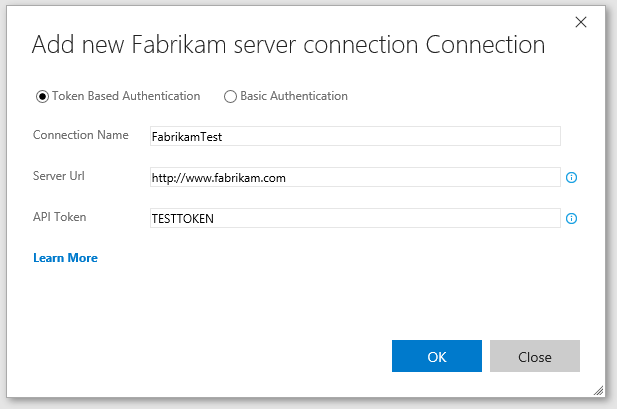

# Create a service endpoint

[!INCLUDE [version-lt-eq-azure-devops](../../includes/version-lt-eq-azure-devops.md)]

Service endpoints are a way for Azure DevOps to connect to external systems or services. They're a bundle of properties securely stored by Azure DevOps, which includes but isn't limited to the following properties:

- Service name
- Description
- Server URL
- Certificates or tokens
- User names and passwords

::: moniker range="tfs-2018"
> [!NOTE]
> _Service endpoints_ are called _service connections_ in TFS 2018 and earlier versions.
> _Pipelines_ are called _build definitions_ in TFS 2018 and and earlier versions.
::: moniker-end
  
Extensions are then able to use the service endpoint to acquire the stored details to do the necessary operations on that service. 
Follow this guide to create a new service endpoint contribution and use it in your extension.

[!INCLUDE [extension-docs-new-sdk](../../includes/extension-docs-new-sdk.md)]

## Task overview

You can develop a service endpoint by creating an example extension for Azure DevOps that includes the following items:
- A custom service endpoint with data sources, which enables a build task or dashboard widget to call a REST endpoint on the service/server defined by the endpoint.
- A build task, which defines two properties: The service endpoint & a picklist, which has values populated from the REST endpoint data source.

> [!NOTE]
> When you create a service endpoints, it's at the project level, not the organization level.

The steps involved in completing this task are:
- [1. Create the extension manifest file](#step1)
- [2. Create the build task pipeline, in the task.json file](#step2)

> [!NOTE]
> This tutorial refers to the home directory for your project as "home".

<a name="step1" />

## Create the manifest file: `vss-extension.json`

The [manifest file](./manifest.md) defines the custom endpoint and links to the task.json manifest for the build task. 

In this article, the manifest file creation is separated into the following three parts:

- [Create a service endpoint](#create-a-service-endpoint)
  - [Task overview](#task-overview)
  - [Create the manifest file: `vss-extension.json`](#create-the-manifest-file-vss-extensionjson)
    - [Create basic manifest file](#create-basic-manifest-file)
    - [Add the custom endpoint contribution](#add-the-custom-endpoint-contribution)
    - [Add the build task contribution](#add-the-build-task-contribution)
  - [Create the build task](#create-the-build-task)
    - [task.json components](#taskjson-components)
  - [Authentication](#authentication)
  - [Next steps](#next-steps)
  - [Related articles](#related-articles)

### Create basic manifest file

Create a json file (`vss-extension.json`, for example) in the `home` directory of your extension.

```json
{
"manifestVersion": 1,
  "id": "service-endpoint-tutorial",
  "version": "0.1.1",
  "name": "Sample extension that leverages a service endpoint",
  "description": "A sample Azure DevOps extension which shows how to create a custom endpoint and dynamic build task parameters taking value from a REST API.",
  "publisher": "francistotten",
  "targets": [
    {
      "id": "Microsoft.VisualStudio.Services"
    }
  ],  
  "files": [
    {
      "path": "BuildTaskFolder"
    }
  ]
}
```

> [!NOTE]
> Update the `publisher` property. The `BuildTaskFolder` is the path where we'll eventually place our build task pipeline.
### Add the custom endpoint contribution

Add the following `contributions` array underneath the `targets` array of the basic manifest content.

> [!IMPORTANT]
> Service connection parameters must be fetched by service connection ID.

```json
  "contributions": [
    {
      "id": "service-endpoint",
      "description": "Service endpoint type for Fabrikam connections",
      "type": "ms.vss-endpoint.service-endpoint-type",
      "targets": [ "ms.vss-endpoint.endpoint-types" ],
      "properties": {
        "name": "fabrikam",
        "displayName": "Fabrikam server connection",
        "url": {
          "displayName": "Server Url",
          "helpText": "Url for the Fabrikam server to connect to."
        },
        "dataSources": [
          {
            "name": "Fabrikam Projects",
            "endpointUrl": "{{endpoint.url}}api/projects/index",
            "resultSelector": "jsonpath:$[*].nm"
          }

        ],
        "authenticationSchemes": [
          {
            "type": "ms.vss-endpoint.endpoint-auth-scheme-token"
          },
          {
            "type": "ms.vss-endpoint.endpoint-auth-scheme-basic",
            "inputDescriptors": [
              {
                "id": "username",
                "name": "Username",
                "description": "Username",
                "inputMode": "textbox",
                "validation": {
                  "isRequired": false,
                  "dataType": "string"
                }
              },
              {
                "id": "password",
                "name": "Password",
                "description": "Password",
                "inputMode": "passwordbox",
                "isConfidential": true,
                "validation": {
                  "isRequired": false,
                  "dataType": "string"
                }
              }
            ]
          }

        ],
        "helpMarkDown": "<a href=\"url-to-documentation\" target=\"_blank\"><b>Learn More</b></a>"
      }
    },
  ],
```

If you've successfully added the service contribution, you see the Fabrikam endpoint when you try to add a new service endpoint to your organization.

Create a service endpoint using the Fabrikam endpoint.

> [!div class="mx-imgBorder"]
> 

> [!TIP]
> You can add inputDescriptors without authenticationSchemes. For more information, see [InputDescriptor interface](/javascript/api/azure-devops-extension-api/inputdescriptor).

### Add the build task contribution

Inside the `contributions` array from the previous step, add the following object to the end.

```json
{
      "id": "build-task",
      "description": "Task with a dynamic property getting data from an endpoint REST data source",
      "type": "ms.vss-distributed-task.task",
      "targets": [ "ms.vss-distributed-task.tasks" ],
      "properties": {
        "name": "BuildTaskFolder"
      }
    }
```

The dataSource endpoint URL gets computed from the URL of the endpoint or a fixed URL, and some other values.
For this tutorial, this REST call returns nothing and is meant to be replaced by any REST calls you wish to make to your service.

It's possible to use other parameters than the endpoint URL for the REST URL, for instance some endpoint properties.
For instance, assuming that we had a property in the endpoint named subscriptionId, the REST URL could use it with the following syntax: $(endpoint.subscription).

<a name="step2" />

## Create the build task

The `task.json` file describes your build task.

> [!NOTE]
> For more information, check out the following articles:
> - [Build task reference](./integrate-build-task.md) to find the schema for the build task json file
> - [Add a custom pipelines task extension](add-build-task.md)
> - [Integrate build task](integrate-build-task.md)

Create a `task.json` file in your `BuildTaskFolder` directory, if you haven't created this folder yet, do so now. 

```json
{
  "id": "6557a6d2-4caf-4247-99ea-5131286a8753",
  "name": "build-task",
  "friendlyName": "Build Task that uses the service endpoint",
  "description": "Task with a dynamic property getting data from an endpoint REST data source",
  "author": "francistotten",
  "helpMarkDown": "Replace with Markdown to show in help",
  "category": "Build",
  "visibility": [
    "Build",
    "Release"
  ],
  "demands": [],
  "version": {
    "Major": "0",
    "Minor": "1",
    "Patch": "1"
  },
  "minimumAgentVersion": "1.95.0",
  "instanceNameFormat": "Service Endpoint Build Task $(project)",
  "inputs": [
    {
      "name": "FabrikamService",
      "type": "connectedService:Fabrikam",
      "label": "Fabrikam service/server end point",
      "defaultValue": "",
      "required": true,
      "helpMarkDown": "Select the Fabrikam end point to use. If needed,selecton 'manage', and add a new service endpoint of type 'Fabrikam server connection'"
    },
    {
      "name": "project",
      "type": "pickList",
      "label": "Fabrikam Project",
      "required": true,
      "helpMarkDown": "Select the name of the Fabrikam Project to analyze.",
      "properties": {
        "EditableOptions": "True"
      }
    }
  ],
  "dataSourceBindings": [
    {
      "target": "project",
      "endpointId": "$(FabrikamService)",
      "dataSourceName": "Fabrikam Projects"
    }
  ],
  "execution": {
    "Node": {
      "target": "sample.js",
      "argumentFormat": ""
    },
    "PowerShell3": {
      "target": "sample.ps1"
    }
  }
}
```

### task.json components

**The `FabrikamService` input object**

This field is the first of type connectedService:Fabrikam.connectedService expresses that it's an endpoint type, and that Fabrikam is the name of the object.

**The `project` input object**

This field is second. It's a picklist.

- This field is populated by a REST call.
- The values from the field "project" are taken from the "Projects" REST data source of the custom endpoint.
- Expressed in the `dataSourceBindings` array.
  - The target is the name of the build task field to be populated ("project").
  - The endpointId is the name of the build task field containing the custom endpoint type.
  - The REST call is chosen by the dataSourceName.

If you've added the Build Task successfully, you should now see the Build Task when you're adding tasks to a build pipeline.

:::image type="content" source="media/service-endpoint-build-task-selector.png" alt-text="Service endpoint build task selector image.":::

Once you've added the Build Task to your pipeline, confirm that it can see the Fabrikam endpoint you created.
The projects dropdown in this tutorial is blank since we aren't using a real service.
Once you replace Fabrikam with your service, replace the Projects call with your own REST API call to use dynamic data inside your build task.

:::image type="content" source="media/service-endpoint-build-task-setup.png" alt-text="Service endpoint build task setup image.":::

## Authentication

The authentication scheme in a service endpoint determines the credentials that would be used to connect to the external service. For more information and to see the following authentication schemes, see the [authentication schemes documentation](./auth-schemes.md).

- Basic authentication
- Token-based authentication
- Certificate-based authentication
- No authentication

## Next steps

> [!div class="nextstepaction"]
> [Package, publish, and install extensions](../publish/overview.md)

## Related articles

- [Test and debug extensions](/previous-versions/azure/devops/extend/test/debug-in-browser)
- [Develop a web extension](../get-started/node.md)
- [Add a pipeline decorator](add-pipeline-decorator.md)
