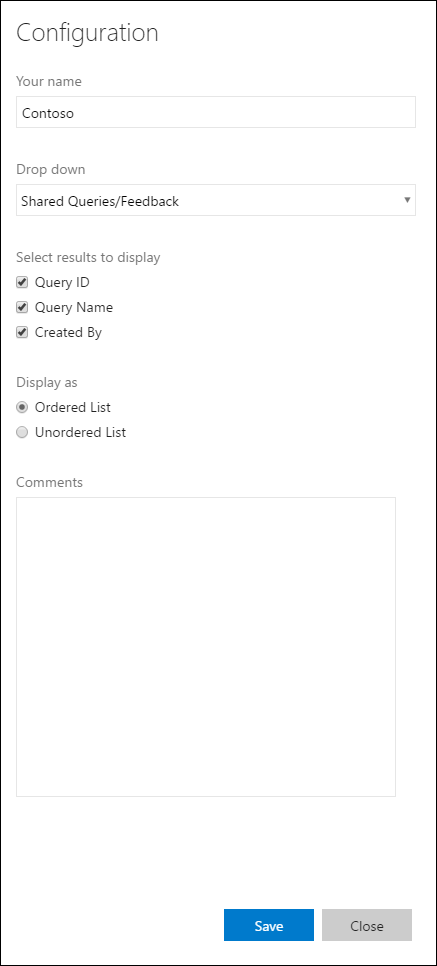
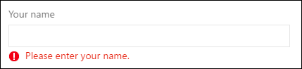

# Basic styles for your widgets

[!INCLUDE [version-lt-eq-azure-devops](../../includes/version-lt-eq-azure-devops.md)]

[!INCLUDE [extension-docs-new-sdk](../../includes/extension-docs-new-sdk.md)]

Use the basic styles provided by the Widget SDK for a consistent look across dashboard widgets.

To include widget styles, call `WidgetHelpers.IncludeWidgetStyles()` during widget initialization:

```javascript
WidgetHelpers.IncludeWidgetStyles();
```

This loads `sdk-widget.css` into your widget's iframe, providing styles for font-family, font-size, margins, paddings, headings, and links.

For widget configuration panels, call `WidgetHelpers.IncludeWidgetConfigurationStyles()` instead:

```javascript
WidgetHelpers.IncludeWidgetConfigurationStyles();
```

This loads `sdk-widget-configuration.css`, which provides styles for font-family, font-size, and common form elements like `input`, `textarea`, and `select`. 

> [!NOTE]
> For these styles to apply, add a `widget` class on the HTML element that contains your widget. All styles from `sdk-widget.css` are scoped to this class. Similarly, add a `widget-configuration` class on the element that contains your widget configuration.

For a working example, see the [extension sample](https://github.com/Microsoft/azure-devops-extension-sample).

### Widget body, title, and description

By adding the `widget` class on your widget's container element, you automatically get padding, font, and color for widget contents.

Always include a title for your widget so users can identify its purpose at a glance. Use `<h2>` with the `title` class. This also helps screen readers identify the different widgets on the dashboard.


> **Design principle:** Widgets should have a title. Use the `<h2>` tag with the `title` class.

To add a description, use the `description` class on the element that contains your widget description.

> **Design principle:** Use the `description` class for the widget description. Descriptions should make sense even when read outside the widget context.

```html
	<div class="widget">
	    <h2 class="title">Widget title</h2>	
		<div class="description">The widget description is used to describe the widget. It makes sense even when read outside of the widget context.</div>
		<p>Place widget content here.</p>
	</div>
```

### Widget titles and subtitles

Subtitles supplement the title and might not make sense when read out of context.


> **Design principle:** Use the `subtitle` class to provide more information about the widget.

Use the `title`, `inner-title`, and `subtitle` classes to get the right font, color, and margins for a title and subtitle combination. The subtitle has a subdued color relative to the title.

```html 
	<div class="widget">
	    <h2 class="title">
			<div class="inner-title">Widget title</div>
			<div class="subtitle">Widget subtitle</div>
		</h2>
		<div class="content">
			Place widget content here.  
		</div>
	</div>
```
Tips for the title and subtitle combination:
- Use an inline element like `<span>` for the subtitle to appear on the same line as the title.
- Use a block element like `<div>` for the subtitle to appear on a new line.

### Links with icons and subtext

Some widgets include links with an icon, text, and subtext.


> **Design principle:** Use links with an icon and subtext to make the purpose of the link obvious to the user. Ensure that the icon symbolizes the link's target. 

To get the same look and feel, use the below HTML structure and classes.

```html 
	<div class="widget">
	    <h2 class="title">Widget title</h2>
		<div class="content">
			<p>Place your content here.</p>
			<a class="link-with-icon-text" href="http://bing.com" target="_blank">
				<span class="icon-container" style="background-color: #68217A"></span>
				<div class="title">
					Primary link text
					<div class="subtitle">Link subtext</div>
				</div>
			</a>		
		</div>
	</div>
```

### Counters

For widgets that display a count, add the `big-count` class on the element holding the number. The Query Tile and Code Tile widgets use this same style.


> **Design principle:** Use the `big-count` class to present numbers in large font. Don't use it with non-numeric characters.

```html 
<div class="widget">
    <h2 class="title">Counter widget</h2>
	<div class="big-count">223</div>
	<div>Additional text</div>
</div>
```

### Clickable widgets

To make a widget clickable so selecting it anywhere navigates to another page:

1. Add an anchor tag as a child of the widget container element.
2. Put all widget content inside the anchor tag.
3. Add `target="_blank"` to the anchor tag so the link opens in a new tab.
4. Add the `clickable` class to the widget container.

Without the `clickable` class, the default blue link color applies to all text inside the widget. The `clickable` class also provides a custom focus indicator for keyboard navigation.

> **Design principle:** Use the `clickable` class and the `<a>` tag to make the entire widget clickable. This pattern works well when your widget summarizes data available on another page.


```html 
<div class="widget clickable">
    <a href="https://bing.com"  target="_blank">
		<h2 class="title">Counter widget</h2>
		<div class="big-count">223</div>
		<div>Select me!</div>
	</a>
</div>
```

### Configuration form elements

Use the following classes for common form elements in widget configuration:

| Form element        | Wrapping element | Guidelines |
|---------------------|------------------|------------|
| Simple text box     | `div` with class "single-line-text-input". | Use a `label` element to add text next to the text box. Use the `input` element to create a text box. Use the `placeholder` attribute to provide placeholder text. |
| Checkbox            | `fieldset` with class "checkbox"           | Use a `label` element to add text next to each checkbox. Use a `legend` element to caption the group of checkboxes. Use the `for` attribute on each `label` element to help screen readers understand the form element. |
| Radio button        | `fieldset` with class "radio"              | Use a `label` element to add text next to each radio button. Use a `legend` element to caption the group of radio buttons. Use the `for` attribute on each `label` element to help screen readers understand the form element. |
| Dropdown            | `div` with class "dropdown"                | Use a `label` element to add text next to the dropdown. If you want a dropdown occupying half the width, add class "half" to the wrapping `div` element. If you want to use the standard arrow icon from the sdk instead of the one provided by the browser, wrap the `select` element with another `div` with class "wrapper". |
| Multi-line text box | `div` with class "multi-line-text-input".  | Use `label` element to label the `textarea` element used as multi-line text box. |


The following example uses each of the form elements listed in the table.



```html
<div class="widget-configuration">

    <div class="single-line-text-input" id="name-input">
        <label>Your name</label>
        <input type="text" value="Contoso"></input>
    </div>

    <div class="dropdown" id="query-path-dropdown">
        <label>Drop down</label>
        <div class="wrapper">
            <select>						
				<option value="Shared Queries/Feedback">Shared Queries/Feedback</option>
				<option value="Shared Queries/My Bugs">Shared Queries/My Bugs</option>
				<option value="Shared Queries/My Tasks">Shared Queries/My Tasks</option>							
			</select>
        </div>

        <fieldset class="checkbox" id="select-results">
            <legend>Select results to display</legend>
            <input type="checkbox" id="check-option1" value="id" name="check" checked="true">
            <label for="check-option1">Query ID</label><br/>
            <input type="checkbox" id="check-option2" value="name" name="check" checked="true">
            <label for="check-option2">Query Name</label><br/>
            <input type="checkbox" id="check-option3" value="createdBy" name="check" checked="true">
            <label for="check-option3">Created By</label><br/>
        </fieldset>

        <fieldset class="radio" id="display-options">
            <legend>Display as </legend>
            <input type="radio" id="radio-option1" value="ordered" name="radio" checked="true">
            <label for="radio-option1">Ordered List</label><br/>
            <input type="radio" id="radio-option2" value="unordered" name="radio">
            <label for="radio-option2">Unordered List</label><br/>
        </fieldset>

        <div class="multi-line-text-input">
            <label>Comments</label>
            <textarea></textarea>
        </div>
    </div>
</div>
```

### Validation error messages

To display validation errors below form elements in a manner consistent with first-party widgets, add the following snippet under each form element:

```html
<span class="validation-error">
	<span class="icon-error-exclamation"></span>
	<span class="validation-error-text"></span>
</span>
```

The visibility is hidden by default. To display an error message, find the corresponding `validation-error-text` element, set its text, and set `visibility: visible` on its parent.

For example, to show an error when a text box is empty:




The html for this would be:

```html
<div class="widget-configuration">
	<div class="single-line-text-input">
		<label>Your name</label>
		<input type="text" placeholder="Type Here">

		<span class="validation-error">
			<span class="icon-error-exclamation"></span>
			<span class="validation-error-text"></span>
		</span>
	</div>
</div>
```

And the JavaScript:

```javascript
const input = document.querySelector(".single-line-text-input input");
const errorText = document.querySelector(".single-line-text-input .validation-error-text");

input.addEventListener("input", function () {
    if (input.value === "") {
        errorText.textContent = "Please enter your name.";
        errorText.parentElement.style.visibility = "visible";
    } else {
        errorText.parentElement.style.visibility = "hidden";
    }
});
```

