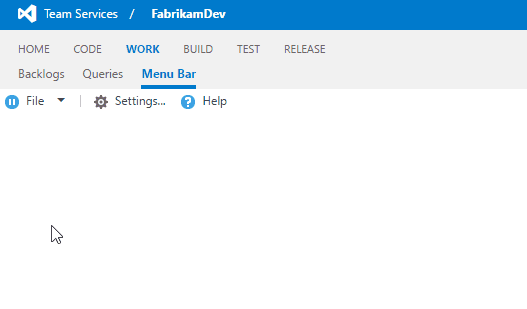

# Use the menubar control

This page shows different samples about the menubar control.

**Go to [API Reference](../../reference/client/controls/menubar.md) for more details.**

<a name="basic"></a>
## Basic menubar
This sample shows the basic usage of the toolbar. Notice how `text` is added to the separators which becomes a group text for sub menus.

<ul class="nav nav-tabs" data-tabs="tabs">
<li class="active"><a data-toggle="tab" href="#typescript_basic_menubar">TypeScript</a></li>
<li><a data-toggle="tab" href="#javascript_basic_menubar">JavaScript</a></li>
</ul>

<div class="tab-content">
  <div id="typescript_basic_menubar" class="tab-pane fade in active">
<pre><code class="lang-typescript">
import Controls = require("VSS/Controls");
import Menus = require("VSS/Controls/Menus");
  
var container = $(".sample-container");

var menuItems: Menus.IMenuItemSpec[] = [
  { id: "file", text: "File", icon: "icon-pause", childItems: [
    { separator: true, text: "NEW" }, // Separator as group text
    { id: "new-tab", text: "New tab", icon: "icon-info" },
    { id: "new-file", text: "New file", icon: "icon-commented-file" },
    { separator: true, text: "SAVE" }, , // Separator as group text
    { id: "save-file", text: "Save file", icon: "icon-save" },
    { id: "save-file-close", text: "Save file & close", icon: "icon-save-close" },
    { separator: true}, // Default separator
    { id: "save-all", text: "Save all", icon: "icon-save-all" },
    { separator: true, text: "MISC"}, // Separator as group text
    { id: "recent-files", text: "Recent files", icon: "icon-play", childItems: [
      { id: "file1", text: "file1.txt", icon: "icon-restricted" },
      { id: "file2", text: "file2.txt", icon: "icon-restricted" },
      { id: "file3", text: "file3.txt", icon: "icon-restricted" }
    ]},
    { id: "exit", text: "Exit" }
  ]},
  { separator: true }, // Default separator
  { id: "settings", text: "Settings...", icon: "icon-settings" },
  { id: "help", text: "Help", icon: "icon-help", tag: "test" }   
];

var menubarOptions = {
  items: menuItems
};

var menubar = Controls.create<Menus.MenuBar, any>(Menus.MenuBar, container, menubarOptions);
</code></pre>
  </div>
  <div id="javascript_basic_menubar" class="tab-pane fade">
<pre><code class="lang-javascript">
VSS.require(["VSS/Controls", "VSS/Controls/Menus"], function(Controls, Menus) {
  var container = $("#sample-container");


  var menuItems = [
    { id: "file", text: "File", icon: "icon-pause", childItems: [
      { separator: true, text: "NEW" }, // Separator as group text
      { id: "new-tab", text: "New tab", icon: "icon-info" },
      { id: "new-file", text: "New file", icon: "icon-commented-file" },
      { separator: true, text: "SAVE" }, , // Separator as group text
      { id: "save-file", text: "Save file", icon: "icon-save" },
      { id: "save-file-close", text: "Save file & close", icon: "icon-save-close" },
      { separator: true}, // Default separator
      { id: "save-all", text: "Save all", icon: "icon-save-all" },
      { separator: true, text: "MISC"}, // Separator as group text
      { id: "recent-files", text: "Recent files", icon: "icon-play", childItems: [
        { id: "file1", text: "file1.txt", icon: "icon-restricted" },
        { id: "file2", text: "file2.txt", icon: "icon-restricted" },
        { id: "file3", text: "file3.txt", icon: "icon-restricted" }
      ]},
      { id: "exit", text: "Exit" }
    ]},
    { separator: true }, // Default separator
    { id: "settings", text: "Settings...", icon: "icon-settings" },
    { id: "help", text: "Help", icon: "icon-help", tag: "test" }   
  ];

  var menubarOptions = {
    items: menuItems
  };

  var menubar = Controls.create(Menus.MenuBar, container, menubarOptions);
  
 });
  
VSS.notifyLoadSucceeded();
 </code></pre>
  </div>
</div>

<div align="center" style="padding-top:15px">
 
</div>

<a name="actions"></a>
## Actions of the menubar
This sample uses `executeAction` delegate to react menubar commands.

<ul class="nav nav-tabs" data-tabs="tabs">
<li class="active"><a data-toggle="tab" href="#typescript_action_menubar">TypeScript</a></li>
<li><a data-toggle="tab" href="#javascript_action_menubar">JavaScript</a></li>
</ul>

<div class="tab-content">
  <div id="typescript_action_menubar" class="tab-pane fade in active">
<pre><code class="lang-typescript">
import Controls = require("VSS/Controls");
import Menus = require("VSS/Controls/Menus");

var container = $(".sample-container");

var menuItems: Menus.IMenuItemSpec[] = [
  { id: "new-tab", text: "New tab", icon: "icon-info" },
  { separator: true },
  { id: "save-all", text: "Save all", icon: "icon-save-all" },
  { separator: true },
  { id: "exit", text: "Exit", noIcon: true }
];

var menubarOptions = {
  items: menuItems,
  executeAction: function (args) {
    var command = args.get_commandName();
    switch (command) {
        case "new-tab":
          alert("Opening new tab!");
          break;
        case "save-all":
          alert("Saving all!");
          break;
        case "exit":
          alert("Exit!");
          break;
        default:
          alert("Unhandled action: " + command);
          break;
    }
  }
};

Controls.create<Menus.MenuBar, any>(Menus.MenuBar, container, menubarOptions);
</code></pre>
  </div>
  <div id="javascript_action_menubar" class="tab-pane fade">
<pre><code class="lang-javascript">
VSS.require(["VSS/Controls", "VSS/Controls/Menus"], function(Controls, Menus) {
  var container = $("#sample-container");


  var menuItems = [
    { id: "new-tab", text: "New tab", icon: "icon-info" },
    { separator: true },
    { id: "save-all", text: "Save all", icon: "icon-save-all" },
    { separator: true },
    { id: "exit", text: "Exit", noIcon: true }
  ];

  var menubarOptions = {
    items: menuItems,
    executeAction: function (args) {
      var command = args.get_commandName();
      switch (command) {
          case "new-tab":
            alert("Opening new tab!");
            break;
          case "save-all":
            alert("Saving all!");
            break;
          case "exit":
            alert("Exit!");
            break;
          default:
            alert("Unhandled action: " + command);
            break;
      }
    }
  };

  var menubar = Controls.create(Menus.MenuBar, container, menubarOptions);
  
 });
  
VSS.notifyLoadSucceeded();
 </code></pre>
  </div>
</div>

<div align="center" style="padding-top:15px">
 
</div>

<a name="disabled"></a>
## Toggle enabled/disabled
This sample shows how the menu items can be enabled/disabled.
```html
<button id="btnToggle">Toggle Enabled/Disabled</button>
```

<ul class="nav nav-tabs" data-tabs="tabs">
<li class="active"><a data-toggle="tab" href="#typescript_toggle_menubar">TypeScript</a></li>
<li><a data-toggle="tab" href="#javascript_toggle_menubar">JavaScript</a></li>
</ul>

<div class="tab-content">
  <div id="typescript_toggle_menubar" class="tab-pane fade in active">
<pre><code class="lang-typescript">
import Controls = require("VSS/Controls");
import Menus = require("VSS/Controls/Menus");

var container = $(".sample-container");

var menuItems: Menus.IMenuItemSpec[] = [
  { id: "settings", text: "Settings...", icon: "icon-settings" },
  { id: "help", text: "Help", icon: "icon-help", tag: "test" } 
];

var menubar = Controls.create(Menus.MenuBar, container, { items: menuItems });

$("#btnToggle").click(function (e) {
  // Get the menu item first
  var settingsItem = menubar.getItem("settings");

  // Update the disabled state
  menubar.updateCommandStates([
    { id: "settings", disabled: !(settingsItem.getCommandState() & Menus.MenuItemState.Disabled) },
  ]);
});
</code></pre>
  </div>
  <div id="javascript_toggle_menubar" class="tab-pane fade">
<pre><code class="lang-javascript">
VSS.require(["VSS/Controls", "VSS/Controls/Menus"], function(Controls, Menus) {
  var container = $("#sample-container");


  var menuItems = [
    { id: "new-tab", text: "New tab", icon: "icon-info" },
    { separator: true },
    { id: "save-all", text: "Save all", icon: "icon-save-all" },
    { separator: true },
    { id: "exit", text: "Exit", noIcon: true }
  ];

 var menuItems = [
    { id: "settings", text: "Settings...", icon: "icon-settings" },
    { id: "help", text: "Help", icon: "icon-help", tag: "test" } 
  ];

  var menubar = Controls.create(Menus.MenuBar, container, { items: menuItems });

  $("#btnToggle").click(function (e) {
    // Get the menu item first
    var settingsItem = menubar.getItem("settings");

    // Update the disabled state
    menubar.updateCommandStates([
      { id: "settings", disabled: !(settingsItem.getCommandState() & Menus.MenuItemState.Disabled) },
    ]);
  });
});
  
VSS.notifyLoadSucceeded();
 </code></pre>
  </div>
</div>

<div align="center" style="padding-top:15px">
 
</div>

<a name="hidden"></a>
## Toggle visible/hidden
This sample shows how the menu items can be made visible/hidden.
```html
<button id="btnToggle">Toggle Show/Hide</button>
```
<ul class="nav nav-tabs" data-tabs="tabs">
<li class="active"><a data-toggle="tab" href="#typescript_hide_menubar">TypeScript</a></li>
<li><a data-toggle="tab" href="#javascript_hide_menubar">JavaScript</a></li>
</ul>

<div class="tab-content">
  <div id="typescript_hide_menubar" class="tab-pane fade in active">
<pre><code class="lang-typescript">
import Controls = require("VSS/Controls");
import Menus = require("VSS/Controls/Menus");

var container = $(".sample-container");

var menuItems: Menus.IMenuItemSpec[] = [
  { id: "settings", text: "Settings...", icon: "icon-settings" },
  { id: "help", text: "Help", icon: "icon-help", tag: "test" }
];

var menubar = Controls.create(Menus.MenuBar, container, { items: menuItems });

$("#btnToggle").click(function (e) {
  // Get the menu item first
  var helpItem = menubar.getItem("help");

  // Update the command state
  menubar.updateCommandStates([
    { id: "help", hidden: !(helpItem.getCommandState() & Menus.MenuItemState.Hidden) }
  ]);
});
</code></pre>
  </div>
  <div id="javascript_hide_menubar" class="tab-pane fade">
<pre><code class="lang-javascript">
VSS.require(["VSS/Controls", "VSS/Controls/Menus"], function(Controls, Menus) {
  var container = $("#sample-container");


 var menuItems = [
      { id: "settings", text: "Settings...", icon: "icon-settings" },
    { id: "help", text: "Help", icon: "icon-help", tag: "test" }
  ];

  var menubar = Controls.create(Menus.MenuBar, container, { items: menuItems });

  $("#btnToggle").click(function (e) {
    // Get the menu item first
    var helpItem = menubar.getItem("help");

    // Update the command state
    menubar.updateCommandStates([
      { id: "help", hidden: !(helpItem.getCommandState() & Menus.MenuItemState.Hidden) }
    ]);
  });
});
  
VSS.notifyLoadSucceeded();
 </code></pre>
  </div>
</div>

<div align="center" style="padding-top:15px">
 
</div>
