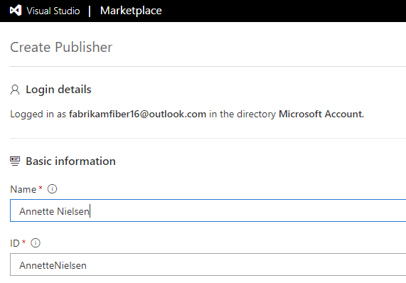
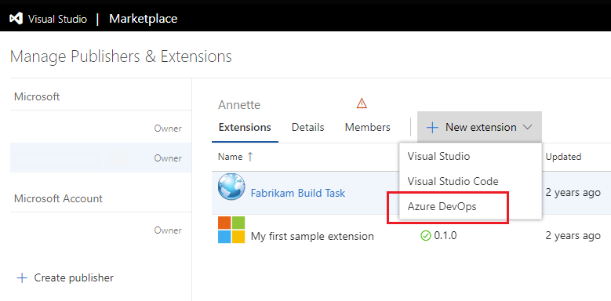
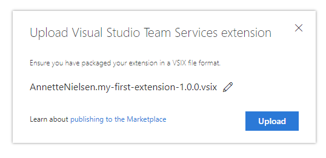
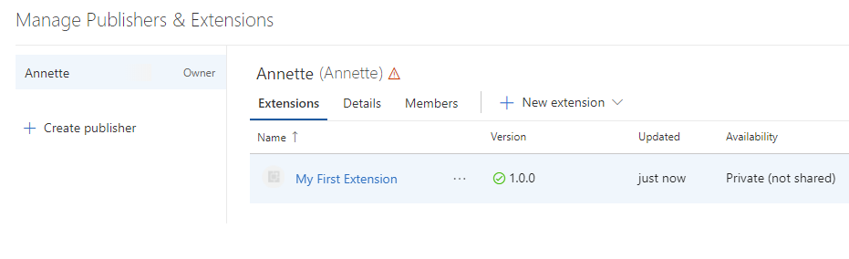
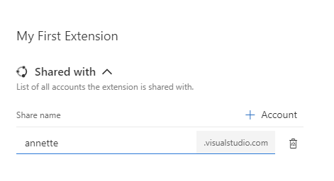
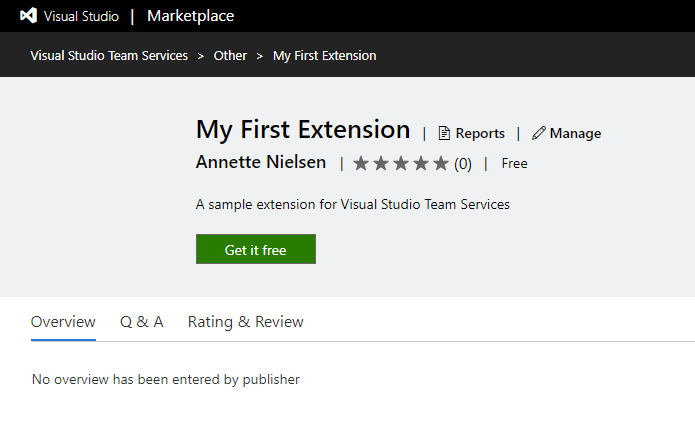
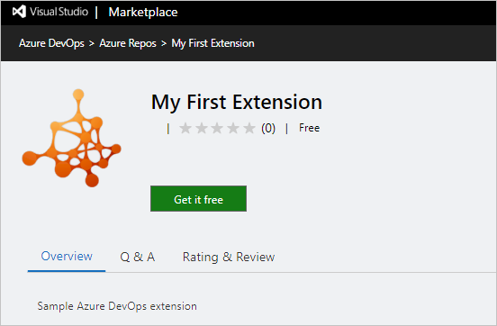
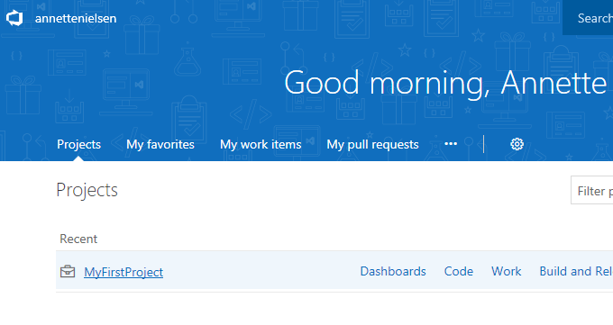
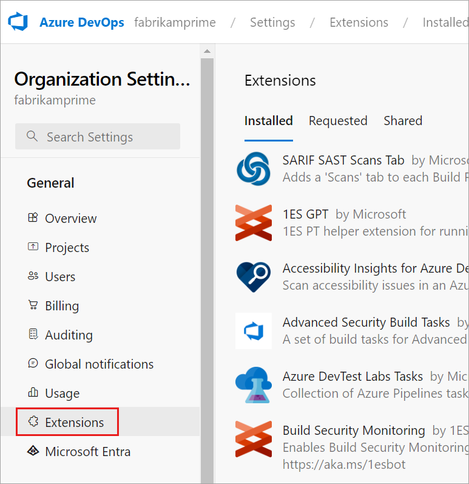

# Develop a web extension

[!INCLUDE [version-tfs-2017-through-vsts](../../report/includes/version-tfs-2017-through-vsts.md)]

Use extensions to enhance Azure DevOps with new web experiences, dashboard widgets, build tasks, and more. You can develop extensions using standard technologies like HTML, JavaScript, and CSS. They're packaged and published to the Visual Studio Marketplace, and can then be installed into an organization.

[!INCLUDE [extension-docs-new-sdk](../../includes/extension-docs-new-sdk.md)]

This tutorial guides you through creating your first web extension, which includes the following tasks.

> [!div class="checklist"]
> * Install the required tools
> * Read a local directory for your extension
> * Create an extension manifest file and hub contribution
> * Package and publish your extension to the Marketplace
> * Test your extension in an organization

[!INCLUDE [preview](../_data/get-help.md)]

## Prerequisites

You must have the following permission and installations.

- You're an organization Owner. If you don't have an organization, you can [create an organization for free](https://app.vsaex.visualstudio.com/profile/account).

- Install [Node.js](https://nodejs.org).

- Install the extension packaging tool (TFX) by running `npm install -g tfx-cli` from a command prompt.

## Create a directory and manifest

An extension is composed of a set of files that includes a required manifest file. You package it into a .vsix file and publish to the Visual Studio Marketplace.

1. Create a directory to hold the files needed for your extension:
   ```
   mkdir my-first-extension
   ```

2. From this directory, initialize a new NPM package manifest:
   ```
   npm init -y
   ```
   
   This file describes the libraries required by your extension.

3. Install the Microsoft VSS Web Extension SDK package and save it to your NPM package manifest:
   ```
   npm install vss-web-extension-sdk --save
   ```

   This SDK includes a JavaScript library that provides APIs required for communicating with the page your extension is embedded in.

4. Create an extension manifest file named `vss-extension.json` at the root of your extension directory with the following content:

    ```json
    {
        "manifestVersion": 1,
        "id": "my-first-extension",
        "publisher": "",
        "version": "1.0.0",
        "name": "My First Extension",
        "description": "A sample Visual Studio Services extension",
        "public": false,
        "categories": ["Azure Repos"],
        "targets": [
            {
                "id": "Microsoft.VisualStudio.Services"
            }
        ],
        "contributions": [
            {
                "id": "my-hub",
                "type": "ms.vss-web.hub",
                "targets": [
                    "ms.vss-code-web.code-hub-group"
                ],
                "properties": {
                    "name": "My Hub",
                    "uri": "my-hub.html"
                }
            }
        ],
        "files": [
            {
                "path": "my-hub.html",
                "addressable": true
            },
            {
                "path": "node_modules/vss-web-extension-sdk/lib",
                "addressable": true,
                "packagePath": "lib"
            }
        ]
    }
    ```

    >[!NOTE]
    >The `public` property controls whether the extension is visible to everyone on the Visual Studio Marketplace. Keep your extensions private during development.

5. Create a file named `my-hub.html` at the root of your extension directory with the following content, which is for the view (also known as a hub) contributed into the web experience.

    ```html
    <!DOCTYPE html>
    <html xmlns="http://www.w3.org/1999/xhtml">
    <head>
        <script src="lib/VSS.SDK.min.js"></script>
        <style>
            body {
                background-color: rgb(0, 67, 117);
                color: white;
                margin: 10px;    
                font-family: "Segoe UI VSS (Regular)","-apple-system",BlinkMacSystemFont,"Segoe UI",sans-serif;
            }
        </style>
        <script type="text/javascript">
            VSS.init();
            VSS.ready(function() {
                document.getElementById("name").innerText = VSS.getWebContext().user.name;
            });
        </script>
    </head>
    <body>        
        <h1>Hello, <span id="name"></span></h1>
    </body>
    </html>
    ```

6. Your extension directory should look like the following example.

    ```
    |-- my-hub.html
    |-- node_modules
        |-- @types
        |-- vss-web-extension-sdk
    |-- package.json
    |-- vss-extension.json
    ```

You're now ready to package, publish, and test your extension.

## Package and publish your extension

### Create a publisher

All extensions, including extensions from Microsoft, are under a publisher. Anyone can create a publisher and publish extensions under it. You can also give other people access to your publisher if a team is developing the extension.

1. Sign in to the Visual Studio [Marketplace management portal](https://aka.ms/vsmarketplace-manage)

2. If you don't already have a publisher, you'll be prompted to create one.

3. In the Create Publisher form, enter your name in the publisher name field. The ID field should get set automatically based on your name:

     

    > [!NOTE]
    > Make note of the ID. You need to set it in the manifest file of your extension.

You're now ready to package your extension and publish (upload) it to the Marketplace. Keep this browser window open as you'll return here after you package your extension.

#### Package your extension

1. Open your extension manifest file (`vss-extension.json`) and set the value of the `publisher` field to the ID of your publisher. For example:
    ```json
    {
        ...
        "id": "my-first-extension",
        "publisher": "AnnetteNielsen",
        ...
    }
    ```     

2. VSS Web Extensions SDK requires TFX. If you haven't already installed it, open a command prompt and run the following command. 
   
   ```
   npm install -g tfx-cli
   ```


3. From a command prompt, run the TFX tool's packaging command from your extension directory.

   ```
   npx tfx-cli extension create
   ```
   

   
   When it's completed, you see a message indicating your extension has been successfully packaged:

   ```
   === Completed operation: create extension ===
   - VSIX: C:\my-first-extension\AnnetteNielsen.my-first-extension-1.0.0.vsix
   - Extension ID: my-first-extension
   - Extension Version: 1.0.0
   - Publisher: AnnetteNielsen
   ```

#### Upload your extension

1. From the [management portal](https://aka.ms/vsmarketplace-manage), select your publisher from the drop-down at the top of the page.

2. Select **New extension**, and then select **Azure DevOps**.

     

3. Drag and drop your file or select it to find your VSIX file, which you created in the previous packaging step, and then choose **Upload**. 

   

   After a few seconds, your extension appears in the list of published extensions. Don't worry, the extension is only visible to you.

    

## Install your extension

To test an extension, it must be installed to an organization in Azure DevOps. Installing requires being the owner of the organization (or having the necessary permissions). Because your extension is private, it must first be shared with the organization you want to install it to.

1. From the management portal, select your extension from the list, right-click, and choose **Share/Unshare** or **Publish/Unpublish**, depending on the extension; Share = Publish and Unshare = Unpublish.

    

2. Select **Organization**, and then enter the name of your organization. Select **Enter**.

    

3. Close the panel.

   Your extension can now be installed into this organization.

4. In the Marketplace, select your extension to open its overview page.

:::moniker range="<= tfs-2018"

    

:::moniker-end

::: moniker range=">= azure-devops-2019"
   
   

:::moniker-end

  > [!NOTE]
  > Because your extension is private, only you and any member of the organization it is shared with can see this page.

1. Select **Get it free** to start the installation process. Select the organization you shared the extension with from the dropdown menu.

    

2. Select **Install**.

Congratulations! Your extension is now installed into an organization and is ready to be tested.

## Try your extension

Your extension contributed a view named "My Hub" to the project-level Code area. Let's navigate to it.

1. Select **Proceed to organization** at the end of the installation wizard to navigate to the home page of the organization the extension was installed to (`https://dev.azure.com/{organization}`).

:::moniker range="<= tfs-2018"

2. Select any of the projects listed to navigate into it:

    

   If there aren't any projects in your organization, you're prompted to create one.

3. Navigate to the Code area and then to the hub contributed by your extension (**My Hub**):

   

:::moniker-end

:::moniker range=">= azure-devops-2019"

2. Select **Organization settings**, and then select **Extensions** to see your newly installed extension.

    

:::moniker-end
   
## Debugging your extension

To debug the extension using Visual Studio or Browser Developer Tools and speed up the development without redeploying extension each time you change source code, you need change manifest adding `baseUri` property:
```json
{
    ...
    "baseUri": "https://localhost:44300",
    ...
}
```     

Changing the manifest loads the extension from your local web server instance. For example, IISExpress in Visual Studio.
After you change the manifest, deploy and install this debugging extension only once.

> [!NOTE]
> Run your local web server in SSL mode, because Azure DevOps demands that the web page is served from a secure source otherwise you obtain an error in browser console during the extension IFRAME loading.


## Next steps

> [!div class="nextstepaction"]
> [Explore the extension samples](../develop/samples-overview.md)

## Related articles

- [Developer Formula Design System](https://developer.microsoft.com/azure-devops/)

