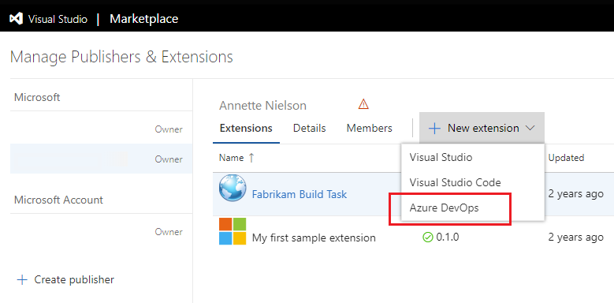

# Develop a web extension for Azure DevOps Services

Extensions enhance Azure DevOps Services and Team Foundation Server (TFS) by contributing enhancements like new web experiences, dashboard widgets, build tasks, and more. Extensions are developed using standard technologies like HTML, JavaScript, and CSS, are packaged and published to the Visual Studio Marketplace, and can then be installed into an organization.

This tutorial will guide you through creating your first web extension.

You will:

> [!div class="checklist"]
> * Install the required tools
> * Ready a local directory for your extension
> * Create an extension manifest file and hub contribution
> * Package and publish your extension to the Marketplace
> * Test your extension in an organization

[!INCLUDE [preview](../_data/get-help.md)]

## Prerequisites

To develop and test your extension you will need:

1. An organization where you have permission to install extensions to (i.e. you are the owner). 

   > If you don't have a personal organization, you can [create an organization for free](https://app.vsaex.visualstudio.com/profile/account).

2. Install [Node.js](https://nodejs.org)

3. Install the extension packaging tool (TFX) by running `npm install -g tfx-cli` from a command prompt

## Create a directory and manifest

An extension is composed of a set of files, including a required manifest file, that you package into a .vsix file and publish to the Visual Studio Marketplace.

1. Create a directory to hold the files needed for your extension:
   ```
   md my-first-extension
   ```

2. From this directory initialize a new NPM package manifest:
   ```
   npm init -y
   ```
   
   > This file describes the libraries required by your extension.

3. Install the Microsoft VSS Web Extension SDK package and save it to your NPM package manifest:
   ```
   npm install vss-web-extension-sdk --save
   ```

   > This SDK includes a JavaScript library that provides APIs required for communicating with the page your extension will be embedded in.

4. Create an extension manifest file named `vss-extension.json` at the root of your extension directory with the following content:

    ```json
	{
		"manifestVersion": 1,
		"id": "my-first-extension",
		"publisher": "",
		"version": "1.0.0",
		"name": "My First Extension",
		"description": "A sample Visual Studio Services extension",
		"public": false,
		"categories": ["Azure Repos"],
		"targets": [
			{
				"id": "Microsoft.VisualStudio.Services"
			}
		],
		"contributions": [
			{
				"id": "my-hub",
				"type": "ms.vss-web.hub",
				"targets": [
					"ms.vss-code-web.code-hub-group"
				],
				"properties": {
					"name": "My Hub",
					"uri": "my-hub.html"
				}
			}
		],
		"files": [
			{
				"path": "my-hub.html",
				"addressable": true
			},
			{
				"path": "node_modules/vss-web-extension-sdk/lib",
				"addressable": true,
				"packagePath": "lib"
			}
		]
	}
    ```

	>[!NOTE]
    >The `public` property controls whether the extension is visible to everyone on the Visual Studio Marketplace. During development you should keep your extensions private.

5. Create a file named `my-hub.html` at the root of your extension directory with the following content:

	```html
	<!DOCTYPE html>
	<html xmlns="http://www.w3.org/1999/xhtml">
	<head>
    	<script src="lib/VSS.SDK.min.js"></script>
    	<style>
        	body {
            	background-color: rgb(0, 67, 117);
            	color: white;
            	margin: 10px;    
            	font-family: "Segoe UI VSS (Regular)","-apple-system",BlinkMacSystemFont,"Segoe UI",sans-serif;
        	}
    	</style>
    	<script type="text/javascript">
        	VSS.init();
        	VSS.ready(function() {
            	document.getElementById("name").innerText = VSS.getWebContext().user.name;
        	});
    	</script>
	</head>
	<body>        
    	<h1>Hello, <span id="name"></span></h1>
	</body>
	</html>
	```

	This will be the content for the view (also known as a hub) contributed into the Azure DevOps Services web experience.

6. At this point your extension directory should look like this:

	```
	|-- my-hub.html
	|-- node_modules
		|-- @types
		|-- vss-web-extension-sdk
	|-- package.json
	|-- vss-extension.json
	```

You're now ready to package, publish, and test your extension.

## Package and publish your extension

#### Create a publisher

All extensions, including extensions from Microsoft, live under a publisher. Anyone can create a publisher and publish extensions under it. You can also give other people access to your publisher if a team is developing the extension.

1. Sign in to the Visual Studio [Marketplace management portal](https://aka.ms/vsmarketplace-manage)

2. If you don't already have a publisher, you'll be prompted to create one.

3. In the Create Publisher form, enter your name in the publisher name field. The ID field should get set automatically based on your name:

   	

    >[!NOTE]
    >Remember this ID. You will need to set it in the manifest file of your extension.

You're now ready to package your extension and publish (upload) it to the Marketplace. Keep this browser window open as you'll need to return here after you have packaged your extension.

#### Package your extension

1. Open your extension manifest file (`vss-extension.json`) and set the value of the `publisher` field to the ID of your publisher. For example:
    ```json
	{
		...
		"id": "my-first-extension",
		"publisher": "AnnetteNielsen",
		...
	}
	```		

2. From a command prompt, run the TFX tool's packaging command from your extension directory:
   ```
   tfx extension create
   ```

3. Once this completes you will see a message indicating your extension has been successfully packaged:
   ```
   === Completed operation: create extension ===
   - VSIX: C:\my-first-extension\AnnetteNielsen.my-first-extension-1.0.0.vsix
   - Extension ID: my-first-extension
   - Extension Version: 1.0.0
   - Publisher: AnnetteNielsen
   ```

#### Upload your extension

1. From the [management portal](https://aka.ms/vsmarketplace-manage) select your publisher from the drop-down at the top of the page.

2. Tap **New Extension** and select **Azure DevOps**:
   	
	

3. Click the link in the center of the Upload dialog to open a browse dialog. 

4. Locate the .vsix file (created in the packaging step above) and choose **Upload**:

   

4. After a few seconds your extension will appear in the list of published extensions. Don't worry, the extension is only visible to you.

   

## Install your extension

To test an extension, it must be installed to an organization in Azure DevOps Services. Installing requires being the owner of the organization (or having the necessary permissions). Because your extension is private, it must first be shared with the organization you want to install it to.

1. From the management portal, select your extension from the list, right-click, and choose **Share/Unshare** .

   

2. Click the **+ Organization** button, enter the name of your organization, and press enter.

   

3. Click the **X** to close this panel.

Your extension can now be installed into this organization.

4. Right-click your extension and choose  **View Extension** to open its details page

   

   >[!NOTE]
   >Because your extension is private, only you (as the publisher of the extension) and any member of the organization it is shared with can see this page.

5. Click **Get it free** to start the installation process. The organization you shared the extension with should be selected:

   

6. Click **Install**.

Congratulations! Your extension is now installed into an organization and is ready to be tested.

## Try your extension

Your extension contributed a view named "My Hub" to the project-level Code area. Let's navigate to it.

1. Tap the **Proceed to organization** button at the end of the installation wizard to navigate to the home page of the organization the extension was installed to (`https://dev.azure.com/{organization}`).

2. Click any of the projects listed to navigate into it:

   

   > If there are no projects in your organization, you will be prompted to create one.

3. Navigate to the Code area and then to the hub contributed by your extension (**My Hub**):

   

## Next steps

> [!div class="nextstepaction"]
> [See more tutorials](tutorials.md)

> [!div class="nextstepaction"]
> [Explore the samples](https://github.com/Microsoft/vsts-extension-samples/)
