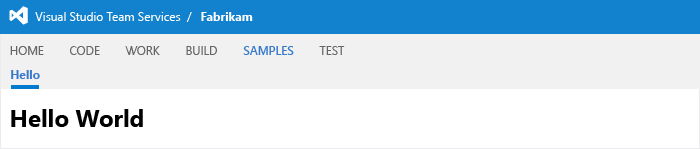

1. Add a hub group to your app's manifest file in contributions, like this.

    ```json
    "contributions": [
        {
            "id": "sample-hub-group",
            "type": "ms.vss-web.hub-group",
            "description": "Adds a 'Samples' hub group at the project/team-level",
            "targets": [
                "ms.vss-web.project-hub-groups-collection"
            ],
            "properties": {
                "name": "Samples",
                "order": 100
            }
        },
     ]
    ```

	Look at the contribution targets reference to see the [available hub groups that can be contributed to](/previous-versions/azure/devops/extend/reference/targets/overview#targets).

2. Change the hub contribution so that it's in the samples hub group that you just created. Just update the targets to the relative contribution ID of the hub group you just added.

    ```json
        {
            "id": "Fabrikam.HelloWorld",
            "type": "ms.vss-web.hub",
            "description": "Adds a 'Hello' hub to the Work hub group.",
            "targets": [
                ".sample-hub-group"
            ],
            "properties": {
                "name": "Hello",
                "order": 99,
                "uri": "hello-world.html"
            }
        }
    ```

4. [Install](../../develop/install.md) your extension.

   Now your hub appears under your Samples hub group.

   
