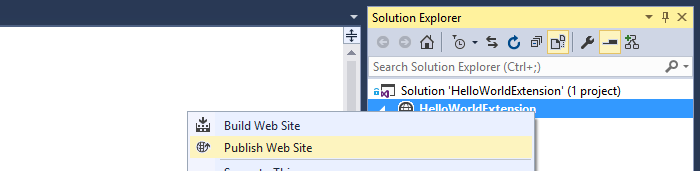
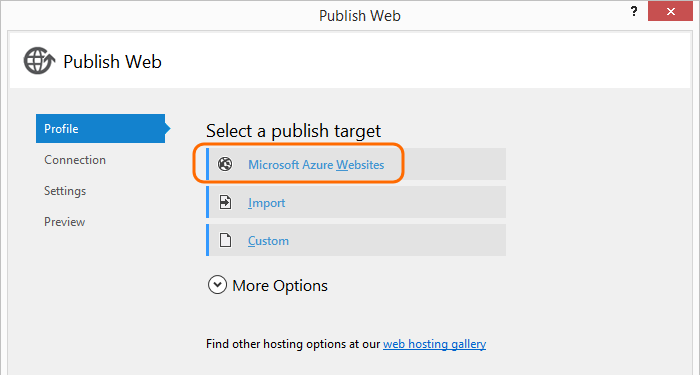

1. If you don't have an Azure subscription, create one.
You can use the [free trial](https://azure.microsoft.com/pricing/free-trial/).

2. Create a web app in Microsoft Azure to host your extension.

    

3. Publish your web site from the solution explorer.

    

4. Publish to Azure.

    

5. Pick the web app that you set up to host your extension.

    

    If your web site doesn't show up, use the **Manage subscriptions** dialog to connect your Visual Studio organization to your Microsoft Azure subscription.

6. Publish your extension.

    

7. Change your extension manifest to use your Microsoft Azure web app instead of localhost.

    ```json
    "baseUri": "https://fabrikam-vso-extensions.azurewebsites.net/",
    ```

8. [Install your extension](../../../marketplace/install-extension.md) again and try it out.