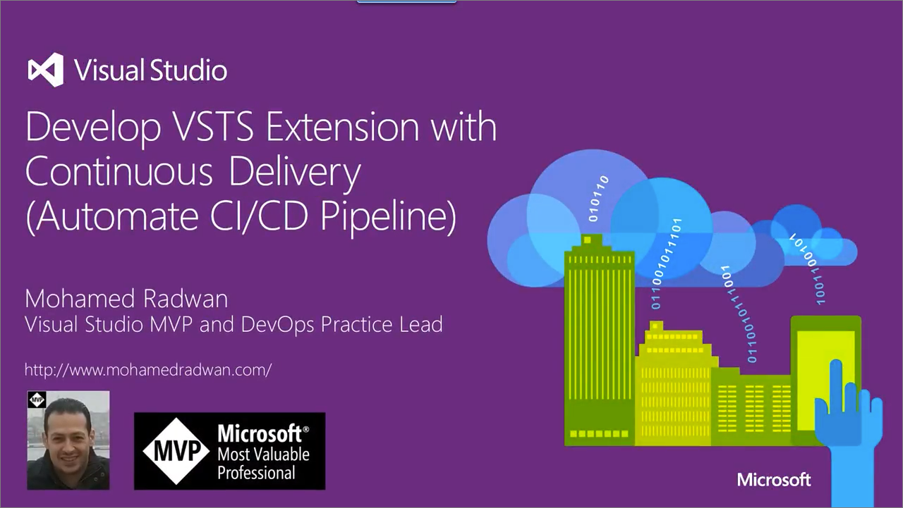

# Develop Extensions

Extensions are simple add-ons that can be used to customize and extend your DevOps experience with Azure DevOps Services. They are written with standard technologies - HTML, JavaScript, CSS - and can be developed using your preferred dev tools.

<a name ="customApps"/>

## 5-minute Quickstarts 
Check out the quick starts to get you started:
* [Write your first extension](get-started/node.md)

## Videos

Develop Azure DevOps Services extension with continuous delivery pipeline:

## Concepts
* [Extension points](reference/targets/overview.md)
* [Contribution model](develop/contributions-overview.md)

## Samples
* [Sample extensions](develop/samples-overview.md)

## How-to Guides
* Develop
    * [Add a build task](develop/add-build-task.md)
    * [Extend the work item form for work item tracking](develop/add-workitem-extension.md)
    * [Add a dashboard widget](develop/add-dashboard-widget.md)
    * [Call a REST API](develop/call-rest-api.md)
* Package and publish
    * [Package and publish extensions](publish/overview.md)
    * [Package and publish integrations](publish/integration.md)

## Reference
* [Manifest reference](develop/manifest.md)
* [Build task reference](develop/integrate-build-task.md)
* [Endpoint authentication schemes](develop/auth-schemes.md)
* [Content hosting](develop/static-content.md)
* [Modal dialog](develop/using-host-dialog.md)
* [Host page navigation](develop/host-navigation.md)
* [Basic styles for widgets](develop/styles-from-widget-sdk.md)
* [Auth and security](develop/auth.md)
* [Deploy web content to Azure](publish/publish-azure.md)
* UI controls
    * [Combo](reference/client/controls/combo.md)
    * [Grid](reference/client/controls/grid.md)
    * [TreeView](reference/client/controls/tree.md)
    * [MenuBar](reference/client/controls/menubar.md)
    * [Modal Dialog](reference/client/controls/modaldialog.md)
    * [Splitter](reference/client/controls/splitter.md)
    * [WaitControl](reference/client/controls/waitcontrol.md)

