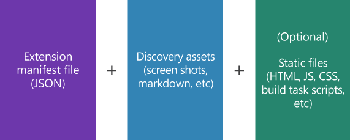
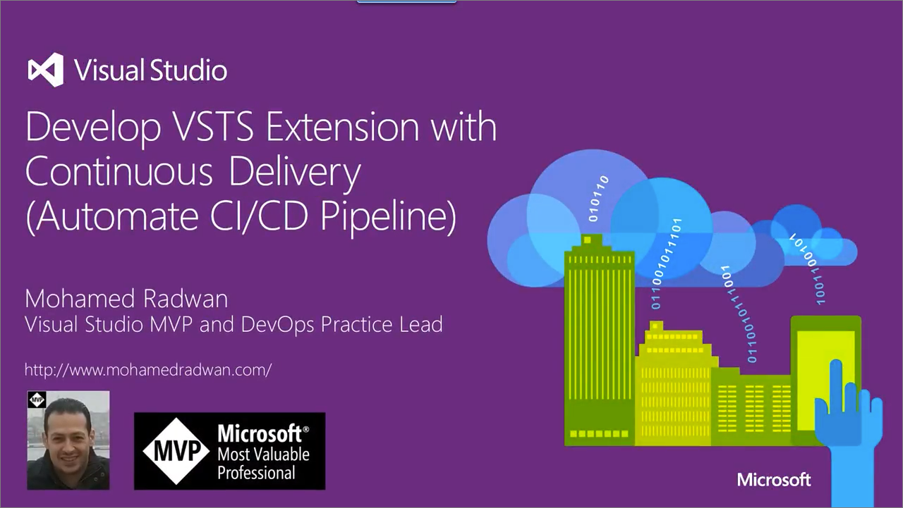

# What are extensions?

[!INCLUDE [version-tfs-2017-through-vsts](../includes/version-tfs-2017-through-vsts.md)]

Extensions are add-ons you can use to customize and extend your DevOps experience with Azure DevOps. 
They're written with standard technologies - HTML, JavaScript, CSS - and are developed using your preferred development tools. 
Extensions use our [RESTful API Library](/rest/api/azure/devops/) to easily interact with Azure DevOps and applications/services.
The [Visual Studio Marketplace](https://marketplace.visualstudio.com/azuredevops) is where extensions are published. 
They can be kept privately for you and your team or shared with the millions of developers currently using Azure DevOps. 

> [!NOTE]
> This section covers developing custom extensions and service-hooks, to find information on installing extensions from the Marketplace, or buying Visual Studio Subscriptions, visit the [Marketplace documentation](../marketplace/overview.md).

## What makes up an extension?

- A [JSON manifest file](./develop/manifest.md) contains basic info about the extension.
- Discovery assets - the markdown and images that make up your extension's overview and aesthetics in the Marketplace. 
- Static files that contain the logic of your extension, including HTML, JS, and CSS files. Static files are only applicable to contribution-based extensions.

These files and assets get bundled up to make a Team Extensions Service Package (.vsix file) that's published to the Marketplace. From the Marketplace,
extensions can be installed directly by users.

## What can you do with extensions?

There are dozens of places where you can add to the user interface, and we're adding more every sprint. Learn about all of the places where you can add a hub in the [contributions reference](/previous-versions/azure/devops/extend/reference/targets/overview).

- [Provide new Azure Pipelines tasks](./develop/add-build-task.md) that teams can use in their builds.
- Use [dashboard widgets](./develop/add-dashboard-widget.md) to get custom views within Azure DevOps. 
- Extend the [work item form](./develop/add-workitem-extension.md) with new tabs, sections, and actions.
- Create [your own hub](./develop/add-hub.md) to embed new capabilities within our Agile, code, build, and test experiences. 
- Develop [actions](./develop/add-action.md) that can be run on hubs, whether they're ours or ones you've created. 

## Build an extension for your delivery pipeline
You can develop an extension for your continuous delivery pipeline as described in the following video.

## Extension building checklist

1. Familiarize yourself with this article and the extension types already available within the Marketplace
    - [Extensions for Azure DevOps](https://marketplace.visualstudio.com/)
2. Learn to build your first extension or check out our full set samples
    - [Build your first extension](./get-started/node.md)
    - [Samples](./develop/samples-overview.md)
3. Familiarize yourself with our RESTful APIs. If you're integrating from a third party app or service, you'll also want to check out our Service Hooks
    - [REST APIs](/rest/api/azure/devops/)
    - [Service Hooks](../service-hooks/overview.md)
4. Once your extension is ready, you'll want to package it, publish it to the Marketplace, and then we hope you'll share it with the community!
    - [Package, publish, and install your extension](./publish/overview.md)
    - [Package and publish your integration with an external app or service](./publish/integration.md)
    - [Share your work publicly with the entire community](./publish/publicize.md)

## Next steps

> [!div class="nextstepaction"]
> [Write your first extension (Add a hub)](./get-started/node.md)

## Related articles

* [Visual Studio Marketplace](https://marketplace.visualstudio.com/azuredevops)
* [Extension Publisher Page](https://marketplace.visualstudio.com/manage)
* [Visual Studio Partner Program](https://vspartner.com/)
* [Extension manifest reference](./develop/manifest.md)