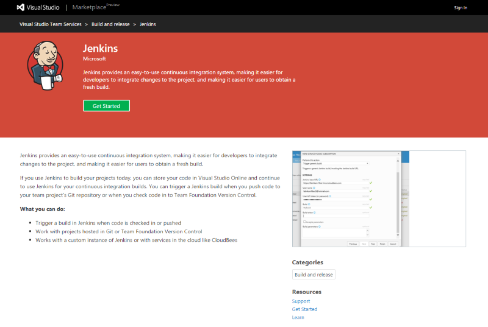
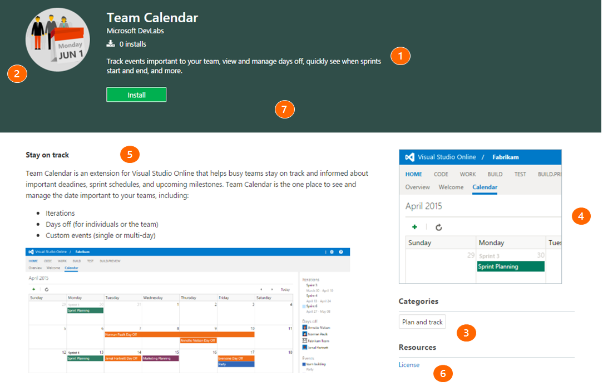

# Package and publish an integration to the Marketplace

[!INCLUDE [version-tfs-2017-through-vsts](../../includes/version-tfs-2017-through-vsts.md)]

Do you have a tool, service, or product that integrates with Azure DevOps or Team Foundation Server (TFS)?
If so, help users find it by publishing it on the Visual Studio Marketplace.
The Marketplace is a one-stop-shop for individuals and teams to find tools that extend and enhance the experience. 

[Browse the Marketplace](https://marketplace.visualstudio.com) to see examples of other integrations and extensions.

> [!NOTE]
> If you're looking for packaging and publishing information for extensions, check out [Package & Publish Extensions](overview.md).

## Publishing requirements

[!INCLUDE [](includes/before-publishing.md)]

## What you need

1. 128x128 pixel logo (PNG or JPEG format) representing your integration, yourself, or your company/organization
2. Minimum of one screenshot showing your integration
3. Call to action / get started URL (where users should go to get started with your integration)

## Steps

Publishing to the Marketplace is an iterative process that starts with creating a manifest file that defines your integration and key discovery characteristics (like screenshots, logos, and overview content). This information is used to present your integration to users on the Marketplace, for example:



[Jenkins for Azure DevOps](https://marketplace.visualstudio.com/items?itemName=ms-vsts.services-jenkins)

Note: The term, `extension`, is used in documentations referenced below. Extensions are another type of Marketplace item and share many similarities from a discovery standpoint as integrations.

<div class="alert alert-info">
    Need help with getting your integration on the Marketplace? <a href="https://go.microsoft.com/fwlink/?LinkId=615292" data-raw-source="[Contact us](https://go.microsoft.com/fwlink/?LinkId=615292)">Contact us</a>. And, yes, this e-mail address is monitored by real people. 
</div>

### Create a publisher

[!INCLUDE [](./includes/create-publisher.md)]

### Create a folder to contain your item manifest and other assets

Before you package your integration as an extension, you'll need to create a `home` folder to contain some required assets, within this folder:

1. Create a folder called `images` to contain:
    * Logo for your integration (128x128 pixels)
    * Screenshots (1366x768 pixels)
2. Create a file called `overview.md`
    * Describe your integration here
    * To learn more about markdown, see [GitHub Flavored Markdown](https://help.github.com/articles/github-flavored-markdown/)
3. Create a file called `vss-integration.json`
    * This file is your Marketplace listing's manifest file, it contains many properties to describe your extension in your Marketplace listing. You can browse the [extension manifest reference here](../develop/manifest.md)

#### Extension Manifest

1. Fill your `vss-integration.json` file with the following JSON:

   [!code-javascript[JSON](../_data/integration.json)]

2. Update the JSON using the following reference:

[!INCLUDE [](../includes/manifest-core.md)]
[!INCLUDE [](../includes/manifest-discovery.md)]

#### Details page

* 1 - description
* 2 - icon
* 3 - categories
* 4 - screenshots
* 5 - content (details)
* 6 - links
* 7 - branding



<div class="alert alert-danger">
  Make sure the &quot;public&quot; attribute gets set to &quot;false&quot; (or not set at all) to avoid your extension or integration from becoming prematurely visible to all users on the Marketplace. 
</div>

<a name="package"></a>

### Package your manifest and assets

#### Get the package tool (tfx-cli)
You can install or update the Cross-platform CLI for Azure DevOps (tfx-cli) using `npm`, a component of [Node.js](https://nodejs.org), from your command line.

```no-highlight
npm i -g tfx-cli
```

#### Package your integration in a .vsix file

```no-highlight
tfx extension create --manifest-globs vss-extension.json
```

> [!NOTE]
> An extension/integration's version must be incremented on every update. <br>
> If you haven't incremented your extension/integration in the manifest, you should pass the `--rev-version` command line switch. This increments the *patch* version number of your extension and saves the new version to your manifest.

### Publish your integration to the Marketplace

[!INCLUDE [Publish_extension](../includes/procedures/publish.md)]

### Share your integration
Before you can install an integration into an organization in Azure DevOps or TFS, you must share it with that organization. Sharing is a requirement during development and testing of an integration, as it's the only way to run an integration.

To share an integration do the following tasks:

1. Select an integration from the list of displayed items 
2. Select the **Share** button
3. Specify the name of the organization to make this integration visible to.
   - For example, to make an integration visible to the **dev.azure.com/fabrikam-fiber-inc** organization, specify `fabrikam-fiber-inc`.

#### Update an item

[!INCLUDE [Update_extension](../includes/procedures/update.md)]

## Make your integration public (visible to everyone) 

For information on making your integration public, visit [Make your listing public](./publicize.md).


