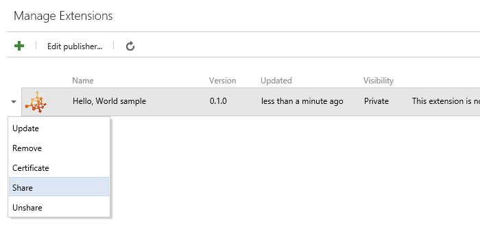

# Package, publish, unpublish, and install Azure DevOps Services extensions

After writing an Azure DevOps Services extension, the next step is to package it. After packaging, extensions are published, or uploaded, to the [Visual Studio Marketplace](https://marketplace.visualstudio.com/azuredevops), where they can be installed by users that the extensions are shared with. The Marketplace is a centralized, global repository for private and public extensions, integrations, and other offers from Microsoft.

>[!NOTE]
>For information on the discovery properties available in your extension's manifest file that will help users discover and learn about your extension, 
>visit the [Extension Manifest Reference](../develop/manifest.md#discoveryprops)

## Publishing Requirements

[!INCLUDE [](./_shared/before-publishing.md)]

## Create a publisher

[!INCLUDE [](./_shared/create-publisher.md)]

<a id="package" />

## Package

Extensions are packaged as VSIX 2.0-compatible .vsix files.
To upload your extension, you need to package it as a VSIX 2.0-compatible .vsix file.
Microsoft provides a cross-platform command line interface (CLI) to package (and also publish) your extension. 

### Get the package tool (tfx-cli)
You can install or update the TFS Cross Platform Command Line Interface (tfx-cli) using `npm`, a component of [Node.js](http://nodejs.org), from your command line.

```no-highlight
npm i -g tfx-cli
```

### Package your extension in a .vsix file

```no-highlight
tfx extension create --manifest-globs vss-extension.json
```

>[!NOTE]
>An extension/integration's version must be incremented on every update. <br>
>If you haven't incremented your extension/integration in the manifest, you should pass the `--rev-version` command line switch. This will increment the *patch* version number of your extension and save the new version to your manifest.

<a id="upload"></a>
## Publish

[!INCLUDE [Package_extension](../_shared/procedures/publish.md)]

## Share
<a name="shareextension" />

Before an extension can be installed into an organization in Azure DevOps Services, it must be shared with that organization. Sharing is a requirement during development and testing of an extension, as it is the only way to run an extension.

To share an extension so it can be installed:

1. Click on the ellipses of an extension item to bring up the menu
2. Click the **Share** button

  

3. Specify the name of the organization to make this extension visible to
  - For example, to make an extension visible to the **dev.azure.com/fabrikam-fiber-inc** organization, specify `fabrikam-fiber-inc`.


## Install 

To install an extension that has been shared:

1. From your organization home page, select the Marketplace icon in the top right corner and choose "Manage Extensions":

  

2. Find the extension under the **Shared with this organization** category:

  

3. Click the card to open the item in the Marketplace
4. From the item's details page, click the **Install** button
5. Choose the organization you shared the extension with and proceed through the installation process. 
  
## Update

[!INCLUDE [Update_extension](../_shared/procedures/update.md)]

## Make your extension public (visible to everyone)

For information on making your extension public, visit [Make your listing public](publicize.md).
   
## Unpublish
You can unpublish/delist free extensions, if you no longer want to offer them in the Marketplace or published by mistake. 

Here are some scenarios where you might want to remove your extension from the Marketplace:
  * You developed another extension and no longer want to offer the current one.
  * Your extension has a problem, so you want to remove your extension from the Marketplace until you have resolved the problem.
  * You published your extension as public by mistake.

To unpublish, select the extension on your [publisher page](https://aka.ms/vsmarketplace-manage) and choose **Unpublish** on the menu. 
Your extension will be unpublished immediately from the Marketplace, and new users won't be able to install it. Ratings and reviews for your extension will stay intact. 

To offer your extension again in the Marketplace, choose **Publish** on the menu.

You can also choose to remove your extension completely from the Marketplace if your extension has zero (0) installs. To do this, choose **Remove** on the menu. This action cannot be undone. 

###Unpublish/Remove requirements
Certain criteria must be met for an extension to be unpublished or removed:

| Action    | Requirements                                                  |
|-----------|---------------------------------------------------------------|
| Unpublish | Only **free extensions** may be unpublished.                  |
| Remove    | Your extension must have **zero (0)** installs to be removed. |

**Important**: If you must remove your extension due to legal or security problems, contact the [Marketplace team](https://aka.ms/vsmarketplace-contact). We will review the request and manually delete the extension. 

## Contact

Send questions about publishing items to the Visual Studio Marketplace to [vsmarketplace@microsoft.com](https://aka.ms/vsmarketplace-contact).
