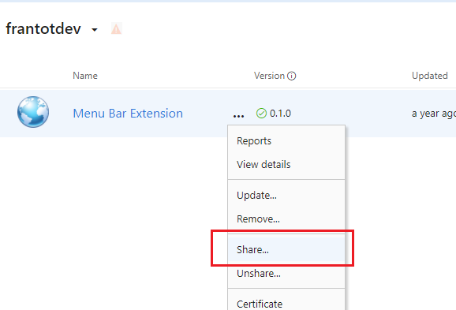
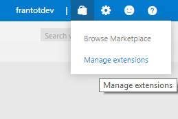
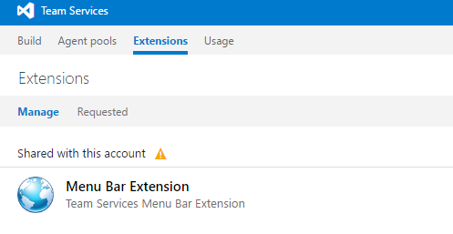

# Package, publish, unpublish, and install extensions

[!INCLUDE [version-tfs-2017-through-vsts](../../report/includes/version-tfs-2017-through-vsts.md)]

Once you've written your extension, the next step is to package it. Then, you publish or upload it to the [Visual Studio Marketplace](https://marketplace.visualstudio.com/azuredevops). Users can install the extension from the Marketplace if it's shared with them. The Marketplace is a global repository for private and public extensions, integrations, and other offers from Microsoft.

>[!NOTE]
>For information on the discovery properties available in your extension's manifest file that helps users discover and learn about your extension, 
>visit the [Extension Manifest Reference](../develop/manifest.md#discoveryprops).

## Prerequisites

[!INCLUDE [](./includes/before-publishing.md)]

## Create a publisher

[!INCLUDE [](./includes/create-publisher.md)]

<a id="package" />

## Package an extension

Extensions are packaged as VSIX 2.0-compatible .vsix files.
To upload your extension, you need to package it as a VSIX 2.0-compatible .vsix file.
Microsoft provides a cross-platform command-line interface (CLI) to package (and publish) your extension. 

### Get the package tool (tfx-cli)
You can install or update the Cross-platform CLI for Azure DevOps (tfx-cli) using `npm`, a component of [Node.js](https://nodejs.org), from your command line.

```no-highlight
npm i -g tfx-cli
```

### Package your extension in a .vsix file

```no-highlight
tfx extension create --manifest-globs vss-extension.json
```

>[!NOTE]
>An extension/integration's version must be incremented on every update. <br>
>If you haven't incremented your extension/integration in the manifest, you should pass the `--rev-version` command line switch. This increments the *patch* version number of your extension and saves the new version to your manifest.

#### Check package size

Check the size of the vsix after it's packaged. If it's greater than 50 MB then it needs to be optimized. To do so, see the following considerations:
* De-duplicate the common dependencies, if any, by stating them once in the extension package.
* Fetch things at runtime or during install time rather than providing it within the package. Consider using the tool installer lib to pull tool dependencies at runtime. Using the lib offers benefits where the tool is cached by version so for private agents, it won't get downloaded every build. We made it a lib so it can be used outside of tool installer tasks. But, the task won't work in disconnected scenarios (no internet), which should be in the description / docs for the task.
* Some customers have had good success with WebPack to tree shake their dependencies in their tasks.

<a id="upload"></a>

## Publish an extension

[!INCLUDE [Package_extension](../includes/procedures/publish.md)]

## Share an extension

<a name="shareextension" />

An extension must be shared with an organization before you can install it in Azure DevOps or TFS. Sharing is a requirement during development and testing of an extension, as it's the only way to run an extension.

To share an extension, do the following tasks:

1. Select the ellipses of an extension item to bring up the menu
2. Select the **Share** button

   

3. Specify the name of the organization to make this extension visible to
   - For example, to make an extension visible to the **dev.azure.com/fabrikam-fiber-inc** organization, specify `fabrikam-fiber-inc`.

## Install an extension

To install an extension that has been shared:

1. From your organization home page, select the Marketplace icon in the top-right corner and choose "Manage Extensions":

   

2. Find the extension under the **Shared with this organization** category:

   

3. Select the card to open the item in the Marketplace
4. From the item's details page, select the **Install** button
5. Choose the organization you shared the extension with and continue through the installation process. 
  
## Update an extension

[!INCLUDE [Update_extension](../includes/procedures/update.md)]

## Make your extension public (visible to everyone)

For information on making your extension public, visit [Make your listing public](publicize.md).
   
## Unpublish an extension

You can unpublish/delist free extensions, if you no longer want to offer them in the Marketplace or published by mistake. 

Here are some scenarios where you might want to remove your extension from the Marketplace:
  * You developed another extension and no longer want to offer the current one.
  * Your extension has a problem, so you want to remove your extension from the Marketplace until you've resolved the problem.
  * You published your extension as public by mistake.

To unpublish, select the extension on your [publisher page](https://aka.ms/vsmarketplace-manage) and choose **Unpublish** on the menu. 
Your extension is unpublished immediately from the Marketplace, and new users can't install it. Ratings and reviews for your extension stays intact. 

To offer your extension again in the Marketplace, choose **Publish** on the menu.

You can also choose to remove your extension completely from the Marketplace if your extension has zero (0) installs. To do so, choose **Remove** on the menu. This action can't be undone. 

### Unpublish or remove extension requirements

Certain criteria must be met for an extension to be unpublished or removed:

| Action    | Requirements                                                  |
|-----------|---------------------------------------------------------------|
| Unpublish | Only **free extensions** may be unpublished.                  |
| Remove    | Your extension must have **zero (0)** installs to be removed. |

**Important**: If you must remove your extension because of legal or security problems, contact the [Marketplace team](mailto:vsmarketplace@microsoft.com). We'll review the request and manually delete the extension. 

## Contact

Send questions about publishing items to the Visual Studio Marketplace to [vsmarketplace@microsoft.com](mailto:vsmarketplace@microsoft.com).
