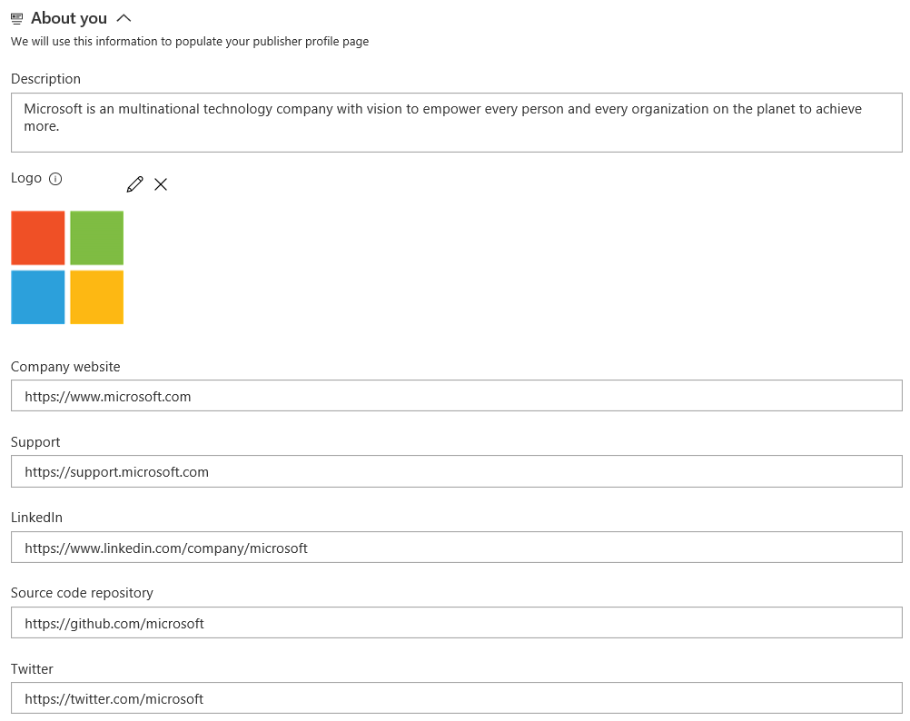

# Make your extension or integration public

The [Visual Studio Marketplace](https://marketplace.visualstudio.com/azuredevops) is a single place users can go to find and purchase extensions, tools, products, and services that extend Visual Studio, Azure DevOps Services, Visual Studio Code, or Team Foundation Server. 

This page covers the required steps to make your integration or extension listing publicly available in the Marketplace. 

* Learn more about developing an [extension for Azure DevOps Services](../index.md)
* Learn more about [packaging and publishing an extension to the Marketplace](./overview.md)
* Learn more about [packaging and publishing an integration to the Marketplace](./integration.md)

> As you are developing your extension or the content for your Marketplace page (for either an extension or integration), your extension can and should remain private.

## Qualifications

To have a public listing on the Marketplace, your integration or extension must meet the following qualifications:

1. Works with or extends one of the following Microsoft products or services:
   * Visual Studio, or
   * Azure DevOps Services (formerly Visual Studio Online), or
   * Visual Studio Code, or
   * Visual Studio Team Foundation Server (2012, 2013, or 2015)
2. You (or your company) owns, develops, and is licensed to distribute and advertise the integration or extension.
3. The extension or integration is actively maintained.

Microsoft might also request a demo and to review the content planned for your Marketplace entry. For more details, refer to the [Visual Studio Marketplace Publisher Agreement](https://cdn.vsassets.io/v/M146_20190123.39/_content/Visual-Studio-Marketplace-Publisher-Agreement.pdf), which you agreed to when creating your publisher.

## Process

The process to have a public Azure DevOps Services listing for an integration or extension is the same. The publisher needs to be verified in order to do so. Only **verified** publishers can have public Azure DevOps Services items in the Marketplace.

> **Developing for Visual Studio, Visual Studio for Mac or Visual Studio Code?** If so, you do not need to request verification. Verification is only required for Azure DevOps Services integrations or extensions.

Once you are ready to publish a public Azure DevOps Services listing to the Marketplace, follow these steps:

1. Visit http://marketplace.visualstudio.com/manage/publishers and login with the organization using which you will publish and manage Azure DevOps Services listings in Marketplace.
2. Select the publisher and through the **Details tab** apply for publisher verification. You will find the appropriate section towards the bottom of the tab.
3. Expect Microsoft to approve or respond within 3 business days to your verification request.

Once your publisher is verified, you need to set the [public flag](../develop/manifest.md#public-flag) to true in your manifest for your extension to be available publicly.

> **Important**: Once your publisher is verified, you will not be able to change its display name without contacting Microsoft.

## Top Publisher
**The Top Publisher is only applicable for publishers with one or more public Azure DevOps extensions or integrations.**

The Top Publisher program recognizes publishers who have shown commitment to their customers and the Marketplace through exemplary policies, quality, reliability, and support. Once marked so, all of their public Azure DevOps offerings (extensions and integrations) will display the Top Publisher badge. This helps customers feel more confident in evaluating and acquiring their offerings.
 

### Requirements

1. For each public Azure DevOps offering under the publisher, ensure the presence of following:

   * Comprehensive and up-to-date privacy policy: refer to [extension manifest](../develop/manifest.md) on how to add one.
   * Comprehensive and up-to-date license i.e. end user license agreement: Refer to [extension manifest](../develop/manifest.md) on how to add one.
   * Comprehensive and up-to-date support policy: refer to [extension manifest](../develop/manifest.md) on how to add one. Your customers should be able to access your support URL and see a clear way to get support from you: file a ticket, email your support team, or other ways to contact you. Preferably offer support for about 8 hours a day for all business days in your local time zone for all your offerings. And a documented low response time for paid offerings for critical issues.
   * Comprehensive and high quality documentation: this could be hosted in your domain, be within your offering, or hosted in a public GitHub repo. Customers should ideally get an overview, quickstart and how-to-guides.
   * Timely and satisfactory responses to valid questions under the Q&A section: answer all valid questions under the Q&A section timely (roughly within a week) and satisfactorily. Responses to reviews are welcome too.

2. Update your publisher profile

    Through publisher profile, you have a way to showcase all of your offerings in one place along with key publisher related information. To provide the information which shows up in the profile:

    * Sign in to http://marketplace.visualstudio.com/manage/publishers using the account with which you publish and manage your offerings in Marketplace
    * Select the publisher and fill in the About you section under the **Details** tab. Below is an example of the About you section for Microsoft (the publisher):       
      
    * Save your changes and use the 'View profile' action towards the top of the page to see how your profile page will appear to the consumers. You may use this profile page to evangelize your offering(s).

### Apply to be a Top Publisher

* Sign in to http://marketplace.visualstudio.com/manage/publishers using the account with which you publish and manage your offerings in Marketplace
* Select the publisher and navigate to its **Top Publisher** tab. Note: you need to have one or more public Azure DevOps (Server/Service) extension or integration for the tab to appear.  
* If you meet the requirements stated above and are the publisher's owner, you will see an option to apply for the program. On application, an email will sent to the Marketplace team to review your case. They will respond in under 10 business days with next steps, clarifying questions or with the grant of the badge.

> The team will likely look at additional parameters such as active uptake of your offerings, install/get started counts and ratings & reviews across your offerings before granting the badge.   Microsoft reserves the right to grant, reject or revoke the Top Publisher badge at any time.
