# Azure DevOps extensibility points

[!INCLUDE [version-vsts-tfs-2017-on](../../../boards/includes/version-vsts-tfs-2017-on.md)]

Extensions enhance the Azure DevOps user experience by contributing new capabilities. In this article, we highlight the most common extensibility points that your extension can target.

>[!NOTE]
>To learn more about the Azure DevOps extensibility model, see the [Contribution model](../../develop/contributions-overview.md) for an overview.

## Other useful references

The [Contributions Guide extension](https://marketplace.visualstudio.com/items/ms-samples.samples-contributions-guide) is a sample extension. Install this extension into your organization. Once it's installed, you see the extensibility points that are available. We recommend you install this extension into a personal or test organization. The [source for this extension](https://github.com/Microsoft/vso-extension-samples/tree/master/contributions-guide) is also available. 
Also, find a sample of a repository creation extension point in this [GitHub pull request](https://nam06.safelinks.protection.outlook.com/?url=https%3A%2F%2Fgithub.com%2Fmicrosoft%2Fazure-devops-extension-sample%2Fpull%2F18&data=02%7C01%7CChrystal.Comley%40microsoft.com%7C35f725d23dab4d086a3008d706321990%7C72f988bf86f141af91ab2d7cd011db47%7C1%7C0%7C636984684551848254&sdata=%2F%2FPWFMtU3KXulFgMJfu%2FXAihRJ7QT18IOD7C7IajPfo%3D&reserved=0).
</div>

<a name="hubs"></a>

## Hubs and hub groups

Hubs and hub groups are the primary navigation elements in Azure DevOps. Files, Releases Backlog, and Queries are examples of hubs. A hub belongs to a hub group. The Files hub, for example, belongs to the project-level Code hub group. Hub groups can exist at the organization (also known as a collection) level or the project level, but most extensions contribute to the project level.

### Targetable hub groups

<a name="targets"></a>

Here are the most common, Microsoft-provided hub groups that hubs can be contributed to:

::: moniker range=">= azure-devops-2019"  

Name                | ID                                         | Level                           | Preview
--------------------|--------------------------------------------|---------------------------------|-----------------------------          
Azure Repos                | `ms.vss-code-web.code-hub-group`           | Project/team                    | 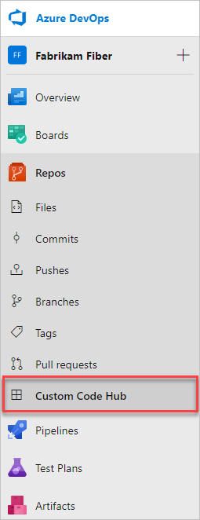
Azure Boards               | `ms.vss-work-web.work-hub-group`           | Project/team                    | 
Azure Pipelines   | `ms.vss-build-web.build-release-hub-group` | Project/team                    | 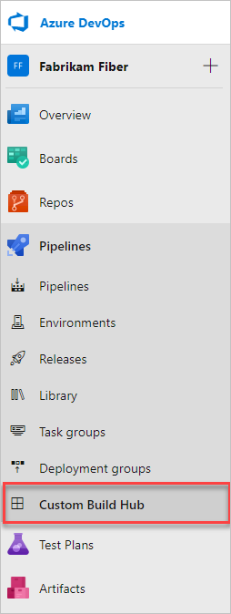
Azure Test Plans                | `ms.vss-test-web.test-hub-group`           | Project/team                    | 
Project settings  | `ms.vss-web.project-admin-hub-group`       | Project                | 
Organization settings  | `ms.vss-web.collection-admin-hub-group`    | Organization (or collection)      | 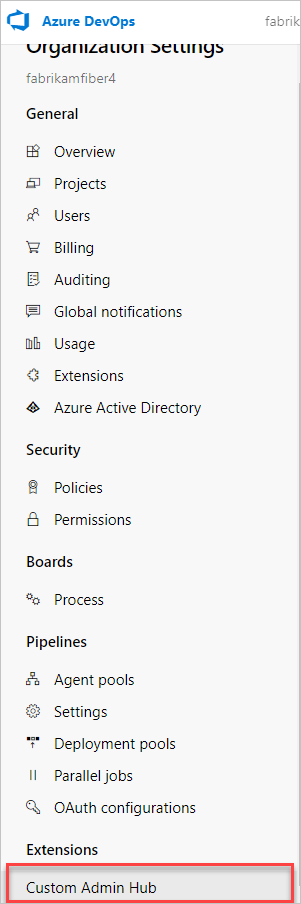

::: moniker-end

::: moniker range=">= tfs-2017 <= tfs-2018"

Name                | ID                                         | Level                           | Preview
--------------------|--------------------------------------------|---------------------------------|-----------------------------          
Code                | `ms.vss-code-web.code-hub-group`           | Project/team                    | 
Work                | `ms.vss-work-web.work-hub-group`           | Project/team                    | 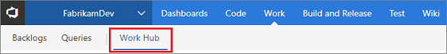
Build and Release   | `ms.vss-build-web.build-release-hub-group` | Project/team                    | 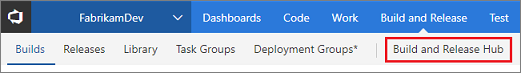
Test                | `ms.vss-test-web.test-hub-group`           | Project/team                    | 
Project settings  | `ms.vss-web.project-admin-hub-group`       | Project                |  
Account settings  | `ms.vss-web.collection-admin-hub-group`    | Account (or collection)      |  

::: moniker-end

### Example

This example shows how to contribute a hub to the Code hub group:

```json
{
    ...
    "contributions": [
        {
            "id": "my-custom-hub",
            "type": "ms.vss-web.hub",
            "targets": [
                "ms.vss-code-web.code-hub-group"
            ],
            "properties": {
                "name": "Code Hub",
                "order": 30,
                "uri": "/views/code/custom.html"
            }
        }
    ]
}
```
* `ms.vss-web.hub` is the type of this contribution. This type is defined in the `vss-web` extension published under the `ms` publisher. This type declares optional and required properties that are required by contributions of this type (for example, name, order, and so on).
* `ms.vss-code-web.code-hub-group` is the full ID of the hub group contribution this hub is targeting. This contribution is declared in the `vss-code-web` extension published under the `ms` publisher
* `my-custom-hub` is the short ID of this contribution; `{publisherId}.{extensionId}.my-custom-hub` is the full ID

<a name="menus"></a>

## Menus and toolbars

::: moniker range=">= azure-devops-2019" 

See [how to add an action](../../develop/add-action.md) for details on contributing an action to a menu or toolbar.

### Add an icon

Add an icon properties, so it can be used directly by name.

We recommend providing your own icon.
Using your own icon example:

 ```"properties": {
            "name": "Sample hub",
            "uri": "dist/Hub/Hub.html",
            "icon": "asset://static/sample-icon.png",
            "supportsMobile": true
        }
```

Using the [Office UI Fabric Icons](https://uifabricicons.azurewebsites.net/) example:

```"properties": {
            "iconName": "Code",
            "name": "Code Hub",
            "order": 30,
            "uri": "/views/code/custom.html"
        }
```

::: moniker-end

::: moniker range=">= tfs-2017 <= tfs-2018"

### Settings

Name                              | Target ID                                           | Preview 
----------------------------------|-----------------------------------------------------|-------------------
Account (collection) overview toolbar       | `ms.vss-admin-web.collection-overview-toolbar-menu` | 
Collection overview projects grid | `ms.vss-admin-web.projects-grid-menu`               | 
Project overview toolbar          | `ms.vss-admin-web.project-overview-toolbar-menu`    | 
Project overview teams grid       | `ms.vss-admin-web.teams-grid-menu`                  | 

::: moniker-end

<a name="menus_build"></a>
<a name="menu_release"></a>

::: moniker range=">= azure-devops-2019" 

### Azure Pipelines

Name                      | Target ID                                   | Preview 
--------------------------|---------------------------------------------|-------------------
Completed build menu      | `ms.vss-build-web.completed-build-menu`     | 
Build definitions menu    | `ms.vss-build-web.build-definition-menu`    | 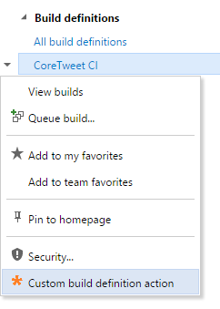
Test results toolbar action    | `ms.vss-test-web.test-results-actions-menu`    | 
Test result details tab    | `ms.vss-test-web.test-result-details-tab-items`    | 
Release pipeline explorer context menu | `ms.vss-releaseManagement-web.release-definition-explorer-context-menu` | 
Release pipeline explorer toolbar menu | `ms.vss-releaseManagement-web.release-definition-explorer-toolbar-menu` | 
Release summary toolbar menu             | `ms.vss-releaseManagement-web.release-editor-tool-bar-menu`             | 
Release summary tab                      | `ms.vss-releaseManagement-web.release-details-view`                     | 
Release summary section                  | `ms.vss-releaseManagement-web.release-details-summary-tab`              | 

::: moniker-end

::: moniker range=">= tfs-2017 <= tfs-2018"

### Build

Name                      | Target ID                                   | Preview 
--------------------------|---------------------------------------------|-------------------
Completed build menu      | `ms.vss-build-web.completed-build-menu`     | 
Build definitions menu    | `ms.vss-build-web.build-definition-menu`    | 
Test results toolbar action    | `ms.vss-test-web.test-results-actions-menu`    | 
Test result details tab    | `ms.vss-test-web.test-result-details-tab-items`    |  menu             | `ms.vss-code-web.source-grid-item-menu`          | 
Source item (tree) menu             | `ms.vss-code-web.source-tree-item-menu`          | 
Source item (grid and tree) menu    | `ms.vss-code-web.source-item-menu`               |
Change list item menu               | `ms.vss-code-web.change-list-item-menu`          |
Change list summary item menu       | `ms.vss-code-web.change-list-summary-item-menu`  |
Git branches tree menu              | `ms.vss-code-web.git-branches-tree-menu`         | 
Git pull request actions menu       | `ms.vss-code-web.pull-request-action-menu`       | 
Git pull request tabs (pivots)      | `ms.vss-code-web.pr-tabs`                        | 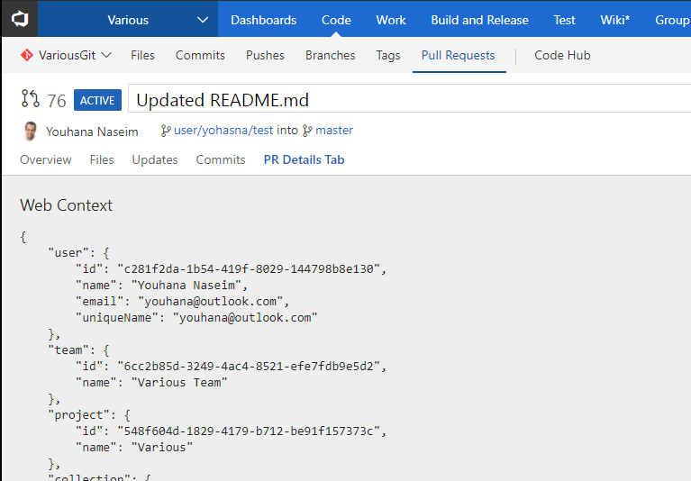
Git commit listing menu             | `ms.vss-code-web.git-commit-list-menu`           |  
Git commit detail menu              | `ms.vss-code-web.git-commit-details-menu`        | 

::: moniker-end

::: moniker range=">= tfs-2017 <= tfs-2018"

### Release

Name                                     | Target ID                                                              | Preview 
-----------------------------------------|-------------------------------------------------------------------------|-------------------
Release pipeline explorer context menu | `ms.vss-releaseManagement-web.release-definition-explorer-context-menu` | 
Release pipeline explorer toolbar menu | `ms.vss-releaseManagement-web.release-definition-explorer-toolbar-menu` | 
Release summary toolbar menu             | `ms.vss-releaseManagement-web.release-editor-tool-bar-menu`             | 
Release summary tab                      | `ms.vss-releaseManagement-web.release-details-view`                     | 
Release summary section                  | `ms.vss-releaseManagement-web.release-details-summary-tab`              | 
Source item (tree) menu             | `ms.vss-code-web.source-tree-item-menu`          | 
Source item (grid and tree) menu    | `ms.vss-code-web.source-item-menu`               |
Change list item menu               | `ms.vss-code-web.change-list-item-menu`          |
Change list summary item menu       | `ms.vss-code-web.change-list-summary-item-menu`  |
Git branches tree menu              | `ms.vss-code-web.git-branches-tree-menu`         | 
Git pull request actions menu       | `ms.vss-code-web.pull-request-action-menu`       | 
Git pull request tabs (pivots)      | `ms.vss-code-web.pr-tabs`                        | 
Git commit listing menu             | `ms.vss-code-web.git-commit-list-menu`           |  
Git commit detail menu              | `ms.vss-code-web.git-commit-details-menu`        | 

::: moniker-end

::: moniker range=">= tfs-2017 <= tfs-2018"

### Test

Name                       | Target ID                                   | Preview 
---------------------------|---------------------------------------------|-------------------
Test run toolbar           | `ms.vss-test-web.test-run-toolbar-menu`     | 
Test run grid menu         | `ms.vss-test-web.test-run-grid-menu`        | 
Test plan suites toolbar   | `ms.vss-test-web.test-plans-suites-toolbar` |
Test plan suites tree menu | `ms.vss-test-web.test-plans-suites-context` |
Test plan hub pivot tab    | `ms.vss-test-web.test-plan-pivot-tabs`      | 

<a name="menus_work"></a>


::: moniker-end

<a name="menus_work"></a>

::: moniker range=">= azure-devops-2019" 

### Azure Boards

Name                            | Target ID                                         | Preview 
--------------------------------|---------------------------------------------------|-------------------
Work item query menu            | `ms.vss-work-web.work-item-query-menu`            | 
Work item query results toolbar menu | `ms.vss-work-web.work-item-query-results-toolbar-menu` | 
Work item query results menu item | `ms.vss-work-web.query-result-work-item-menu`   | 
Work item query results tab     | `ms.vss-work-web.query-tabs`                      | 
Work item for context menu               | `ms.vss-work-web.work-item-toolbar-menu`          | 
Backlog item menu               | `ms.vss-work-web.backlog-item-menu`               | 
Sprint board pivot filter menu  | `ms.vss-work-web.sprint-board-pivot-filter-menu`  | 
Board pivot filter menu         | `ms.vss-work-web.backlog-board-pivot-filter-menu` | 
Card menu                       | `ms.vss-work-web.backlog-board-card-item-menu`    | 
Product backlog tab             | `ms.vss-work-web.product-backlog-tabs`            | 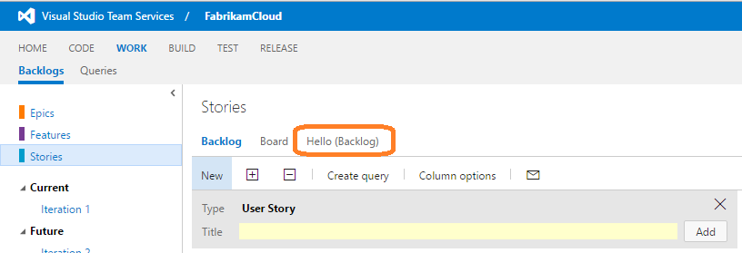
Iteration backlog tab           | `ms.vss-work-web.iteration-backlog-tabs`          | 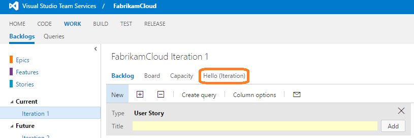
Portfolio backlog pane          | `ms.vss-work-web.portfolio-backlog-toolpane`      | 
Product backlog pane            | `ms.vss-work-web.requirement-backlog-toolpane`    | 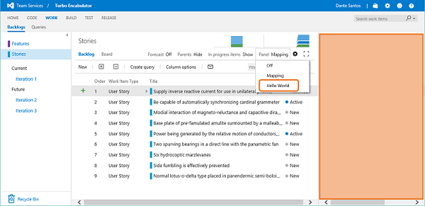
Iteration backlog pane          | `ms.vss-work-web.iteration-backlog-toolpane`      | 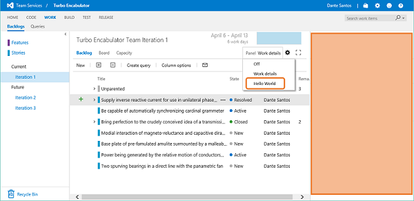

::: moniker-end

::: moniker range=">= tfs-2017 <= tfs-2018"

### Work

Name                            | Target ID                                         | Preview 
--------------------------------|---------------------------------------------------|-------------------
Work item query menu            | `ms.vss-work-web.work-item-query-menu`            | 
Work item query results toolbar menu | `ms.vss-work-web.work-item-query-results-toolbar-menu` | 
Work item query results menu item | `ms.vss-work-web.query-result-work-item-menu`   | 
Work item query results tab     | `ms.vss-work-web.query-tabs`                      | 
Work item for context menu               | `ms.vss-work-web.work-item-toolbar-menu`          | 
Backlog item menu               | `ms.vss-work-web.backlog-item-menu`               | 
Sprint board pivot filter menu  | `ms.vss-work-web.sprint-board-pivot-filter-menu`  | 
Board pivot filter menu         | `ms.vss-work-web.backlog-board-pivot-filter-menu` | 
Card menu                       | `ms.vss-work-web.backlog-board-card-item-menu`    | 
Product backlog tab             | `ms.vss-work-web.product-backlog-tabs`            | 
Iteration backlog tab           | `ms.vss-work-web.iteration-backlog-tabs`          | 
Portfolio backlog pane          | `ms.vss-work-web.portfolio-backlog-toolpane`      | 
Product backlog pane            | `ms.vss-work-web.requirement-backlog-toolpane`    | 
Iteration backlog pane          | `ms.vss-work-web.iteration-backlog-toolpane`      | . Learn how to [contribute a dashboard widget](../../develop/add-dashboard-widget.md).

<a name="witform"></a>

## Work item form

The work item form is enhanced by extensions with new sections, tabs, actions, and custom field renderers. For more information, learn how to 
 [extend the work item form](../../develop/add-workitem-extension.md).

<a name="buildtasks"></a>

## Azure Pipelines tasks

Tasks perform work in a build or release. For more information, learn how to [contribute a build or release task](../../develop/add-build-task.md).

<a name="serviceHooks"></a>

## Service hooks

A "consumer" is the service that events are sent to in Service Hooks. An extension can contribute consumer services. These services are configured by a user (or programmatically), to send events to that service. For more information, see [contribute a service hooks consumer](../../develop/add-service-hook.md).

## Features

**Name:** Preview feature (hosted only)
**Target ID:** ms.vss-web.managed-features
 
**Name:** Feature (on-prem only)
**Target ID:** ms.vss-web.managed-features-onprem

